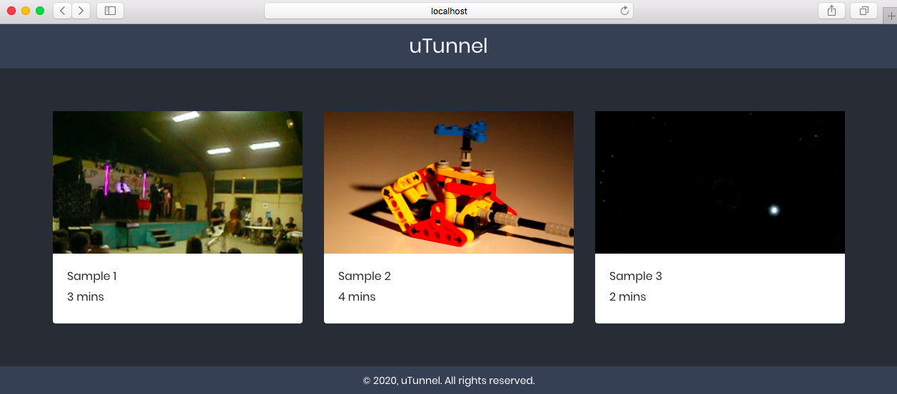
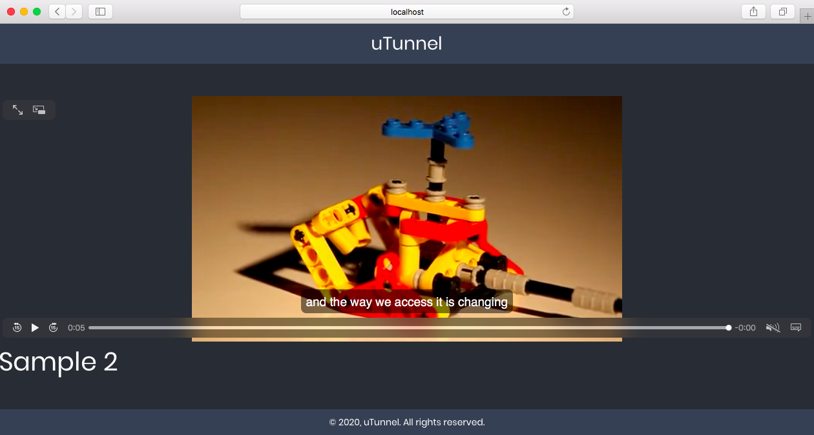
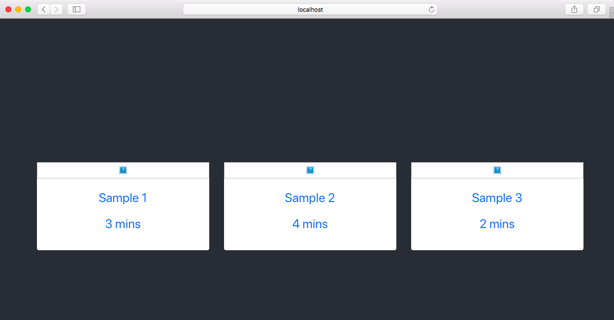
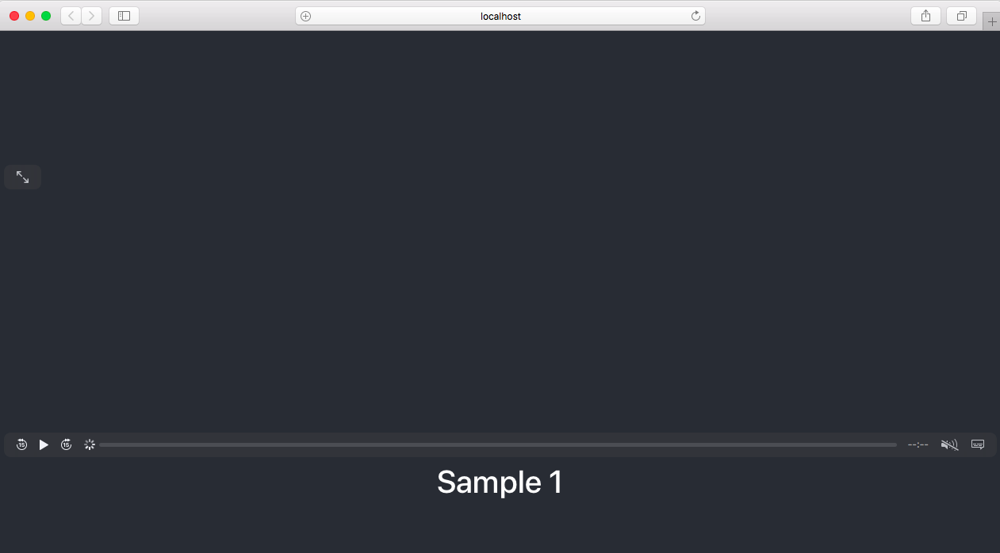
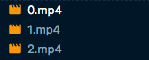
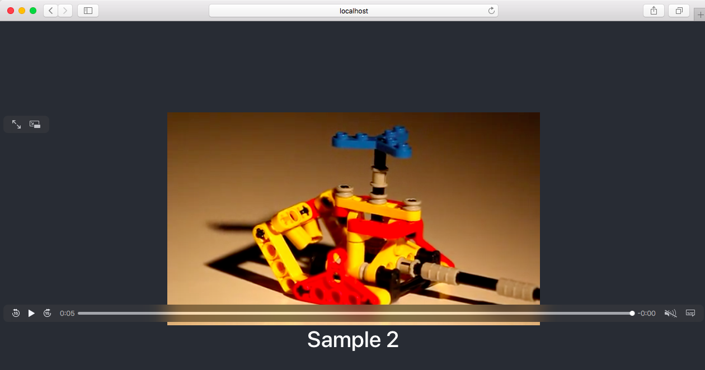
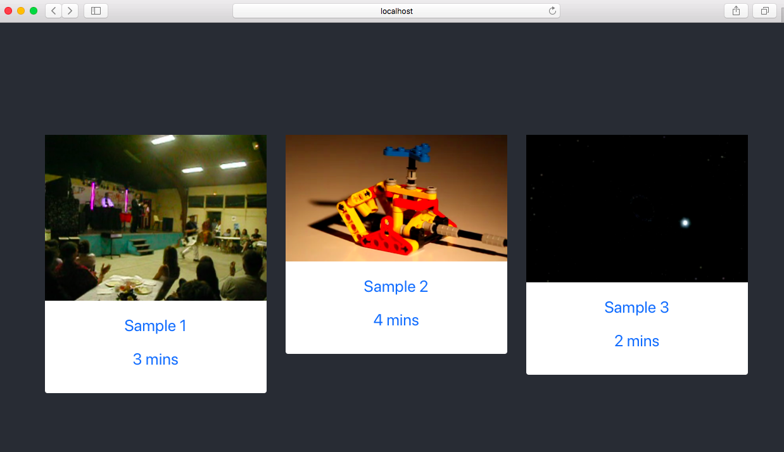
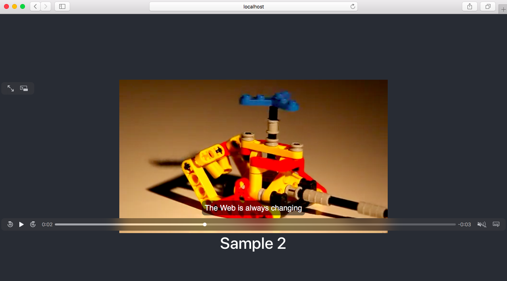

## Introduction

Building a live video streaming application might seem daunting at first, but this guide will breakdown how this can be achieved. Specifically, we'll demonstrate how to implement a streaming service with the following components:

- A server-side *Node.js* application that handles fetching and streaming videos, generating thumbnails for your videos, and serving captions and subtitles for videos.
- A client application for the devices in *React* that consumes the videos on our server. This application will have two views: a listing of videos that are available, and a player view for each video.

When completed, your application looks as follows:

### About Video Streams

Videos work with streams. This means that instead of sending the whole video at once, a video is sent as a set of smaller chunks which make up the full video. This explains why if you are on a slow broadband and watching a video, it buffers because it plays the latest chunk it has received and tries to load more.

## Before You Begin

For this tutorial, you’ll need:

- A basic understanding of HTML, CSS, JavaScript, Node/Express, and React
- A text editor (e.g. VS Code or Atom)
- A web browser (e.g. Chrome, Firefox)
- [FFmpeg](https://www.ffmpeg.org/download.html) installed on your workstation
- [Node.js](https://nodejs.org/en/download/). [Node Version Manager (nvm)](https://github.com/nvm-sh/nvm) can be used to install and maintain several versions of Node on your computer.


When following the tutorial, you can refer to the [project source code](https://github.com/Dunebook/Videostreaming-app) to compare your code with the final result.


## Application Setup

For the purposes of this tutorial, both the server application and the client application will be built on your workstation. To get started, create a new directory that will contain both components of your application. You can do this from the terminal or a GUI interface:

    mkdir react-node-video-streaming

### Setting Up the Server

1. We'll build the *server* with Node.js. Inside our project directory, create a folder called `server`:

        cd react-node-video-streaming
        mkdir server

1. Next, let's setup the server:

        cd server
        npm init

1. Follow the prompts from `npm init` and use the default values it suggests. When the command finishes, it creates a `package.json` file in the directory.

1. Install the packages the server will need:

        npm install --save nodemon express cors

    - `nodemon` automatically restarts our server when we make changes.

    - `express` gives us a nice interface to handle routes.

    - `cors` will allow us to make cross-origin requests since our client and server will be running on different ports.

1. Inside the `server` project, create a folder called `assets`. This will hold the video files for the server application:

        mkdir assets

1. Copy a `.mp4` video file into the new `assets` folder, and make sure it is named `sample.mp4`. For example, you can download one of the videos from the guide's [project source repository](https://github.com/Dunebook/Videostreaming-app/tree/master/server/assets) and rename it to `sample.mp4`.

1. We can start writing code for React video streaming server. Create a new file in the root of the `server` directory called `app.js` and add the following snippet:

    
const express = require('express');
const fs = require('fs');
const path = require('path');

const app = express();


    This just imports the packages we'll be using. The `fs` module makes it easy to read and write to files on the server.

1. For now, we'll create a single `/video` route. When requested, it will send a video file back to the client. Add this line after the `const app` declaration in `server/app.js`:

    
// add after 'const app = express();'

app.get('/video', (req, res) => {
    res.sendFile('assets/sample.mp4', { root: __dirname });
});


    This routes simply serves the `sample.mp4` video file when requested.

1. Add this call to `app.listen()` to the end of `server/app.js`:

    
// add to end of file

app.listen(4000, () => {
    console.log('Listening on port 4000!')
});


    This code sets up the server to listen on port 4000.

1. At the moment, the server is not running. In `package.json`, add the following `dev` script to the `scripts` section:

    
//...
"scripts": {
    "dev": "nodemon app.js",
    // ...
},
// ...


1. Then from your terminal, run:

        npm run dev

    If you see the message `Listening on port 4000!` in the terminal, then the server is working correctly. Navigate to [http://localhost:4000/video](http://localhost:4000/video) in your browser in your local system and you should see the video playing.

### Scaffolding the Frontend with React

1. Open a second terminal and create a new `client` directory in your projects folder:

        cd react-node-video-streaming
        mkdir client && cd client

1. Initialize a React project here like so:

        npx create-react-app .

    This command generates our application shell and installs the packages required by React. The `.` argument means all this setup happens in the current directory (`client`).

    
If you don't have `npx` on your workstation, it can be installed globally with:

    npm install -g npx


1. Once it is done, open `src/App.js` in your `client` project and replace the contents with:

    
import React from 'react';
import './App.css';
function App() {
    return (
        

            <header className="App-header">
            <video controls muted>
                <source src="http://localhost:4000/video" type="video/mp4"></source>
            </video>
            </header>
        

    );
}
export default App;


    In this markup, we have a single `video` element, and the `src` is the route on our server that serves the sample video file.

1. Save it, and in your terminal run:

        yarn start

    Or if you prefer to use `npm`, run:

        npm start

    This command starts a web server and opens the React application in your browser. You should see the video in your React application.

## Building Out the Frontend

So far, we've set up React video streaming server to serve a video file when requested. In reality, our React application will have two views:

- A **Home** view that contains a list of videos
- A **Player** view where videos will play

We'll be using Bootstrap to layout our interface, so add the following to the `head` section of `public/index.html` in your `client` project:


<!-- add to <head> -->
<link rel="stylesheet" href="https://cdnjs.cloudflare.com/ajax/libs/twitter-bootstrap/4.4.1/css/bootstrap.css">


React video streaming application has two routes to handle the `Home` and `Player` views, so install `react-router-dom` to handle routing of the React application. From the terminal, run the command:

- If you are using yarn:

        yarn add react-router-dom

- If you are using npm:

        npm install --save react-router-dom

This installs the recommended router for React applications.

### Create the Home View

We can start to build out the necessary views. Let’s start with the `Home` view. Create a new file `src/Home.js` in your `client` project and add the following snippet:


import React, { Component } from 'react';
import { Link } from 'react-router-dom';
export default class Home extends Component {
    constructor() {
        super();
        this.state = {
            videos: []
        };
    }
    async componentDidMount() {
        try {
            const response = await fetch('http://localhost:4000/videos');
            const data = await response.json();
            this.setState({ videos: [...data] });
        } catch (error) {
            console.log(error);
        }
    }
    render() {
        return (
            

                

                    

                        {this.state.videos.map(video =>
                        

                            <Link to={`/player/${video.id}`}>
                                

                                    
                                    

                                        
{video.name}

                                        
{video.duration}

                                    

                                

                            </Link>
                        

                        )}
                    

                

            

        )
    }
}


Our component starts off by importing some required packages (lines 1-2). Then it initializes the state variable `videos` to an empty array (line 7). In the `componentDidMount` (lines 10-18), it makes a request to an endpoint (http://localhost:4000/videos), which will return an array of video metadata. This metadata will be represented as array of objects, where each object looks like:


{
    id: 0,
    poster: '/video/0/poster',
    duration: '3 mins',
    name: 'Sample 1'
}


After fetching the video metadata, we render it as a list of videos (lines 19-40). Each card is wrapped with a link to the Player view, which will be created in the next section.

On line 28, another endpoint request is made to `http://localhost:4000${video.poster}`, which will return a thumbnail of a video in the list. The `video.poster` variable is populated with a value like `/video/0/poster` from the video metadata array, so the request will have the form `http://localhost:4000/video/:id/poster`.


We have not created the `/videos` metadata endpoint, or the `/video/:id/poster` video thumbnail endpoint yet. These will be added to the `server` project in the [Handling Requests from the Frontend](#handling-requests-from-the-frontend) section.


### Create the Player View

Next, we create the player view. Create a new file `src/Player.js` in the `client` project and add the following snippet:


import React, { Component } from 'react'
export default class Player extends Component {
    constructor(props) {
        super(props);
        this.state = {
            videoId: this.props.match.params.id,
            videoData: {}
        };
    }
    async componentDidMount() {
        try {
            const res = await fetch(`http://localhost:4000/video/${this.state.videoId}/data`);
            const data = await res.json();
            this.setState({ videoData: data });
        } catch (error) {
            console.log(error);
        }
    }
    render() {
        return (
            

                <header className="App-header">
                    <video controls muted autoPlay>
                        <source src={`http://localhost:4000/video/${this.state.videoId}`} type="video/mp4"></source>
                    </video>
                    <h1>{ this.state.videoData.name }</h1>
                </header>
            

        )
    }
}


For the player view, we get the video `id` from the URL parameter (line 6):

- With the `id`, we can make a request to the server to fetch metadata about the video: `http://localhost:4000/video/${this.state.videoId}/data`, on line 12.
- In the markup for the view, the video element's `src` attribute is a link which appends the `id` to the `/video` route, and the server responds with the actual video: `http://localhost:4000/video/${this.state.videoId}`, on line 24.


We have not created the `/video/:id/data` metadata endpoint, or the `/video/:id` video streaming endpoint yet. These will be added to the `server` project in the [Handling Requests from the Frontend](#handling-requests-from-the-frontend) section.


### Update App.js

That's all we need for the views. Let's glue them both together. Replace the contents of your `src/App.js` with this snippet:


import React from 'react';
import {
    Route,
    BrowserRouter as Router,
    Switch,
} from "react-router-dom";
import Home from './Home';
import Player from './Player';
import './App.css';

function App() {
    return (
        <Router>
            <Switch>
            <Route exact path="/" component={Home}></Route>
            <Route path="/player/:id" component={Player}></Route>
            </Switch>
        </Router>
    );
}
export default App;


Here, we import the router package (lines 2-6), as well as our `Home` and `Player` view components (lines 7 and 8). The `/` route (line 15) shows the Home component. For the `/player` route (line 16), notice the dynamic `:id` which would match anything that matches the pattern. This is how we pass the `id` to the `Player` component.

## Handling Requests from the Frontend

Right now, we have four requests from the frontend that are not handled by our server yet:

- `/videos`: Returns an array of video metadata that will be used to populate the list of videos in the `Home` view
- `/video/:id/data`: Returns metadata for a single video. Used by the `Player` view.
- `/video/:id`: Streams a video with a given ID. Used by the `Player` view.
- `/video/:id/poster`: Returns a thumbnail for a video with a given ID. Used by the `Home` view.

Let's tackle them one after another:

### Return Metadata for the List of Videos

For this demo application, we'll create an array of multiple objects that will hold the metadata and send that to the frontend when requested. In a real application, you would probably be reading the data from a database, which would then be used to generate an array like this. For simplicity's sake, we won’t be doing that in this tutorial.

1. From the `server` directory, open `app.js` and add this array declaration just after the `require()` statements:

    
// add after require() statements

const videos = [
    {
        id: 0,
        poster: '/video/0/poster',
        duration: '3 mins',
        name: 'Sample 1'
    },
    {
        id: 1,
        poster: '/video/1/poster',
        duration: '4 mins',
        name: 'Sample 2'
    },
    {
        id: 2,
        poster: '/video/2/poster',
        duration: '2 mins',
        name: 'Sample 3'
    },
];


    As you can see, each object contains information about the video. Notice the `poster` attribute which contains the link to a poster image of the video. Later in this tutorial, we’ll see how we can generate a poster image from a video.

    With this in place, in `server/app.js`, let’s create a new route `/videos` that will send this data to the frontend.

1. Add this line after the other `require()` statements at the top of the `server/app.js`:

    
// add after other require() statements

const cors = require('cors');


1. Add these lines just after the existing `app.get('/video', ...)` route:

    
// add after existing app.get('/video', ...) route

app.use(cors());
app.get('/videos', (req, res) => res.json(videos));


    First, we enable `cors` on the server since we’ll be making the requests from a different origin (domain). `cors` was installed in the [Application Setup](#application-setup) section. Then the `/videos` route is declared, which returns the array we just created in `json` format.

1. Save the file and it should automatically restart the server. Once it’s started, switch to your browser and check the React application. Your app should display the names and the duration of the videos, but not the thumbnails:

    

### Return Metadata for a Single Video

Our React application fetches the video by `id`, so we can use the `id` to get the requested video metadata from the array. Let’s create a new route that will handle this in `server/app.js`. Add this snippet of code after the route from the previous section:


// add after app.get('/videos', ...) route

app.get('/video/:id/data', (req, res) => {
    const id = parseInt(req.params.id, 10);
    res.json(videos[id]);
});


If you remember, the `Player` view makes a request to `http://localhost:4000/video/${this.state.videoId}/data` which would match this route. This snippet gets the `id` from the route parameters and converts it to an integer. Then we send the object that matches the `id` from the `videos` array back to the client.

Now, the `Player` view should look like this:

### Stream a Video

In the [Application Setup](#application-setup) section, we created a `/video` route that just serves a video to the client. This endpoint did not actually send smaller chunks of a video; instead, it just served an entire video file on request.

We now need to implement two new features that are not supported by that endpoint. First, we need to be able to dynamically serve one of the three videos that are in the `videos` array. Second, we need to stream the video in chunks.

1. Delete the `/video` route from `server/app.js`.

1. We need three videos, so copy the example videos from the tutorial's [source code](https://github.com/slightlynerd/react-node-video-streaming/tree/master/server/assets) into the `assets/` directory of your `server` project. Make sure the filenames for the videos are `0.mp4`, `1.mp4`, and `2.mp4`, as these correspond to the `id`s in the `videos` array:

    

1. Create the route for streaming videos. Add this snippet below your other routes in `server/app.js`:

    
// add after app.get('/video/:id/data', ...) route

app.get('/video/:id', (req, res) => {
    const path = `assets/${req.params.id}.mp4`;
    const stat = fs.statSync(path);
    const fileSize = stat.size;
    const range = req.headers.range;
    if (range) {
        const parts = range.replace(/bytes=/, "").split("-");
        const start = parseInt(parts[0], 10);
        const end = parts[1]
            ? parseInt(parts[1], 10)
            : fileSize-1;
        const chunksize = (end-start) + 1;
        const file = fs.createReadStream(path, {start, end});
        const head = {
            'Content-Range': `bytes ${start}-${end}/${fileSize}`,
            'Accept-Ranges': 'bytes',
            'Content-Length': chunksize,
            'Content-Type': 'video/mp4',
        };
        res.writeHead(206, head);
        file.pipe(res);
    } else {
        const head = {
            'Content-Length': fileSize,
            'Content-Type': 'video/mp4',
        };
        res.writeHead(200, head);
        fs.createReadStream(path).pipe(res);
    }
});


1. Save the file, which should automatically restart the server. Then navigate to your browser and refresh the application. You should see something like this:

    

#### Inspecting the Streaming Video Route

The new `/videos/:id` route contains a fair bit of code, so let’s walk through it:


const path = `assets/${req.params.id}.mp4`;
const stat = fs.statSync(path);
const fileSize = stat.size;
const range = req.headers.range;


First, we get the `id` from the route `/video/:id` and use it to generate the `path` to the video. Using `fs`, we read the file to get the file size. For videos, a user's browser will send a `range` parameter in the request. This lets the server know which chunk of the video to send back to the client.

Some browsers send a range in the initial request, but others don’t. For those that don’t, or if for any other reason the browser doesn’t send a range, we handle that in the `else` block. This code gets the file size and send the first few chunks of the video:


else {
    const head = {
        'Content-Length': fileSize,
        'Content-Type': 'video/mp4',
    };
    res.writeHead(200, head);
    fs.createReadStream(path).pipe(res);
}


Subsequent requests will include a range, which we handle in the `if` block:


if (range) {
    const parts = range.replace(/bytes=/, "").split("-");
    const start = parseInt(parts[0], 10);
    const end = parts[1]
        ? parseInt(parts[1], 10)
        : fileSize-1;
    const chunksize = (end-start) + 1;
    const file = fs.createReadStream(path, {start, end});
    const head = {
        'Content-Range': `bytes ${start}-${end}/${fileSize}`,
        'Accept-Ranges': 'bytes',
        'Content-Length': chunksize,
        'Content-Type': 'video/mp4',
    };
    res.writeHead(206, head);
    file.pipe(res);
}


This code creates a read stream using the `start` and `end` values of the range. We then set the response headers, setting the `Content-Length` to the chunk size that is calculated from the `start` and `end` values. We also use [HTTP code 206](https://developer.mozilla.org/en-US/docs/Web/HTTP/Status/206), which signifies that the response contains partial content. This means the browser will keep making requests until it has fetched all chunks of the video.

### Dynamically Generate a Thumbnail for a Video

Our `Home` view appears broken at the moment because the poster images are not generated. To generate the thumbnails for these posters:

1. If you have not yet installed FFmpeg on your system, [install it now](https://www.ffmpeg.org/download.html).

1. Then, open your terminal in the `server` directory and install the `thumbsupply` module, which will use FFmpeg:

    - When using yarn:

            yarn add thumbsupply

    - When using npm:

            npm install --save thumbsupply

1. Add this line after your other `require()` statements in `server/app.js`. This will import `thumbsupply`:

    
// add after other require() statements

const thumbsupply = require('thumbsupply');


1. Create a new route that will handle generating thumbnails. Add this code after the other routes in `server/app.js`:

    
// add after app.get('/video/:id', ...) route

app.get('/video/:id/poster', (req, res) => {
    thumbsupply.generateThumbnail(`assets/${req.params.id}.mp4`)
    .then(thumb => res.sendFile(thumb));
});


    `thumbsupply` provides a `generateThumbnail` method that accepts a path to a video and then generates the thumbnail. If successful, we send the generated file back to the client.

1. Save the file, which restarts the server. Refresh the application in the browser, and you should see that the `Home` view now includes poster images for the videos:

    

## Add Captions to Videos

Adding captions helps the deaf and hard of hearing to be able to follow along with videos. It’s also fair to point out that [captions and subtitles are not the same thing](http://web.archive.org/web/20160117160743/http://screenfont.ca/learn/). Even though they are not the same, they are implemented the same way.

### Create the Caption File

A caption file contains the caption text for a video. We won’t look at how to create caption files in this tutorial, but here’s what one looks like:


WEBVTT

00:00:00.500 --> 00:00:02.000
The Web is always changing

00:00:02.500 --> 00:00:08.300
and the way we access it is changing


The file starts with `WEBVTT`, which indicates this is a [Web Video Track File](https://developer.mozilla.org/en-US/docs/Web/API/WebVTT_API). This is the format used for captions/subtitles on the web, and its file extension is `.vtt`. A duration is specified for each caption and the caption text sits under the duration.

1. Inside the `server` project, create a `captions/` directory under `assets/` directory:

        mkdir captions/assets

1. Create a new file named `sample.vtt` inside the new directory with this snippet:

    
WEBVTT

00:00:00.500 --> 00:00:02.000
The Web is always changing

00:00:02.500 --> 00:00:08.300
and the way we access it is changing


    For this guide's example, the same caption file will be used for all caption requests. In a real application, there would be a unique caption file for each video.

### Add the Track Element to Player.js

The [`track` element](https://developer.mozilla.org/en-US/docs/Web/HTML/Element/track) is used to support timed text tracks. Update the `video` element in `client/src/Player.js` like so:


<video controls muted autoPlay crossOrigin="anonymous">
    <source src={`http://localhost:4000/video/${this.state.videoId}`} type="video/mp4"></source>
    <track label="English" kind="captions" srcLang="en" src={`http://localhost:4000/video/${this.state.videoId}/caption`} default></track>
</video>


We’ve added `crossOrigin="anonymous"` to the video element; otherwise, the request for captions will fail. The `track` element includes these attributes:

| Attribute | Description |
|-----------|-------------|
| `label` | Specifies the label that appears in the captions menu |
| `kind` | Can be *captions* or *subtitles* |
| `srcLang` | The language the caption is in (e.g. `en` means English) |
| `src` | The location of the caption file |
| `default` | Indicates this as the default caption |

### Add the Caption Route

With the `track` element set up, we can now create the endpoint that will handle caption requests.

1. Create a new route in `server/app.js` after the previous routes:

    
// add after the app.get('/video/:id/poster', ...) route

app.get('/video/:id/caption', (req, res) => res.sendFile('assets/captions/sample.vtt', { root: __dirname }));


    This route will serve the same caption file, regardless of which `id` is passed as a parameter. In a more complete application, you could serve different caption files for different `id`s.

1. Save the file, which restarts the server. You should now see captions appear on the video:

    

## Making Things Pretty

We can add some styles to make the application look better:

1. Update the React application `src/App.css` file in your `client` project with this snippet:

    
.App-header {
    min-height: 100vh;
    color: white;
}
header, footer {
    background-color: #374153;
    text-align: center;
    color: white;
    padding: 10px 0;
}
header {
    margin-bottom: 50px;
    font-size: 28px;
}
footer {
    margin-top: 50px;
    font-size: 14px;
}
.card {
    margin: 10px 0;
}
a, a:hover {
    color: #282c34;
    text-decoration: none;
}
video {
    width: 100%;
    height: 50vh;
}
img {
    height: 200px;
    object-fit: cover;
    object-position: center top;
}
p {
    margin-bottom: 5px;
    font-size: 16px;
}


1. Replace `src/index.css` with:

    
body {
    margin: 0;
    font-family: 'Poppins', sans-serif;
    -webkit-font-smoothing: antialiased;
    -moz-osx-font-smoothing: grayscale;
    background-color: #282c34;
}


1. Add this line to the `head` section of `client/public/index.html` in your `client` project:

    
<link href="https://fonts.googleapis.com/css?family=Poppins&display=swap" rel="stylesheet">


1. Create `Header` and `Footer` components in the `src/` directory of your `client` project:

    
import React from 'react';
function Header() {
    return (
        <header>
            uTunnel
        </header>
    );
}
export default Header;


    
import React from 'react';
function Footer() {
    return (
        <footer>
            &copy; 2020, uTunnel. All rights reserved.
        </footer>
    );
}
export default Footer;


1. Import and use the new `Header` and `Footer` components in `src/Home.js` and `src/Player.js`. To do this, add these `import` statements below the other `import` statements at the top of both files:

    
// add below the other import statements

import Header from './Header';
import Footer from './Footer';


    Then, add the components to markup in the `return()` method of both files in the following locations:

    
// ...

render() {
    return (
        

            <Header />
            <!-- Other component markup -->
            <Footer />
        

    )
}

// ...


    
// ...

render() {
    return (
        

            <Header />
            <!-- Other component markup -->
            <Footer />
        

    )
}

// ...


1. The application should now look like this:

    

    

## Conclusion

In this tutorial, we have seen how to create a server in Node.js that streams videos, generates captions and posters for those videos, and serves metadata of the videos. We’ve also seen how to use React on the frontend to consume the endpoints and the data generated by the server.
