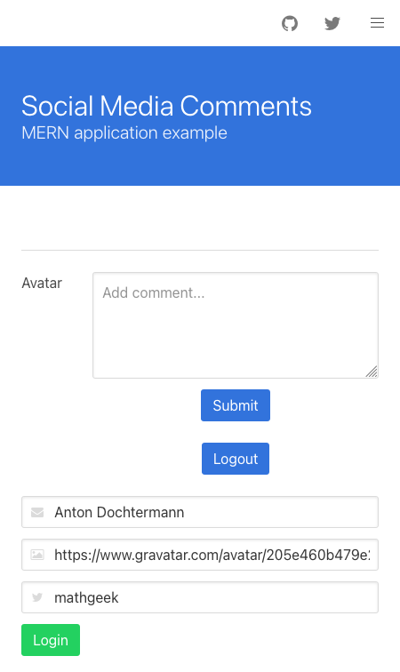

MERN is a stack for modern web applications. It consists of MongoDB, Express JS, React, and Node.js — all well-established open-source technologies that make a solid foundation for new web applications.

This guide helps you deploy your existing MERN stack project onto Akamai cloud compute, using the MERN Marketplace App or by manually installing the MERN stack on a new Compute Instance. After your server is set up, learn how to copy your project to your server. If you do not yet have an existing project and wish to create a new MERN application, review one of the following guides instead:

- [Install the MERN Stack and Create an Example Application](/docs/guides/install-the-mern-stack/)

- [Build a Basic Chat Application using the MERN Stack](/docs/guides/build-mern-stack-chat-application/)

## Before You Begin

1. Familiarize yourself with our [Getting Started with Linode](/docs/getting-started/) guide, and complete the steps for setting your Linode's hostname and timezone.

1. This guide uses `sudo` wherever possible. Complete the sections of our [How to Secure Your Server](/docs/security/securing-your-server/) guide to create a standard user account, harden SSH access, and remove unnecessary network services.

1. Update your system using the following command:

    ```command
    sudo apt update && sudo apt upgrade
    ```


The steps in this guide are written for non-root users. Commands that require elevated privileges are prefixed with `sudo`. If you’re not familiar with the `sudo` command, see the [Linux Users and Groups](/docs/tools-reference/linux-users-and-groups/) guide.


## What Is the MERN Stack?

A MERN architecture is a full-stack framework for developing modern web applications. It is a variation of the MEAN stack, but replaces Angular (the **A**) with React.

A MERN stack is made up of the following components:

- [MongoDB](https://www.mongodb.com/) document database
- [Express JS](https://expressjs.com/) server-side framework
- [React](https://reactjs.org/) client-side framework
- [Node](https://nodejs.org/en/about/) web server

Each of these technologies is well-supported and offers robust features. This makes a MERN stack a good choice for developing new web applications.

As noted above, other variants exist, like the MEAN stack (which uses Angular) and the MEVN stack (which uses Vue). But MERN uses React, so you get the advantages of its server-side rendering and improved availability for web crawlers.

## Deploy the MERN Stack on Akamai

To deploy a functional MERN stack on a server, select from one of the deployment options below:

-  **Linode Marketplace:** Deploy the [MERN App](https://www.linode.com/marketplace/apps/linode/mern/) through the Linode Marketplace to automatically install MongoDB, Node.JS, Express, and React. This is the easiest method and enables you to quickly get up and running without needing to install and configure everything manually. Just note, when choosing this method you are limited to the distribution images supported by the Marketplace App.

-  **Manual Installation:** If you wish to have full control over application versions and the initial configuration, you can manually install all required components. To do so, follow the [Manually Install the MERN Stack](#manually-install-the-mern-stack) section below.

### Manually Install the MERN Stack

To install the components for a MERN stack yourself, you can follow the steps below. These walk you through installing MongoDB and Node.js and adding Express JS and React to your project if they are not already added.

Further on, you can also see how to start up your MERN stack application once all of the components have been installed. By the end, you have a functioning MERN application running on your server.

To get started, you need to install each of the components that make up a MERN stack. For Express JS and React, this typically means starting a Node.js project and setting up Express JS and React as dependencies.

### Install MongoDB

1.  Install `gnupg` using the following command:

    ```command
    sudo apt install gnupg
    ```

1.  Import the GPG key for MongoDB.

    ```command
    wget -qO - https://www.mongodb.org/static/pgp/server-5.0.asc | sudo apt-key add -
    ```

1.  Add the MongoDB package list to APT.

    
    
    ```command
    echo "deb http://repo.mongodb.org/apt/debian buster/mongodb-org/5.0 main" | sudo tee /etc/apt/sources.list.d/mongodb-org-5.0.list
    ```
    
    
    ```command
    echo "deb [ arch=amd64,arm64 ] https://repo.mongodb.org/apt/ubuntu focal/mongodb-org/5.0 multiverse" | sudo tee /etc/apt/sources.list.d/mongodb-org-5.0.list
    ```
    
    

1.  Update the APT package index using the following command:

    ```command
    sudo apt update
    ```

1.  Install MongoDB using the following command:

    ```command
    sudo apt install mongodb-org
    ```

See the official documentation for more on installing MongoDB [on Debian](https://docs.mongodb.com/manual/tutorial/install-mongodb-on-debian/) and [on Ubuntu](https://docs.mongodb.com/manual/tutorial/install-mongodb-on-ubuntu/). You can also refer to our guide [How To Install MongoDB on Ubuntu 16.04](/docs/guides/install-mongodb-on-ubuntu-16-04/).

### Install Node.js

1.  Install the Node Version Manager, the preferred method for installing Node.js.

    ```command
    curl -o- https://raw.githubusercontent.com/nvm-sh/nvm/v0.39.0/install.sh | bash
    ```

1.  Restart your shell session (logging out and logging back in), or run the following commands:

    ```command
    export NVM_DIR="$HOME/.nvm"
    [ -s "$NVM_DIR/nvm.sh" ] && \. "$NVM_DIR/nvm.sh"
    [ -s "$NVM_DIR/bash_completion" ] && \. "$NVM_DIR/bash_completion"
    ```

1.  Install the current version of Node.js:

    ```command
    nvm install node
    ```

1.  If your project uses the Yarn package manager instead of NPM, you need to install Yarn as well. You can do so with:

     ```command
     npm install -g yarn
     ```

You can additionally refer to our [How to Install and Use the Node Package Manager (NPM) on Linux](/docs/guides/install-and-use-npm-on-linux/#how-to-install-or-update-npm) guide. If you are interested in using Yarn instead of NPM, take a look at our [How to Install and Use the Yarn Package Manager](/docs/guides/install-and-use-the-yarn-package-manager/) guide.

### Install Express JS

If you have an existing MERN project using Express JS, you only need to install the project's Node.js dependencies. Doing so is covered in the [Upload Your Application](#upload-your-application) section.

Otherwise, you can add Express JS as a dependency to your NPM project using this command. This also adds the Mongoose module, which is typically the module used for connecting to MongoDB from Express JS.

    ```command
    npm install --save express mongoose
    ```

If you are working on a Yarn project, use the command below instead:

     ```command
     yarn add express mongoose
     ```

Learn more about getting started with Express JS in our guide [Express JS Tutorial: Get Started Building a Website](/docs/guides/express-js-tutorial/).

### Install React (if necessary for server-side rendering)

As with Express JS, you only need to install your Node.js dependencies if you already have React in your existing MERN project. This guide covers installing those dependencies in the [Upload Your Application](#upload-your-application) section.

Otherwise, you can add React to your NPM project with a command like the one here. This also includes the Axios module, typically used for communications between React and the Express JS server.

    ```command
    npm install --save react react-dom axios
    ```

Alternatively, use a command like the next one if your project uses Yarn instead of NPM.

    ```command
    yarn add react react-dom axios
    ```

Find out more about building applications with React from the [official documentation](https://reactjs.org/docs/getting-started.html) and in our guide [Deploying a React Application on Debian 10](/docs/guides/how-to-deploy-a-react-app-on-debian-10/#create-an-example-react-app).

## Upload Your Application

There are two recommended methods for getting your locally-developed MERN project onto your server instance:

- Copy your code to the server over SSH. You can use the `scp` command to do so, even on Windows. This method works well if you subsequently intend to work with the project files on the server exclusively.

- House your MERN stack code in a remote Git repository. Then, pull your code down from the remote repository to your server. While requiring more effort to set up, this method helps keep your project consistent as you work on it across multiple machines.

Below, you can find instructions for each of these methods.

### Copy a Project to a Server Using SCP

To follow along, you can download the [MERN stack starter](https://github.com/rfdickerson/mern-example) project, a small project demonstrating how a MERN stack application works.

1.  Using `scp`, copy your project's directory to the server.

    - On **Linux** and **macOS**, execute a command like the one below. Replace the path to your MERN project directory with the actual path. Likewise, replace `example-user` with your user on the server instance and `192.0.2.0` with the instance's IP address.

        ```command
        scp -r ~/mern-example example-user@192.0.2.0:~/
        ```

    - On **Windows**, you first need to open port **22** on the server instance. Log into your server instance, and use UFW to open port **22**.

       ```command
       sudo ufw allow 22
       sudo ufw reload
       ```

        The above commands require you to have the UFW utility installed. It comes pre-installed if you use the Linode Marketplace one-click app. Otherwise, you can learn how to use UFW from our [How to Secure Your Server](/docs/security/securing-your-server/) guide discussed above.

        You can now use `scp` from your Windows machine, with a command like the one below. Replace the path to your MERN project folder with the actual path. Likewise, replace `example-user` with your user on the server instance and `192.0.2.0` with the instance's IP address:

            ```command
            scp -r "C:\mern-example" example-user@192.0.2.0:~/
            ```

1.  Delete the `node_modules` directory from the copy of the project on your server. It is best to reinstall these due to potential system differences affecting the modules. Replace the path given below with the actual path to your project's `node_modules` directory.

    ```command
    rm -r ~/mern-example/node_modules
    ```

    Your project may have more than one such directory, depending on whether the Express JS and React portions were created as separate NPM/Yarn projects. Be sure to remove each `node_modules` directory.

### Set Up Git Version Control for Your Project

Take a look at our guide [Introduction to Version Control](/docs/guides/introduction-to-version-control/#installing-git) to learn more about using Git for version control.

The examples in the steps below use GitHub. They assume you have a GitHub account and have created a blank repository on GitHub for pushing your MERN project. You can learn how to create a repository on GitHub using the steps in GitHub's [official documentation](https://docs.github.com/en/repositories/creating-and-managing-repositories/creating-a-new-repository).

This first set of steps needs to be taken on your local machine. It sets up your project as a Git repository and pushes it to the remote repository on GitHub.

1.  Ensure that Git is installed.

    - On **Linux** systems, you can use your package manager. For instance, on **Debian** and **Ubuntu** use the following command:

       ```command
       sudo apt install git
       ```

    - On **macOS**, running the Git command should prompt you to install Git if it is not already installed.

       ```command
       git --version
       ```

    - On **Windows**, download the Git binary from the [official website](https://git-scm.com/download/win).

1.  Change into your project's directory, and make your project a Git repository if it is not already one. This example assumes your project is in the `mern-example` directory in your current user's home directory.

    ```command
     cd ~/mern-example
    git init
    ```

1.  Create a `.gitignore` file at the base of your project. If there are files or directories you do not want to be added to the remote Git repository, add patterns matching those files/directories to the `.gitignore` file. This should include a `/node_modules` pattern to ensure that the Node.js modules do not get carried over.

    As an example, here is a typical `.gitignore` for a Node.js project.

    ```file {title=".gitignore"}
    .DS_STORE
    /node_modules
    /build
    logs
    *.log
    npm-debug.log*
    ```

1.  Add your project's files for staging to your first Git commit.

    ```command
    git add .
    ```

1.  Commit the files. It is recommended that you add a brief descriptive comment to each commit you make, like below:

    ```command
     git commit -m "Initial commit."
    ```

1.  Add the remote repository. Replace the URL in the example below with the URL for your remote repository.

    ```command
    git remote add origin https://github.com/example-user/example-repository.git
    ```

1.  Push your local project to the remote repository.

     ```command
     git push -u origin master
     ```

These next steps then need to be taken on the server instance to pull down the project from the remote repository. You can use these steps with the [MERN stack starter](https://github.com/rfdickerson/mern-example) project to have a working example of how pulling down a repository works.

1.  Ensure that Git is installed using the following command:

    ```command
    sudo apt install git
    ```

1.  Change into a directory where you want the project to live. Here, the current user's home directory is used.

    ```command
     cd ~
    ```

1.  Clone the remote GitHub repository. As above, replace the URL here with the actual URL for your repository.

    ```command
    git clone https://github.com/rfdickerson/mern-example.git
    ```

## Install Your Application's Dependencies

1.  Now that the files are on your server instance, you need to reinstall the project's Node.js modules. To do so, change into the project directory, and execute one of the commands below.

    - If you used NPM to install modules, use the following command:

       ```command
       npm install
       ```

    - If you used Yarn to install modules, use the following command:

        ```command
       yarn
       ```

    You can tell which one your project uses by searching its base directory. If you find a `yarn.lock` file, it should be a Yarn project. Otherwise, it should be an NPM project.

    You may need to run the above commands in multiple directories within your project. This depends again on whether you set up Express JS and React as two separate NPM/Yarn projects.

1.  Depending on your Node.js and React versions, you may need to enable the legacy OpenSSL provider in Node.js. If you get an OpenSSL error when trying to run React, use the following command:

    ```command
    export NODE_OPTIONS=--openssl-legacy-provider
    ```

    To make this configuration persistent, add the line above to your `~/.bashrc` file.

## Start Your Application

1.  Start the MongoDB service using the following command:

    ```command
    sudo systemctl start mongod
    ```

1.  Change into the project's `server` directory, and start up the Express JS and React servers. The commands for this vary depending on your project configuration.

    Typically, you can run an NPM project with a command like the following:

    ```command
    npm start
    ```

    Or, if your project uses an NPM script, you might run it with something like this, replacing `mern-project` with the name of the script:

    ```command
    npm run mern-project
    ```

    For the [MERN stack starter](https://github.com/rfdickerson/mern-example) project referenced as an example above, use the following command:

    ```command
    yarn start-dev
    ```

You can then visit your application in a browser. By default, React runs on `localhost:3000`, and that is the case for the example application referenced above. To access it remotely, you can use an SSH tunnel.

- On **Windows**, use the PuTTY tool to set up your SSH tunnel. Follow the appropriate section of the [Setting up an SSH Tunnel with Your Linode for Safe Browsing](/docs/guides/setting-up-an-ssh-tunnel-with-your-linode-for-safe-browsing/#windows) guide, replacing the example port number there with **3000**.

- On **macOS** or **Linux**, use the following command to set up the SSH tunnel. Replace `example-user` with your username on the application server and `192.0.2.0` with the server's IP address.

    ```command
    ssh -L3000:localhost:3000 example-user@192.0.2.0
    ```

