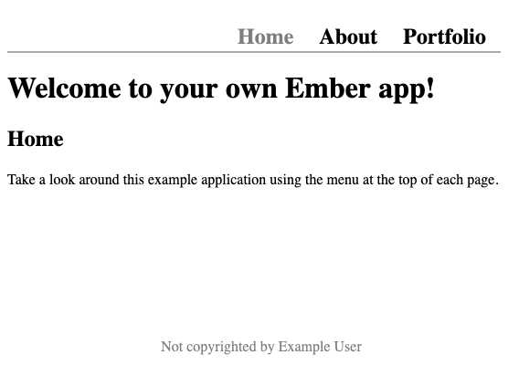
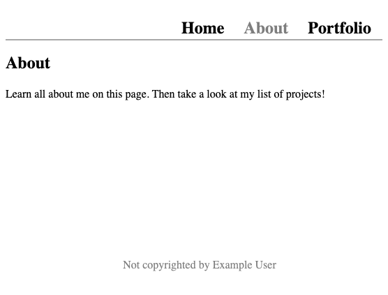

Ember is a JavaScript framework for making the process of developing modern web applications better for developers and users. Ember's component and service-based framework give powerful tools for making consistent and efficient applications.

With this guide, learn what Ember has to offer and how it structures its applications. Follow along for an in-depth example of how to install Ember and start building an application of your own with its command-line tools.

## Before You Begin

1. Familiarize yourself with our [Getting Started with Linode](/docs/products/platform/get-started/) guide and complete the steps for setting your Linode's hostname and timezone.

1. This guide uses `sudo` wherever possible. Complete the sections of our [How to Secure Your Server](/docs/products/compute/compute-instances/guides/set-up-and-secure/) guide to create a standard user account, harden SSH access, and remove unnecessary network services.

1. Update your system.

    - On **Debian** and **Ubuntu**, use the following command:

        ```command
        sudo apt update && sudo apt upgrade
        ```

    - On **AlmaLinux**, **CentOS** (8 or later), or **Fedora**, use the following command::

        ```command
        sudo dnf upgrade
        ```


The steps in this guide are written for non-root users. Commands that require elevated privileges are prefixed with `sudo`. If you’re not familiar with the `sudo` command, see the [Linux Users and Groups](/docs/guides/linux-users-and-groups/) guide.


## What is the Ember Framework?

[Ember.js](https://emberjs.com/) is a modern JavaScript framework for developing web frontends. Ember utilizes a Model-View-Controller (MVC) architecture and centers application design around reusable components and services.

With Ember, everything comes ready to build efficient and dynamic application frontends. Routing is built in, as is two-way data binding, all while being a light layer on top of vanilla JavaScript.

Ember.js is also an open-source, community-backed framework. The project has clear and thorough documentation, and its community support can be a boon for working through the process of building your own applications.

### Ember vs React

React stands as one of the most popular tools for building modern web application frontends. So when it comes to adopting Ember, you may wonder how it compares to its more popular alternative.

The two are similar in that both are designed for developing efficient web frontends, and both use component-based approaches.

But the two differ in scope. React is a library, designed specifically for enhancing the experience of developing user interfaces. Ember.js, on the other hand, is a framework, meaning that it brings with it an entire architecture for developing front-end applications.

Beyond that, the following are some of the key differences between the two:

- Ember is highly opinionated. It brings with it a particular architecture (MVC) and conventions, and developers need to follow these to develop Ember applications. React, on the other hand, is not opinionated, in large part because it is strictly focused on the view aspect. This makes React more adaptable but also gives it a less built-in structure.

- Ember comes built-in with features for modern web application development like routing and services. React can have these features added to it, but doing so typically requires bringing in other, supplementary libraries, or a framework like Next.js.

- Ember is generally considered to have a higher learning curve than React. React's adaptability often makes it easier to pick up for the first time user. By contrast, Ember requires developers to be explicit with its architecture and conventions to create applications.

Overall, Ember is considered an strong solution for dynamic single-page applications. With its full suite of features and underlying architecture, Ember gives developers a strong basis for building highly interactive applications.

React, on the other hand, does well with larger and more complicated applications. React is a JavaScript library for handling user interfaces, which makes it adaptable for use alongside other libraries that handle other parts of complex applications.

## How to Install Ember

The Ember framework itself only needs to be installed for the particular JavaScript project on which you are working.

But Ember does have tools that you likely want to install to make working with Ember projects smoother. These make the process of creating new JavaScript projects with the Ember framework straightforward.

These steps walk you through installing the Ember tooling.

1. Follow our tutorial on how to [Install and Use the Node Package Manager (NPM) on Linux](/docs/guides/install-and-use-npm-on-linux/).

1. Install the Ember command-line (CLI) tool as a global NPM package:

    ```command
    npm install -g ember-cli
    ```

This gives you the `ember` command-line command. The rest of this guide uses this tool for setting up Ember projects. But the tool can be used for conveniently creating files for new components and services on your project.

## Getting Started with Ember

Once you have the Ember CLI, the process of creating a new Ember project is straightforward. Follow along through this next section to create a new Ember project and run the default base application.

Later, the guide builds on this base project to create a full and custom application.

### Create an Ember Base Project

The Ember CLI provides a command for creating a new Ember project. For this guide, the project is named `example-app`. The following Ember CLI command creates a new project with that name, resulting in an `example-app` directory within the current directory.

```command
ember new example-app
```

```output
installing app
Ember CLI v4.7.0

✨  Creating a new Ember app in /home/example-user/example-app:
[...]

[...]
🚧  Installing packages... This might take a couple of minutes.
npm: Installed dependencies

🎥  Initializing git repository.
Git: successfully initialized.

🎉  Successfully created project example-app.

```

Now you can change into the new project's directory, where the rest of this guide assumes you are working:

```code
cd example-app
```

The base Ember project comes with a working application. You can start a development server with the following command:

```command
ember server
```

Ember serves the application on port `4200` by default. You can access the application by navigating to that port in a web browser. For instance, assuming your server's remote IP address is `192.0.2.0`, you would navigate to `http://192.0.2.0:4200`.


To access this remotely, you may first need to open the port in your system's firewall. You can learn about how to do that in one of the guides linked below, depending on your system's Linux distribution.

- For **Debian** and **Ubuntu**, refer to our guide on [How to Configure a Firewall with UFW](/docs/guides/configure-firewall-with-ufw/).

- For **AlmaLinux**, **CentOS**, and **Fedora**, refer to our guide on [Enabling and Configuring FirewallD on CentOS](/docs/guides/introduction-to-firewalld-on-centos/)



You can then stop the Ember development server with the **Ctrl + C** key combination.

### Understand the Parts of an Ember Project

You should familiarize yourself with Ember's most important parts. These next few sections summarize the most useful of these and lay foundations for how to start working with them.

#### Templates

Templates, stored in the `app/templates` subdirectory, define the structure of each page of your Ember application. The default template, `templates/application.hbs`, does not have much content, since most of the design is done in the `<WelcomePage />` component.

You can see in the sections below on that template files follow some of the basic principles of HTML. Ember extends widely on HTML's possibilities, however, to make its templates capable of dynamic, and adaptable content.

#### Components

Components provide supplements to standard HTML tags. They are defined via files in the `app/components` subdirectory.

Think of components as custom tags that provide particular structures and behaviors for your application. Components are particularly useful because they are reusable. They allow you to define and maintain a display in one file that can be used anywhere across your application.

The example application created in a following section includes components for everything from the navigation bar to the structure of page content.

#### Routes

A route is a way to define what content to display in a single page app without navigating away from the page a user is currently on.

Routes are defined in the `app/router.js` file, via modifications to the `Router.map` portion of the file.

For instance, you can add an `/about` route, for an "About Me" page, by modifying the default `Router.map` as shown below:

```file {title="app/router.js"}
// [...]

Router.map(function () {
  this.route('about');
});
```

Each route points to a template of the same name — the above example points to the `app/templates/about.hbs` template. You can also apply custom paths for your routes, using the `path` variable. This example modifies the above to use the path `about-me` for the `about` template:

```file{title="app/router.js"}
// [...]

Router.map(function () {
  this.route('about', { path: '/about-me' });
});
```

Each route also points to a JavaScript file of the associated name, stored in the `app/routes` subdirectory. These files are not required — the `/about` route in the example application created below does not have one. But they allow you to associate particular behaviors with the route and give the route a model for storing data and methods.

#### Services

Services provide reusable behaviors across an Ember application, particularly for behaviors that require a shared state across the application. These services are defined by files in the `app/services` subdirectory.

Services can be useful for retrieving data, fetching and maintaining authentication, connecting to web sockets, and external APIs, and providing logging. They are typically best for functions and states that you need access to across the application.

## How to Create an Ember Application

To put that knowledge about Ember and how it structures applications into practice, this section walks you through the creation of a full Ember application.

This example application covers most of the key concepts discussed above. Along the way, this walkthrough gives you a deeper look at Ember's features and how you can develop them.

### Constructing Templates

This project has three pages: a homepage, an about page, and a portfolio page. For each, you can create an Ember template, each consisting of a `.hbs` file, in the `app/templates` subdirectory.

These templates already use some components to abstract pieces of the page design. You can find more on each of these components in the next section.

- Create an `index.hbs` template and give it the contents shown below.

    ```file {title="app/templates/index.hbs"}
    <h1>Welcome to your own Ember app!</h1>
    <!-- Use a component for page content. This component takes a title argument
        and some body content, which can include any HTML/template markup. -->
    <PageContent @title="Home">
      Take a look around this example application using the menu at the top of each page.
    </PageContent>
    ```

- Create an `about.hbs` template with the contents shown below.

    ```file {title="app/templates/about.hbs"}
    <PageContent @title="About">
      Learn all about me on this page. Then take a look at my list of projects!
    </PageContent>
    ```

- Create a `projects.hbs` template with the contents shown below. This page is a more complex, as it uses a model which fetches dynamic data. You can see how that behavior is implemented in the section further below on data fetching.

    ```file {title="app/templates/projects.hbs"}
    <PageContent @title="Projects">
      These are some key projects of mine.
      <!-- Each of these components takes a list of projects and renders
          them for display. -->
      <ProjectsList @project-list-title="Completed" @projects={{@model.completedProjects}}/>
      <ProjectsList @project-list-title="In Progress" @projects={{@model.inProgressProjects}}/>
    </PageContent>
    ```

None of the above templates includes a header or footer section. Instead, you can use a special `application.hbs` template to implement them. This file should already be present in the default Ember application. Replace its contents with the following to implement a consistent frame for each page.

```file {title="app/templates/projects.hbs" hl_lines="3 10"}
<div class="container">
  <!-- Use a component for the menu bar at the top of each page. -->
  <NavBar />
  <div class="content">
    <!-- This plugs the template for the current page within this
         application template. -->
    {{outlet}}
  </div>
  <!-- Use a component for the footer at the bottom of each page. -->
  <Footer />
</div>
```

### Putting Together Components

The templates above use a variety of components to implement reusable structures. With components, you can design elements that can be reused across your application. These tend to be easier to maintain because they are centralized.

Here you can see the creation of the components used in this example application. Components are stored in the `app/components` subdirectory of your Ember project, and each can be used as an HTML element.

For instance, the `nav-bar.hbs` component below is readily available to the `application.hbs` template above, because it is added with the `<NavBar />` tag.

- Create a `NavBar` component and a `Footer` component. These are used in the `application.hbs` template to add a menu bar and footer to every page on the application.

    ```file {title="app/components/nav-bar.hbs"}
    <nav>
      <!-- Use a built-in Ember component for handling links. -->
      <LinkTo @route="index">
        <h2>Home</h2>
      </LinkTo>
      <LinkTo @route="about">
        <h2>About</h2>
      </LinkTo>
      <LinkTo @route="projects">
        <h2>Portfolio</h2>
      </LinkTo>
    </nav>
    ```

    ```file {title="app/components/footer.hbs"}
    <footer>
      Not copyrighted by Example User
    </footer>
    ```

- Create a `PageContent` component for handling page content. The pages for this project all follow a similar structure. Using a component lets you abstract some of the structure so you do not have to repeat it.

    More importantly, doing so lets you more easily update that structure later. Should you need to update the format for displaying page content, you can do so from one centralized component, rather than from each template.

    ```file {title="app/components/page-content.hbs"}
    <div>
      <!-- Make use of the title argument to provide variable content. -->
      <h2>{{@title}}</h2>
      <div>
        <!-- Display the content wrapped in the component's tag when the
            component gets called into a template. -->
        {{yield}}
      </div>
    </div>
    ```

- Create a `ProjectList` component for rendering a list of projects. The portfolio page of this example application has two lists, and this component can handle both.

    ```file {title="app/components/project-list.hbs"}
    <!-- Use the argument passed from the template for the list title. -->
    <h3>{{@project-list-title}}</h3>
    <ul>
      <!-- Use templating code to loop through each of the listed projects. -->
      {{#each @projects as |project|}}
        <li>{{project.name}}</li>
      {{/each}}
    </ul>
    ```

### Define Routes

Ember comes with routing, and adding new routes can be done through modifications to the default `app/router.js` file.

This example adds two new routes, `/about` and `/projects`, directing to two of the templates created for this project. The home page, at the `/` route, is included by default, routing to the `index.hbs` template.

```file {title="app/router.js"}
// [...]

Router.map(function () {
  this.route('about');
  this.route('projects');
});
```

### Implement Data Fetching

The portfolio page for this example application fetches two external lists to display results from. The data fetching can be handled using a route's JavaScript file, stored in the `app/routes` subdirectory.

The `/project` route's JavaScript file implements a model for the route, providing it some fetched data and a few behaviors. The model first fetches the broad list of portfolio projects and then exposes two methods, each for providing a different filtered list of projects.

```file {title="app/routes/projects.js"}
// Import the route module for handling route-specific behavior.
import Route from '@ember/routing/route';

// Create the class for the route.
export default class ProjectsRoute extends Route {
  // Create a model for the route.
  async model() {
    // Fetch the projects list, in this case from a JSON file. Parse the
    // response JSON.
    let response = await fetch('/api/projects.json');
    let responseParsed = await response.json();

    // Have the model return two methods, each devoted to a particular filter
    // of the fetched projects list.
    return {
      get completedProjects() {
        return responseParsed.data.filter((project) => project.status === "Completed");
      },
      get inProgressProjects() {
        return responseParsed.data.filter((project) => project.status === "In Progress");
      }
    }
  }
}
```

For demonstration purposes, this example just uses a JSON file for fetching the lists, rather than an external service like a REST API. You can create the JSON file used here by adding a `project.json` file with the following contents to your project's `public/api` subdirectory.

```file {title="public/api/projects.json"}
{
  "data": [
    { "status": "Completed", "name": "My First Project", "url": "https://example.com/my-first-project" },
    { "status": "Completed", "name": "The Second Project", "url": "https://example.com/second-project" },
    { "status": "Completed", "name": "Another Project", "url": "https://example.com/another-project" },
    { "status": "In Progress", "name": "Latest Project", "url": "https://example.com/on-going-project" }
  ]
}
```

### Run the Application

To run this example application, you can use the same command you used to run the default Ember application:

```command
ember server
```

Now, navigate to port `4200` on the server to see the new application in action.

- The home page loads from the default route (`/`).

    

- You can then use the links in the navigation menu to visit the application's other routes, like `/about`.

    

- On the portfolio page (`/projects`), you can see the lists of projects rendered as expected.

    

## Conclusion

This guide offers a general overview of Ember and its application structure, as well as a walkthrough for creating an application of your own. With it, you have the foundations for getting started with Ember and developing your own web applications.
