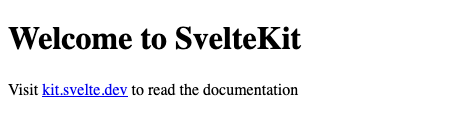
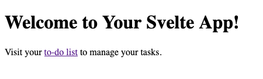
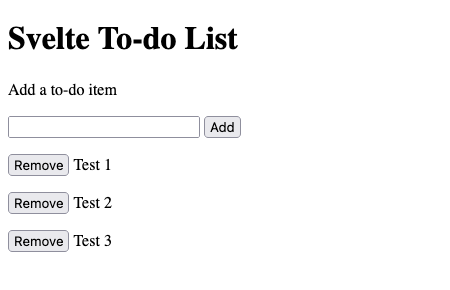
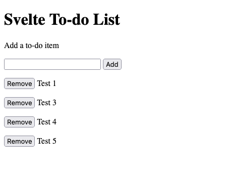

Svelte is a JavaScript framework for frontend web development. And unlike most similar frameworks, Svelte handles page processing at build time. Svelte frontends operate without a virtual DOM, giving you small and efficient application bundles with streamlined performance.

Through this guide, learn more about what sets the Svelte framework apart and how you can start building your own Svelte frontends.

## Before You Begin

1. If you have not already done so, create a Linode account and Compute Instance. See our [Getting Started with Linode](/docs/guides/getting-started/) and [Creating a Compute Instance](/docs/guides/creating-a-compute-instance/) guides.

1. Follow our [Setting Up and Securing a Compute Instance](/docs/guides/set-up-and-secure/) guide to update your system. You may also wish to set the timezone, configure your hostname, create a limited user account, and harden SSH access.


The steps in this guide are written for non-root users. Commands that require elevated privileges are prefixed with `sudo`. If you’re not familiar with the `sudo` command, see the [Linux Users and Groups](/docs/guides/linux-users-and-groups/) guide.


## What Is the Svelte Framework?

[Svelte](https://svelte.dev/) is a JavaScript framework for developing web application frontends. There are many such frameworks, and these typically offload the majority of work to a user's browser through a virtual Document Object Model (DOM). Svelte sets itself apart by shifting the bulk of that work to the app compilation step. Svelte frontends, as a result, work without a virtual DOM.

Svelte's leveraging of the compilation step means that its application bundles tend to be smaller and more performant. Couple that with Svelte's more classical frontend model, and you have a compelling tool for efficiency and approachability.

### Svelte vs React vs Vue

React remains one of the most widely used frameworks for web-frontend development, and the popularity of the Vue framework is not too far behind. Relative to these frameworks, Svelte is a newcomer. What, then, makes Svelte different, and why would you choose it over React, or Vue?

Both React and Vue handle web page changes through a virtual DOM. The virtual DOM provides efficiency over traditional DOM manipulation, but it still has the user's browser handle most of the page processing. As a result, users can experience performance dips with more virtual DOM manipulation.

Svelte diverges from that model. Instead of using a virtual DOM, Svelte applications do the majority of their process during compilation. The result is small, performant application bundles.

Svelte also stays closer to standard HTML and JavaScript/TypeScript concepts and tooling. React and Vue re-imagine the model for web-frontend development, introducing many novel concepts and tools to enhance the developer experience. However, Svelte's model only slightly deviates from classic frontend models. That fact makes the framework typically more approachable for developers unfamiliar with modern web frontend concepts and tooling.

## How to Install Svelte

To install Svelte, the recommended approach in the official documentation is to start your Svelte project using the SvelteKit. The SvelteKit installs with the command for creating a new NPM project, meaning you do not need any global Svelte installation.

With the SvelteKit installed, your project compiles `.svelte` files into the appropriate JavaScript and CSS at build time. SvelteKit also brings ready access to convenient frontend development features like routing.

1. Install NPM to manage your Svelte project and install its dependencies. Follow the relevant section of our guide on [How to Install and Use the Node Package Manager (NPM) on Linux](/docs/guides/install-and-use-npm-on-linux/#how-to-install-npm).

1. Create a new NPM project using the SvelteKit template. This example names the project `exampleApp`, and this name gets used for the Svelte project throughout the rest of this guide:

    ```command
    npm create svelte@latest exampleApp
    ```

    Follow the prompts to complete the setup for your project.

    - Choose an application template to start your project with. This guide later uses the `Skeleton project` for a base template, but you may choose the `SvelteKit demo app` option to seem Svelte's capabilities.

    - Choose whether you would like type-checking within your project. This is where you can select TypeScript for your project should you want. Svelte also has the option of type-checking through a `JSDoc` syntax, which is what this guide uses. Choose `No` for a more traditional JavaScript experience, without type checking.

    - Choose any additional features you would like from the remaining prompts. This guide selects `No` to all of these subsequent prompts to make the examples simpler, but the features offered here can improve the development experience for many projects.

1. Change into the new project directory, and have NPM install the project dependencies. The rest of this guide assumes you are in this directory for any example commands:

    ```command
    cd exampleApp
    npm install
    ```

And with that, you have gotten started with Svelte. Anytime you want to create a new Svelte application, you can use the steps above to set it up.

You can test this base project by running the development server. Run the development server using the following command, and then look for the output by navigating to `localhost:5173` in a web browser:

```command
npm run dev
```

```output
  VITE v4.0.1  ready in 1165 ms

  ➜  Local:   http://localhost:5173/
  ➜  Network: use --host to expose
  ➜  press h to show help
```

To access this URL from a remote machine, you can use an SSH tunnel. Set up the SSH tunnel using one of the methods below, depending on your operating system.

- On **Windows**, you can use the PuTTY tool to set up your SSH tunnel. Follow the PuTTY section of our guide on how to [Create an SSH Tunnel for MySQL Remote Access](/docs/guides/create-an-ssh-tunnel-for-mysql-remote-access/#how-to-access-mysql-remotely-by-creating-an-ssh-tunnel-with-putty). Use `5173` as the **Source port** and `127.0.0.1:5173` as the **Destination**.

- On **macOS** or **Linux**, use the following command to set up the SSH tunnel. Replace `example-user` with your username on the remote server and `192.0.2.0` with the remote server's IP address:

    ```output
    ssh -L5173:localhost:5173 example-user@192.0.2.0
    ```

You should now be able to access the development server from the remote machine. Navigate to `localhost:5173` in a web browser, just as you would on the remote machine itself.



## How to Build a Frontend with Svelte

With a Svelte project of your own created, you should now get familiar with how Svelte applications work. Svelte adheres more closely to traditional web development models, making it often more approachable for new frontend developers. However, SvelteKit does implement some particular structures to help modern projects off the ground.

These next sections aim to get you familiar with the SvelteKit structure and its features as well as the fundamentals of developing a Svelte application. The example application demonstrates some of the characteristics of Svelte applications overall.

### SvelteKit Application Structure

Using the SvelteKit base template, your project gets initialized with a simple structure that you can build on. Here is what the base structure looks like:

- `src/`

    - `routes/`

        - `+page.svelte`

- `app.d.ts`

- `app.html`

Most of the work for building your application takes place within the `src/routes` path. Within this directory, any `+page.svelte` files represent the base page template for the path. So the `+page.svelte` file above, in the `routes` directory, represents the landing page, for the `/` address.

Adding a `new-path` directory under `routes` creates a new route. A `+page.svelte` file within this new directory would define a page for the `/new-path` path.

There are numerous more features for working with the `routes` structure. What follows are a few of the most noteworthy and useful for getting started.

- Use square brackets (`[...]`) in a `routes` path to implement a slug. For instance, a `routes/new-path/[slug]` directory creates a new path with a variable slug. JavaScript and Svelte files within the `[slug]` directory can access that slug as a parameter.

- Use a `+page.js` file (or `+page.ts` for TypeScript) within a `routes` path to implement a script for loading data. These scripts get executed before the path's page gets rendered. The scripts can be used, for instance, to fetch page content based on a parameter like a path slug.

- Use `+error.svelete` within a `routes` path to create custom error pages. SvelteKit has default error pages, but using `+error.svelte` lets you provide customized displays and responses.

Learn more about the SvelteKit structure and the features it offers through the SvelteKit documentation linked at the end of this guide.

### Example Svelte Application

The base template set up with the installation above gives only a sparse demonstration of Svelte, without showing routing and interactive features. So to help better understand Svelte and the SvelteKit features, the following series of steps walk you through creating a basic interactive frontend.

The example creates a to-do list, adding a new route and a link to it from the main page. The new route includes a script to load the initial to-do list and demonstrates features like dynamic rendering and two-way data binding.

1. Follow the section above on installing Svelte to create a new Svelte project. Use the `Skeleton project` template, and choose the `JSDoc` option for the type checking.

1. Open the `src/routes/+page.svelte` file, and modify its contents to include the following. This just changes the paragraph text and includes a link to a `/todo` route:

    ```file {title="src/routes/+page.svelte"}
    <h1>Welcome to Your Svelte App!</h1>
    <p>Visit your <a href="/todo">to-do list</a> to manage your tasks.</p>
    ```

1. Create a new directory of `src/routes/todo`. This creates a new `/todo` route for your application.

1. Add a `+page.js` file within the `src/routes/todo` directory, and give the file the contents shown here. The `load` function runs before the page renders, usually to load data. The example here simply uses some static data, but the function is capable of fetching data from other files or services:

    ```file {title="src/routes/todo/+page.js"}
    /** @type {import('./$types').PageLoad} */
    export function load({ params }) {
        return {
            todoList: ['Test 1', 'Test 2', 'Test 3'],
        }
    }
    ```

1. Add a `+page.svelte` file within the `src/routes/todo` directory, and give the file the contents shown here. Annotations are provided throughout the code here to help break down what each part does. Overall, this file defines the structure of the to-do list and the functions for handling actions on the list:

    ```file {title="src/routes/todo/+page.svelte"}
    <script>
      // Imports the data from the +page.js file.
      /** @type {import('./$types').PageData} */
      export let data;

      // Creates a base variable for new to-do items. The $ defines the variable
      // as reactive, enabling dynamic updates to associated elements.
      $: newTodoItem = '';

      // Defines a to-do list from the loaded initial list.
      let todoList = data.todoList;

      // Defines a function for adding a new item to the to-do list.
      function addTodo() {
          if (newTodoItem != '') {
              todoList.push(newTodoItem);
              // Svelte only reactively updates elements when the variable is
              // redefined, not modified, so the following statement is needed.
              todoList = todoList;
          }

          newTodoItem = '';
      }

      // Defines a function to remove an item from the to-do list.
      function removeTodo(todoItem) {
          // Redefines the list by filtering out the matching item.
          todoList = todoList.filter((x) => x !== todoItem);
      }
    </script>

    <h1>Svelte To-do List</h1>

    <div>
      <p>Add a to-do item</p>
      <div>
        <!-- Creates a two-way data binding. -->
        <input type="text" bind:value={newTodoItem}/>
        <input type="button" value="Add" on:click={addTodo}/>
      </div>
    </div>

    <div>
      <!-- Loops through each to-do item and renders its display. -->
      {#each todoList as todoItem}
        <p><input type="button" value="Remove" on:click={removeTodo(todoItem)}/> {todoItem}</p>
      {:else}
        <p>Nothing to do!</p>
      {/each}
    </div>
    ```

1. Run the development server for the application, and navigate to it in your web browser, just as shown in the section on installing the project above. You should see a variant of the default welcome page.

    

1. Click the link on the welcome page or otherwise navigate to the `/todo` route, `localhost:5173/todo`, to see the default to-do list.

    

1. Make some changes to the list to verify that it works as expected. Here, the item `Test 2` was removed and items `Test 4` and `Test 5` were added.

    

## Conclusion

You now have a working Svelte application of your own and with it a foundational knowledge of how to work with Svelte and SvelteKit. Svelte has many more features for you to leverage, and SvelteKit still helps you structure modern and efficient frontend applications. Be sure to refer to the Svelte and SvelteKit documentation linked below to get the most out of your new Svelte application.
