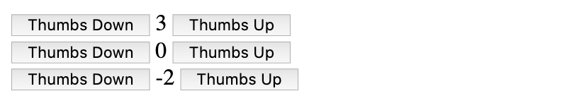
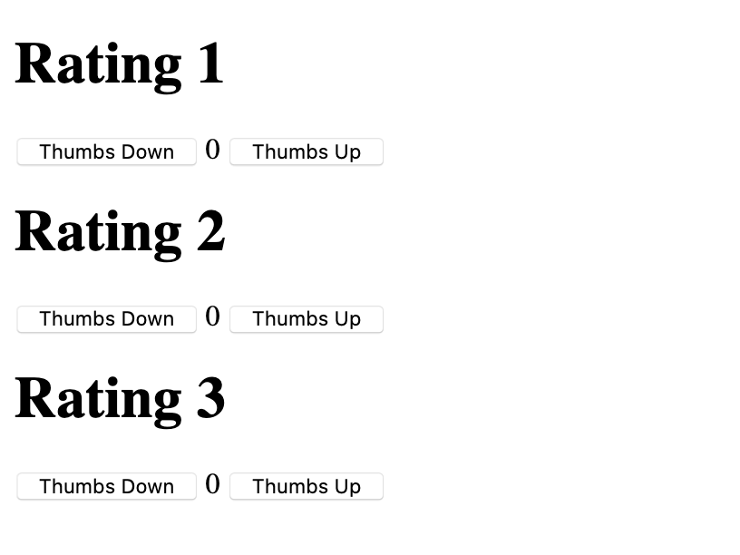
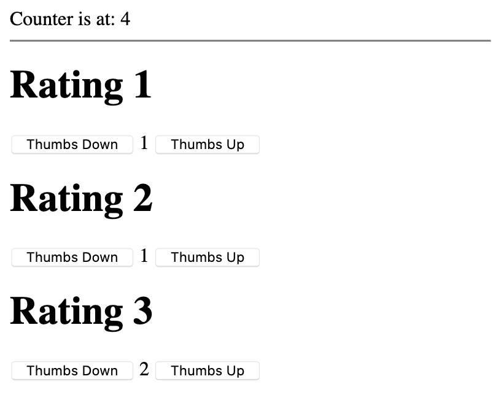
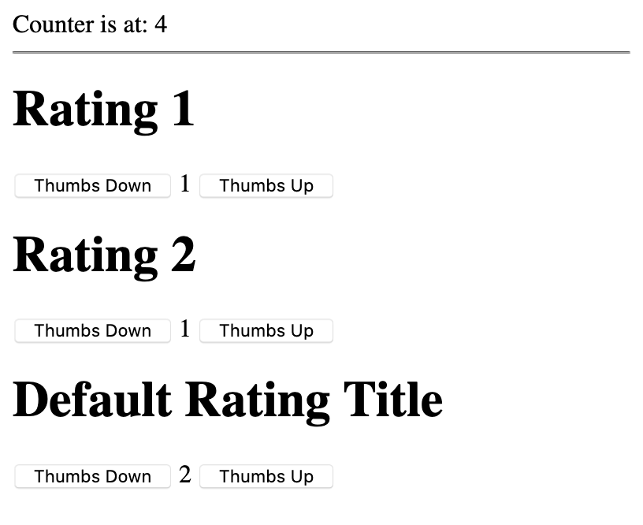
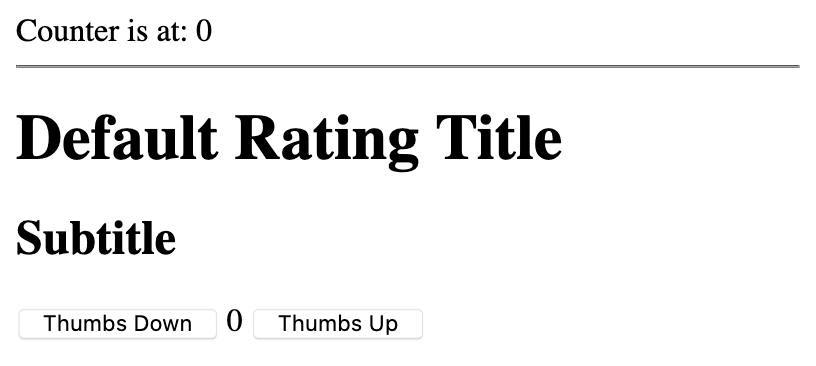
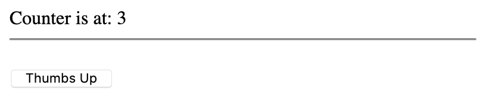
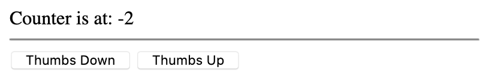

## What are VueJS Components

In VueJS, [components](https://vuejs.org/v2/guide/components.html) are a way to create custom VueJS instances which can easily be reused in your code. In order to properly explain what VueJS components are we will build a very simple `rating-counter` component.

This guide is written for new VueJS users and will explain what are components are, how to build them, and how to use them. Basic knowledge of JavaScript and VueJS is important for following through with the tutorial.

In this guide you learn how to:

 - [Create your first component](#creating-your-first-component)
 - Add custom properties to your component [with props](#using-component-props)
 - Embed content in a component [with slots](#using-slots)
 - Communicate information back to a component's parent [with events](#using-component-events)


You can [download all of the example files for this guide here](how-to-build-and-use-vuejs-components.tar.gz).


## Prepare the Vue App

In your text editor on your computer, create a new file called `ratingcounter.html`. Then, paste in the content from this snippet:


<script src="https://cdn.jsdelivr.net/npm/vue/dist/vue.js"></script>

<div id="app">
</div>

<script>
var app = new Vue({
  el: '#app'
})
</script>


As this will be a simple VueJS application, the first thing we have to do is include the VueJS library in our document.

-   The easiest way that is done is by going to the [Installation page at vuejs.org](https://vuejs.org/v2/guide/installation.html) and copying the script tag specified under CDN.

-   As we are in the development stage of the application, we will use the development version of the VueJS library. This line is copied into line 1 of the HTML snippet.

After the VueJS library is included, a `div` with `id` set to `app` is created on lines 3-4. On lines 6-10, a barebones VueJS app is created and linked to this element.

So far this new app does nothing at all, but we will use it for the skeleton of our example application.

## Creating your First Component

The component we’ll be developing is a simple reusable rating counter that will illustrate how VueJS components work. We’ll explain each part of the component along the way. Let's get started:

### Define the Component

In your `ratingcounter.html`, update the second `<script>` section (currently on lines 6-10 of your file) to include the `Vue.component()` function from lines 7-18 of this snippet:


<script src="https://cdn.jsdelivr.net/npm/vue/dist/vue.js"></script>

<div id="app">
</div>

<script>
Vue.component('rating-counter', {
    data() {
        return {
            count: 0
        }
    },
    template:   `<div>
                    <button v-on:click="count--">Thumbs Down</button>
                    {{ count }}
                    <button v-on:click="count++">Thumbs Up</button>
                </div>`
})

var app = new Vue({
  el: '#app'
})
</script>


Let's go through each part of the component:

- The first parameter of the `Vue.component()` function is the component’s name, in this case `rating-counter` (line 7). You will be referring to this component by its name in order to render it (described in the next section: [Use the Component](#use-the-component)).

-   The second argument to the `Vue.component()` function is the component’s options (lines 8-18). We only use two options: the data function and the template.

-   The component’s data [must be a function](https://vuejs.org/v2/guide/components.html#data-Must-Be-a-Function). This is because each instance of the component must have a separate and independent copy of the data object. Otherwise, each time we reuse a component it would inherit the data from the other instances of the component.

-   The template contains the HTML this component will render:

    -   VueJS uses [mustache tags](https://vuejs.org/v2/guide/syntax.html#Text) to render strings. In our example, `{{ count }}` (line 19) will render the count from the component's data.

        What is interesting is that as VueJS is reactive, when you change your variable the view automatically updates it, and you don’t have to add any code to make this work.

    -   Another thing you probably noticed in the template is the `v-on:click` attribute of the buttons (lines 14 and 16). Similar to jQuery's `.on(‘click’, func)`, you can use this feature to attach a function to the on-click event of the element.

        This can either be pointed to a function, or you can use JavaScript operators. This example uses the increment `++` and decrement `--` operators directly in the attribute itself.

At this point, we’ve built our first component, but it won't be visible yet if you load `ratingcounter.html` in your browser.

### Use the Component

Let's try the new component out. In your `ratingcounter.html`, update the `app` div as follows:


<div id="app">
   <rating-counter></rating-counter>
   <rating-counter></rating-counter>
   <rating-counter></rating-counter>
</div>


This will render three rating counters which work independently from one another:



Awesome. Let's say however that we need to pass arguments from the parent application to the component. The option for that is called *props*.

## Using Component Props

[Props](https://vuejs.org/v2/guide/components.html#Passing-Data-to-Child-Components-with-Props) are VueJS's method for adding custom properties to your component. To demonstrate this concept, let's modify our component a little bit:

1. In `ratingcounter.html`, update your `Vue.component()` declaration as follows:

    
Vue.component('rating-counter', {
    props: ['title'],
    data() {
        return {
            count: 0
        }
    },
    template:   `<div>
                    <h1>{{ title }}</h1>
                    <button v-on:click="count--">Thumbs Down</button>
                    {{ count }}
                    <button v-on:click="count++">Thumbs Up</button>
                </div>`
})


    The `props` option has been added on line 2 of this snippet, and you can access its values from the template with the mustache syntax, just like a regular data parameter. In line 9 of this snippet, the reference to `{{ title }}` has been added to the template.

1.  How can you actually pass data to a prop? Just pass `title` as an attribute to your component’s opening tag. Whatever you pass there would be accessible by your component.

    In your `ratingcounter.html`, update the `app` div as follows:

    
<div id="app">
   <rating-counter title="Rating 1"></rating-counter>
   <rating-counter title="Rating 2"></rating-counter>
   <rating-counter title="Rating 3"></rating-counter>
</div>


1. If you reload the file in your browser, you'll now see a title rendered for each component instance. Voila:

    

### Sharing Data Between Components and the Parent App

Just as a Vue component can keep track of data used in that component, the Vue app itself can also maintain [its own data object](https://vuejs.org/v2/guide/instance.html#Data-and-Methods). This section will show how props can also be used to share that data with your components.

Replace the contents of your `ratingcounter.html` with the following snippet:


<script src="https://cdn.jsdelivr.net/npm/vue/dist/vue.js"></script>

<div id="app">
   {{ parentHeader.label }}{{ parentHeader.globalCount }}
   <hr />
   <rating-counter title="Rating 1" v-bind:parent="parentHeader"></rating-counter>
   <rating-counter title="Rating 2" v-bind:parent="parentHeader"></rating-counter>
   <rating-counter title="Rating 3" v-bind:parent="parentHeader"></rating-counter>
</div>

<script>
Vue.component('rating-counter', {
    props: ['title', 'parent'],
    data() {
        return {
            count: 0
        }
    },
    template:   `<div>
                    <h1>{{ title }}</h1>
                    <button v-on:click="count--;parent.globalCount--;">Thumbs Down</button>
                    {{ count }}
                    <button v-on:click="count++;parent.globalCount++;">Thumbs Up</button>
                </div>`
})

new Vue({
    el: '#app',
    data: {
        parentHeader: {
            label: "Counter is at: ",
            globalCount: 0
        }
    }
})
</script>


Load the file in your browser and start clicking the buttons. You'll now see a label at the top of the page that counts up the total from each of your components:



Let's break down the updated parts of the file:

- The parent app's data is set on lines 29-34. The app now keeps track of an object called `parentHeader`.

- The data from this object is rendered on line 4.

- On line 13, we've added another prop to the component, called `parent`.

- On lines 6-8, the value for this prop is assigned with the `v-bind:parent` attribute. By using the [`v-bind` syntax](https://vuejs.org/v2/api/#v-bind), you’re telling VueJS to bind the `parent` attribute of the component to whichever data property you supply, in this case the `parentHeader` object.

- On lines 21 and 23, the on-click actions for each button will increment or decrement the `globalCount` property of the `parent` prop, which corresponds to the `globalCount` property of the `parentHeader` object in your app's data.

- Because props are reactive, changing this data from the component will cascade the changes back to the parent, and to all other components that reference it.


## Using Slots

[Slots](https://vuejs.org/v2/guide/components.html#Content-Distribution-with-Slots) are another very clever way to pass data from parent to components in VueJS. Instead of using attributes as you did before, you can pass data within the component's opening and closing HTML tags. Let's take a look at the below example:

Replace the contents of your `ratingcounter.html` with the following snippet:


<script src="https://cdn.jsdelivr.net/npm/vue/dist/vue.js"></script>

<div id="app">
   {{ parentHeader.label }}{{ parentHeader.globalCount }}
   <hr />
   <rating-counter v-bind:parent="parentHeader"><h1>Rating 1</h1></rating-counter>
   <rating-counter v-bind:parent="parentHeader"><h1>Rating 2</h1></rating-counter>
   <rating-counter v-bind:parent="parentHeader"><h1>Rating 3</h1></rating-counter>
</div>

<script>
Vue.component('rating-counter', {
    props: ['parent'],
    data() {
        return {
            count: 0
        }
    },
    template:   `<div>
                    <slot></slot>
                    <button v-on:click="count--;parent.globalCount--;">Thumbs Down</button>
                    {{ count }}
                    <button v-on:click="count++;parent.globalCount++;">Thumbs Up</button>
                </div>`
})

new Vue({
    el: '#app',
    data: {
        parentHeader: {
            label: "Counter is at: ",
            globalCount: 0
        }
    }
})
</script>


When loaded in a browser, the page should appear identical to the example in the previous section.

On lines 6-8, notice how instead of passing the `title` prop with an argument, we pass it within the component's open and close tags:

```html
<rating-counter v-bind:parent="parentHeader"><h1>Rating 1</h1></rating-counter>
```

On line 20, the slot is referenced with the `<slot></slot>` syntax. As shown in this example, slots support HTML. As well, they have access to the parent’s scope (not demonstrated here), and they even support [nesting more components](#nesting-slots).


Slot [scope](https://vuejs.org/v2/guide/components-slots.html#Compilation-Scope) is an important concept to grasp when working with slots. Even though the content you are passing from the parent is intended for the component, you are still within the context of the parent.

For example, trying to access the `count` data of the `rating-counter` component like this would fail:

```html
<rating-counter v-bind:parent="parentHeader">
    <h1>{{ count }}</h1>
</rating-counter>
```

However, as you are within the scope of the parent app, you can access the `parentHeader` object (or any other app data):

```html
<rating-counter v-bind:parent="parentHeader">
    <h1>{{ parentHeader.label }}</h1>
</rating-counter>
```

Using the `parentHeader.label` string here wouldn't make much sense anyway, so this would only serve to demonstrate the scope concept.


### Nesting Slots

The most important feature of slots might be the ability to use components within components. This is especially useful when creating structure for your apps.

Replace the contents of your `ratingcounter.html` with the following snippet:


<script src="https://cdn.jsdelivr.net/npm/vue/dist/vue.js"></script>

<div id="app">
    {{ parentHeader.label }}{{ parentHeader.globalCount }}
    <hr />

    <rating-counter v-bind:parent="parentHeader">
        <rating-title>Rating 1</rating-title>
    </rating-counter>

    <rating-counter v-bind:parent="parentHeader">
        <rating-title>Rating 2</rating-title>
    </rating-counter>

    <rating-counter v-bind:parent="parentHeader">
        <rating-title></rating-title>
    </rating-counter>
</div>

<script>
Vue.component('rating-counter', {
    props: ['parent'],
    data() {
        return {
            count: 0
        }
    },
    template:   `<div>
                    <slot></slot>
                    <button v-on:click="count--;parent.globalCount--;">Thumbs Down</button>
                    {{ count }}
                    <button v-on:click="count++;parent.globalCount++;">Thumbs Up</button>
                </div>`
})

Vue.component('rating-title', {
    template:   `<div>
                    <h1>
                        <slot>Default Rating Title</slot>
                    </h1>
                </div>`
})

new Vue({
    el: '#app',
    data: {
        parentHeader: {
            label: "Counter is at: ",
            globalCount: 0
        }
    }
})
</script>


We've created another component called `rating-title` to illustrate slot nesting. This component will wrap a title that you set inside a pair of `<h1>` tags:



Let's explore the code for this component:

-   The template for the new component is defined on lines 37-41. The `<slot>` tag has been added to this template, but this time the slot is not empty.

-   You can specify the default value for slots by adding it between the open and close slot tags: ```<slot>Default Rating Title</slot>```

-   You can see how this default value is referenced for the new `rating-title` component on line 16. Whenever nothing is included between the `<rating-title></rating-title>` tags, the default value is used.

-   Compare this with how the component is used on lines 8 and 12. Because a title is included between the component's tags, the default text is not rendered.

### Named Slots

To allow even more structure, you can use multiple slots in a template by using [slot naming](https://vuejs.org/v2/guide/components-slots.html#Named-Slots). Lets overengineer our simple example a little bit to see how it works.

Replace the contents of your `ratingcounter.html` with the following snippet:


<script src="https://cdn.jsdelivr.net/npm/vue/dist/vue.js"></script>

<div id="app">
    {{ parentHeader.label }}{{ parentHeader.globalCount }}
    <hr />

   <rating-counter v-bind:parent="parentHeader">
       <template v-slot:title>
           <rating-title></rating-title>
       </template>
       <template v-slot:subtitle>
           Subtitle
       </template>
   </rating-counter>
</div>

<script>
Vue.component('rating-counter', {
    props: ['parent'],
    data() {
        return {
            count: 0
        }
    },
    template:   `<div>
                    <slot name="title"></slot>
                    <h2>
                        <slot name="subtitle"></slot>
                    </h2>
                    <button v-on:click="count--;parent.globalCount--;">Thumbs Down</button>
                    {{ count }}
                    <button v-on:click="count++;parent.globalCount++;">Thumbs Up</button>
                </div>`
})

Vue.component('rating-title', {
    template:   `<div>
                    <h1>
                        <slot>Default Rating Title</slot>
                    </h1>
                </div>`
})

new Vue({
    el: '#app',
    data: {
        parentHeader: {
            label: "Counter is at: ",
            globalCount: 0
        }
    }
})
</script>


When loaded in a browser, the file will look like:



-   You can see that within our `rating-counter` component (on lines 26-29) there are now two slots. This time they have name attributes as well: `title` and `subtitle`.

-   This takes care of the creation of the named slots, but how do we use them? You can reference a named slot by using the `<template v-slot:slotname></template>` syntax within your parent component. The content inside the `<template>` tags will then be inserted where the `<slot>` with the same name appears in your component's template.

## Using Component Events

[Events](https://vuejs.org/v2/guide/components.html#Listening-to-Child-Components-Events) in components are essential for component-to-parent communication in VueJS. Whenever a component needs to communicate back to its parent, this is the safe way of doing that.

For an example of how this works, replace the contents of your `ratingcounter.html` with the following snippet:


<script src="https://cdn.jsdelivr.net/npm/vue/dist/vue.js"></script>

<div id="app">
    {{ parentHeader.label+" "+parentHeader.globalCount }}
    <hr />

    <rating-counter v-bind:parent="parentHeader" v-on:increment="parentHeader.globalCount++"></rating-counter>
</div>

<script>
Vue.component('rating-counter', {
    template:   `<div>
                    <br><button v-on:click="$emit('increment');">Thumbs Up</button>
                </div>`
})

new Vue({
    el: '#app',
    data: {
        parentHeader: {
            label: "Counter is at: ",
            globalCount: 0
        }
    }
})
</script>


When loaded in a browser, the file will look like:



The example is similar to the previous examples, but we've only left what is essential to the events:

- In the `v-on:click` event of our component (line 13), you can see that this time we're using VueJS's [`$emit` method](https://vuejs.org/v2/api/#vm-emit) instead of changing variables manually. The `$emit()` method takes a custom event name as an argument (`increment` in this example).

- This fires an empty `increment` event, which our parent is subscribed to on line 7. Notice the `v-on:increment="parentHeader.globalCount++"` attribute; this is our event subscriber.

- The subscriber can call a method of the VueJS app, or in this example, just directly use the increment JavaScript `++` operator to increase the counter.

- Because the component no longer directly manipulates the parent's `globalCount` data, the `parent` prop for the component can be removed.

### Passing a Parameter with Events

How about if you want to pass a parameter with the event? We've got you covered.

For an example of how this works, replace the contents of your `ratingcounter.html` with the following snippet:


<script src="https://cdn.jsdelivr.net/npm/vue/dist/vue.js"></script>

<div id="app">
    {{ parentHeader.label+" "+parentHeader.globalCount }}
    <hr />

    <rating-counter v-bind:parent="parentHeader" v-on:increment="parentHeader.globalCount+=$event"></rating-counter>
</div>

<script>
Vue.component('rating-counter', {
    template:   `<div>
                    <button v-on:click="$emit('increment', -1);">Thumbs Down</button>
                    <button v-on:click="$emit('increment', 1);">Thumbs Up</button>
                </div>`,

})

new Vue({
    el: '#app',
    data: {
        parentHeader: {
            label: "Counter is at: ",
            globalCount: 0
        }
    }
})
</script>


When loaded in a browser, the file will look like:



- This example introduces a second parameter of the `$emit()` function (lines 13-14).

- Instead of simply incrementing by one, our parent event subscriber can make use of this argument with the `$event` variable (line 7).

- The template for the component now has a `Thumbs Down` button again, and the argument for this button's event is `-1` (line 13).
