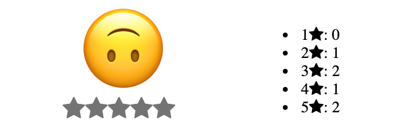

When first learning VueJS, and when using it for smaller projects, you will likely use [regular, globally-defined components](/docs/guides/how-to-build-and-use-vuejs-components/). Once your project grows and you start needing more structure and flexibility, *single file components* can be a better option.

Below you can see an example of a barebones single file component, which we will examine part-by-part later in the guide:


<template>
<h1>{{ greeting }}</h1>
</template>



In this guide, you will learn:

-   [What single file components are](#what-are-single-file-components) and why you would choose them over regular components
-   [How to prepare a development environment](#prepare-your-development-environment) for writing single file components with Vue CLI
-   [How to build your first single file components](#building-your-first-single-file-components), and then [how to add interaction to the components](#adding-methods-to-the-components)
-   [How to communicate between components via an event bus](#communication-between-components-via-an-event-bus)


You can [download all of the example files for this guide here](vuejs-single-file-components.tar.gz).


## Before You Begin

If you haven’t read our [Building and Using VueJS Components](/docs/guides/how-to-build-and-use-vuejs-components/) already, go take a look.

Make sure you have Node.js installed. If you don’t, our [How to Install Node.js](/docs/guides/how-to-install-nodejs/) guide outlines different installation options.

## What are Single File Components

Single file components are similar to regular components, but there are a few key differences which can make single file components the better tool for your project:

-   They can be defined locally, instead of globally.

-   You can define your component's `<template>` outside of your JavaScript, which allows for syntax highlighting in your text editor, unlike with string templates.

-   CSS/styling information is included in the component definition.

### Inspecting a Single File Component

Single file components are contained in files with the `.vue` extension. Each `.vue` file consists of three parts: template, script, style. Let's revisit our barebones component:


<template>
<h1>{{ greeting }}</h1>
</template>



-   Lines 1-3 of the component define the `<template>`, where we specify the HTML template of our component. In comparison, a regular component's template is represented with a string property inside the component's JavaScript. This can become increasingly confusing for complex components, because there is no syntax highlighting within the string.

    Another benefit for your templates is that you do not have to [adjust the `{{ }}` mustache tag delimiters](https://vuejs.org/v2/api/#delimiters) to `[[ ]]` or something else if you are working with another framework that already uses them.

    
For example, [Symfony](https://symfony.com/) developers using VueJS would have to update their delimiter configuration, because [Twig](https://twig.symfony.com/) already uses mustache delimiters for its rendering methods. Even though this might be a fairly trivial task, using single file components eliminates that need entirely.


-   The script section of the component (lines 5-19) defines the component’s properties and business logic. This is similar to how regular components are defined, but instead everything is within an [export statement](https://developer.mozilla.org/en-US/docs/Web/JavaScript/Reference/Statements/export).

-   The style section, on lines 21-26, uses the [`scoped` attribute](https://vue-loader.vuejs.org/guide/scoped-css.html) to create component-specific CSS. If you were instead using regular components, you would have no way of adding component-specific CSS, and thus you would have to define your styles globally.

    This makes your components completely independent, so you can now not only use them in your current project, but reuse them among other projects as well. Finally, you can use preprocessors like [SASS](https://sass-lang.com/) and [Babel](https://babeljs.io/) for the styling information in your component.

## Prepare your Development Environment

One drawback of single file components for beginners is that they require [webpack](https://webpack.js.org/) or [Browserify](http://browserify.org/) to build. These tools bundle your application's dependencies, but they can add to the learning curve. Vue provides a [CLI package](https://cli.vuejs.org/) that's built on top of webpack and which simplifies managing your project.

We'll use this tool throughout this guide; to install it, run:

    sudo npm install -g @vue/cli

The Vue CLI will now be available globally on your workstation (because the `-g` flag was used).


If you're using [NVM](https://github.com/nvm-sh/nvm), you can install Vue CLI without `sudo`:

    npm install -g @vue/cli


### Create your Project

All of the examples in this guide will live under a single project. Run the `vue create` command to create a directory for this project and have Vue CLI build the project skeleton for you:

    vue create single-file-components --packageManager=npm


Vue CLI v4.3.1
? Please pick a preset: (Use arrow keys)
❯ default (babel, eslint)
Manually select features



You can specify `--packageManager=yarn` if you prefer yarn to npm.


The CLI uses pretty sensible defaults, so if you're a beginner you can just press enter and the Vue CLI will build your first project and install the needed dependencies. If you haven’t done this before, it might take a while to fetch the needed dependencies.

Now let's test:

    cd single-file-components && npm run serve


DONE Compiled successfully in 3398ms

App running at:

-   Local: http://localhost:8080/
-   Network: unavailable

Note that the development build is not optimized.
To create a production build, run npm run build.


What `npm run serve` does is run the development server, but the cool thing is that while you make changes the dev server automatically rebuilds the project and injects the changes in the browser, so you don’t even have to refresh.

Now, if everything is fine, you should be able to open http://localhost:8080 in your browser and you will see the VueJS welcome screen:

Let's look at the directory structure of the default application and go through each folder:

    tree -I node_modules


.
├── babel.config.js
├── package.json
├── package-lock.json
├── public
│   ├── favicon.ico
│   └── index.html
├── README.md
└── src
    ├── App.vue
    ├── assets
    │   └── logo.png
    ├── components
    │   └── HelloWorld.vue
    └── main.js



The `-I node_modules` option will tell `tree` to ignore your `node_modules/` directory, which is where all of the node dependencies reside.


### The public Folder and index.html

Files in the `public` folder will not be bundled by webpack. When your project is created, this folder will contain [an index.html file](https://cli.vuejs.org/guide/html-and-static-assets.html#the-index-file):


<!DOCTYPE html>
<html lang="en">
<head>
    <meta charset="utf-8" />
    <meta http-equiv="X-UA-Compatible" content="IE=edge" />
    <meta name="viewport" content="width=device-width,initial-scale=1.0" />
    <link rel="icon" href="<%= BASE_URL %>favicon.ico" />
    <title><%= htmlWebpackPlugin.options.title %></title>
</head>
<body>
    <noscript>
        <strong>
            We're sorry but <%= htmlWebpackPlugin.options.title %> doesn't
            work properly without JavaScript enabled. Please enable it to
            continue.
        </strong>
    </noscript>
    

    <!-- built files will be auto injected -->
</body>
</html>


On lines 7, 8, and 13 you will notice the `<%= %>` syntax where the favicon link and page title are embedded; this is part of the [lodash template syntax](https://lodash.com/docs/4.17.15#template), which the index file is written in. While your index file isn't included in webpack's dependency bundle, it *will* be processed by the [html-webpack-plugin](https://github.com/jantimon/html-webpack-plugin), which does a few useful things:

-   It populates the variables that you embed using the template syntax. You can see more about the default variable values exposed by webpack [here](https://github.com/jantimon/html-webpack-plugin#writing-your-own-templates).
-   It automatically connects your index to the app bundle that webpack compiles: on line 19, you'll see a comment that says the files built by webpack are auto-injected by the build procedure.

    

This is an example of what the file will look like after the build procedure:


<!DOCTYPE html>
<html lang=en>
<head>
    <meta charset=utf-8>
    <meta http-equiv=X-UA-Compatible content="IE=edge">
    <meta name=viewport content="width=device-width,initial-scale=1">
    <link rel=icon href=/favicon.ico> <title>single-file-components</title>
    <link href=/css/app.fb0c6e1c.css rel=preload as=style>
    <link href=/js/app.ae3090b2.js rel=preload as=script>
    <link href=/js/chunk-vendors.b4c61135.js rel=preload as=script>
    <link href=/css/app.fb0c6e1c.css rel=stylesheet>
</head>
<body>
    <noscript>
        <strong>
            We're sorry but single-file-components doesn't work properly without JavaScript enabled. Please
            enable it to continue.
        </strong>
    </noscript>
    

    
    
</body>
</html>


Notice that your app's script and CSS dependencies have been added to the file on lines 21 and 22, and that these files have random hash appended their names (e.g. `app.ae3090b2.js`). These hashes will change over time for subsequent builds of your app, and the html-webpack-plugin will keep the hash updated in your index. Without this feature, you would need to update those lines for each build.


The rest of the body contains these elements:

-   The noscript tag, which is in place to warn users with disabled JS that the app will not work unless they enable it.
-   The `

` container where our VueJS app will be bound.

### The src Folder

The `src/` folder is where most of your work will be done. The `src/main.js` file will serve as the entry point for webpack's build process:


import Vue from 'vue'
import App from './App.vue'

Vue.config.productionTip = false

new Vue({
    render: h => h(App),
}).$mount('#app')


This file imports VueJS (line 1), imports the `App` component from the `src` folder (line 2), and binds the `App` component to the container with the `id` property set to `app` (lines 6-8).

Now to the interesting part: `src/App.vue`:


<template>
    

        
        <HelloWorld msg="Welcome to Your Vue.js App" />
    

</template>



This is a simple single file component relatively similar to the example we discussed above, but this example shows how to import and use components:

-   On line 9, the `HelloWorld` component is imported.
-   On lines 12-14, the `HelloWorld` component is [*locally registered*](https://vuejs.org/v2/guide/components-registration.html#Local-Registration) for use within the `App` component. The registered component can only be used in the template of the parent component that registered it. Contrast this with the components in [Building and Using VueJS Components](/docs/guides/how-to-build-and-use-vuejs-components/), which were [*globally registered*](https://vuejs.org/v2/guide/components-registration.html#Global-Registration).

    
Local registration is a valuable architectural feature for reusable components within big projects.


-   The `HelloWorld` component is used within the `App` component's template on line 4.

## Building your First Single File Components

Now that we’ve covered the basic structure of the project created by Vue CLI, let's build our own components on top of that. As in [Building and Using VueJS Components](/docs/guides/how-to-build-and-use-vuejs-components/), we will again be building a rating application, but this time it will be a little more sophisticated.

This is what your rating app will look like:

This is how it will behave:

-   Clicking on a star on the left side will register a vote for that star.

-   The left side will interactively change when a user hovers over the stars.

-   It will allow the user to rate only once on each visit to the page. If the page is refreshed, or if it is visited again later, the user can vote again.

-   It will keep score of votes between page visits in the browser's local storage.

Here's how the app's template will look in protocode; you do *not* need to copy and paste this:



    

        

            
            

                <Star weight="1"></Star>
                <Star weight="2"></Star>
                <Star weight="3"></Star>
                <Star weight="4"></Star>
                <Star weight="5"></Star>
            

        

        

    



We’ll make each star a separate component (named `Star`), and we'll also create a `Summary` component which will hold the summary of the votes.

### App.vue

To start, replace the content of your `App.vue` with this snippet:


<template>
    

        

            

                
                

                    <Star
                        v-for="index in 5"
                        v-bind:key="index"
                        v-bind:weight="index"
                        v-bind:enabled="enabled"
                        v-bind:currentRating="currentRating"
                    ></Star>
                

            

            

        

    

</template>



This is the main component, but there are no methods set on it yet, so for now it doesn’t have any functionality. Here are some notable parts of the code:

-   `<template>`:

    -   On lines 7-13, all five `Star` components are rendered from a single `<Star>` declaration with the `v-for="index in 5"` syntax. A weight is assigned to each `Star` by the `v-bind:weight="index"` syntax. The [`key` attribute](https://vuejs.org/v2/guide/list.html#Maintaining-State) is also bound to the `index`. The `enabled` and `currentRating` props will be bound to values that are described in the `




<template>
    

        <ul>
            <li v-for="rating in ratings" v-bind:key="rating.weight">
                {{ rating.weight }}<i class="icon-star"></i>: {{ rating.votes }}
            </li>
        </ul>
    

</template>



Here are some notable parts of the code:

-   In both components, the [Font Awesome icon-star](https://fontawesome.com/v3.2.1/icon/star) is used. On lines 13-17 of `Star.vue`, some styling is set for the icons in the `Star` component, including setting the color to light grey.

    Because this style section uses the `scoped` attribute, these styles are limited to the `Star` component. As a result, the icons in the `Summary` component are not also styled in this way.

-   On lines 4-6 of `Summary.vue`, the `v-for` syntax is used again to display the rating votes.

After creating `Star.vue` and `Summary.vue`, the application can be viewed in the browser. Head to http://127.0.0.1:8080 and you will see the following:

Because there are no methods set on the components yet, it will not be interactive.


If you're not still running `npm run serve` in your terminal, you'll need to re-run it from inside your project.


## Adding Methods to the Components

The application right now is a skeleton, so now we'll make it work. These three custom events will be handled:

-   When you hover over a star, all previous stars will be highlighted in yellow. For example, if you hover over the star number 4, stars 1-3 also get highlighted.

-   When your mouse moves away, the highlight will be removed.

-   When you click on a star, a vote is cast and you no longer can vote until you visit the page again.

### Updating App.vue

1.  Update the `Star` component declaration in the `<template>` of `src/App.vue` to match this snippet:

    
<!-- ... --->
<Star
    v-for="index in 5"
    v-bind:key="index"
    v-bind:weight="index"
    v-bind:enabled="enabled"
    v-bind:currentRating="currentRating"
    v-on:lightUp="lightUpHandler"
    v-on:lightDown="lightDownHandler"
    v-on:rate="rateHandler"
></Star>
<!-- ... --->


    The new additions to this declaration are the `v-on` directives, which set methods as event handlers for the custom `lightUp`, `lightDown`, and `rate` events.

    
The `Star` component will be updated in the next section to emit those events.


1.  Next, replace the `methods` object in the component with the following snippet. These are the event handlers:

    
// ...
methods: {
    lightUpHandler: function (weight) {
        this.currentRating = weight;

        // Display different emojis based on the weight
        if (weight <= 2) {
            this.bigRating = "&#128549;"; // Emoji: 😥
        }
        if (weight > 2 && weight <= 4) {
            this.bigRating = "&#128556;"; // Emoji: 😬
        }
        if (weight > 4) {
            this.bigRating = "&#128579;"; // Emoji: 🙃
        }
    },
    lightDownHandler: function () {
        // Reset on mouse away
        this.currentRating = 0;
        this.bigRating = "&#128566;"; // Emoji: 😶
    },
    rateHandler: function (weight) {
        this.currentRating = weight;

        // Finding the relevant rating and incrementing the cast votes
        let rating = this.ratings.find((obj) => obj.weight == weight);
        rating.votes++;

        // Disabling from voting again
        this.enabled = false;

        // Saves the votes to the browser localStorage
        localStorage.setItem("ratings", JSON.stringify(this.ratings));
    },
},
// ...


    - The `lightUpHandler` and `rateHandler` methods receive a `weight` from the `Star` component that emitted the corresponding event. These methods set the `weight` as the `currentRating`.

    -   At the end of the `rateHandler` method, the component's ratings are converted to a JSON object and saved so we can use them as a starting point the next time the page loads (line 33).

    
At this point, your `App.vue` should be the same as this snippet:


<template>
    

        

            

                
                

                    <Star
                        v-for="index in 5"
                        v-bind:key="index"
                        v-bind:weight="index"
                        v-bind:enabled="enabled"
                        v-bind:currentRating="currentRating"
                        v-on:lightUp="lightUpHandler"
                        v-on:lightDown="lightDownHandler"
                        v-on:rate="rateHandler"
                    ></Star>
                

            

            

        

    

</template>




### Updating Star.vue

Let's modify the `Star` component to emit the events:

1.  In the template of `Star.vue`, replace the `<i>` element with this snippet:

    
<!-- ... --->
<i
    v-bind:class="getClass()"
    v-on:mouseover="mouseoverHandler"
    v-on:mouseleave="mouseleaveHandler"
    v-on:click="clickHandler"
></i>
<!-- ... --->


    -   The CSS classes of the icon will now be dynamically generated by a `getClass` method on the component. This change is made so that the hover highlight effect can be toggled by a CSS class.

    -   The `mouseover`, `mouseleave`, and `click` DOM events are associated with new handler methods that will also be added to the component.

1.  In the script section, add this `data` function to the component:

    
// ...
data: function () {
    return {
        hover: false,
    };
},
// ...


    The `hover` variable will maintain the hover state of the component.

1.  Also in the script section, add this `methods` object to the component:

    
// ...
methods: {
    getClass: function () {
        var baseClass = "icon-star";

        // Adds the hover class if you're hovering over the component or you are hovering over a star with greater weight
        if (this.hover || this.currentRating >= this.weight) {
            baseClass += " hover";
        }
        return baseClass;
    },
    mouseoverHandler: function () {
        // Makes sure stars are not lighting up after vote is cast
        if (this.enabled) {
            // Emits the lightUp event with the weight as a parameter
            this.$emit("lightUp", this.weight);
            // Enables hover class
            this.hover = true;
        }
    },
    mouseleaveHandler: function () {
        // Makes sure stars are not lighting up after vote is cast
        if (this.enabled) {
            // Emits the lightDown event
            this.$emit("lightDown", this.weight);
            // Removes hover class
            this.hover = false;
        }
    },
    clickHandler: function () {
        // Makes sure you only vote if you haven't voted yet
        if (this.enabled) {
            // Emits the rate event with the weight as parameter
            this.$emit("rate", this.weight);
        } else {
            alert("Already voted");
        }
    },
},
// ...


    -   The `mouseoverHandler`, `mouseleaveHandler`, and `clickHandler` methods will emit the `lightUp`, `lightDown`, and `rate` custom events, respectively.

    -   These methods also first check to see if `enabled` has been set to false; if false, then the methods do nothing, which means that the DOM events will result in no action.

    -   In the `getClass` method, the `currentRating` prop is used to determine if a star icon should be highlighted. This prop was previously bound to the `currentRating` data property of the `App` component.

        
The `currentRating` prop is not a particularly beautiful solution, but we will improve on that further in the guide.


1.  Finally, add this rule to the style section:

    
/* ... */
i.icon-star.hover {
    color: yellow;
}
/* ... */


    
At this point, your `Star.vue` should be the same as this snippet:


<template>
    <i
        v-bind:class="getClass()"
        v-on:mouseover="mouseoverHandler()"
        v-on:mouseleave="mouseleaveHandler()"
        v-on:click="clickHandler()"
    ></i>
</template>




1. Head to http://localhost:8080/ in your browser, and you should see that your rating application now works. Try hovering over the stars and clicking on them to observe the interaction. If you refresh the page, you can vote again, and the votes will be tallied:

## Communication between Components Via an Event Bus

Notice how clumsy all of the `v-on` directives chained one after the other look:


<Star
    v-for="index in 5"
    v-bind:key="index"
    v-bind:weight="index"
    v-bind:enabled="enabled"
    v-bind:currentRating="currentRating"
    v-on:lightUp="lightUpHandler"
    v-on:lightDown="lightDownHandler"
    v-on:rate="rateHandler"
></Star>


This setup can be inelegant to scale: imagine having 10 of those on a single component, and then imagine you have 10 components. The directives would become hard to follow, so it's worth exploring other ways to communicate between components.

Fortunately, VueJS supports a [publish-subscribe pattern](https://en.wikipedia.org/wiki/Publish%E2%80%93subscribe_pattern) called an *event bus*. You can easily implement it in your components to make things a bit more elegant.

### Event Bus Basics

In VueJS, an event bus is a new Vue instance that is declared globally (in `main.js`, for example):


// ...
export const eventBus = new Vue();
// ...


It is then imported in each component which accesses it:


// ...
import { eventBus } from "../main.js";
// ...


Components can emit events to the event bus:


// ...
eventBus.$emit("event", parameter);
// ...


Other components will register event handlers on the same event bus with the [`$on` method](https://vuejs.org/v2/api/#vm-on):


// ...
eventBus.$on("event", (parameter) => {
    // Do stuff
});
// ...


Basically, think of the event bus as a global communication layer between your components.

### Adding an Event Bus to your App

Now let's rebuild our example to take advantage of an event bus:

1. Open `main.js` and replace its content with this snippet:

    
import Vue from "vue";
import App from "./App.vue";

Vue.config.productionTip = false;

export const eventBus = new Vue();

new Vue({
    render: h => h(App)
}).$mount("#app");


    This update adds an event bus declaration on line 6.

1.  Open `App.vue` and replace its content with this snippet:

    
<template>
    

        

            

                
                

                    <Star
                        v-for="index in 5"
                        v-bind:key="index"
                        v-bind:weight="index"
                        v-bind:enabled="enabled"
                    ></Star>
                

            

            

        

    

</template>



    The following changes have been made in this updated file:

    - The `eventBus` instance is imported on line 24.
    - We removed the `v-on` directives from the `Star` component declaration in the template (lines 7-12).
    - The component's methods have been removed, which previously served as the event handlers for the `v-on` directives.
    - Instead, we subscribe to the events in the `created` hook (lines 61-86). The logic that was in the component's methods has been moved here.
    - We also no longer need the `currentRating` data property, so it has been removed. This is because the `Star` components will also subscribe to the event bus and can be directly notified of all `lightUp` and `rate` events.

    The template looks much leaner now, and you can easily spot the subscribed events by simply having a look in the `created` hook.

1.  Open `Star.vue` and replace its content with this snippet:

    
<template>
    <i
        v-bind:class="getClass()"
        v-on:mouseover="mouseoverHandler"
        v-on:mouseleave="mouseleaveHandler"
        v-on:click="clickHandler"
    ></i>
</template>



    The following changes have been made in this updated file:

    - The `eventBus` instance is imported on line 11.
    - The `currentRating` prop has been removed (line 21).
    - We’ve modified the handler methods to emit the events on the `eventBus` instance (lines 22-56)
    - We also subscribe to the same events from the `created` hook (lines 57-73), so that all `Star` components are aware of which component the user is currently hovering over without needing the `currentRating` prop.
    - We've added an `active` class to the component's style (lines 86-88). This is enabled when a user enters a rating, and it sets a different highlight color for the stars. To enable the class, an `active` data property has been added to the component (line 18), and it is set to `true` within the `rate` event handling logic (line 70).

    