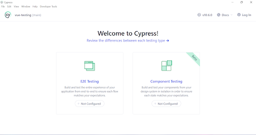
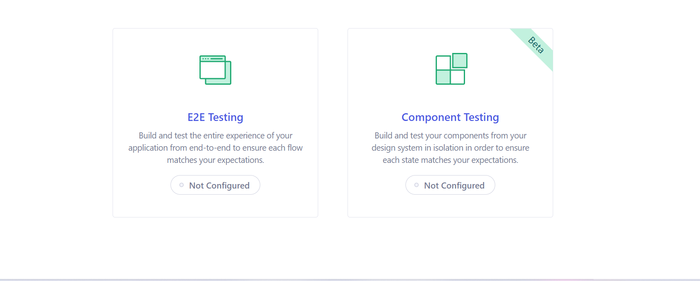
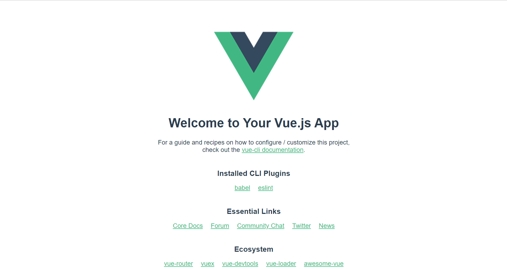
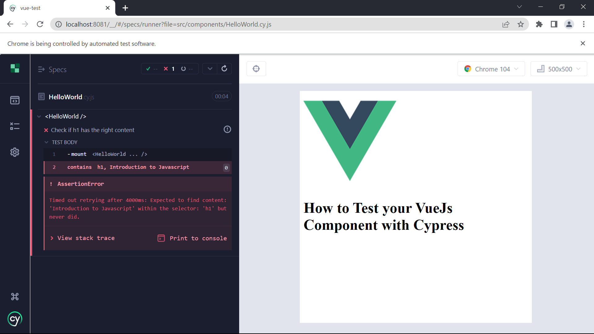

Running a test on your application is essential because it helps you find problems and mistakes that may have happened while it was building. Due to a lack of coding experience or sophisticated logic, a developer may make a mistake when implementing an application. Some of these issues may cause havoc with our application and degrade user pleasure, prompting them to seek out other good competitors.

This guide will examine software testing, why it is essential, and how to test our Vue.js component with Cypress.

In this guide we will cover the following

* Brief Intro to Software Testing
* Why software testing is essential
* Setup VueJs project
* Install Cypress
* Setup Cypress
* Testing your VueJs component with Cypress 
* Conclusion

## Brief Intro to Software Testing
Software testing confirms that a software application or product performs as intended. The significant advantages of testing are identifying and fixing human errors that occurred during the creation of the product or software.


## Why Software testing is essential?

Software testing is vital for your application for many reasons, including bug prevention, improved performance, higher-quality code, detection of poor UX/UI functionalities, etc.

## Setup VueJs project

We have learned what software testing is and why it is essential. The next step is to set up our VueJS project.

We will setup our Vuejs project with the command below:

    vue create app-name  

Select our preferred features, and install the application.    

After installing our project, the next step is the start the server.

Run the server with the command below:

    npm run serve


## Install Cypress

We have successfully set up our VueJs project;  the following step is to install our testing framework (Cypress)

Cd into the folder we created earlier and run the command below:

     npm install cypress

Run the command below to open your cypress application:

     npx cypress open

Here is a output of what our cypress application would look like when we open it using the above command



## Setup Cypress 

When using cypress, you can select the type of testing you want in your application.



In the output above, we have two options to select **E2E Testing** and **Component Testing.** Let me give a brief explanation on both

**E2E Testing:** E2E testing is the testing that involves testing your entire application to ensure each of the flows matches your expectation.

**Component Testing:** Component Testing requires building and testing the components in your design system to ensure they match your requirements. 

We will go for the component testing as that is the method we use in this guide, so click **Component Testing**

Cypress automatically detects your front-end framework. However, you still have the option to select your preferred framework.


It will then produce all the configuration files you need and ensure all the essential dependencies are installed. After verifying the necessary files, click the "Continue" option.


Cypress will show you the list of the configured files; after going through, click on “Continue”


Next, we will select the browser we want to use in testing our application. In this example, we will use chrome. After selecting the browser, click on the **Start Component Testing in Chrome**


output of our cypress running in chrome,


## Testing your VueJs Component with Cypress.

In the previous sections, we learned how to build up our Vue project, install and set up Cypress, and launch our Cypress application. The purpose of this post is to teach you how to test your Vue component using Cypress, so let's get started.

The first step is to test our existing component to see how it works, so we will begin with the  `HelloWorld` component to see if it renders. 

We will select the option "create from the component" and create our spec `HelloWord.cy.js` automatically you will have the code below:

```
import HelloWorld from "./HelloWorld.vue"

describe('<HelloWorld />', () => {
  it('renders', () => {
    // see: https://test-utils.vuejs.org/guide/
    cy.mount(HelloWorld)
  })
})
```

The output will look like this



To help us understand better, let's look at another example. We will start with our HelloWorld component. We will check if our h1 contains the required text in this example.

```
import HelloWorld from "./HelloWorld.vue";

describe("<HelloWorld />", () => {
  it("Check if h1 has the right content", () => {
    // see: https://test-utils.vuejs.org/guide/

    cy.mount(HelloWorld);
    cy.contains("h1", "How to Test your VueJs Component with Cypress");
  });
});
```

When the result test is successfull the output will


The test was successful because the h1 contains the required text. Now let’s check another example; this time, we want to make our test fail by putting out the wrong content in the h1 tag. Code example below:


Output of failed test



The second illustration the test failed because the content in the h1 tag does not contain **Introduction to Javascript.** 

## Conclusion

Testing your component is crucial because it can help find some of those frequent mistakes and faults and recommend fixes in the affected area before the product is delivered to the client. In addition, it boosts the efficiency of your application.


