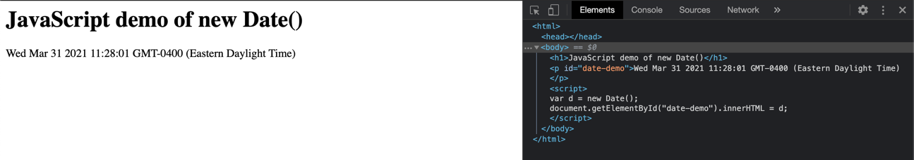
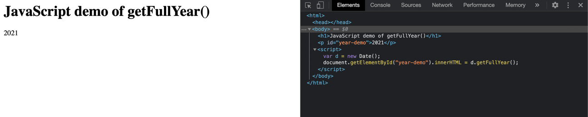
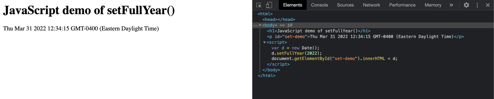
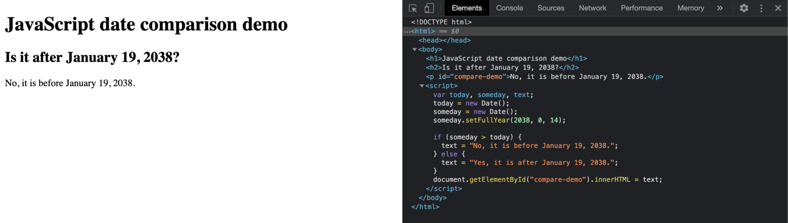

When creating a website or application, JavaScript handles dynamic, interactive, and event-driven behavior on your site. The `Date` object in JS uses a platform-agnostic format to represents a moment in time. This object uses the `Number` type to designate the date in milliseconds. The milliseconds are the time elapsed since January 1, 1970 UTC. This article covers the basics of getting the current year, month, date, and/or time using the JS `Date` object. This guide assumes some familiarity with JavaScript.

## Understanding JavaScript `Date` and Unix Time

Unix time is calculated beginning on January 1, 1970 UTC at 00:00 and counts every millisecond that has elapsed. For example, the timestamp for Thursday, January 1 1970 (GMT) would have been `0`. The timestamp for one second after midnight (GMT) on Friday, January 1, 2021 would have been `1609459201`. The `Date` object helps you perform this calculation in your JS scripts.

`Date` has presented some issues over time for developers, due to its reliance on Unix time and the numerous limitations that it presents. For example, Unix time doesn't work well for non-Gregorian calendars. Also, 32-bit systems using Unix time will encounter an integer overflow issue on [January 19, 2038](https://en.wikipedia.org/wiki/Year_2038_problem). There is work being done on the [Temporal](https://tc39.es/proposal-temporal/docs/index.html) API to create a modern and more flexible replacement, but it is not yet ready to be used in production environments.

## Getting Today's Date in JS

This section demonstrates the default behavior of the `Date` object by using it in a script with the [`getElementByID`](https://developer.mozilla.org/en-US/docs/Web/API/Document/getElementById) method. You can run this example on your local workstation (where it shows your local date, time, and GMT offset). You can also run the example on your Linode (where it displays the Linode's date, time, and GMT offset).

Create a file named `date-test.html` on your computer with the following content:


<html>
  <body>

    <h1>JavaScript demo of new Date()</h1>

    

    

  </body>
</html>


Open the file in a browser to see the results. You should see similar results to the example below (date, time, and GMT offset will vary):

## Use the Date Object's Get Methods

The Date object provides several Get methods that you can use to retrieve different data from your Date instance. For example, your website might only need to display the current year (in a copyright statement on a webpage, for example). In that case, you can use the `getFullYear()` method. Modify your `year-test.html` example to add the new method as shown below:


<html>
  <body>

  <h1>JavaScript demo of getFullYear()</h1>

  

  

  </body>
</html>


Reload your browser page and you should see a similar result to the example below:

You can experiment and change the `getFullYear()` method to `getMonth()` or `getDay()`. Refer to Mozilla's documentation to view a [full list](https://developer.mozilla.org/en-US/docs/Web/JavaScript/Reference/Global_Objects/Date#instance_methods) of all available Get methods.

## Use the Date Object's Set Methods

The Date object provides several Set methods that you can use to update an instance of the Date object. Perhaps you need to set a deadline of some sort, or you need to reference a year in the future. You can use the `setFullYear()` method to achieve this. Modify your `year-test.html` example to add the new method as shown below:


<html>
  <body>

  <h1>JavaScript demo of setFullYear()</h1>

  

  

  </body>
</html>


When you reload your browser, notice that the results display the year 2022:

Similar to the Get methods in the previous section, you can experiment with other Set methods. Change the example to use `setFullYear()`, `setMonth()`, or `setDay()`. Refer to Mozilla's documentation to view a [full list](https://developer.mozilla.org/en-US/docs/Web/JavaScript/Reference/Global_Objects/Date#instance_methods) of all available Set methods.

## Comparing Dates in JS

Now that you are familiar with Get and Set methods, you can use them to compare dates using JavaScript. Referring to the [year 2038 problem](https://en.wikipedia.org/wiki/Year_2038_problem) mentioned in the beginning of the guide, you may want to use the Date object to notify you if it's January 19, 2038. Modify your `year-test.html` example to add the JavaScript code to compare Dates:


<html>
  <body>

    <h1>JavaScript date comparison demo</h1>

    <h2>Is it after January 19, 2038?</h2>

    

    

  </body>
</html>


The results will look like this (they may vary, or be completely inoperative on a 32-bit system, if it is after January 19, 2038):

## Further Reading

The `Date` object in JavaScript is very powerful and offers several built-in methods to support many uses. You can refer to the [W3 Schools tutorial](https://www.w3schools.com/js/js_dates.asp) to see a few more examples.