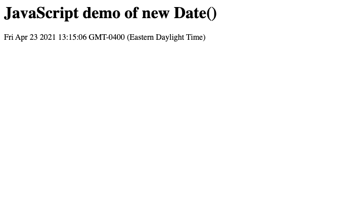
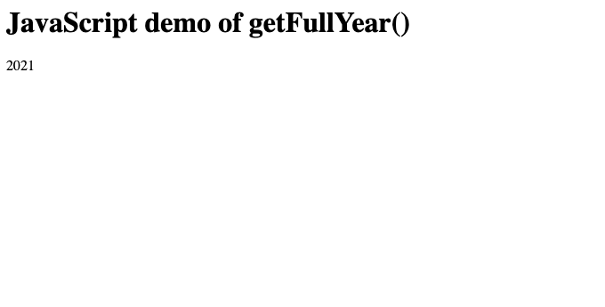
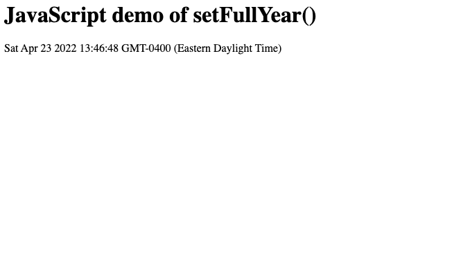
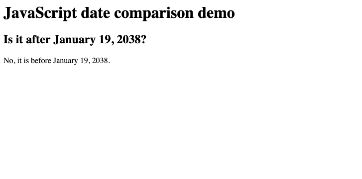

JavaScript (JS) is used to handle the behavior of a webpage, and the `Date` object in JS is used to represent a moment in time utilizing a platform-independent format. It does this by the `Number` it contains, which represents milliseconds since the UNIX Epoch began (1 January 1970 UTC). There are numerous ways to use `Date`, many of which are covered in extensive tutorials on the web. This article is going to cover the basics of getting the current date, year, month, date, and/or time.

## Before You Begin

1.  This guide assumes you are already familiar with JavaScript. If you are not, see the various tutorials available across the web.

2.  Ensure any development tools you use locally are up to date.

3.  Update your Linode's system:

        sudo apt-get update && sudo apt-get upgrade

## Understanding `Date` according to `Number`

The primary idea a developer needs to undertand when it comes to UNIX time is how the time is counted. It starts on 1 January 1970 UTC at 00:00 and counts every millisecond since.

The timestamp for Thursday, January 1 1970 (GMT) was 0.

Therefore, the timestamp for one second after midnight (GMT) on Friday, January 1 2021 was 1609459201.

Since no one really wants to calculate that manually when it comes to creating a report or some other time-based tool or output on their webpage, `Date` can help.


`Date` has been a problem for many developers over many years, partially due to its reliance on UNIX time and the numerous limitations that comes with it (for example, it doesn't work well for non-Gregorian calendars, and it will cease to work on 32-bit systems come January 19, 2038 due to an overflow that will happen on those systems). There is work being done on the [`Temporal`](https://tc39.es/proposal-temporal/docs/index.html) API to create a modern and more flexible replacement, but it is not ready to be used in production environments. That means, for now, `Date` has to be used.


## Getting Today's Date in JS

JavaScript's `Date` object is the foundation of working with dates. Below is an example the default behavior of the `Date` object in a script using [`getElementByID`](https://developer.mozilla.org/en-US/docs/Web/API/Document/getElementById) (and displaying it in HTML) that you can run on your local workstation (where it will show your local date, time, and GMT offset) or even on your Linode (where it will show the Linode's date, time, and GMT offset).


<html>
<body>

<h1>JavaScript demo of new Date()</h1>

</body>
</html>


The result will look something like this (date, time, and GMT offset will vary, naturally):

## Getting Other Date Options in JS

Perhaps you only need to show the year (in a copyright statement on a webpage, for example). In that case, you will need to add the `getFullYear()` method to the example above, like so:


<html>
<body>

<h1>JavaScript demo of getFullYear()</h1>

</body>
</html>


The results will look something like this (results will vary if it's not 2021 where you are):

It's possible to change `getFullYear()` above to methods such as `getMonth()` or `getDay()`, and we encourage you to experiment.

## Setting Other Date Options in JS

Perhaps you need to set a deadline of some sort, or you're tired of the current year and want to pretend you're in the future. Either way, using a `set` method will do it. In the example below, we're going to set the year to 2022:


<html>
<body>

<h1>JavaScript demo of setFullYear()</h1>

</body>
</html>


The results will look much like this (the date, time, month, and GMT offset may vary, but the year, since it's set in the script, will not):

Again, it's possible to change `setFullYear()` above to methods such as `setMonth()` or `setDay()`, and we encourage you to experiment with that, too.

## Comparing Dates in JS

Using a `set` method may not interest most, but now that we have covered `get` and `set` methods, we can use them to compare dates using JavaScript. Suppose you're worried about that January 19, 2038 deadline mentioned above and how it's going to wreak havoc on 32-bit systems still using `Date` in their JavaScript. You can use the example below to know if it's January 19, 2038 yet:


<html>
<body>

<h1>JavaScript date comparison demo</h1>

<h2>Is it after January 19, 2038?</h2>

</body>
</html>


The results will look like this (they may vary, or be completely inoperative on a 32-bit system, if it is after January 19, 2038):

## Further Reading

The `Date` operator in JavaScript has numerous uses and this article is just a summary of some things you can do with it. For more information, see something like the w3schools' [tutorials for `Date` in JavaScript](https://www.w3schools.com/js/js_dates.asp).