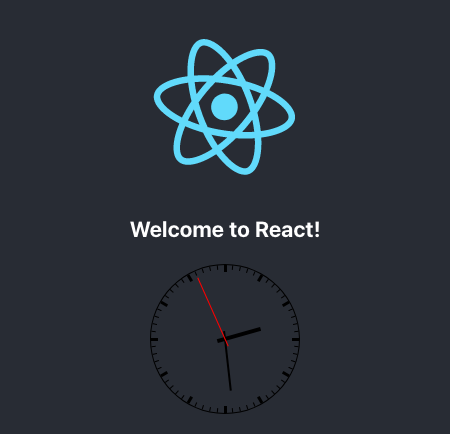

Bun introduces a new JavaScript runtime with exceptional performance, built-in bundling & transpiling, and first-class support for TypeScript & JSX. This up-and-coming tool promises to be an asset for JavaScript developers and a strong competitor to Node.js and Deno.

In this tutorial, learn about the Bun JavaScript runtime and how it compares to other runtimes like Node.js and Deno. See how to set up Bun on your own system, and follow along to build an example React application with it.

## Before You Begin

1. Familiarize yourself with our [Getting Started with Linode](/docs/products/platform/get-started/) guide, and complete the steps for setting your Linode's hostname and timezone.

1. This guide uses `sudo` wherever possible. Complete the sections of our [How to Secure Your Server](/docs/products/compute/compute-instances/guides/set-up-and-secure/) guide to create a standard user account, harden SSH access, and remove unnecessary network services.

1.  Update your system.

    -   **Debian** and **Ubuntu**:

            sudo apt update && sudo apt upgrade

    -   **AlmaLinux**, **CentOS Stream** (8 or later), **Fedora**, and **Rocky Linux**:

            sudo dnf upgrade


This guide is written for a non-root user. Commands that require elevated privileges are prefixed with `sudo`. If you’re not familiar with the `sudo` command, see the [Users and Groups](/docs/guides/linux-users-and-groups/) guide.


## What Is Bun?

[Bun](https://bun.sh/) enters the field of JavaScript runtimes opposite options like Node.js and Deno. Built on the lightning-fast JavaScriptCore engine, the Bun runtime stands out for its speed and built-in bundling & transpiling features.

These next sections aim to make you more familiar with Bun and what it has to offer. Keep reading to learn more about JavaScript runtimes in general, and how Bun stacks up against its main competitors.

### What Are JavaScript Runtimes?

JavaScript runtimes are tools that allow you to run JavaScript outside of a browser. With a JavaScript runtime, you can use JavaScript to build server, desktop, and mobile applications.

By far, the predominant JavaScript runtime is Node.js. Built on the V8 JavaScript engine behind Google Chrome, Node.js is the default JavaScript runtime for many developers.

Recently, the creator of Node.js put out a new JavaScript runtime, Deno. The Deno runtime, like Node.js, is built on the V8 JavaScript engine. However, Deno introduces numerous fundamental improvements to Node.js in terms of security, performance, and more. It also adds first-class support for TypeScript and JSX.

### The Bun Runtime

The Bun runtime arose with a fresh approach to JavaScript runtimes. Developed using the Zig programming language, Bun constructs its runtime on the JavaScriptCore engine, used in Apple's Safari web browser. The result is an incredibly fast runtime.

Additionally, Bun has built-in handling for bundling and transpiling. With other runtimes, you need to rely on outside tools for bundling your JavaScript projects and for transpiling code from another language. Bun handles all of these features.

What's more, Bun's runtime implements the Node.js algorithm for resolving modules. This means that Bun can make use of NPM packages. Bun's bundler can find and install packages from the vast NPM repository and manage their dependencies, giving you a full-featured and seamless bundler.

Like Deno, Bun also comes with first-class support for the TypeScript and JSX languages.

### Bun vs Node.js and Deno

Bun offers some of the same advantages over Node.js as Deno. Besides the aforementioned first-class support for TypeScript and JSX, both offer performance and quality-of-life improvements over Node.js.

However, the Bun runtime also aims to exceed Deno in terms of performance. Bun's use of the JavaScriptCore engine has allowed Bun to achieve immense speed gains in its execution of JavaScript programs.

With Bun, you also get simplified tooling. Bun includes transpiling and bundling features, which keeps you from having to adopt and maintain separate tools for those tasks.

## How to Install Bun

Before proceeding, make sure your Linux system uses a version supported by Bun. Currently, Bun runs on systems using at least version 5.1 of the Linux kernel (though it prefers 5.6).

You can check your kernel version with the command:

    uname -r

On a CentOS Stream 9 system, for instance, you could expect an output like the following:


5.14.0-80.el9.x86_64


For reference, here are versions of some popular Linux distributions that use at least version 5.1 of the Linux kernel:

-   **CentOS Stream** (9 or newer)
-   **Debian** (11 or newer)
-   **Fedora** (34 or newer)
-   **Ubuntu** (20.04 LTS or newer)

The Bun installation script requires that you have Unzip installed on your system. You can install Unzip using one of the following commands:

-   **Debian** and **Ubuntu**:

        sudo apt install unzip

-   **AlmaLinux**, **CentOS Stream**, **Fedora**, and **Rocky Linux**:

        sudo dnf install unzip

Bun can be installed using an installation script. The command below accesses the script and runs it in your shell session:

    curl https://bun.sh/install | bash

Once finished, the Bun installation script displays a success message:


bun was installed successfully to /home/example-user/.bun/bin/bun
[...]


The script may also inform you to add two lines to your `.bashrc` file. You can quickly do so using the following commands:

    echo 'export BUN_INSTALL="/home/example-user/.bun"' >> ~/.bashrc
    echo 'export PATH="$BUN_INSTALL/bin:$PATH"' >> ~/.bashrc

Restart your shell session by exiting and reentering it, and you are finally ready to start using Bun. At this point you can verify your installation by checking the Bun version:

    bun -v


0.1.5


## Example of a Bun Project

Like NPM, Bun can be used to create and manage application projects. To give you an idea of Bun's capabilities, the next series of steps walk you through creating and running a React application with Bun.

The example adds a simple analog clock widget to the base React template, which lets you see more of how Bun manages project dependencies.

1.  Create a new Bun project. This is done by giving the `bun create` command with a template name and project folder.

    You can get a list of some useful available templates by running the `create` command without any arguments:

        bun create

    For this example, create your project from the React template, and give the project a directory of `example-react-app`, like this:

        bun create react ./example-react-app

1.  Afterward, be sure to change into the new project directory. The rest of these steps assume you are working out of this directory:

        cd example-react-app

1.  This already gives you a working React application, you just need to start it:

        bun dev

1.  You can see the application in action by navigating to `localhost:3000` in your browser.

    To see the application remotely, you can use an SSH tunnel.

    -   On Windows, use the PuTTY tool to set up your SSH tunnel. Follow the appropriate section of the [Setting up an SSH Tunnel with Your Linode for Safe Browsing](/docs/guides/setting-up-an-ssh-tunnel-with-your-linode-for-safe-browsing/#windows) guide, replacing the example port number there with `3000`.

    -   On macOS or Linux, use the following command to set up the SSH tunnel. Replace `example-user` with your username on the application server and `192.0.2.0` with the server's IP address:

            ssh -L3000:localhost:3000 example-user@192.0.2.0

    

1.  Use the **CTRL+C** key combination to stop Bun when you are finished viewing the application.

1.  Add an NPM package to your project. You can do so using the `bun add` command followed by the package name.

    This example uses the `react-clock` package, which allows you to easily render an analog clock for your React application:

        bun add react-clock

1.  The `src/App.jsx` file is the basis for the default React application. Open the file and incorporate the `react-clock`:

        nano src/App.jsx

1.  Replace the contents of `src/App.jsx` with the example file below. You can see the relatively simple modifications made to this file to incorporate the `react-clock`. The modified areas are prefaced with explanatory comments:

    
import logo from "./logo.svg";
import "./App.css";

// Import React modules to be used by react-clock.
import React, { useEffect, useState } from 'react';

// Import react-clock and its CSS file.
import Clock from 'react-clock';
import 'react-clock/dist/Clock.css';

function App() {
    // Define a state variable for the clock value; initialize it with the
    // current date-time.
    const [clockValue, setValue] = useState(new Date());

    // Define an effect that updates the clock's value periodically.
    useEffect(() => {
        const clockInterval = setInterval(() => setValue(new Date()), 1000);

        return () => {
            clearInterval(clockInterval);
        };
    }, []);

    // Add to the default layout a <Clock/> tag for rendering the clock;
    // give it the clockValue to display.
    return (
        

            <header className="App-header">
                
                <h3>Welcome to React!</h3>
                <Clock value={clockValue} />
            </header>
        

    );
}

export default App;


1.  Press **CTRL+X** to exit Nano, then **Y** to save, and **Enter** to confirm.

1.  Start up the application with Bun again:

        bun dev

    Once again, you should be able to visit the project by navigating to `localhost:3000` in a web browser. Now you should see the default application modified with an analog clock.

    

## Conclusion

Now that you have a footing with the Bun runtime, you can start exploring and seeing all it has to offer. With its built-in bundling and transpiling, you can create and execute projects with simpler tooling, plus the benefits of Bun's incredible performance.

Keep learning about Bun through the links below, as well as through the [official documentation](https://github.com/oven-sh/bun#Reference).