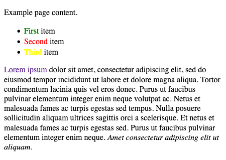
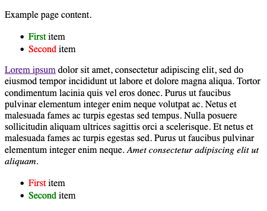
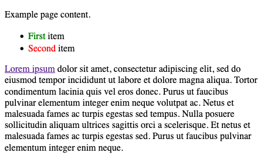
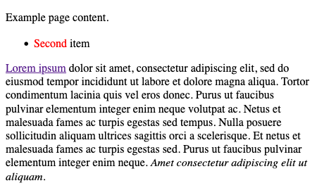

The Document Object Model (DOM) is a programming interface for HTML web pages. Scripting languages, like JavaScript, can access and manipulate the DOM to alter the display of a web page. In this guide, you learn about the methods and properties you can use to modify the DOM by adding and removing element nodes. You also learn how to use specialized properties to assign and update a DOM element's CSS styles.

If you are not familiar with the DOM, refer to our [An Introduction to the Document Object Model (DOM)](/docs/guides/document-object-model/) and [Traversing the Document Object Model with JavaScript](/docs/guides/traversing-the-dom/) guides before continuing with this guide.

## Before You Begin

To follow along with the examples in this guide, use your web browser’s developer tools JavaScript console to interact with the DOM.

- On Chrome, refer to Google's [Open Chrome DevTools](https://developer.chrome.com/docs/devtools/open/#elements) documentation to learn how to access their developer tools.
- On Firefox, refer to Mozilla's [Open the Inspector](https://developer.mozilla.org/en-US/docs/Tools/Page_Inspector/How_to/Open_the_Inspector) documentation to learn how to access their developer tools.

Most of this guide’s examples are based on an example web page created from the HTML source code displayed below. To follow along with this guide’s examples, [view the rendered example web page](example-page.html) in your browser as you read through the guide.


<!DOCTYPE html>
<html>
    <head>
        <title>Example Page</title>
    </head>
    <body>
        

            
Example page content.

            <ul>
                <li>First item</li>
                <li>Second item</li>
            </ul>
        

        

            
<a href="https://loremipsum.io/">Lorem ipsum</a> dolor sit amet, consectetur adipiscing elit, sed do eiusmod tempor incididunt ut labore et dolore magna aliqua. Tortor condimentum lacinia quis vel eros donec. Purus ut faucibus pulvinar elementum integer enim neque volutpat ac. Netus et malesuada fames ac turpis egestas sed tempus. Nulla posuere sollicitudin aliquam ultrices sagittis orci a scelerisque. Et netus et malesuada fames ac turpis egestas sed. Purus ut faucibus pulvinar elementum integer enim neque. <em>Amet consectetur adipiscing elit ut aliquam.</em>

        

    </body>
</html>


## How to Create and Remove DOM Elements

To make a web page dynamic, you use JavaScript to alter the elements that make up the web page's DOM. Typically, the DOM is altered by programmatically creating new HTML elements or moving specific elements or attributes.

The sections below show you how to use JavaScript to create and remove elements from the DOM. You also learn how to control the way in which new elements are added to the DOM using a few specialized JavaScript methods.

### Creating Element Nodes

The DOM represents the elements and content of an HTML document as nodes and objects. You can create element nodes in the following two ways:

- Using a `document` object method to create the element and to append the new node
- Changing the value of the `innerHTML` property on a parent node

Depending on what you are trying to achieve, you might choose one approach over another. The following sections provide examples for each approach and information on when to use them.

#### Using the createElement() Method

The `document` object has several built-in methods for creating new nodes, like the `createElement()` method. This method is especially convenient when you want to create multiple elements or are working programmatically with numerous elements.

The list below includes an overview of the steps used when creating a new element using JavaScript.

- The `createElement()` method accepts the tag name of the element to create as a parameter. It creates the specified tag without any content contained within the tag.
- Once you've created a new element, you have access to properties or additional methods of the element object that can be used to style the element, populate it with text, and achieve many other enhancements. The [How to Modify Element Attributes](/docs/guides/javascript-dom-manipulation/#how-to-modify-element-attributes) discusses these changes in greater depth.
- When your new element looks and behaves the way you intend, you can add the element node to the DOM's target parent node. For example, you can use the `appendChild()` method to achieve this. The [Inserting Element Nodes](/docs/guides/javascript-dom-manipulation/#inserting-element-nodes) discusses `appendChild()` and other methods you can use to insert an element into the DOM.

The example below demonstrates the steps used to create and add a new element to the DOM using the `createElement()` method. You can run the JavaScript code on the [example page](example-page.html) using your browser's developer console. The JavaScript code creates a new `li` element and a new `span` element. After adding some styling and text to these new elements, the commands append the elements as children of the existing `ul` element.

    // Creates the new span element, assigns its class, sets its
    // color, and finally gives the element some text content
    const new_span_element = document.createElement("span");
    new_span_element.classList.add("numeral-name");
    new_span_element.style.color = "yellow";
    new_span_element.textContent = "Third";

    // Creates the new li element, adds the span element to it,
    // and adds some additional text content.
    const new_li_element = document.createElement("li");
    new_li_element.appendChild(new_span_element);
    new_li_element.append("item");

    // Appends the new li element to the existing ul element,
    // which adds the new elements to the visible DOM.
    const ul_element = document.getElementsByTagName("ul")[0]
    ul_element.appendChild(new_li_element);

The result of executing the JavaScript on the [example page](example-page.html) resembles the following:

#### Using the innerHTML Property

You can use the `innerHTML` property to add HTML elements to the DOM. This property is available on the `document` object and any element object that is a part of the DOM.

The `innerHTML` property stores a string representation of the DOM's HTML. This means that you can use this property to overwrite existing content, create entirely new content, or manipulate content using string manipulation.

However, the `innerHTML` property does not give you convenient means for modifying child elements and nodes, since it represents everything in one, often long, string.

For this reason, the `innerHTML` property is useful when you need to make large and sweeping changes to several elements. It is not as useful when you want to create child elements systematically, or when you want to do so in an iterative loop.

The example below demonstrates the typical steps used to create and add a new element to the DOM using the `innerHTML` property.
You can run the JavaScript code on the [example page](example-page.html) using your browser's developer console. The JavaScript creates a new `ul` element and child `li` elements, each with its own containing text.

    // Fetches the second-div element, then extends its innerHTML with a new
    // ul element. Observe that this requires rewriting the innerHTML.
    const second_div_element = document.getElementById("second-div");
    second_div_element.innerHTML = second_div_element.innerHTML + "<ul></ul>";

    // Fetches the new ul element and writes two new li elements to its
    // innerHTML, complete with classes, attributes, and text content.
    const second_ul_element = document.querySelector("#second-div > ul");
    second_ul_element.innerHTML = `<li>First item</li>
    <li>Second item</li>`

The result of executing the above JavaScript commands on the [example page](example-page.html) resembles the following:

On its own, using the `innerHTML` property to add new elements to the DOM can result in verbose code. Thus, even when you need to use the `innerHTML` property, it works best when combined with element creation methods, like `createElement()`.

The example below uses both the `innerHTML` property and the `createElement()` method to achieve the same results as the previous example, with much less code.

    // Adds the new ul element to the second-div element.
    const new_ul_element = document.createElement("ul");
    document.getElementById("second-div").appendChild(new_ul_element);

    // Writes the two new li elements to the new ul element.
    new_ul_element.innerHTML = `<li>First item</li>
    <li>Second item</li>`

### Removing Element Nodes

There are two methods available to remove an element from the DOM: the `remove()` method and the `removeChild()` method. The `remove()` method completely removes the selected element node from the DOM, while the `removeChild()` method removes the child node of the selected element node.

- Each element within the DOM has a `remove()` method that allows you to remove the element node from the DOM. For instance, using the HTML from the [example page](/docs/guides/javascript-dom-manipulation/#before-you-begin), the code below removes the `em` element from the `p` element in the `second-div`:

        const second_div_em_element = document.querySelector("#second-div em");
        second_div_em_element.remove();

    

- The `document` object and each element have a `removeChild()` method. This lets you specify a child node that you want to remove. For instance, the code below removes the first `li` element from the `ul` element contained within the `first-div`:

        const first_div_ul_element = document.querySelector("#first-div > ul");
        const first_ul_li_element = first_div_ul_element.getElementsByTagName("li")[0];
        first_div_ul_element.removeChild(first_ul_li_element);

    

### Inserting Element Nodes

Before a new element is displayed on a web page, it must be explicitly added to the DOM. In the [Using the createElement() Method](/docs/guides/javascript-dom-manipulation/#using-the-createelement-method) section, this was achieved using the `appendChild()` method. There are, in fact, two more methods you can use to add an element to the DOM: the `insertBefore()` and the `replaceChild()` methods. These two methods let you specify where to insert an element, giving you finer control over modifying the DOM.

Below, you can find examples that use each method to insert an element node into the DOM. Each example modifies the HTML displayed below.

    <ul>
        <li id="first-item">First item</li>
        <li id="second-item">Second item</li>
    </ul>

The JavaScript below assigns the `<ul>` element and its contents to the `ul_element` variable.

    const ul_element = document.getElementsByTagName("ul")[0];

Each example uses the `ul_element` variable.

- The `appendChild()` method adds a new node to the end of the designated parent node. For example, the code below adds a third `<il>` element to the existing `<ul>` element.

        const third_li_element = document.createElement("li");
        third_li_element.textContent = "Third item";

        ul_element.appendChild(third_li_element);

- The `insertBefore()` method adds the new node before an existing node. The inserted node becomes the child of the targeted parent node. This next example adds an item to the `ul_element` before the `first-item` element.

        const zero_li_element = document.createElement("li");
        zero_li_element.textContent = "Zero item";

        const first_li_element = ul_element.querySelector("#first-item");

        ul_element.insertBefore(zero_li_element, first_li_element);

- The `replaceChild()` method replaces an existing child node with a new child node. You can see this here with the `zero_li_element` created above being replaced with a new item:

        const not_first_li_element = document.createElement("li");
        not_first_li_element.textContent = "First negative item";

        ul_element.replaceChild(not_first_li_element, zero_li_element);

After running, in sequence, all the JavaScript examples from this section, your HTML should have been updated to resemble the following:

    <ul>
        <li>First negative item</li>
        <li id="first-item">First item</li>
        <li id="second-item">Second item</li>
        <li>Third item</li>
    </ul>

## How to Modify Element Attributes

All HTML elements can have attributes which provide additional information about the element. In the DOM, attributes are represented as nodes and can be added to the DOM in the same way that you add element nodes. For instance, you can use the `createAttribute()` method to add an attribute to an element node, much in the same way that you [use the `createElement()` method](/docs/guides/javascript-dom-manipulation/#using-the-createelement-method).

The `document` object also has a set of specialized properties that handle the specific needs of attributes. For example, it includes some dedicated properties that deal with attributes like classes and styles. These specialized attributes are discussed below in their own dedicated sections.

The next sections show you how to set and change an element's attributes using the DOM's attribute properties.

#### Setting Attributes

The `setAttribute()` method lets you assign an attribute's value, whether or not it has already been set. The method is available on any element node and takes two arguments: the attribute name and its value.

For example, using the JavaScript shown below, you can add an `id` attribute to the first `li` element of the `first-div` found on the [example page](example-page.html). Use your browser's developer console to execute the example JavaScript.

    const first_div_li_element = document.querySelector("#first-div li");
    first_div_li_element.setAttribute("id", "first-li");

    console.log(first_div_li_element);


<li id="first-li">


#### Checking for Attributes

When you start working with element attributes, you often need to check if an element already has a value set for a given attribute. This can be achieved with the `hasAttribute()` method. After that, you may also need to know a given attribute's current value. This can be done with the `getAttribute()` method.

The example JavaScript below uses the `hasAttribute()` and the `getAttribute()` methods to verify that the selected `` element has an assigned `class` attribute. If it does have an assigned `class` attribute, the browser's developer console displays its `class` attribute's value.

    const first_div_span_element = document.querySelector("#first-div span");
    if (first_div_span_element.hasAttribute("class")) {
        console.log(first_div_span_element.getAttribute("class"));
    }


numeral-name


#### Removing Attributes

You can remove any existing attribute from an element object using the `removeAttribute()` method. The `removeAttribute()` method accepts the attribute to remove's name as an argument.

For example, use the `removeAttribute()` method to delete the `id` attribute added to the `first_div_li_element` in the [Setting Attributes](/docs/guides/javascript-dom-manipulation/#setting-attributes) section above.

    first_div_li_element.removeAttribute("id")'
    console.log(first_div_li_element)


<li>


### Styling Attributes

Style attributes are not as straightforward to modify. This is because the single attribute, `style`, can actually hold numerous properties of its own. The `setAttribute()` method only lets you redefine the style attribute's value, not adjust the values of its individual properties.

For instance, you can use the `setAttribute()` method to assign several properties to an element's style attribute, expressing them as a single string:

    const first_p_element = document.querySelector("#first-div > p");

    first_p_element.setAttribute("style", "font-weight: bold; text-align: center;");

    console.log(first_p_element.style);


{ "font-weight" → "bold", "text-align" → "center" }


However, if you then want to adjust only one of those style properties, the `setAttribute()` method's arguments are quite verbose.

    first_p_element.setAttribute("style", "font-weight: normal;");

    console.log(first_p_element.style);


{ "font-weight" → "normal" }


To remedy this, JavaScript allows you to adjust the style attribute, and its individual properties, via the `style` property. This property makes available all of the CSS style properties of the style attribute, letting you set and adjust each one independently.


While CSS hyphenates property names, JavaScript, instead, uses camelCase. So, for instance, the CSS properties `font-weight` and `text-align` become `fontWeight` and `textAlign`, respectively, in JavaScript.


The example below accomplishes the same style changes that were attempted with the `setAttribute()` method in the example above:

    first_p_element.style.fontWeight = "bold";
    first_p_element.style.textAlign = "center";
    console.log(first_p_element.style);

    first_p_element.style.fontWeight = "normal";
    console.log(first_p_element.style);


{ "font-weight" → "bold", "text-align" → "center" }
{ "font-weight" → "normal", "text-align" → "center" }


### Class Attributes

Class attributes present another special challenge when using JavaScript to modify this attribute. An element can have one or more classes, and sometimes you may find the need to work with them individually. This is especially the case with modern CSS frameworks, where you may need to check for a particular class and toggle it on or off.

The `classList` property has several methods that help you modify an element's class attribute. The property itself returns a list of the classes available to an element node.

#### Checking for Classes

You can check to see whether an element has a given class using the `contains` method on the `classList` property.

The example below checks whether the `p` element in the `second-div` has the `active` class:

    const second_p_element = document.querySelector("#second-div > p");
    console.log(second_p_element.classList.contains("active"));


false


#### Toggling Classes

Some classes, especially with modern CSS frameworks, require toggling for you to achieve the desired behavior for an element on a web page. For instance, the `active` class is often used to highlight an element. Being able to toggle the class via JavaScript could allow you to have a button that toggles highlighting on the element.

The example below uses the `second_p_element` object defined in the [Checking for Classes](/docs/guides/javascript-dom-manipulation/#checking-for-classes) section. Recall that the element here does not have the `active` class assigned to it. For this reason, toggling the class adds the `active` class to the element.

    second_p_element.classList.toggle("active")
    console.log(second_p_element.classList.contains("active"));


true


If the element already has the class, toggling removes the class.

    second_p_element.classList.toggle("active")
    console.log(second_p_element.classList.contains("active"));


false


#### Adding and Removing Classes

In some cases, you may want to permanently add or remove a class, rather than toggle it "on" and "off". Using the `toggle()` method for this purpose, would first require using the `contains()` method to determine whether the class is already present or not.

Instead, you can use the `add()` and `remove()` methods. These methods are straightforward and do not require any knowledge of the current classes on an element.

The example below first adds and then removes the `button` class from the `a` element in the `second-div`. This is another class often used by modern CSS frameworks, usually to add an anchor link to a button's styling.

    const a_element = document.querySelector("#second-div a");

    a_element.classList.add("button");
    console.log(a_element.classList);


[ "button" ]


    a_element.classList.remove("button");
    console.log(a_element.classList);


[]


## Conclusion

Once you understand [what the Document Object Model is](/docs/guides/document-object-model/#what-is-the-document-object-model) and are familiar with the JavaScript methods that interface with the DOM, you are ready to start manipulating DOM elements with JavaScript. This guide showed you how to use several DOM methods and properties to add and remove elements from the DOM. You also learned how to use specialized properties to assign and update a DOM element's CSS styles.