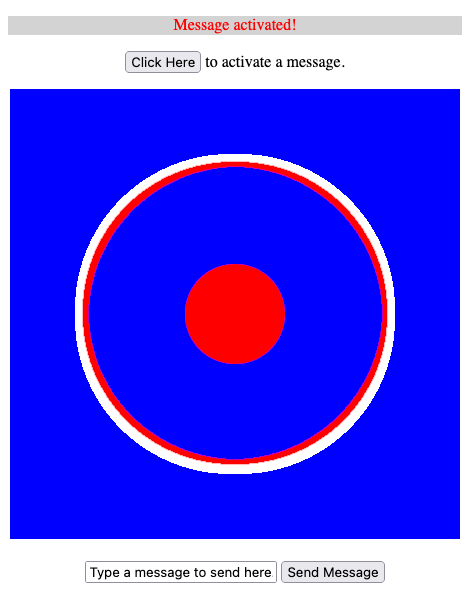
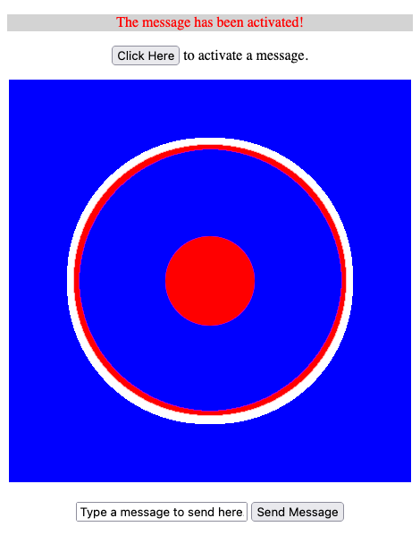
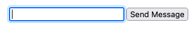
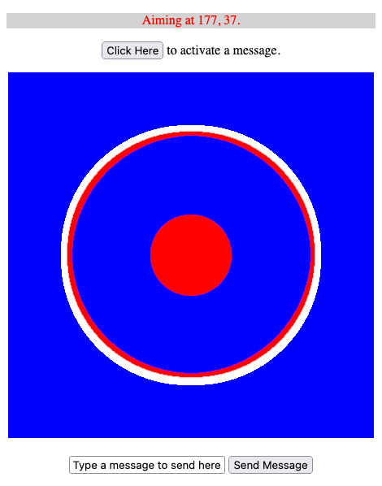

JavaScript's events give you a means of adding interactivity to your web pages. These events respond to actions occurring on the Document Object Model, giving your code more ways to make dynamic web pages.

This tutorial explains what JavaScript events are, including explanations of event listeners and event handlers. Its descriptions are rounded out with practical examples to set you off using JavaScript events effectively.

Before jumping in, you can learn more about the DOM through the first guide in this series, **Introduction to the DOM**. Check out the other guides in the series for even more on navigating and working with the DOM.

## Before You Begin

The examples in this guide use a web browser's developer tools to view the DOM and interact with a JavaScript console. You can follow along using your browser:

- On Chrome, refer to Google's [Open Chrome DevTools](https://developer.chrome.com/docs/devtools/open/#elements) documentation.
- On Firefox, refer to Mozilla's [Open the Inspector](https://developer.mozilla.org/en-US/docs/Tools/Page_Inspector/How_to/Open_the_Inspector) documentation.

Most of this guide's examples use this [example web page](example-page.html). You can follow along with the guide by visiting that page in your web browser and opening developer tools on it.

## What Are JavaScript Events?

Like in daily life, events are things that happen. More specifically though, JavaScript events are notifications provided when certain things happen in the DOM.

One of the more common JavaScript events, for instance, is triggered when the user clicks an element. Another triggers when the user presses a key, and another when the user changes the contents of a text field. There is even a JavaScript event for when the browser window is resized.

JavaScript events can be broken down into two parts. The next sections cover both of these.

### Event Listeners

The key piece for JavaScript events is the **event listener**. Event listeners are triggered when particular events occur, and they initiate one or more actions in response. Essentially, they tell JavaScript to:

- Look for a certain event trigger. If the listener is attached to an element, it looks for events occurring relative to that element.
- Execute a particular function, called an event handler, when the event occurs. This can be either a new function or a reference to an existing one. Learn about them in the next section.

Event listeners can be attached to either the `document` object or to particular elements. There are two ways of doing so:

- Using the `addEventListener` method. This method has the advantage of allowing you to add multiple handlers for the same event on the same object and letting you remove specific listeners.
- Using an event handler property. You can only assign one per event per object, but this can be helpful if you want to overwrite a previous event listener whenever you reassign it.

You can learn more about how to create and attach event listeners in the [Adding and Removing Event Listeners](/docs/guides/javascript-events-tutorial/#adding-and-removing-event-listeners) section below. That section also includes a link to a full list of available event types and their designations.

### Event Handlers

To take action on event triggers, event listeners call on **event handlers**. These are functions that run when an event listener is triggered by an event.

Event handlers can be either separately defined functions or anonymous functions declared as part of the event listener declaration. In the [Creating Event Handlers](/docs/guides/javascript-events-tutorial/#creating-event-handlers) section further on, you can see both of these approaches in action.


Even handlers that are defined separately cannot have custom arguments passed to them. They only receive an event object, which has a specific set of values depending on the kind of event.

To pass custom arguments, you need to use an anonymous function to call the predefined function. An example of this is also shown in the section below on crating event handlers.


### Inline Event Handlers

You may have seen inline event handler properties like the one below, which creates a listener and assigns a handler directly in the HTML:

    

      Click me!
    

These can be convenient for one-off event handling, but this approach is actually not recommended any longer. There are a few reasons for this:

- They make HTML markup more difficult to read
- They spread out your event-related code, making it more difficult to maintain
- They leave some JavaScript code in the HTML body, making things even more difficult to maintain

Thus, this guide does not use these properties and recommends against using them generally. They may work in the short term, but they can become out of hand and nearly unmanageable as projects scale.

## How to Use JavaScript Events

Now you can start seeing how those two fundamental parts of events — listeners and handlers — combine to work with actual events in JavaScript. The next few sections walk you through working with events for [the example page](example-page.html) linked at the beginning of this guide.

Just open up that page in your web browser, and open up your browser's JavaScript console on it. You can enter the example code given throughout the rest of this guide in that console.

Several of the upcoming examples use a `displayMessage` function, which is already defined in the code for the example page. For reference, here is the code for that function:


// [...]

      const messageContentElement = document.getElementById("message-content");

      // Provides a function for displaying messages. Includes a timer to reset
      // the message display area after five seconds.
      const displayMessage = (messageText) => {
          messageContentElement.innerHTML = "
" + messageText + "
";
          messageContentElement.classList.remove("hidden");

          setTimeout(() => {
              messageContentElement.innerHTML = "";
              messageContentElement.classList.add("hidden");
          }, 5000);
      }

// [...]


The following sections only cover a few of the more commonly used event types, but they are by no stretch exhaustive. For a full list of event types, refer to Mozilla's [event reference documentation](https://developer.mozilla.org/en-US/docs/Web/Events).

### Adding and Removing Event Listeners

Recall from above that you can add event handlers in one of two ways: as properties or via the `addEventListener` method. These next sections show you how to use each approach, discussing their particular features as they go.

#### Event Handler Properties

Event handler properties let you define functions or provide function references to be used when a specific event is triggered. Typically, these properties begin with `on`, as in `onclick` for the `click` event.

They are called "event handler" properties because you assign them event handler functions, but they themselves play the role of adding event listeners to objects.

To demonstrate, here is some JavaScript code to add an event listener to the example page using the `onclick` property. This listener triggers when the `message-activate-button` element gets clicked:

    const messageActivateButton = document.getElementById("message-activate-button");

    messageActivateButton.onclick = () => displayMessage("Message activated!");

Here, the `onclick` event property is assigned a function, its event handler, which calls another function to display a message.

It is necessary to wrap the `displayMessage` call in a function here because the call needs to pass a custom argument. However, you can reference a function name directly if it does not have a custom argument, like this:

    const displayActivationMessage = () => displayMessage("The message has been activated!");

    messageActivateButton.onclick = displayActivationMessage;

This demonstrates another feature of event handler properties, in fact. The code just above overwrites the previously assigned handler for this property. Only the message "The message has been activated!" now displays, instead of both messages.

The fact that event handler properties can be overwritten can be useful in many use cases. However, it also means that they can only be used to define one event listener per event per object.

#### Event Listener Methods

There are actually two main methods related to event listeners: `addEventListener` and `removeEventListener`. This is because using the `addEventListener` method does not overwrite existing events. You can actually add multiple events of the same kind to one object, and then remove individual events as needed.

Here is an example that adds a listener to the `message-send-text` element for the `focus` event. The anonymous function assigned to handle the event clears the placeholder text whenever the user places focus in the text field:

    const messageSendTextElement = document.getElementById("message-send-text");

    messageSendTextElement.addEventListener("focus", () => {
        messageSendTextElement.value = "";
    }

As with event handler properties, you can replace the anonymous function with the name of a predefined function. In fact, this is usually the preferred approach with the `addEventListener` method because it allows you to later remove the listener. You can see how to do that below.

For reference, the code below performs the same as the example above, but defines the function separately:

    const clearMessageSendText = () => messageSendTextElement.value = "";
    messageSendTextElement.addEventListener("focus", clearMessageSendText);

But, also like event handler properties, the `addEventListener` method cannot pass custom arguments to its function references. You can learn more about how function references work with this method in the [Creating Event Handlers](/docs/guides/javascript-events-tutorial/#creating-event-handlers) section below.

The complimentary `removeEventListener` method allows you to remove handlers, given the event name and the name of the handler function. You can use this with the example just above:

    messageSendTextElement.remvoeEventListener("focus", clearMessageSendText);

This only works with the second `addEventListener` example. Because `addEventListener` allows you to add multiple listeners for an event, you need to be able to specify which one you want to remove. The `removeEventListener` uses the name of the event handler function for that, but doing so means that you cannot remove event listeners that use anonymous functions.

### Creating Event Handlers

Each of the event listeners created above also references an event handler function, sometimes as an anonymous function and sometimes as a predefined function.

This next example aims to show more of the capabilities of event handlers. It uses a combination of event handler properties and event listener methods, demonstrating some of the virtues of each. Follow along with the comments in the code:

    const targetImage = document.getElementById("target-img");

    // Defines a function to handle the mousemove event. Gets the current
    // position of the mouse releative to the target-img element.
    const messageTargetAimingLocation = (evt) => {
        let currentMouseX = evt.pageX - targetImage.offsetLeft;
        let currentMouseY = evt.pageY - targetImage.offsetTop;

        displayMessage("Aiming at " + currentMouseX + ", " + currentMouseY + ".")
    }

    // Defines a function to handle the click event. Removes the listeners
    // for aiming, then checks the click location relative to the target-img
    // element. If the click was in the center, shows a success message.
    // Otherwise, shows a miss message.
    const messageTargetClickingResult = (evt) => {
        targetImage.removeEventListener("mousemove", messageTargetAimingLocation);
        targetImage.removeEventListener("click", messageTargetClickingResult);

        let mouseReleaseX = evt.pageX - targetImage.offsetLeft;
        let mouseReleaseY = evt.pageY - targetImage.offsetTop;

        if ( (mouseReleaseX > 175 && mouseReleaseX < 275) &&
             (mouseReleaseY > 175 && mouseReleaseY < 275) ) {
            displayMessage("You hit the target!");
        } else {
            displayMessage("You missed the target!");
        }
    }

    // Creates an event listener and handler for the keydown event, and looks
    // for the "a" key. If that key has been pressed, adds the mousemove and
    // click event listeners with the handler functions defined above.
    document.onkeydown = (evt) => {
        if (evt.code == "KeyA") {
            targetImage.addEventListener("mousemove", messageTargetAimingLocation);
            targetImage.addEventListener("click", messageTargetClickingResult);

            displayMessage("Aiming!");
        }
    }

Above, the event handler property `onkeydown` uses an anonymous function to add two new event listeners. This is where the event listener methods can be especially useful. The code needs to be able to remove those listeners when they are no longer needed, which the `removeEventListener` method can take care of.

Each of the example's functions receive an `evt` argument. Take a look at the next section to learn what this argument is and how you can use it to get input from events.

#### Taking Event Input

You can see above that each function has one parameter. Events often pass a particular kind of event object to the handler function, even when referencing a predefined function. These objects contain information on things like mouse location, in the case of mouse events, and key codes, for keyboard events.

Here is another example, one that you can use to learn more and experiment with the event outputs:

    document.onclick = (evt) => console.log("Mouse clicked at " + evt.pageX + ", " + evt.pageY + ".");
    document.onkeydown = (evt) => console.log("Key pressed with code " + evt.code + ".");

The `keydown` event handler here is especially useful when you want to figure out exactly how certain keys are coded. Then, you can readily and accurately use them in functions, like the handler for the `keydown` event in the section above.

Different kinds of events pass different objects. You can refer to Mozilla's event reference documentation, linked at the end of this guide. Follow the links there to the page for the particular event you want to use. There, if that event passes an object, you can find another link with details on the object (called an "interface").

## Conclusion

You are now set up to be able to start effectively working with events in JavaScript. This guide aims to lay the fundamentals so you can create event listeners and handlers for whatever kind of event you need.

Be sure to take a look at Mozilla's event reference documentation linked below. It provides a comprehensive list of events, their property names, and the objects they pass to the handler functions.

Wanting to learn more about working with the DOM through JavaScript? Take a look at the previous guides in this series, covering everything from the DOM basics to manipulating DOM elements to change web page displays.
