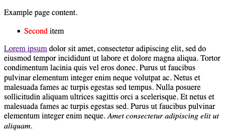

The Document Object Model (DOM) is a programming interface for HTML web pages. Scripting languages, like JavaScript, can access and manipulate the DOM to alter the display of a web page.

In this guide, you can go a step further with that knowledge, learning the tools JavaScript offers for modifying the DOM. It shows you how to manipulate the DOM, from creating new elements to changing their attributes. With the tools detailed here, you are well on your way to creating dynamic web pages.

You can learn more about navigating the DOM in the previous guide in this series, **How to Navigate and Access Elements of the DOM with JavaScript**. And you can learn more about the DOM generally through the first guide in this series, **Introduction to the DOM**.

## Before You Begin

The examples in this guide use a web browser’s developer tools to view the DOM and interact with a JavaScript console. To get the most out of the information in this guide, follow along in your own Chrome or Firefox browser.

- On Chrome, refer to Google's [Open Chrome DevTools](https://developer.chrome.com/docs/devtools/open/#elements) documentation to learn how to access their developer tools.
- On Firefox, refer to Mozilla's [Open the Inspector](https://developer.mozilla.org/en-US/docs/Tools/Page_Inspector/How_to/Open_the_Inspector) documentation to learn how to access their developer tools.

Most of this guide’s examples are based on an example web page created from the HTML source code displayed below. To follow along with this guide’s example, [view the rendered example web page](example-page.html) in your browser.


<!DOCTYPE html>
<html>
    <head>
        <title>Example Page</title>
    </head>
    <body>
        

            
Example page content.

            <ul>
                <li>First item</li>
                <li>Second item</li>
            </ul>
        

        

            
<a href="https://loremipsum.io/">Lorem ipsum</a> dolor sit amet, consectetur adipiscing elit, sed do eiusmod tempor incididunt ut labore et dolore magna aliqua. Tortor condimentum lacinia quis vel eros donec. Purus ut faucibus pulvinar elementum integer enim neque volutpat ac. Netus et malesuada fames ac turpis egestas sed tempus. Nulla posuere sollicitudin aliquam ultrices sagittis orci a scelerisque. Et netus et malesuada fames ac turpis egestas sed. Purus ut faucibus pulvinar elementum integer enim neque. <em>Amet consectetur adipiscing elit ut aliquam.</em>

        

    </body>
</html>


## How to Create and Remove DOM Elements

To make a web page dynamic, you use JavaScript to alter the elements that make up the web page's DOM. Typically, the DOM is altered by creating new HTML elements or moving specific elements or attributes, programmatically.

The sections below show you how to use JavaScript to create and remove elements from the DOM. You also learn how to control the way in which new elements are added to the DOM using a few specialized JavaScript methods.

### Creating Element Nodes

The DOM represents the elements and content of an HTML document as nodes and objects. You can create element nodes in the following two ways:

- Using a `document` object method to create the element and to append the new node
- Changing the value of the `innerHTML` property on a parent node

Depending on what you are trying to achieve, you might choose one approach over another. The following sections provide examples on each approach and information on when to use them.

#### Using the createElement() Method

The `document` object has several built-in methods for creating new nodes, like the `createElement()` method. This method is especially convenient when you want to create multiple elements or are working programmatically with numerous elements.

The list below includes an overview of the steps typically used when creating a new element using JavaScript.

- The `createElement()` method accepts the tag name of the element to create as a parameter. It creates the specified tag without any content contained within the tag.
- Once you've created a new element, you have access to properties or additional methods of the element object that can be used to style the element, populate it with text, and achieve many other enhancements. The [How to Modify Element Attributes](/docs/guides/making-changes-to-the-dom-with-javascript/#how-to-modify-element-attributes) discussed these changes in great depth.
- When your new element looks and behaves the way you intend, you can add the element node to the DOM's target parent node. For example, you can use the `appendChild()` method to achieve this. The [Inserting Element Nodes](/docs/guides/making-changes-to-the-dom-with-javascript/#inserting-element-nodes) discussed the `appendChild()` and other methods you can use to insert an element into the DOM.

The example below demonstrates the typical steps used to create and add a new element to the DOM using the `createElement()` method. The steps include a series of JavaScript code that you can run on the [example page](example-page.html) using your browser's developer console. The JavaScript code creates a new `li` element and a new `span` element. After adding some styling and text to these new elements, the commands append the elements as children of the existing `ul` element.

    // Creates the new span element, assigns its class, sets its
    // color, and finally gives the element some text content
    const new_span_element = document.createElement("span");
    new_span_element.classList.add("numeral-name");
    new_span_element.style.color = "yellow";
    new_span_element.textContent = "Third";

    // Creates the new li element, adds the span element to it,
    // and adds some additional text content.
    const new_li_element = document.createElement("li");
    new_li_element.appendChild(new_span_element);
    new_li_element.append("item");

    // Appends the new li element to the existing ul element,
    // which adds the new elements to the visible DOM.
    const ul_element = document.getElementsByTagName("ul")[0]
    ul_element.appendChild(new_li_element);

The result of executing the JavaScript on the [example page](example-page.html) resembles the following:

#### Using the innerHTML Property

You can use the `innerHTML` property to add HTML elements to the DOM. This property is available on the `document` object model and any element object that is a part of the DOM.

The `innerHTML` property stores a string representation of the DOM's HTML. This means that you can use this property to overwrite existing content, create new content wholesale, or manipulate content using string manipulation.

However, the `innerHTML` property does not give you convenient means for modifying child elements and nodes, since it represents everything in one, often long, string.

For this reason, the `innerHTML` property is useful when you need to make large and sweeping changes to several elements. It is not as useful when you want to create child elements systematically, or when you want to do so in an iterative loop.

The example below demonstrates the typical steps used to create and add a new element to the DOM using the `innerHTML` property.
Following are a series of JavaScript commands that you can use on the [example page](example-page.html). The steps include a series of JavaScript code that you can run on the [example page](example-page.html) using your browser's developer console. The JavaScript creates a new `ul` element and child `li` elements, each with its own containing text.

    // Fetches the second-div element, then extends its innerHTML with a new
    // ul element. Observe that this requires rewriting the innerHTML.
    const second_div_element = document.getElementById("second-div");
    second_div_element.innerHTML = second_div_element.innerHTML + "<ul></ul>";

    // Fetches the new ul element and writes two new li elements to its
    // innerHTML, complete with classes, attributes, and text content.
    const second_ul_element = document.querySelector("#second-div > ul");
    second_ul_element.innerHTML = `<li>First item</li>
    <li>Second item</li>`

The result of executing the above JavaScript commands on the [example page](example-page.html) looks like the following:

By itself, this approach can be a bit cumbersome, both to write, and to read. Thus, even when your needs favor using the `innerHTML` property, it works better combined with the element creation methods.

Following is another example, which uses these approaches in combination and results in the same changes to the DOM as in the example demonstrated above:

    // Adds the new ul element to the second-div element.
    const new_ul_element = document.createElement("ul");
    document.getElementById("second-div").appendChild(new_ul_element);

    // Writes the two new li elements to the new ul element.
    new_ul_element.innerHTML = `<li>First item</li>
    <li>Second item</li>`

### Removing Element Nodes

You can remove an element using one of two methods: either one on the parent element or one on the element itself.

- The `document` object and each element have a `removeChild` method. This lets you specify a child node that you want to remove. For instance, the code below removes the first `li` element from the `ul` in the `first-div`:

        const first_div_ul_element = document.querySelector("#first-div > ul");
        const first_ul_li_element = first_div_ul_element.getElementsByTagName("li")[0];
        first_div_ul_element.removeChild(first_ul_li_element);

    

- Each node has a `remove` method that allows you to remove that node itself from the DOM. For instance, the code below removes the `em` element from the `p` element in the `second-div`:

        const second_div_em_element = document.querySelector("#second-div em");
        second_div_em_element.remove();

    

### Inserting Element Nodes

You can see above that new elements have to be explicitly added to the DOM before they are displayed. The examples above use the `appendChild` method for doing so, but, in fact, two more options are also available. These methods let you control where new elements are added to the DOM, giving you finer control over how you modify the DOM.

Below is a breakdown of each of the three options, with examples, to help you know which one to use to fit your needs. To make these examples more straightforward and clear, they use the simple DOM element assigned to `ul_element` as shown below:

    <ul>
        <li id="first-item">First item</li>
        <li id="second-item">Second item</li>
    </ul>

- `appendChild` adds the new node to the end of the parent node. For example, the following adds a third item to the `ul_element`:

        const third_li_element = document.createElement("li");
        third_li_element.textContent = "Third item";

        ul_element.appendChild(third_li_element);

- `insertBefore` adds the new node before an existing node which is also a child of the intended parent node. This next example adds an item to the `ul_element` before the `first-item` element:

        const zero_li_element = document.createElement("li");
        zero_li_element.textContent = "Zero item";

        const first_li_element = ul_element.querySelector("#first-item");

        ul_element.insertBefore(zero_li_element, first_li_element);

- `replaceChild` replaces an existing child node with a new child node. You can see this here with the `zero_li_element` created above being replaced with a new item:

        const not_first_li_element = document.createElement("li");
        not_first_li_element.textContent = "First negative item";

        ul_element.replaceChild(not_first_li_element, zero_li_element);

All of the above commands, in sequence, rework the `ul` element to look like the following:

    <ul>
        <li>First negative item</li>
        <li id="first-item">First item</li>
        <li id="second-item">Second item</li>
        <li>Third item</li>
    </ul>

## How to Modify Element Attributes

Recall that attributes are also nodes, and they can be added to the DOM similar to how you add element nodes. For instance, you can use the `createAttribute` on the `document` objects like you would use the `createElement` method.

However, the `document` object also has a set of specialized properties ready to handle the specific needs of attributes. It even includes some dedicated properties for dealing with certain kinds of attributes, like classes and styles.

The next sections focus on these specialized properties, showing you how to use them to set and change your elements' associated attributes.

### General Attributes

Most attributes can be managed by a central set of methods, detailed in the next three sections.

However, if you are looking to manage class or style attributes, you can see below the special tools JavaScript has for more conveniently working with those kinds of attributes.

#### Setting Attributes

The `setAttribute` method lets you set an attribute's value, whether the attribute is already on an element or you want to introduce it. The method is available on any element node and takes two arguments: the attribute name and its value.

For example, you can add an `id` attribute to the first `li` element in the `first-div` of the example page as shown below:

    const first_div_li_element = document.querySelector("#first-div li");
    first_div_li_element.setAttribute("id", "first-li");

    console.log(first_div_li_element);


<li id="first-li">


#### Checking for Attributes

Often, when you start working with element attributes, you need to be able to check whether an element already has a given attribute. After that, it is also common to need to know what a given attribute's current value is.

    const first_div_span_element = document.querySelector("#first-div span");
    if first_div_span_element.hasAttribute("class") {
        console.log(first_div_span_element.hasAttribute("class"));
        console.log(first_div_span_element.getAttribute("class"));
    }


true
numeral-name


#### Removing Attributes

You can remove any existing attribute using the `removeAttribute` method. Again, each element node inherits this method.

Using it, you can, for instance, delete the `id` attribute added to the `first_div_li_element` above:

    first_div_li_element.removeAttribute("id")'
    console.log(first_div_li_element)


<li>


### Style Attributes

Style attributes are not so readily manipulated. This is because the single attribute, `style`, can actually hold numerous properties of its own. The `setAttribute` method only lets you redefine the style attribute's value, not adjust the values of its individual properties.

For instance, you can use the `setAttribute` to give an element's style attribute several properties, expressing them as a single string:

    const first_p_element = document.querySelector("#first-div > p");

    first_p_element.setAttribute("style", "font-weight: bold; text-align: center;");

    console.log(first_p_element.style);


{ "font-weight" → "bold", "text-align" → "center" }


However, if you then want to adjust only one of those style properties, `setAttribute` becomes cumbersome.

    first_p_element.setAttribute("style", "font-weight: normal;");

    console.log(first_p_element.style);


{ "font-weight" → "normal" }


To remedy this, JavaScript allows you to adjust the style attribute, and its individual properties, via the `style` property. This property makes available all of the CSS style properties of the style attribute, letting you set and adjust each one independently.


While CSS hyphenates property names, JavaScript instead uses camel case. So, for instance, the CSS properties `font-weight` and `text-align` become `fontWeight` and `textAlign`, respectively, in JavaScript.


Here is an example, which accomplishes what was attempted with the `setAttribute` method above:

    first_p_element.style.fontWeight = "bold";
    first_p_element.style.textAlign = "center";
    console.log(first_p_element.style);

    first_p_element.style.fontWeight = "normal";
    console.log(first_p_element.style);


{ "font-weight" → "bold", "text-align" → "center" }
{ "font-weight" → "normal", "text-align" → "center" }


### Class Attributes

Class attributes present another special challenge. An element can have one or more classes, and sometimes you may find the need to work with them individually. This is especially the case with modern CSS frameworks, where you may need to check for a particular class and toggle it on or off.

The `classList` property remedies the difficulty. The property itself returns a list of the classes on an element, but the property also comes with several convenient methods for dealing with classes.

#### Checking for Classes

You can check to see whether an element has a given class using the `contains` method on the `classList` property.

This example checks whether the `p` element in the `second-div` has the `active` class:

    const second_p_element = document.querySelector("#second-div > p");
    console.log(second_p_element.classList.contains("active"));


false


#### Toggling Classes

Some classes, especially with modern CSS frameworks, require toggling for you to get the most out of them. For instance, the `active` class is often used to highlight an element. Being able to toggle the class via JavaScript could allow you to have a button that toggles highlighting on the element.

Here is an example using the `second_p_element` object defined above. Recall that the element here does not have the `hidden` class. In that case, toggling the class adds the class to the element.

    second_p_element.classList.toggle("active")
    console.log(second_p_element.classList.contains("active"));


true


If the element already has the class, toggling removes the class.

    second_p_element.classList.toggle("active")
    console.log(second_p_element.classList.contains("active"));


false


#### Adding and Removing Classes

In some cases, you may want to add or remove a class unconditionally, rather than toggle it. Using the `toggle` method for this would first require using the `contains` method to determine whether the class is already present or not.

Instead, you can just use the `add` and `remove` methods. These methods are straightforward and do not require any knowledge of the current classes on an element.

The example below first add and then removes the `button` class from the `a` element in the `second-div`. This is another class often used by modern CSS frameworks, usually to give a link to the modern button styling.

    const a_element = document.querySelector("#second-div a");

    a_element.classList.add("button");
    console.log(a_element.classList);


[ "button" ]


    a_element.classList.remove("button");
    console.log(a_element.classList);


[]


## Conclusion

This guide showed you the ins and outs of manipulating the DOM. From adding and removing elements to working with attributes, classes, and styles.

Be sure to take a look at our other guides in this series. These cover everything from the basics of the DOM to, in the next guide in the series, an in-depth look at how to handle JavaScript events.
