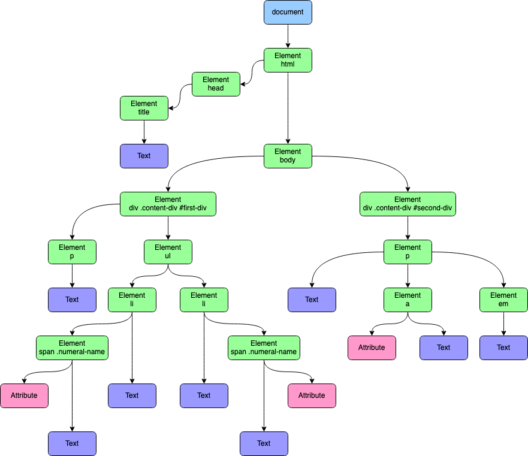

The Document Object Model (DOM) is an interface that gives scripting languages, like JavaScript, access to a web page's structure and content. You can learn more about the DOM and how it represents HTML in our guide [Introduction to the DOM](/docs/guides/document-object-model/).

The DOM is organized as a tree of objects, called nodes, that give access to everything from HTML elements to the text displayed on a web page. Understanding how to navigate and access nodes on this tree is essential to working with the DOM. This guide explains the DOM tree, how to navigate it, and how to access its nodes using JavaScript.

## Before You Begin

The examples in this guide use a web browser's developer tools to view the DOM and interact with a JavaScript console. To get the most out of the information in this guide, follow along in your own Chrome or Firefox browser.

- On Chrome, refer to Google's [Open Chrome DevTools](https://developer.chrome.com/docs/devtools/open/#elements) documentation to learn how to access their developer tools.
- On Firefox, refer to Mozilla's [Open the Inspector](https://developer.mozilla.org/en-US/docs/Tools/Page_Inspector/How_to/Open_the_Inspector) documentation to learn how to access their developer tools.

Most of this guide's examples are based on an example web page created from the HTML source code displayed below. To follow along with this guide's example, [view the rendered example web page](example-page.html) in your browser.


<!DOCTYPE html>
<html>
    <head>
        <title>Example Page</title>
    </head>
    <body>
        

            
Example page content.

            <ul>
                <li>First item</li>
                <li>Second item</li>
            </ul>
        

        

            
<a href="https://loremipsum.io/">Lorem ipsum</a> dolor sit amet, consectetur adipiscing elit, sed do eiusmod tempor incididunt ut labore et dolore magna aliqua. Tortor condimentum lacinia quis vel eros donec. Purus ut faucibus pulvinar elementum integer enim neque volutpat ac. Netus et malesuada fames ac turpis egestas sed tempus. Nulla posuere sollicitudin aliquam ultrices sagittis orci a scelerisque. Et netus et malesuada fames ac turpis egestas sed. Purus ut faucibus pulvinar elementum integer enim neque. <em>Amet consectetur adipiscing elit ut aliquam.</em>

        

    </body>
</html>


## Understanding the DOM Tree

The DOM is organized as a tree, each branch of which is a node. Though many nodes represent HTML elements, they also represent attributes and text associated with elements.

In the following sections, you learn more about the structure of the DOM tree. You also learn about the components used to identify nodes and sets of nodes, which is the basis for effectively accessing nodes.

### What Is the DOM Tree?

The [`document` object](/docs/guides/document-object-model/#document-object) is the base of all of the DOM's nodes. The nodes are arranged as a tree, with nodes nested under other nodes. Below, is an example of the DOM representation of a simple web page:

    <body>
        

            
Paragraph text

        

        

            <ul>
                <li>First item</li>
                <li>Second item</li>
            </ul>
        

    </body>

In the example above, elements nest under other elements. The two `div` elements are nested under the `body` element. Text nodes are nested under the `p` and `li` elements, and the `style` attribute is considered a node under the `p` element, as well.

Plotting the nesting structure out, the DOM resembles the following tree:

    body
     \_ div
     |   \_ p
     |      \_ [text]
     |      |
     |      \_ [attribute]
     \_ div
         \_ ul
             \_ li
             |   \_ [text]
             |
             \_ li
                 \_ [text]

Knowing the arrangement of the DOM tree and its leaves, helps you understand how to access specific nodes when working with JavaScript. This is especially true when you are working with more complicated web pages. The [Navigating the DOM Tree](/docs/guides/traversing-the-dom/#navigating-the-dom-tree) section of this guide includes a more in-depth discussion on moving around the nodes of the DOM tree.

The diagram below provides a visualization of the DOM tree for this guide's [example web page](example-page.html). You can also view the `example-page.html` file in the [Before You Begin](/docs/guides/traversing-the-dom/#before-you-begin) section of this guide.

### How Are Nodes Accessed?

When working with JavaScript, you need to pinpoint a node or a particular set of nodes to access. Nodes can be identified by the three components listed below:

- *Tags*, used to define HTML elements. Common examples include `div` for page components, `p` for paragraphs, and `a` for hyperlinks.
- *Classes* that distinguish between similar elements. Classes are optional, but let you apply CSS styles and let you differentiate between a subset of the same type of element.
- *IDs*, which are meant to identify particular elements. These are most useful when applied to elements that you want to be able to conveniently and consistently select individually from the DOM.

Although this is not always the case, the arrangement of these components above generally reflects the components' specificity, from least specific to most. For instance:

- A **tag** can be used to identify every `div` element on a page.
- A **class** can identify a smaller set of those `div` elements.
- An **ID** can identify a specific `div` element.

The [Navigating the DOM Tree](/docs/guides/traversing-the-dom/#navigating-the-dom-tree) section below shows how these components can be used to access particular elements or set of elements.

#### Query Selectors

The popular JavaScript library [jQuery](https://jquery.com/) introduced *query selectors*. These give you advanced ways to access DOM elements, using the above three components as well as attributes and other node features. Query selectors even let you combine all of these in a single command.

JavaScript now directly implements its own query selectors as well. This gives you access to advanced DOM selections, which are covered in depth later on in this guide.

To give you an idea, the list below includes some examples of where you can use query selectors to fetch elements. The query selectors can be based on elements:

- matching a specific sequence of tag, class, and/or ID
- with a given attribute and/or attribute value
- with a matching parent element
- that do not match a query

## Navigating the DOM Tree

Once you understand the DOM's tree structure and how its nodes are identified, you can start using JavaScript to access and alter the DOM. The sections below show how you can use JavaScript to select specific elements from the DOM. This is divided into two sections:

1. Using standard methods on DOM objects. These have been around for a longer time and provide some of the most straightforward selection methods.
1. Using query selectors. These are relatively new features in standard JavaScript and provide advanced selection methods. They are ideal when you want to make complicated queries in a few commands.

### How to Access Elements via Object Methods

Most often, you can start accessing the DOM elements you need using methods from the `document` object. These allow you to match elements based on tag, class, or ID.

Moreover, these methods are inherited by any element object. This makes it possible to navigate the DOM tree from element to element, narrowing it down to the specific elements you need.

-  To fetch elements based on tag, use the `getElementsByTagName` method:

        document.getElementsByTagName("p");

-  To fetch elements based on class, use the `getElementsByClassName` method:

        document.getElementsByClassName("content-div");

-  To fetch an element based on ID, use the `getElementById` method:

        document.getElementById("first-div");

With the exception of `getElementById`, all the listed methods return an array of elements, no matter how many elements actually match the query. The `getElementById` method only returns the first matching element, even if multiple elements on the page have the same ID.

The following example shows how you can traverse the DOM using a combination of the inherited `document` object methods. It also shows how you can leverage the fact that every element inherits these methods, allowing you to narrow your search down the DOM tree.

    // Fetch the element with the `first-div` ID. This uses the `document` object,
    // so the search looks at all elements on the page.
    const first_div_element = document.getElementById("first-div");

    // Fetch all of the `ul` elements from under the `first-div` element. Remember,
    // this method returns an array, even if there is only one matching element.
    const ul_elements = first_div_element.getElementsByTagName("ul");

    // Fetch the elements with the `numeral-name` class from under the first
    // element in the array of `ul` elements.
    const numeral_elements = ul_elements[0].getElementsByClassName("numeral-name");

    // Grab and print the `style.color` value from each of the matching
    // `numeral-name` elements.
    for (const span_element of numeral_elements) {
        console.log(span_element.style.color);
    }

If you run the above JavaScript in your web browser's developer tools console, you see the following output.


green
red


From the example above, you could also get to the `numeral-name` elements directly using the following code:

    const numeral_elements = document.getElementsByClassName("numeral-name");

The approach of using particular elements' methods to select lower elements on the tree can be extraordinarily helpful in some cases. For instance, if you want to select only the `p` elements from the second `div`, use the following JavaScript code:

    const second_div_element = document.getElementById("second-div");
    const p_elements = second_div_element.getElementsByTagName("p");

### How to Access Elements via Query Selectors

Query selectors give you more advanced options for selecting elements from the DOM. They can be accessed via two methods from the `document` object — and they are also inherited on all other element objects. The two methods are the following:

- `querySelector` fetches one element matching the query string. If multiple elements match, the method only returns the first one.
- `querySelectorAll` fetches an array of elements matching the query string. Even if only one element matches, the result is an array.

Like the methods covered in the previous section, these query selector methods let you select elements based on tag, class, and ID. However, the query selector syntax also lets you combine element selectors, and expands on how you can search for specific elements.

The following examples display some key ways in which you can use query selectors to navigate and access elements from the DOM.

- You can look for elements with a specific combination of tag, class, and ID. For instance, to search for a combination of the `div` tag, the `content-div` class, and the `first-div` ID, use the following code:

        document.querySelectorAll("div.content-div#first-div");

    The query selector syntax uses `.` to precede class names and `#` to precede IDs. It assumes labels without a prefix to be tag names.

- You can look for elements nested under particular elements. These are called the *descendants* of an element. The following example finds `em` elements nested somewhere under any element with the `content-div` class:

        document.querySelectorAll(".content-div em");

- You can look for elements based on associated attributes. The example below accesses the first element with an `href` attribute:

        document.querySelector("[href]");

    Alongside this, you can also specify the tag, class, and/or ID. This allows you to narrow down the search to elements whose attribute has a specific value:

        document.querySelector("a[href='https://loremipsum.io/']");

- You can look for elements based on their direct parent elements. The next command fetches all `p` elements that are immediate children of any `div` elements with the `first-div` ID:

        document.querySelectorAll("div#first-div > p");

    This selector is more specific than the descendant selector above. Where the descendant selector `div em` grabs an element from the example page, the child selector `div > em` does not.

    Why is this? The page's `em` element is a direct child of a `p` element — that is, nested immediately under a `p` element — but not a `div` element. It is only a descendant of a `div` element, meaning it is nested somewhere, however deeply, beneath one.

- You can look for elements that do not have a certain matching quality. For instance, the example below gets all `p` elements that are not a child of an element with the `first-div` ID:

        document.querySelectorAll("p:not(#first-div > p)")

The above is, in fact, just a selection of some of the most commonly used features of the query selector. You can get more examples of query selector options in the [More Information](/docs/guides/traversing-the-dom/#more-information) section of this guide.

## Conclusion

This tutorial walked you through what the DOM tree looks like, how to navigate its parts, and how to start accessing them. The [links below](/docs/guides/traversing-the-dom/#more-information) give you some resources to learn more about navigating the DOM, with more examples and coverage of advanced options and scenarios.

