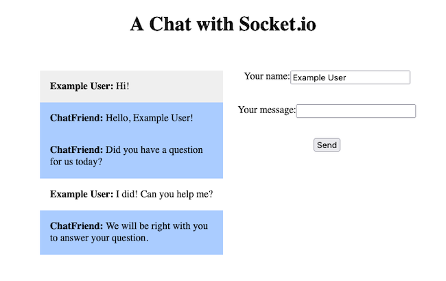

Socket.IO provides applications real-time, bidirectional communications. It is similar to traditional WebSockets, but with added efficiencies and guarantees, making Socket.IO a compelling choice for deployments with real-time requirements.


## Before You Begin

1. If you have not already done so, create a Linode account and Compute Instance. See our [Getting Started with Linode](/docs/guides/getting-started/) and [Creating a Compute Instance](/docs/guides/creating-a-compute-instance/) guides.

1. Follow our [Setting Up and Securing a Compute Instance](/docs/guides/set-up-and-secure/) guide to update your system. You may also wish to set the timezone, configure your hostname, create a limited user account, and harden SSH access.


This guide is written for a non-root user. Commands that require elevated privileges are prefixed with `sudo`. If you’re not familiar with the `sudo` command, see the [Users and Groups](/docs/guides/linux-users-and-groups/) guide.


## What Is Socket.IO?

[Socket.IO](https://socket.io/) is a library for low-latency, real-time, bidirectional communications, similar to WebSockets. However, Socket.IO stands out for providing higher-level APIs and a set of guarantees. Thus, Socket.IO aims to be a more secure and manageable communication solution.

### Socket.IO vs WebSocket

Socket.IO shares the field of real-time bidirectional communications with WebSockets. In fact, Socket.IO builds on the WebSocket protocol for many of its communications. However, Socket.IO is not a WebSockets implementation. Socket.IO utilizes a combination of WebSockets and HTTP long-polling to provide more consistent communications and a better experience.

Essentially, Socket.IO works in the following manner:

-   Socket.IO starts with an HTTP long-polling connection. Should WebSockets not work for whatever reason, starting with long-polling dramatically improves the user experience.

-   Socket.IO upgrades to a WebSocket connection when possible, as WebSockets provide much more efficient real-time communications.

Beyond that, Socket.IO provides a set of higher-level APIs over WebSockets. This often makes Socket.IO easier to work with, and it includes a set of guarantees about the consistency of communications.

So, why use WebSockets directly? Socket.IO gives a higher-level interface, but for some use cases that is not wanted. In fact, some use cases specifically call for lower-level control over connections and communications. Such cases likely need to work directly with WebSockets.

You can learn more about WebSockets in our tutorial [Introduction to WebSockets](/docs/guides/introduction-to-websockets/).

## How to Use Socket.IO

To start using Socket.IO you need an application that features Socket.IO. The example in this guide is a basic chat application, as it's a common example of real-time communications. However, the example here expands on that premise by showing how to integrate an AI chatbot.

### Setting Up a Server

This tutorial's example application requires a Socket.IO server, as well as a server to host the static files for the chat client. One of the most approachable solutions is using the Node.js package for Socket.IO, alongside Express JS for hosting the static files.

More options exist for Socket.IO, including a Python implementation, [python-socketio](https://github.com/miguelgrinberg/python-socketio). The general approach taken here should be similar regardless of the Socket.IO server implementation.

To learn more about Express JS, reference our [Express JS Tutorial](/docs/guides/express-js-tutorial/). This guide uses a simpler setup, but the Express JS tutorial showcases more capabilities.

1.  Install the Node Package Manager (NPM). Follow the relevant section of our guide on [How to Install and Use the Node Package Manager (NPM) on Linux](/docs/guides/install-and-use-npm-on-linux/#how-to-install-npm).

1.  Create a directory for the example project and change into it as the working directory. This tutorial uses the directory name `socket-example`. The client-side code gets added to a subdirectory in the next section.

    ```command
    cd ~/
    mkdir socket-example
    cd socket-example
    ```

1.  Initialize an NPM project in the directory. This allows the installation of Node.js packages, including Express JS and Socket.IO.

    ```command
    npm init
    ```

    Follow through the prompts with the <kbd>Enter</kbd> key to select the default options.

1.  Install the Express and Socket.IO packages:

    ```command
    npm install --save express socket.io
    ```

### Developing the Server

This project needs server-side code to implement Socket.IO. The primary component of this is essentially a chat hub for receiving new messages from clients and broadcasting those messages across all connected sockets. While this example does not persist messages, this is where persistence would be implemented if chosen.

Additionally, this example application needs to integrate with a chatbot. So the chat server needs to pass inbound messages to a chatbot interface, receive any responses from the chatbot, and broadcast those responses.

The chatbot interface is implemented in a dedicated module, which is built in the next section.

Create an `index.js` file within the project directory. This file houses the code for running the chat server. Give the file the contents shown below, and follow along with the inline comments to see what each part does:

```file {title="socket-example/index.js" lang="js"}
// Define a PORT variable for the server
const PORT = 3000;

// Import the Express package and initialize the app object
const express = require('express');
const app = express();

// Initialize a basic HTTP server to be used by Socket.IO
const http = require('http');
const server = http.createServer(app);

// Create a Socket.IO server with the HTTP server
const { Server } = require('socket.io');
const io = new Server(server);

// Import the custom chatbot module
const chatbot = require('./chatbot');

// Serve static files from the public/ directory
app.use(express.static('public'));

// Have Socket.IO listen for socket connections
io.on('connection', (socket) => {
    console.log('Connection made');

    // Define handling for new messages
    socket.on('newmessage', async (messageObject) => {
        console.log('Message received:\n\t' + messageObject.body);

        // Broadcast the message to all sockets
        io.emit('newmessage', messageObject);

        // Fetch a response from the chatbot, and broadcast that response
        botResponse = await chatbot.getResponse({ sender: messageObject.user, message: messageObject.body })
            .then((responses) => {
                for (response of responses) {
                    console.log('Bot message of:\n\t' + response);

                    io.emit('botmessage', { user: 'ChatFriend', body: response });
                }
            })
    });

    // Define handling for disconnects
    socket.on('disconnect', () => {
        console.log('Disconnected user');
    });
});

// Start up the HTTP server on the given port
server.listen(PORT, () => {
    console.log('Server running on port ' + PORT);
});
```

This relatively simple server handles all the basic chat needs. Some additional features could be added for production use, such as user authentication, message persistence, and chat "rooms", but the bases are covered here.

By abstracting the interface with a chatbot into a separate module, the chat application itself becomes more adaptable. For instance, this model makes it easier to change the chatbot solution in use.

### Implementing a Chatbot

There are many ways and options for implementing a chatbot. Right now, the server code above leaves the chatbot integration open-ended. It simply calls a `getResponse` function in a `chatbot` module and expects a text response back.

This section covers setting up a basic `chatbot` module that can work with the server created above. That basic module can then be modified to integrate with specific chatbot solutions. Further on in this section are examples of those solutions, particularly open source ones.

Create a `chatbot.js` file within the project directory alongside the `index.js` server file. Give the file the contents shown below and follow along with the in-code comments to see what each part does:

```file {title="socket-example/chatbot.js" lang="js"}
// Define a getResponse function exported by the module
exports.getResponse = async (chatObject) => {
    // Set up an initial response array; this can also handle multiple responses to one message
    let response = [];

    //
    // BEGIN CHATBOT IMPLEMENTATION
    // Modify the following depending on your desired chatbot implementation
    //

    // Simplest chatbot: A series of conditions with predefined responses

    if (!chatObject.sender || chatObject.sender === '') {
        response = ['Hello!', 'What is your name?'];
        return response
    }

    if (!chatObject.message || chatObject.message === '') {
        response = ['What did you want to ask?']
        return response
    }

    if (chatObject.message.toLowerCase().includes('hello') || chatObject.message.toLowerCase().includes('hi')) {
        response.push('Hello, ' + chatObject.sender + '!')
    }

    if (chatObject.message.includes('?')) {
        response.push('We will be right with you to answer your question.');
    } else {
        response.push('Did you have a question for us today?')
    }

    //
    // END CHATBOT IMPLEMENTATION
    //

    // Return the response array for the chat server to use
    return response;
}
```

The `getResponse` behavior above represents perhaps the simplest kind of chatbot: one that takes a series of specific conditions and renders predefined responses for each.

However, that kind of chatbot requires a prohibitively extensive list of conditions for many use cases. Such a set of conditions would be difficult to implement, and even more difficult to maintain.

For that reason, it's best to replace the implementation above with something that connects to a chatbot AI. Numerous such chatbots exist, and they generally have the advantage of being designed and trained specifically for handling the variability of text communications.

Below are a couple of notable AI projects. Both are open source, making them efficient to pick up, and both are regarded as exceptional tools.

-   [Rasa](https://github.com/RasaHQ/rasa) is an open source machine learning framework for conversations. Rasa specializes in contextualized conversations, and its story-based model helps handle conversations with back-and-forth exchanges.

-   [botpress](https://github.com/botpress/botpress) is a full developer stack application for building and running conversational AI applications. botpress provides an easy-to-navigate administrator interface to construct custom chatbots.

See how to set up a chatbot using Rasa through our guide [Introduction to the Rasa Framework for Automated Chats](/docs/guides/getting-started-with-rasa/).

### Creating a Client

Finally, the Socket.IO server needs a client interface. This tutorial provides a webpage with a simple interface for users to enter their name and send a message. Behind the webpage, the client has the necessary client-side JavaScript to connect to the Socket.IO server.

1.  Create a `public` directory within the `socket-example` project directory.

    ```command
    mkdir public
    ```

1.  Create an `index.html` file in the `socket-example/public` directory, and give it the contents shown below. This defines the page structure and provides elements to insert chat content into.

    ```file {title="socket-example/public/index.html" lang="html"}
    <!doctype html>
    <html>
      <head>
        <meta charset="utf-8">
        <meta name="viewport" content="width=device-width, initial-scale=1">
        <title>Socket.IO Example App</title>
        <link rel="stylesheet" href="./main.css">
      </head>
      <body>
        <h1>A Chat with Socket.IO</h1>
        <div class="row">
          <div class="column">
            <ul id="messageField">
            </ul>
          </div>
          <div class="column" id="messageForm">
            <span id="errorMessage"></span>
            <form>
              <div class="row justify-center">
                <label for="messageUser">Your name: </label>
                <input type="text" id="messageUser"></input>
              </div>
              <div class="row justify-center">
                <label for="messageBody">Your message: </label>
                <input type="text" id="messageBody"></textarea>
              </div>
              <div class="row justify-center">
                <input type="button" id="send" value="Send" onclick="sendMessage()"/>
              </div>
            </form>
          </div>
        </div>
        <script src="/socket.io/socket.io.js"></script>
        <script src="./main.js"></script>
      </body>
    </html>
    ```

1.  Create a `main.js` file in the `socket-example/public` directory, and give it the contents below. This is where the Socket.IO client is defined. Follow along with the comments in the code to see what each part is doing.

    ```file {title="socket-example/public/main.js" lang="js"}
    // Create a socket from the Socket.IO module
    var socket = io();

    // Assign variables for elements of the page for easy access
    var messageUser = document.getElementById('messageUser');
    var messageBody = document.getElementById('messageBody');
    var errorMessage = document.getElementById('errorMessage');
    var messageField = document.getElementById('messageField');

    // Define a function to handle inbound 'newmessage' communications on the
    // socket; render an <li> element for each
    socket.on('newmessage', (messageObject) => {
        var messageElement = document.createElement('li');
        messageElement.innerHTML = "<strong>" + messageObject.user + ":</strong> " + messageObject.body;

        messageField.appendChild(messageElement);
    });

    // Define a function to handle inbound 'botmessage' communications; render
    // these similarly, but with an additional class for visual distinction
    socket.on('botmessage', (messageObject) => {
        var messageElement = document.createElement('li');
        messageElement.classList.add('botMessage');
        messageElement.innerHTML = "<strong>" + messageObject.user + ":</strong> " + messageObject.body;

        messageField.appendChild(messageElement);
    });

    // Define a function for sending a message; this function gets called
    // when the user presses the 'Send' button
    const sendMessage = () => {
        if (messageUser.value != '' && messageBody.value != '') {
            errorMessage.innerHTML = '';

            socket.emit('newmessage', { user: messageUser.value, body: messageBody.value });

            messageBody.value = '';
        } else {
            errorMessage.innerHTML = 'Please complete the form to send a message';
        }
    }
    ```

1. Create a `main.css` file in the `socket-example/public` directory to handle the page styling and give the contents shown below:.

    ```file {title="socket-example/public/main.css" lang="css"}
    h1 {
        text-align: center;
    }

    .row {
        display: flex;
        padding: 1em;
    }

    .column {
        flex: 50%;
    }

    .justify-center {
        justify-content: center;
    }

    #messageForm {
        text-align: center;
    }

    #errorMessage {
        color: red;
    }

    #messageField {
        list-style-type: none;
    }

    #messageField > li {
        padding: 1em;
    }

    #messageField > li:nth-child(odd) {
        background: #EFEFEF;
    }

    #messageField > li.botMessage {
        background: #AACCFF;
    }
    ```

### Running the Example Application

With everything in place, run the project to test the Socket.IO connections. Run the command below from within the `sockert-example` project directory, and the server should start running on `localhost:3000`.

```command
node index.js
```

Navigate to `localhost:3000` in a web browser to see the application. To access the application remotely, use an SSH tunnel:

-   On **Windows**, use the PuTTY tool to set up an SSH tunnel. Follow the PuTTY section of our guide on how to [Create an SSH Tunnel for MySQL Remote Access](/docs/guides/create-an-ssh-tunnel-for-mysql-remote-access/#how-to-access-mysql-remotely-by-creating-an-ssh-tunnel-with-putty). Use `3000` as the **Source port** and `127.0.0.1:3000` as the **Destination**.

-   On **macOS** or **Linux**, use the following command to set up the SSH tunnel. Replace `example-user` with your username on the remote server and `192.0.2.0` with the remote server's IP address:

    ```command
    ssh -L3000:localhost:3000 example-user@192.0.2.0
    ```

[](socket-io-example-app.png)

## Conclusion

This covers the basics of setting up WebSockets with Socket.IO, from developing a Socket.IO server to composing a client for it.

The example shown here is a brief example of Socket.IO's capabilities, but you can learn more through the link to the official Socket.IO documentation below.

Interested in the idea of integrating a chatbot with a Socket.IO server? Be sure to check out our [Introduction to the Rasa Framework for Automated Chats](/docs/guides/getting-started-with-rasa/) guide discussed above.
