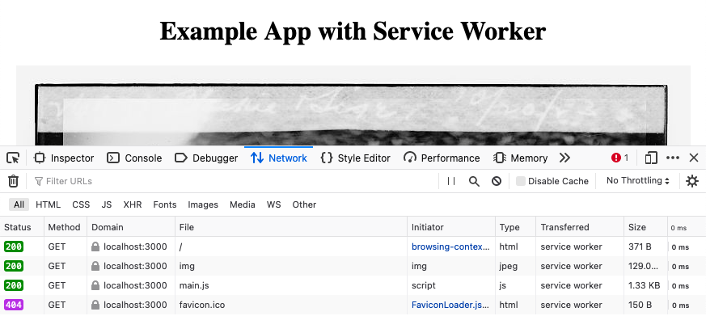

Service workers are JavaScript workers that sit between a website or web page and a network. JavaScript service workers give you immense control in developing offline experiences for your web applications, as well as features like push notifications and background sync. This guide introduces the key concepts behind service workers and how they can be used. Then, it provides the steps for setting up your own service worker.

## What Are Service Workers?

Service workers are event-driven JavaScript workers capable of intercepting navigation and resource requests and caching resources. In contrast to comparable tools, service workers provide far more granular control, making them adaptable, and appropriate for a wide range of use cases. Since service workers run on a separate thread, they do not block your main JavaScript application code.

Service workers are generally leveraged in three main areas. The following subsections deal with each of these areas to give you an idea of what service workers have to offer. Since service workers offer a high degree of control and adaptability, many more possible uses are being found for them. The prospects look good for service workers to dramatically alter how we think of a web application's offline experience.

### Offline Experience

Service workers can be used to craft offline experiences for web applications. They are exceptional in this regard because they give you low-level granular control over intercepting and manipulating requests and caching resources.

A typical scenario has service workers intercepting fetch requests when the browser is unable to connect to a network. From there, service workers can be arranged to provide a rich offline experience using cached resources.

Theoretically, an API for caching web content already exists in AppCache. So why would you want to use service workers instead? While AppCache's API can make the caching process easy, it makes an array of assumptions about how the cache may be used. AppCache's ease of use made it difficult for developers to deviate from the assumed path without possibly breaking their applications. With service workers, by contrast, you can decide precisely how to manage requests, and caching.

To get started using service workers for crafting offline experiences, take a look at the section below, [Example Service Worker](/docs/guides/what-are-javascript-service-workers/#example-service-worker), for more details. You may also want to explore the [Caching Strategies](https://serviceworke.rs/caching-strategies.html) section of Mozilla's Service Worker Cookbook.

### Push Notifications

Services workers also come with push notification functionality. You can, of course, achieve push notifications without service workers. However, service workers have the special ability to provide notifications even while the user is not on the associated web page or website. While service worker push notifications can help provide information related to cached content, they can also be useful generally. Sending push notifications even when a user navigates away from the website makes service worker provided push notifications especially useful.

To learn more about service workers push notification capabilities, check out the [Web Push](https://serviceworke.rs/web-push.html) section of Mozilla's Service Worker Cookbook.

### Background Sync

Because service workers aim at improved offline experiences, they also come with a background sync API. This feature allows web content to be synchronized without interrupting the user's experience. For instance, form data can be held for background syncing if the user submits a form while on an unstable connection. The service worker can then sync the form data with the server in the background and only do so once the connection has stabilized. Like with push notifications, service workers' background sync capability can operate even when the user is no longer on the web page/website.

You can explore the ideas behind service worker background sync through the [specifications and examples](https://github.com/WICG/background-sync) maintained by the Web Incubator Community Group.

## Example Service Worker

In this section, you can follow along to implement your own service worker. The implementation is based on the [Cache and update](https://serviceworke.rs/strategy-cache-and-update.html) example provided in Mozilla's Service Worker Cookbook.

This service worker caches content from a web server and intercepts requests to get content from the cache by default. The page's content loads quickly as a result, even when the network connection is slow or unstable.

### Before You Begin

1.  If you have not already done so, create a Linode account and Compute Instance. See our [Getting Started with Linode](/docs/products/platform/get-started/) and [Creating a Compute Instance](/docs/products/compute/compute-instances/guides/create/) guides.

1.  Follow our [Setting Up and Securing a Compute Instance](/docs/products/compute/compute-instances/guides/set-up-and-secure/) guide to update your system. You may also wish to set the timezone, configure your hostname, create a limited user account, and harden SSH access.


This guide is written for non-root users. Commands that require elevated privileges are prefixed with `sudo`. If you are not familiar with the `sudo` command, see the [Linux Users and Groups](/docs/guides/linux-users-and-groups/) guide.


### Install Node.js

1. Install Node.js. This example uses the Node.js and the Express JS framework to set up both a static file server and a simple web service.

    On Debian and Ubuntu distributions, use the following commands:

        curl -fsSL https://deb.nodesource.com/setup_15.x | sudo -E bash -
        sudo apt install nodejs

    On CentOS, use the following commands:

        curl -fsSL https://rpm.nodesource.com/setup_15.x | sudo -E bash -
        sudo yum install nodejs

1. Set NPM to use the latest version of Node.js.

        sudo npm install npm@latest -g

### Download Images

The server in this example dynamically serves some cachable content — in this case, a series of images — to demonstrate the service worker's capabilities.

1. Download a collection of images. For this guide, ten images are selected from the Library of Congress's [collection of free-to-use cat images](https://www.loc.gov/free-to-use/cats/). You can download one of these images with the example command, replacing the URL below with the URL for one of the images you select.

        wget https://tile.loc.gov/storage-services/service/pnp/jpd/02700/02798v.jpg -O imgs/cat-1.jpg

    Be sure to increment the `1` with each image you download. The remaining sections assume you have downloaded ten images using the above naming convention — i.e., `cat-1.jpg`, `cat-2.jpg`, etc.

    To do this quickly, you can create the example script to download ten images from the Library of Congress source listed above. Place the shell script in your project directory, and edit the file to change `example-user` to your username on the server.

    
#!/bin/sh

wget=/usr/bin/wget

TARGET_DIRECTORY="/home/example-user/service-worker-example/imgs"

mkdir -p "${TARGET_DIRECTORY}"

$wget "https://tile.loc.gov/storage-services/service/pnp/jpd/02700/02798v.jpg" -O "${TARGET_DIRECTORY}/cat-1.jpg"
$wget "https://tile.loc.gov/storage-services/service/pnp/pga/07100/07149v.jpg" -O "${TARGET_DIRECTORY}/cat-2.jpg"
$wget "https://tile.loc.gov/storage-services/service/pnp/cph/3c00000/3c00000/3c00100/3c00170v.jpg" -O "${TARGET_DIRECTORY}/cat-3.jpg"
$wget "https://tile.loc.gov/storage-services/service/pnp/ppmsca/51500/51533v.jpg" -O "${TARGET_DIRECTORY}/cat-4.jpg"
$wget "https://tile.loc.gov/storage-services/service/pnp/hec/21500/21589v.jpg" -O "${TARGET_DIRECTORY}/cat-5.jpg"
$wget "https://tile.loc.gov/storage-services/service/pnp/npcc/09700/09707v.jpg" -O "${TARGET_DIRECTORY}/cat-6.jpg"
$wget "https://tile.loc.gov/storage-services/service/pnp/ds/04000/04037v.jpg" -O "${TARGET_DIRECTORY}/cat-7.jpg"
$wget "https://tile.loc.gov/storage-services/service/pnp/cph/3b00000/3b06000/3b06200/3b06249r.jpg" -O "${TARGET_DIRECTORY}/cat-8.jpg"
$wget "https://tile.loc.gov/storage-services/service/pnp/pga/05000/05046v.jpg" -O "${TARGET_DIRECTORY}/cat-9.jpg"
$wget "https://tile.loc.gov/storage-services/service/pnp/cph/3c20000/3c20000/3c20400/3c20459v.jpg" -O "${TARGET_DIRECTORY}/cat-10.jpg"
    

    Then, execute the following commands:

        mkdir imgs
        chmod +x download_cat_images.sh
        ./download_cat_images.sh

### Create the Server

1. Make a directory for the project. In this example, `service-worker-example` is used as the project and directory name. The example project here lives in the current user's home directory.

        mkdir ~/service-worker-example

1. Change into the project directory. For the remaining steps in this example, the guide assumes you are in `service-worker-example` directory.

        cd ~/service-worker-example

1. Create the following JavaScript file. This creates an Express JS server that serves both the cat images and the application's static files.

    
// Import and initialize Express JS, setting it to use port **3000**.
const express = require('express');
const app = express();
const port = 3000;

// Set up variables for the images.
const CACHE_TIMEOUT = 10000;
const MAX_IMAGES = 10;
var imageNumber = 0;
var lastUpdate = 0;

// Serve the static files.
app.use(express.static('public'));

// Serve an image which expires after `CACHE_TIMEOUT`.
app.get('/img', (req, res) => {
    serveImage(res, CACHE_TIMEOUT);
})

function serveImage(res, timeout) {
    var now = Date.now();

    if (now - lastUpdate > timeout) {
      imageNumber = (imageNumber + 1) % MAX_IMAGES;
      lastUpdate = Date.now();
    }

    var imageName = 'cat-' + (imageNumber + 1) + '.jpg';
    res.sendFile(imageName, { root: './imgs/'});
}

// Have Express JS begin listening for requests.
app.listen(port, () => {
    console.log(`Server listening at http://localhost:${port}`);
})
    

1. Initialize the Node.js project.

        npm init

    You are prompted to enter information related to your project. You can simply press **Enter** for each prompt to use the default values.

1. Install Express JS for your project.

        npm install express --save

### Create the Web Page

1. Make a new `public` directory. The server is configured to serve everything in this directory as static content, so it can be used for the web page's HTML and client-side JavaScript files.

        mkdir public

1. Create an `index.html` file with the following contents. Store the file in the `public` directory.

    
<!doctype html>

<html>
<head>
    <meta charset="utf-8">
    <meta name="viewport" content="width=device-width, initial-scale=1">
    <title>Example App with Service Worker</title>
</head>
<body style="text-align: center;">
    <h1>Example App with Service Worker</h1>
    
    
</body>
</html>
    

1. Create a `main.js` file in the `public` directory. Add the contents shown below, which have this file register and initialize the service worker.

    
navigator.serviceWorker.register('service-worker.js', {scope: "./"});
navigator.serviceWorker.ready.then(console.log('Service Worker is running.'));
    

### Create the Service Worker

1. Create a `service-worker.js` file, also in the `public` directory, and add the following contents. You can look through the comments in the code to get an idea of what each part is doing.

    
const CACHE = 'cat-image-cache'

// Add content to the cache when the service worker is installed.
self.addEventListener('install', (event) => {
    event.waitUntil(caches.open(CACHE).then((cache) => {
        cache.addAll(['./img']);
    }));
});

// Intercept fetch requests.
self.addEventListener('fetch', (event) => {
    // First, satisfy the request with cached content.
    event.respondWith(fetchFromCache(event.request));

    // Then, update the cache.
    event.waitUntil(updateCache(event.request));
});

// Fetches the requested content from the cache.
function fetchFromCache(request) {
    return caches.match(request).then((matching) => {
        if (matching) {
            return matching;
        }

        return fetch(request);
    });
}

// Updates the cache from the server.
function updateCache(request) {
    return caches.open(CACHE).then((cache) => {
        return fetch(request).then((response) => {
            return cache.put(request, response.clone()).then(() => {
                return response;
            });
        });
    });
}
    

### Run the Application

You are all set to run your website with a service worker.

1. Start up the Express JS server.

        node server.js

    Express serves the application on `localhost:3000`. To visit the application remotely, you can use an SSH tunnel.

    - On Windows, you can use the PuTTY tool to set up your SSH tunnel. Follow the appropriate section of the [Using SSH on Windows](/docs/guides/connect-to-server-over-ssh-on-windows/#ssh-tunnelingport-forwarding) guide, replacing the example port number there with **3000**.
    - On OS X or Linux, use the following command to set up the SSH tunnel. Replace `example-user` with your username on the application server and `192.0.2.0` with the server's IP address.

            ssh -L3000:localhost:3000 example-user@192.0.2.0

1. Now you can visit the application in your browser by navigating to `localhost:3000`.

1. Refresh the page, and use the browser developer tools to see that the requests are being satisfied by the service worker.

- To bring up the developer tools in Chrome, press the **Ctrl**, **Shift**, and **C** keys simultaneously. If you are using Mac OS, press the **Command**, **Option**, and **C** keys simultaneously instead.

- To bring up the developer tools in Firefox, press the **F12** key.

    Under the **Network** tab, you should see that requests are being handled by the service worker. Both Chrome and Firefox also provide a dedicated section in the **Application** tab where you can view the service worker's status.

    Here is an example of the **Network** developer tools display in Firefox.

    

## Conclusion

As noted above, service workers have a great potential for changing how you approach designing offline experiences for web applications. It is a good time to start learning about them and trying out unique and compelling ways to use them.

After reading this guide, if you want to dive deeper into the world of service workers, take a look at the resources linked below. They can take you further on the concepts behind service workers and what those mean for their possible uses. Mozilla's Service Worker Cookbook is especially helpful in getting you started with a variety of example projects.
