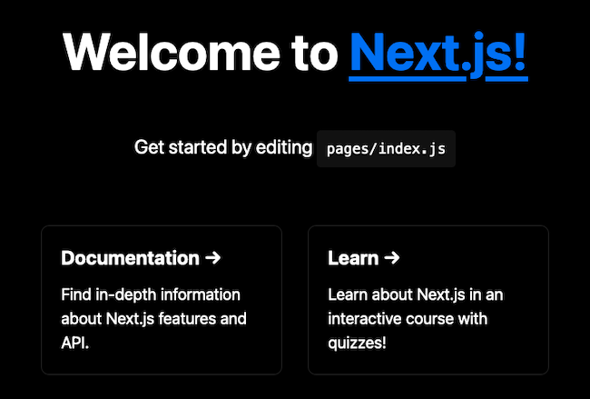
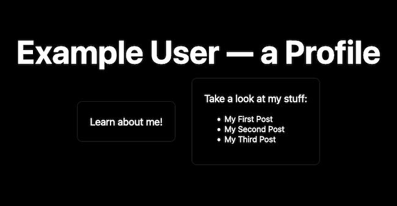
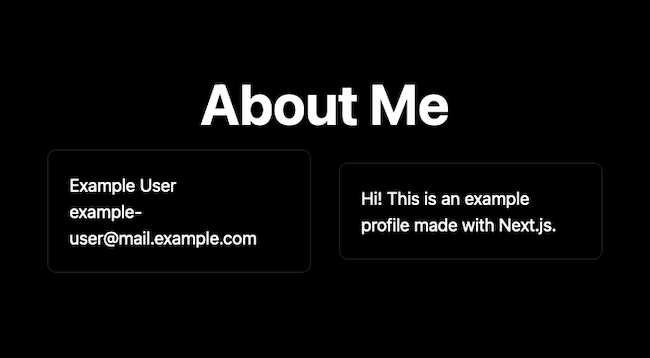
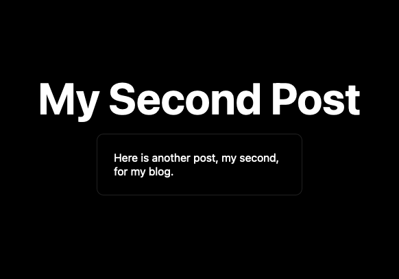

Next.js is a framework built on top of React, extending React with a range of features for modern web development. Next gives your React applications ready access to features like routing and server-side rendering. At the same time, Next.js brings optimizations and base structures to enhance the experience both for developers and end users.

Whether you are looking to develop a static website or a full-stack application, Next.js comes with the flexibility and features to handle it.

Learn all that you need to get started with Next.js in this tutorial. It explains what Next.js is and walks you through creating an example application, showing off a range of the features Next has to offer.

## Before You Begin

1. Familiarize yourself with our [Getting Started with Linode](/docs/products/platform/get-started/) guide and complete the steps for setting your Linode's hostname and timezone.

1. This guide uses `sudo` wherever possible. Complete the sections of our [How to Secure Your Server](/docs/products/compute/compute-instances/guides/set-up-and-secure/) guide to create a standard user account, harden SSH access, and remove unnecessary network services.

1. Update your system.

    - On **Debian** and **Ubuntu**, use the following command:

            sudo apt update && sudo apt upgrade

    - On **AlmaLinux**, **CentOS** (8 or later), or **Fedora**, use the following command:

            sudo dnf upgrade


The steps in this guide are written for non-root users. Commands that require elevated privileges are prefixed with `sudo`. If you’re not familiar with the `sudo` command, see the [Linux Users and Groups](/docs/guides/linux-users-and-groups/) guide.


## What Is Next.js?

[Next.js](https://nextjs.org/) is actually a React framework. On top of React, Next adds numerous features for building your application. Next implements some additional structure, adds some optimizations, and includes application features like routing, and data fetching.

Like with React, Next allows you to create something as simple as a static website or something more complicated like a dynamic web frontend. However, Next.js comes complete with the features needed to implement application routes and server-side rendering. With Next, you can actually create a full-stack application right out of the box.

### Next.js vs React

What are the differences between Next.js and React?

React is a JavaScript library for creating user interfaces. That is fairly broad, and React is consequently highly adaptable and can be extended widely.

Next.js is one of those ways. Next operates on top of React, extending the base React library with a set of features for efficiently developing web applications.

The closer comparison to Next.js is actually the [Create React App](https://github.com/facebook/create-react-app) framework. **Create React App** is the official tool for creating React application templates. It gives you a quick way to set up a React project with many of the features modern web developers expect.

So how does Next.js stand up against Create React App? Following are the key differences:

- Next.js uses server-side rendering by default. This makes for a faster user experience and better SEO performance because content is pre-rendered as HTML by the server before being loaded in the browser.

    Create React App can enable server-side rendering, but that feature is not included, and doing so can be a difficult configuration task.

- Next.js keeps to React's ethos of being flexible and unopinionated. The design of Next leaves just about everything available for configuration. Thus, for those drawn to React for its adaptability, Next maintains the appeal.

    Create React App, on the other hand, is designed to be highly opinionated. Its goal is to restrict the vast options of React, focusing them into a tight set of features to bootstrap the development process.

- Create React App focuses on bootstrapping for the development of single-page applications. It does not include routing, and instead focuses on the key features and structures to help developers quickly and efficiently construct single-page applications.

    Next.js includes routing as one of its additional features and thus can readily build multi-page application right from the start. Again, Next prioritizes adaptability, meaning that by default it is ready to develop everything from single-page applications to complex, full-stack applications.

## How to Create a Next.js App

One of the best ways to get to know Next.js is by building an application with it. In this section, the guide walks you through creating a basic Next application to familiarize you with its main parts.

Throughout, the guide also attempts to show off some of the main features that Next.js boasts. The goal is to not only get started with Next.js, but to also have a practical demonstration of some of what sets it apart.

Next.js also offers first-class support for TypeScript. This guide only covers a JavaScript approach to Next, but you can learn about using Next with TypeScript in our [Building a Next.js App with TypeScript](/docs/guides/next-js-with-typescript) guide.

### Set Up a Next.js App

Next.js has its own script for boostrapping a project template. This guide makes use of this script to get the project base in place.

For that and to help with managing application dependencies, the guide uses NPM. You can find a link in the steps below to help you install NPM if you do not already have it.

1. Follow our guide on how to [Install and Use the Node Package Manager (NPM) on Linux](/docs/guides/install-and-use-npm-on-linux/). NPM handles the project's dependencies and runs the Next.js frontend.

1. Create a base Next.js project using `create-next-app`. The example below also names the new project — `example-app` — in the same command.

    The commands below ask whether you want to create a TypeScript project. Click **Yes** to install the necessary types/dependencies and create the new project using the project name in the current user's home directory.

        cd ~/
        npx create-next-app example-app

    
✔ Would you like to use ESLint with this project? … No / Yes
    

1. Change into the project's directory. The rest of this guide assumes you are still in this directory unless otherwise noted.

        cd example-app

The above command gives you a ready-to-run Next.js with a "Welcome" application. Just run the following command to start up the Next.js development server:

    npm run dev

Now in a web browser navigate to port `3000` on your server. For instance, assuming your server's remote IP address is `192.0.2.0`, navigate to `http://192.0.2.0:3000`.


To access this remotely, you may first need to open the port in your system's firewall. You can learn about how to do that in one of the guides linked below, depending on your system's Linux distribution.

- For **Debian** and **Ubuntu**, refer to our guide on [How to Configure a Firewall with UFW](/docs/guides/configure-firewall-with-ufw/).

- For **AlmaLinux**, **CentOS**, and **Fedora**, refer to our guide on [Enabling and Configuring FirewallD on CentOS](/docs/guides/introduction-to-firewalld-on-centos/)


### Build the Next.js App

For a thorough introduction to Next.js, you can follow with an example application designed to demonstrate some of the most noteworthy features of Next.

Over the course of this section of the guide, pieces of a complete Next.js application come together. Each part of this section also demonstrates a feature of Next for developing powerful modern web applications.

Follow along with the in-code comments throughout to get in-depth explanations of how everything works. And take a look at the start of the next section, on running the application, to get links to completed code for the example project.

#### Page Routes

Next renders pages from `.js` files stored in the `pages` subdirectory. This makes page routing straightforward while still leaving plenty of room for adaptability.

The base page, for the `/` route, loads from the `index.js` file. Each other file in the `pages` subdirectory defines a new route. For instance, in this example, an `about.js` file is added to the subdirectory. This creates a `/about` route on the Next.js application.

The `index.js` file here provides a simple homepage with a link to the about page. The `index.js` gets expanded further on to add some additional functionality.


// Import the JSX and style modules to be used for the page. The CSS file
// here is the default one for a base Next project.
import Head from 'next/head'
import styles from '../styles/Home.module.css'

// Create the function for the home page.
export default function Home() {
  // Render the page template.
  return (
    

      <Head>
        <title>My Next.js Profile Page</title>
        <meta name='description' content='Generated by create next app' />
        <link rel='icon' href='/favicon.ico' />
      </Head>

      <main className={styles.main}>
        <h1 className={styles.title}>
          Example User — a Profile
        </h1>

        

          

            
Learn <a href='/about'>about me</a>!

          

        

      </main>

      <footer className={styles.footer}>
        Created for a Linode guide
      </footer>
    

  )
}


The `about.js` page itself provides a simple page template with a brief bio for the website author.


// Import the JSX and style modules to be used for the page.
import Head from 'next/head'
import styles from '../styles/Home.module.css'

// Create the function for the about page.
export default function About() {
  // Render the page template.
  return (
    

      <Head>
        <title>My Next.js Profile Page | About Me</title>
        <meta name="description" content="Generated by create next app" />
        <link rel="icon" href="/favicon.ico" />
      </Head>

      <main className={styles.main}>
        <h1 className={styles.title}>
          About Me
        </h1>

        

          

            
Example User

            
example-user@mail.example.com

          

          

            
Hi! This is an example profile made with Next.js.

          

        

      </main>
    

  );
}


#### API Routes

This example application gets some blog functionality in the next steps. To support that and make the application more dynamic, it uses an API to fetch data for the blog posts.

Next considers any files in the `pages/api` subdirectory as representing API endpoints. Like with page routing, this structure creates routes that are both straightforward to work with and adaptable.

To start, the application creates a subdirectory of `pages/api/posts` to house all of its endpoints related to blog posts. It then maps the `api/posts` endpoint by adding an `index.js` file to the subdirectory.


// Import the stub data to be served by the API.
import { postsData } from '../../../data/posts';

// Create a handler to serve API requests to the endpoint.
export default function handler(req, res) {
  res.status(200).json(postsData);
}


For this guide, the data source is just another JavaScript file, `posts.js`. This file is stored in the `data` subdirectory.


export const postsData = [
  { slug: 'first-post', name: 'My First Post', content: 'This is the first post on my blog.' },
  { slug: 'second-post', name: 'My Second Post', content: 'Here is another post, my second, for my blog.' },
  { slug: 'third-post', name: 'My Third Post', content: 'Yet another, the third post made on my blog.' }
]


Finally, the home page, `index.js`, can be modified to fetch blog post data from this API endpoint. To keep things brief, the snippets below show only the modified portions of the file and their contexts.


// [...]

// Import the React modules for state variables and effects.
import {useState, useEffect} from 'react'

// Create the function for the home page.
export default function Home({ postsInfo }) {
  // Initialize the state variable and its set function.
  const [postsData, setPostsData] = useState([]);

  // Have the page load post data from the API on page load.
  useEffect(() => {
    fetch('/api/posts')
      .then((res) => res.json())
      .then((data) => setPostsData(data))
  }, [])

// [...]
        

          

            
Learn <a href='/about'>about me</a>!

          

          

            
Take a look at my stuff:

            <ul>
              {postsData.map((postData) => (
                <li key={postData.slug}>
                  <a href={ '/posts/' + postData.slug }>{postData.name}</a>
                </li>
              ))}
            </ul>
          

        

// [...]


#### Dynamic Routes

To render each blog post, the application can make use of Next.js's dynamic routes. These allow you to specify a placeholder parameter for routes, allowing for page slugs or "pretty" URLs.

Next accomplishes this by using square brackets as part of the filename for the page template. For instance, this example application uses `pages/posts/[postSlug].js`. That `postSlug` then becomes the parameter by which an individual post is identified.

The contents of the file itself form a template that gets used for rendering each blog post. The particular contents for each post can be fetched from the API based on the given `postSlug`.


// Import the JSX and style modules to be used for the page.
import Head from 'next/head'
import styles from '../../styles/Home.module.css'

// Create the function for the post page template. Load in the postData
// object from the page props.
export default function Post({ postData }) {
  return (
    

      <Head>
        <title>My Next.js Profile Page | {postData.name}</title>
        <meta name="description" content="Generated by create next app" />
        <link rel="icon" href="/favicon.ico" />
      </Head>

      <main className={styles.main}>
        <h1 className={styles.title}>
          {postData.name}
        </h1>

        

          

            {postData.content}
          

        

      </main>
    

  );
}

// Provide a list of possible paths for the route.
export async function getStaticPaths() {
  // Fetch posts from the API.
  const res = await fetch('http://localhost:3000/api/posts')
  const postsData = await res.json()

  // Generate an array of paths. Each object follows a specific format:
  //   { params: [routeId]: [possibleValue] }
  const paths = postsData.map((postData) => {
    return {
      params: {
        postSlug: postData.slug
      }
    }
  });

  // Return the array of paths; fallback=false has the app 404 for any paths
  // not in this list.
  return {
    paths,
    fallback: false
  }
}

// Load page propeties as part of server-side pre-rendering.
export async function getStaticProps({ params }) {
  // Fetch the page data from the API.
  const res = await fetch('http://localhost:3000/api/posts/' + params.postSlug);
  const postData = await res.json();

  // Return the fetched data in the props object.
  return {
    props: {
      postData
    }
  };
}


The two functions at the end of this file, `getStaticPaths` and `getStaticProps`, should be elaborated on. You can learn more about the `getStaticProps` function in the [server-side pre-rendering](/docs/guides/getting-started-next-js/#server-side-pre-rendering) section.

As part of its pre-rendering process, Next requires the `getStaticPaths` function for any dynamic routes. This function provides Next with an array of possible path IDs for the dynamic route.

In this application's case, the array consists of `postSlug` values as shown below:

    [
        {
            params: { postSlug: first-post }
        },
        {
            params: { postSlug: second-post }
        },
        {
            params: { postSlug: third-post }
        }
    ]

#### Dynamic API Routes

Similar dynamic routing can be used for API endpoints as well. You can see that the `[postSlug].js` file above already makes use of a dynamic API route in its `getStaticProps` function.

To create the dynamic endpoint used here, the application makes use of a `[postSlug].js` file in the `pages/api/posts` subdirectory. This file receives the dynamic portion of the path within the `res.query` object.

Otherwise, this file works much like the other API file defined earlier in this guide. However, the file also implements a switch for the request method, demonstrating how you could work with different request method on a given API route.


// Import the stub data to be served by the API.
import { postsData } from '../../../data/posts';

// Create a handler to serve API requests to the endpoint.
export default function handler(req, res) {
  // Extract the postSlug from the query portion of the URL.
  const requestedPostSlug = req.query.postSlug;

  // Provide cases for different kinds of request methods. Optional,
  // but provides a good template for scaling the API.
  switch (req.method) {
    case 'GET':
      // Start with a not-found object.
      let responsePostData = { slug: 'na', name: 'No Such Post', content: 'Error: No such post.' };

      // Search the post data for an object matching the query slug.
      // Overwrite the default object if a match is found.
      for (const i in postsData) {
        if (postsData[i].slug === requestedPostSlug) {
          responsePostData = postsData[i];
        }
      }

      // Provide the success response and matching object.
      res.status(200).json(responsePostData);
      break;
    default:
      // Presenting, the API only implements the GET method.
      res.status(404);
      break;
  }
}


#### Server-side Pre-rendering

Next.js employs two kinds of server-side pre-rendering, fitting different needs. You can learn more about the two options overall in the Next.js [documentation on pre-rendering](https://nextjs.org/docs/basic-features/pages#pre-rendering):

- **Static generation** renders page content at build time. The pre-rendered content gets reused with each request. This option provides the most efficient performance, and Next recommended it for most cases so long as your page data is available at build time.

    Static generation is implemented using the `getStaticProps` function, like you see with the `[postSlug].js` page above. You can learn more about this function and its use cases in the Next.js [getStaticProps documentation](https://nextjs.org/docs/basic-features/data-fetching/get-static-props).

- **Server-side rendering** renders page content at the time of each request. The contents do not get reused, and instead get re-rendered whenever a new request is made. This approach is less efficient, but it provides server-side rendering for any pages that need to fetch data at request time.

    Server-side rendering uses the `getServerSideProps` function, which can be implemented similarly to the `getStaticProps` function shown above. You can learn more about `getServerSideProps` and its use cases in the Next.js [getServerSideProps documentation](https://nextjs.org/docs/basic-features/data-fetching/get-server-side-props).

The examples used in this guide has all of the necessary post data at build time, so the `pages/posts/[postSlug].js` page uses the `getStaticProps` to implement static generation. You can refer to the `pages/posts/[postSlug].js` file's contents above for an example of how this function looks in action.

### Run the Next.js App

The steps explained in the sections above leaves you with a complete Next.js application. For further reference, you can find all of the files modified or created for this guide listed below. Each filename here is a link to the file itself, and the bullets represent the directory hierarchy. You can add these files to your base Next.js project to run the application shown in this guide:

- `data`
    - [`posts.js`](example-app/data/posts.js)
- `pages`
    - `api`
        - `posts`
            - [`[postSlug].js`](example-app/pages/api/posts/[postSlug].js)
            - [`index.js`](example-app/pages/api/posts/index.js)
    - `posts`
        - [`[postSlug].js`](example-app/pages/posts/[postSlug].js)
    - [`index.js`](example-app/pages/index.js)

Once everything is in place, you can run the Next.js application with the same command as used earlier to run the template application:

    npm run dev

Visiting the server's port `3000` again now shows the new Next.js application.

- The homepage of the new Next.js application looks like the following:

    

- Navigating to the `about` route displays the following page:

    

- Clicking on any of the blog post routes displays the following page:

    

#### Build the Next.js App

The above command runs the application on a development server. When you are ready to deploy your application to production, you should instead build the Next.js application using the following command and start it from there:

    npm run build
    npm run start

## Conclusion

With that, you have a thorough overview of Next.js and a host of its impressive features for modern web application development. You can keep learning more about Next.js from the links to the official documentation below.

You may also be interested in our other guide on Next.js. These include a guide on **Building a Next.js App with Typescript** and **How to Create a Next.js App with a Supabase Backend**, showing how to connect a Next.js application to Supabase for a lean and simplified backend.

Have more questions or want some help getting started? Feel free to reach out to our [Support](https://www.linode.com/support/) team.
