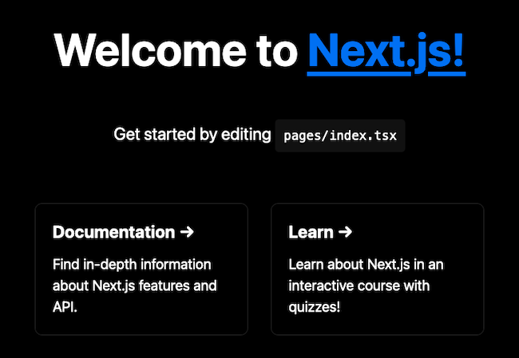
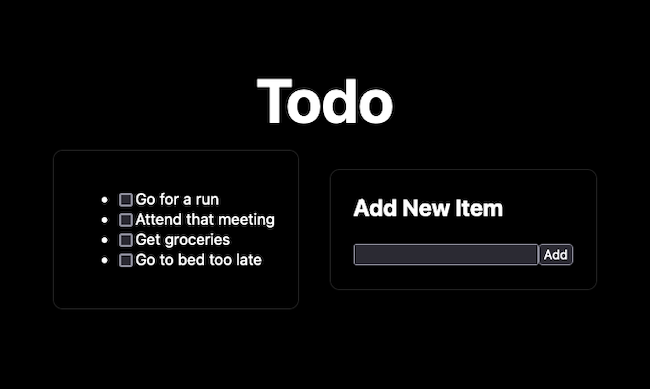
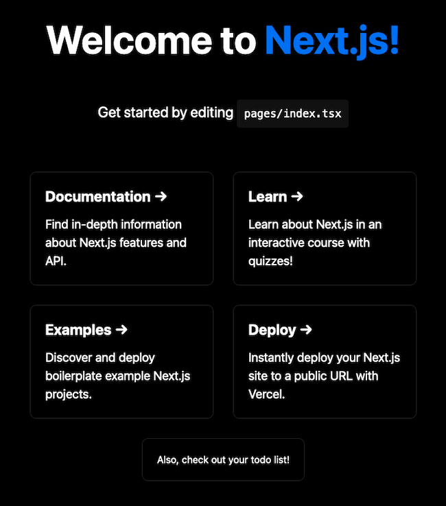

With Next.js, your React applications start with a rich structure and set of features. Built-in routing, server-side rendering, and among numerous other features, Next.js is a powerful framework built upon React to create production-ready applications.

On top of that, Next.js also offers first-class support for TypeScript. This means that you can easily start building efficient React applications with all of the advantages of a strongly-typed language like TypeScript.

It only takes a little configuration to get your Next.js project running with TypeScript. Learn how to do just that in this guide. See how to create a new Next.js project with TypeScript and how to convert an existing project to use TypeScript. Then follow along to see how you can put together the TypeScript code for your own Next application.

## Before You Begin

1. Familiarize yourself with our [Getting Started with Linode](/docs/products/platform/get-started/) guide and complete the steps for setting your Linode's hostname and timezone.

1. This guide uses `sudo` wherever possible. Complete the sections of our [How to Secure Your Server](/docs/products/compute/compute-instances/guides/set-up-and-secure/) guide to create a standard user account, harden SSH access, and remove unnecessary network services.

1. Update your system.

    - On **Debian** and **Ubuntu**, use the following command:

            sudo apt update && sudo apt upgrade

    - On **AlmaLinux**, **CentOS** (8 or later), or **Fedora**, use the following command:

            sudo dnf upgrade


The steps in this guide are written for non-root users. Commands that require elevated privileges are prefixed with `sudo`. If you’re not familiar with the `sudo` command, see the [Linux Users and Groups](/docs/guides/linux-users-and-groups/) guide.


## What Is Next.js?

[Next.js](https://nextjs.org/) is a "batteries included" React framework. Next extends on top of React by adding powerful features for building modern applications and implementing some additional structure and optimizations.

Next.js includes capabilities like routing, data fetching, and server-side rendering built in. Compare this to the sometimes arduous processes required to efficiently implement these features in a base React project.

And, like React, Next.js gives you the ability to create applications ranging from static, single-page applications to full-stack, dynamic websites.

Learn more about what Next.js has to offer and how it compares to base React in our [Getting Started with Next.js](/docs/guides/getting-started-next-js) guide.

### Why TypeScript?

[TypeScript](https://www.typescriptlang.org/) is a programming language designed and maintained by Microsoft. The TypeScript language is a superset of JavaScript, meaning that any valid JavaScript code can be run as TypeScript.

Where TypeScript stands out is its introduction of strong typing to JavaScript development. JavaScript does not in itself explicitly type variables, which allows for an exceptional degree of flexibility. However, it can also leave code ambiguous and more prone to runtime errors.

TypeScript, by introducing strong typing to JavaScript, can improve the development experience, and application consistency. The strong typing of TypeScript can facilitate catching errors sooner, like while coding rather than at code execution. And it can help to reduce runtime errors due to unexpected variable typing.

For many, this makes TypeScript a highly desirable alternative to base JavaScript. Ideally, adopting TypeScript can mean an improved developer experience and a more consistent user experience.

## How to Enable TypeScript on a Next.js Project

Next.js features first-class support for TypeScript. However, you do have to enable Next's TypeScript feature before it becomes available for your project.

There are two main ways of accomplishing this. You can find steps for both ways outlined in the sections that follow.

### Create a New Next.js Project with TypeScript

Next.js has its own starter script for bootstrapping a project template, `create-next-app`. The script has an option for initializing your project as a TypeScript project, making the process of starting Next with TypeScript straightforward.

For running the starter script and managing application dependencies, this guide uses NPM. You can find a link in the steps below to help you install NPM if you do not already have it.

1. Follow our guide on [How to Install and Use the Node Package Manager (NPM) on Linux](/docs/guides/install-and-use-npm-on-linux/). NPM handles the project's dependencies and runs the Next.js frontend.

1. Run the `create-next-app` script with `npx` (included with NPM), and add the `--typescript` or `--ts` flag to initialize the project with TypeScript instead of JavaScript. The example below also names the new project — `example-app` — in the same command.

    The commands below ask whether you want to create a TypeScript project. Click **Yes** to install the necessary types/dependencies and create the new project using the project name in the current user's home directory.

        cd ~/
        npx create-next-app --typescript example-app

    
✔ Would you like to use ESLint with this project? … No / Yes
    

The above command gives you a ready-to-run Next.js application built on TypeScript. ESLint is optional, but helps in surfacing errors or problems in application code.

Running the following command from the project's base directory starts up the "Welcome" application on the Next.js development server:

    cd ~/example-app
    npm run dev

Now in a web browser navigate to port `3000` on your server. For instance, assuming your server's remote IP address is `192.0.2.0`, navigate to `http://192.0.2.0:3000`.


To access this remotely, you may first need to open the port in your system's firewall. You can learn about how to do that in one of the guides linked below, depending on your system's Linux distribution.

- For **Debian** and **Ubuntu**, refer to our guide on [How to Configure a Firewall with UFW](/docs/guides/configure-firewall-with-ufw/).

- For **AlmaLinux**, **CentOS**, and **Fedora**, refer to our guide on [Enabling and Configuring FirewallD on CentOS](/docs/guides/introduction-to-firewalld-on-centos/).


### Convert an Existing Next.js Project to TypeScript

You can enable TypeScript on an existing Next.js project by adding a `tsconfig.json` file to the project's base directory. The file does not even need to have any contents in addition to turning on TypeScript for your project.

So, for instance, if your project's base directory is `~/example-app`, you can have the project use TypeScript with:

    touch ~/example-app/tsconfig.json

Any existing JavaScript code in your project still works just as it would have before. But now your project can also support `.ts` and `.tsx` files for TypeScript functionality.

This also means that you can manage the pace for converting your project to TypeScript. You can, for instance, add the above `tsconfig.json` file to a full JavaScript-based Next project. Then, you can progressively convert one page after another from JavaScript to TypeScript, moving at your own pace. Instead of having to convert the entire codebase all at once.

## How to Create a Next.js App with TypeScript

You should see our **Getting Started with Next.js** guide for more thorough coverage of how to create an application with Next.js. It walks you through the most significant features in Next for creating efficient and powerful applications.

This guide, instead, focuses on demonstrating, and getting you started with TypeScript usage in Next while not retracing too much covered in our other guide.

### Set Up the Next.js Project

To perform the initial setup for the project, follow the steps in the [Create a New Next.js Project with TypeScript](/docs/guides/next-js-with-typescript/#create-a-new-nextjs-project-with-typescript) section above.

You have a base Next project with TypeScript after that, and the rest of these steps build on that.

### Programming the App with TypeScript

The goal for this example is to extend the default "Welcome" application with a "todo list" page. To that end, follow along with these next steps. They create a new file for the `/todo` route and give that file contents for the page's logic and display. Then, the steps finally have you integrate a link to the todo page in the default `index.tsx` page.

The steps below and the ones in the next section assume that you are in the base directory of your Next.js.

1. Create a new file, `todo.tsx`, in the `pages` subdirectory. Doing so automatically creates a new route for the application at `/todo`. Then, give the file the contents shown here. Follow along with the in-code comments to get explanations of what each part of the code is doing.

    
// Import the page and head components as well as the default style sheet.
import type { NextPage } from 'next'
import Head from 'next/head'
import styles from '../styles/Home.module.css'

// Import the React module for handling state variables.
import { useState } from 'react'

// Create the page, using the NextPage type.
const Todo: NextPage = () => {
  // Initialize the state variables and their set functions.
  // This example uses a static initial todo list, but you could instead have
  // the application load the todo list from a database on page load using
  // the useEffect module from React.
  const [todoList, setTodoList] = useState([
    'Go for a run',
    'Attend that meeting',
    'Get groceries',
    'Go to bed too late'
  ])
  const [newTodoItem, setNewTodoItem] = useState('')

  // Provide a function to add a new item to the todo list.
  const addTodoItem: void = () => {
    // Create a new version of the list with the new item added, then set the
    // todo list state variable to the new list.
    const newTodoList = todoList.concat(newTodoItem)
    setTodoList(newTodoList)
  }

  // Provide a function to mark a todo item completed, removing the item from
  // the list.
  const markTodoItem: void = (markedItem, isMarked) => {
    // Make sure that the user has marked the item for removal.
    if (isMarked) {
      // Create a new version of the list filtering out the marked item, then
      // set the todo list state variable to the new list.
      const newTodoList = todoList.filter(e => e !== markedItem)
      setTodoList(newTodoList)
    }
  }

  // Define the page's HTML structure. This includes a mapping function to
  // loop through the todo list items and create an li element for each with
  // the todo item text and a checkbox for marking it complete.
  return (
    

      <Head>
        <title>Example Next App | Todo List</title>
        <meta name="description" content="Generated by create next app" />
        <link rel="icon" href="/favicon.ico" />
      </Head>

      <main className={styles.main}>
        <h1 className={styles.title}>
          Todo
        </h1>
        

          

            <ul>
              {todoList.map((todoItem) => (
                <li key={todoItem}>
                  <input type="checkbox" onChange={ (e) => markTodoItem(todoItem, e.target.checked) } />
                  {todoItem}
                </li>
              ))}
            </ul>
          

          

            <h2>Add New Item</h2>
              

                <input type="text" onChange={ (e) => { setNewTodoItem(e.target.value) } } />
                <button onClick={addTodoItem}>Add</button>
              

          

        

      </main>
    

  )
}

// Export the page for processing and display.
export default Todo
    

1. Open the existing `pages/index.tsx` file. This file has the contents for the default welcome page. To provide a link to the `todo` list page, add the following just above the closing `</main>` tag.

    
    // [...]
        

          

            Also, check out your <a href="/todo">todo list</a>!
          

        

    // [...]
    

And that is it — your Next application with its todo list is ready to run. Follow along through the next section to run the application and see the results.

### Run the Next.js App

Running the application now uses the same steps as [shown earlier](/docs/guides/next-js-with-typescript/#create-a-new-nextjs-project-with-typescript) when running the default application. Execute the following command from the project's base directory to run your Next.js application on a development server:

    npm run dev

Now you can visit the application again in your web browser, only this time navigating to the `/todo` route. For instance, if your server's IP address is `192.0.2.0`, navigate to: `http://192.0.2.0:3000/todo`.

You can also navigate back to the home page (`http://192.0.2.0:3000`) and see the added element with a link to the todo list.

## Conclusion

That covers getting set up with TypeScript on Next.js. Should you want to start a new Next project with TypeScript or convert an existing project, this guide has walked through what you need. And you have a solid basis to start putting together your own Next.js application with TypeScript code.

To get a more thorough survey of Next and what it has to offer, take a look at our **Getting Started with Next.js** guide.

Have more questions or want some help getting started? Feel free to reach out to our [Support](https://www.linode.com/support/) team.
