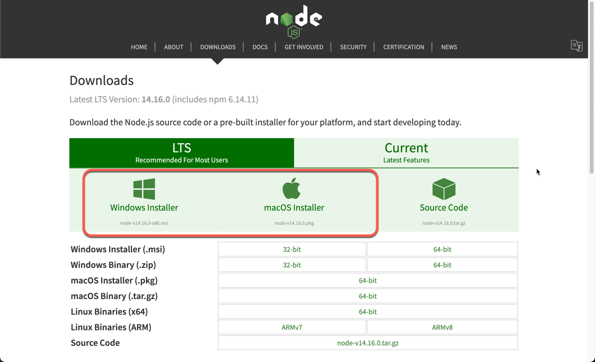

Node.js is a cross-platform runtime environment for server-side JavaScript applications. Node.js uses the V8 JavaScript engine and is very popular. It is regularly updated for security and improvements, and should be kept updated on your systems.

## Before You Begin

1.  This guide assumes you are already running Node.js on your Linode or local workstation and are updating the version. If you don't have it installed, see the [How to Install Node.js](/docs/guides/how-to-install-nodejs/) guide.

2.  Install NPM, which installs by default with Node.js.

3.  This guide assumes you are only updating your version of Node.js and aren't looking to run multiple versions. If you do, see the guide [How to Install and Use the Node Version Manager](/docs/guides/how-to-install-use-node-version-manager-nvm/).

4.  Update your Linode's system:
    sudo apt-get update && sudo apt-get upgrade

3.  Update your local workstation's system using the tools and package managers for the operating system.

5.  If you're using the installer to update, go to the Node.js downloads page to get the appropriate version. The most recent version of *long-term support* (LTS) is listed and you also have the option to choose a version in the *Current* section.


**Current** is for developers and development or testing environments that don't require the systems to be as stable or up and accessible. LTS is aimed at production environments that require stability and continued uptime. If you are unsure which you need, choose LTS.


## Updating the Node.js version using NPM

NPM is installed by default with Node.js and is the easiest way to update to any new version on Linux, macOS, or Windows when you do not need to use multiple versions.

1.  Open the Terminal on Linux or macOS. On Windows, launch the Windows PowerShell as an administrator. Search for it in the search bar and then either right-click or click on the arrow to the right and choose **Run as Administrator**.

2.  Enter the command `npm install -g n` to install the [`n`](https://www.npmjs.com/package/n?activeTab=readme) module, a Node.js version manager.

3.  Now that `n` is installed, enter `n stable` in the Terminal or PowerShell to install the stable version of Node.js
    -   You can also use `n latest` for the most recent version, or `n [version number]` if you have a specific version you need to install.

4.  Agree to any prompts that appears.

5.  When the installation is complete, check the version installed with `node -v`.

6.  Close the Terminal or PowerShell when finished.

## Updating the Node.js version using NVM

If you need to install NVM, see our guide [How to Install and Use the Node Version Manager](/docs/guides/how-to-install-use-node-version-manager-nvm/). It's a useful tool to have, especially in a development environment or if you have to use multiple versions of Node.js.

1.  Open the Terminal on Linux or macOS. On Windows, launch the Windows PowerShell as an administrator. Search for it in the search bar and then either right-click or click on the arrow to the right and choose **Run as Administrator**.

2.  If you only need the most recent stable version, enter the command `nvm ls stable`.
    -   If you need something other than the stable version:
        a. Enter the command `nvm ls` to check what version you have.
        d. Enter the command `nvm ls -remote` to see what versions are available. Note the one you need.
        c. Enter the command `nvm install [version number]`

3.  Agree to any prompts that appears.

5.  When the installation is complete, check the version installed with `nvm ls`.

6.  Close the Terminal or PowerShell when finished.

## Updating the Node.js version on macOS

### Using Homebrew

If you installed Node.js using Homebrew, then updating is easy.

1.  Open the Terminal.

2.  Enter the command `brew update` and agree to any prompts.

3.  Enter the command `brew upgrade node` and agree to any prompts.

4.  Quit the Terminal when finished.

### Using the Node.js Installer

1.  Open the installer from your Downloads folder and click **Continue**.

3.  If you agree with it, accept the license by clicking **Continue** and **Agree**.

4.  If you need to change the installation location, do so. Also, if you want to customize the installation, choose **Customize**. Linode recommends using the Standard Installation. Click **Continue**.

5.  The installation is finished. Click **Close** and macOS moves the installer to the Trash.

## Updating the Node.js version on Windows

### Using Chocolatey

Assuming you installed Chocolatey when originally installing Node.js, updating should move quickly. Otherwise, update using the following installer instructions.

1.  Launch the Windows PowerShell as an administrator. Search for it in the search bar and then either right-click or click on the arrow to the right and choose **Run as Administrator**.

2.  When the command prompt loads, enter the following command:

        choco upgrade nodejs.install

3.  Accept any prompts that requires permission.

4.  Close PowerShell when finished.

### Using the Node.js Installer

1.  Open the installer from your Downloads folder and click **Next**.

3.  If you agree with it, accept the license by checking the box next to *I accept the terms in the License Agreement* and click **Next**.

4.  If you need to change the installation location, do so now and click **Next**.

5.  Choose the packages to install Linode recommends all of them, which is the default. You are prompted to check a box to **Automatically install the necessary tools.** Do so and click **Next**.

6.  After installation is complete move the installer to the Recycle Bin.
