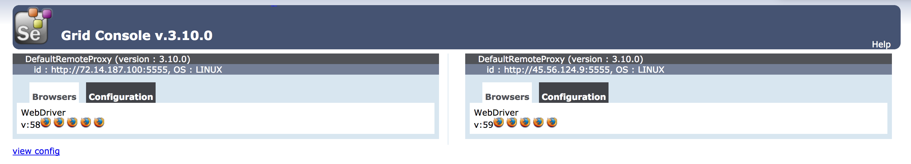

## What is Selenium Grid?

[Selenium](https://seleniumhq.github.io/selenium/docs/api/javascript/index.html) is a browser automation library with bindings for most common programming languages. It is most often used for testing web applications, but can also be used to automate any task that a web browser can perform. In contrast to similar tools such as Nightmare.js, Selenium can run tasks or tests on any version of any major browser. This can make it more complicated to get running, but allows you to test your application's behavior on exactly the platforms that users are likely to need.

For many applications, the Selenium standalone server is sufficient. However, Selenium can also be configured as a grid, with multiple nodes communicating with a central hub. The nodes and hub can be run on the same computer or server, or can be located on separate Linodes. Selenium Grid offers two main benefits:

- Selenium runs on Java and is compatible with all major operating systems. This makes it possible to set up a grid consisting of servers (or virtual machines) running Linux, OSX, and Windows. A test suite can then be run against the grid, with each test run on multiple browsers and operating systems. The hub will delegate each test to a node that has the requested capability (e.g. sending a Safari test to a node with OSX and the Safari webdriver).

- For larger projects, running a lengthy test suite in series can be time consuming. By running the test suite across a grid consisting of multiple servers, it is possible to distribute the tests across multiple nodes and significantly increase the performance of the testing process.

This guide shows how to set up a simple Selenium grid consisting of a hub and two nodes, all on  separate Linodes. A simple test script will then be used to demonstrate running tests against different versions of Firefox.

## Prepare Grid Linodes

Install Java and other dependencies on each Linode that will be part of the Selenium grid. This guide uses three Linodes for this purpose, but you can also run all of the nodes from the same Linode if you prefer. Throughout this guide, these Linodes will be referred to as `hub`, `node-1`, and `node-2`.

### Install Java



### Install Dependencies

When running tests with Selenium, each grid node can only run tests on browsers that have been installed on that node. Each browser also requires a separate executable webdriver. For this example, install Geckodriver and different versions of Firefox on `node-1` and `node-2`.

1.  Check the latest release of Geckodriver on the [releases](https://github.com/mozilla/geckodriver/releases) page and download it to `node-1` and `node-2`:

        wget https://github.com/mozilla/geckodriver/releases/download/v0.19.1/geckodriver-v0.19.1-linux64.tar.gz

2.  Extract the archive and move the executable to a location in your PATH:

        tar -xvf geckodriver-v0.19.1-linux64.tar.gz
        sudo mv geckodriver /usr/local/bin/

3.  On `node-1`, install the latest stable version of Firefox:

        sudo apt install firefox

4.  On `node-2`, install the Firefox developer edition:

        sudo add-apt-repository ppa:ubuntu-mozilla-daily/firefox-aurora
        sudo apt update && sudo apt install firefox

5.  Check and record the version numbers to use when running tests:

    **node-1:**

        firefox --version

    
Mozilla Firefox 58.0.2


    **node-2:**

        firefox --version

    
Mozilla Firefox 59.0


### Download Selenium

Selenium provides a single `.jar` file that can be used to run a standalone server, hub, or node. Check the latest release at the [Selenium downloads page](https://www.seleniumhq.org/download/) and download the file to each Linode using `wget`:

    wget http://selenium-release.storage.googleapis.com/3.10/selenium-server-standalone-3.10.0.jar

### Start Grid Hub

1.  On the `hub` Linode, start the hub by running the Selenium server with `-role` set to `hub`:

        java -jar selenium-server-standalone-3.10.0.jar -role hub

2.  The resulting output will give you URLs to use for registering nodes and connecting to the hub. Copy these URLs for later use:

    
21:27:51.470 INFO [GridLauncherV3.launch] - Selenium build info: version: '3.10.0', revision: '176b4a9'
21:27:51.475 INFO [GridLauncherV3$2.launch] - Launching Selenium Grid hub on port 4444
2018-03-06 21:27:52.248:INFO::main: Logging initialized @1166ms to org.seleniumhq.jetty9.util.log.StdErrLog
21:27:52.446 INFO [Hub.start] - Selenium Grid hub is up and running
21:27:52.447 INFO [Hub.start] - Nodes should register to http://69.164.211.42:4444/grid/register/
21:27:52.448 INFO [Hub.start] - Clients should connect to http://69.164.211.42:4444/wd/hub


### Configure Grid Nodes

1.  On `node-1` and `node-2`, create a node configuration file `config.json` and add the following content. Replace the `hub` address with the public IP of the `hub` Linode, and replace the `version` with the version of Firefox installed on the respective nodes. If you are putting the grid and nodes on the same Linode, replace the IP address with `http://localhost:4444`:

    
{
  "capabilities":
  [
    {
      "browserName": "firefox",
      "marionette": true,
      "maxInstances": 5,
      "seleniumProtocol": "WebDriver",
      "version": "58.0.2"
    }
  ],
  "proxy": "org.openqa.grid.selenium.proxy.DefaultRemoteProxy",
  "maxSession": 5,
  "port": 5555,
  "register": true,
  "registerCycle": 5000,
  "hub": "http://192.0.2.0:4444",
  "nodeStatusCheckTimeout": 5000,
  "nodePolling": 5000,
  "role": "node",
  "unregisterIfStillDownAfter": 60000,
  "downPollingLimit": 2,
  "debug": false,
  "servlets" : [],
  "withoutServlets": [],
  "custom": {}
}


2.  Connect each node to the hub:

        java -jar selenium-server-standalone-3.10.0.jar -role node -nodeConfig config.json

3.  You should see output similar to the following, indicating that your nodes have been successfully registered to the hub:

    
21:33:22.856 INFO - Selenium Server is up and running on port 5555
21:33:22.857 INFO - Selenium Grid node is up and ready to register to the hub
21:33:22.895 INFO - Starting auto registration thread. Will try to register every 5000 ms.
21:33:22.896 INFO - Registering the node to the hub: http://69.164.211.42:4444/grid/register
21:33:23.064 INFO - Updating the node configuration from the hub
21:33:23.178 INFO - The node is registered to the hub and ready to use


  You can also check the output from the hub itself:

    
21:27:53.849 INFO [DefaultGridRegistry.add] - Registered a node http://198.58.122.154:5555
21:27:56.445 WARN [BaseRemoteProxy.<init>] - Max instance not specified. Using default = 1 instance
21:27:56.450 INFO [DefaultGridRegistry.add] - Registered a node http://50.116.22.93:5555
21:27:56.743 WARN [BaseRemoteProxy.<init>] - Max instance not specified. Using default = 1 instance


4.  Navigate to `http://192.0.2.0:4444/grid/console` in a web browser (replace `192.0.2.0` with the public IP address of your `hub` Linode) to see a console listing your available nodes.

    

    The console should show that each node is configured to use a different version of Firefox.

## Prepare Local Test Environment

In this example, the test script will be run from your local development machine. It will connect to the remote grid and execute the tests from there. If you do not have an available development machine, use a separate Linode.

### Install Node.js and NPM

This guide uses the NPM `selenium-webdriver` package, which contains Node.js bindings for Selenium.



### Create an Example Test Script

This script tests the Linode Docs home page.

1.  Create a directory for the test suite:

        mkdir test-selenium && cd test-selenium

2.  Initialize a Node.js app within the directory:

        npm init

    Accept the default values when prompted.

3.  Install NPM packages:

        npm install --save selenium-webdriver

4.  Create `test.js` and add the following script. Replace `192.0.2.0` on Line 11 with the IP address of `hub`:

    
const {Builder, By, Capabilities, Key, until} = require('selenium-webdriver');
let firefox = require('selenium-webdriver/firefox');

const VERSIONS = ['58.0.2','59.0'];

function buildDrivers(versions) {
    let drivers = [];
    for (let version of versions) {
        driver = new Builder().forBrowser('firefox')
                                      .withCapabilities(Capabilities.firefox().setBrowserVersion(version))
                                      .usingServer('http://192.0.2.0:4444/wd/hub')
                                      .setFirefoxOptions(
                                            new firefox.Options().headless())
                                      .build();
        drivers.push(driver);
    }
    console.log('built drivers for ' + versions);
    return drivers;
}

async function example(driver) {
       try {
        await driver.get('http://www.linode.com/docs');
        await driver.findElement(By.name('q')).sendKeys('nginx', Key.RETURN);
        let el = driver.findElement(By.linkText('How to Configure nginx'));
        await driver.wait(until.elementIsVisible(el), 1000);
        await el.click();
        title = await driver.getTitle();
      } finally {
        await driver.quit();
      }
};

async function main() {
    const drivers = await buildDrivers(VERSIONS);

    for (let driver of drivers) {
    example(driver);
  };
}

main();


5.  Save the test script, then run it:

        node test.js

    If successful, the script will search for NGINX in the Linode docs library, visit one of the results pages, and check that the page title matches the link text. It will print out the page title as well:

    
built drivers for 58.0.2,59.0
How to Configure nginx
How to Configure nginx


6.  The driver requested two versions of Firefox to run on the two nodes. `test.js` runs the driver asynchronously across two nodes in order to run the `getTitle` method across two browser versions.

By creating different drivers for each combination of platform, browser, and version you want to test, you can specify which node or nodes should be used to run each test. If more than one node has the requested capabilities, Selenium will choose one of the nodes at random. In this way it is possible to run a large, cross-browser test suite in much less time than it would take to run the tests one at a time.
