## Introduction

Twitter bots are a great way to practice using an API and develop some coding skills along the way. You can usually get the bot going for under 100 lines of code, so it’s especially good for beginners. This tutorial shows how to make a Twitter bot that tweets a link to a video game soundtrack once a week (pulled randomly from an array of YouTube links). It also responds to other Twitter users who ask for a link with a random link from the same array.

The tutorial demonstrates how to use Node.js, a framework for JavaScript, and a few packages from *npm*, the Node Package Manager, to have your bot tweeting in no time. As well, the guide shows how to set up a GitHub repository for your bot's code. At the end of the guide, we demonstrate how to host the bot on a Linode cloud instance.

## Before You Begin

### Create Twitter, GitHub, and Linode Accounts

To follow along with this guide, accounts with the following websites are required:

- [Twitter](https://twitter.com/home): If you already have a Twitter account, you can use that existing account to access the [Twitter Developer portal](https://developer.twitter.com/en). You may instead want to create a new, separate Twitter account to use for this tutorial. If you sign up for a new account, Twitter requires a unique email address and phone number to register the account.

    This is where you decide what you want your account to be named and what it does automatically. The tutorial names the bot [@SNESSoundtracks](https://twitter.com/snessoundtracks), but your Twitter account name needs to be unique.

- [GitHub](https://github.com/): This tutorial shows how to record the bot's application code in a repository on GitHub. If you already have a GitHub account, you can use that one. If you do not, create a new one now.

- [Linode](https://www.linode.com): At the end of the tutorial, the Node.js app is installed and run on a Linode instance. If you already have a Linode account, you can use that one. If you do not, create a new one now. For new accounts, there is a **Sign Up** link at the bottom of this tutorial that offers a free credit.

### Install Software on your Workstation

The following software is needed on your workstation to complete the tutorial:

- **A plain-text editor**. [Visual Studio Code](https://code.visualstudio.com/) (abbreviated *VS Code*) is a recommended desktop text editor, but any other plain-text editor can be used as well. VS Code also includes a [built-in terminal](https://code.visualstudio.com/docs/editor/integrated-terminal).

- **Git**: The Git command line software, or [GitHub Desktop](https://desktop.github.com/).

    These tools are used to download a copy of the GitHub repository that is created in this guide. The GitHub Desktop software can be more user-friendly for beginners, but you might prefer to work out of the command line. Instructions for using both are provided in this tutorial.

    To install the command line software, follow our [How to Install Git on Linux, Mac or Windows](/docs/guides/how-to-install-git-on-linux-mac-and-windows/) guide. Then, follow the [Configure Git](/docs/guides/how-to-configure-git/#configure-git) section of our [Getting Started with Git](/docs/guides/how-to-configure-git/) guide. When doing this, you don't need to set the `core.editor` option, but it is important to set your username and email for Git.

- **[Node.js](https://nodejs.org/en/) and the [Node Package Manager](https://www.npmjs.com/) (*npm*)**, which are used to initialize a new npm package for the Twitter bot.

    There are a number of different ways to install Node.js and npm. Our [How to Install Node.js](/docs/guides/how-to-install-nodejs/) guide outlines some of these options. For this tutorial, we recommend using the *Node Version Manager* (*nvm*), which can manage multiple versions of Node.js and npm. Follow the next [Install Node.js and npm via the Node Version Manager](#install-nodejs-and-npm-via-the-node-version-manager) section for instructions.

### Install Node.js and npm via the Node Version Manager

The original [nvm](https://github.com/nvm-sh/nvm) software project is used on **Unix, Linux, and macOS**:

1. Follow the [Installing and Configuring NVM](/docs/guides/how-to-install-use-node-version-manager-nvm/#installing-and-configuring-nvm) section of our [How to Install and Use the Node Version Manager](/docs/guides/how-to-install-use-node-version-manager-nvm/) guide to install nvm.

1. Run this command from your terminal. This installs the latest version of Node.js and npm:

        nvm install --lts

A separate [nvm-windows](https://github.com/coreybutler/nvm-windows) project was created for native installation on **Windows**:

1. Follow the [instructions in the project's README](https://github.com/coreybutler/nvm-windows#installation--upgrades) to install nvm-windows.

1. Run this command from your terminal. This installs the latest version of Node.js and npm:

        nvm install latest

## Apply for Access to the Twitter Developer Portal

Twitter's developer portal is where you register your new account to be able to use the Twitter API. This is an important step because it unlocks the account's ability to tweet by using the API with code instead of manually tweeting. You know, the whole point of a bot?

Follow these steps to register for developer access:

1. Head to the [developer page](https://developer.twitter.com/en). Once there you’ll see a link near the profile picture on the top right that says **Apply**.

1. Click the **Apply for a developer account** button on the page that appears:

    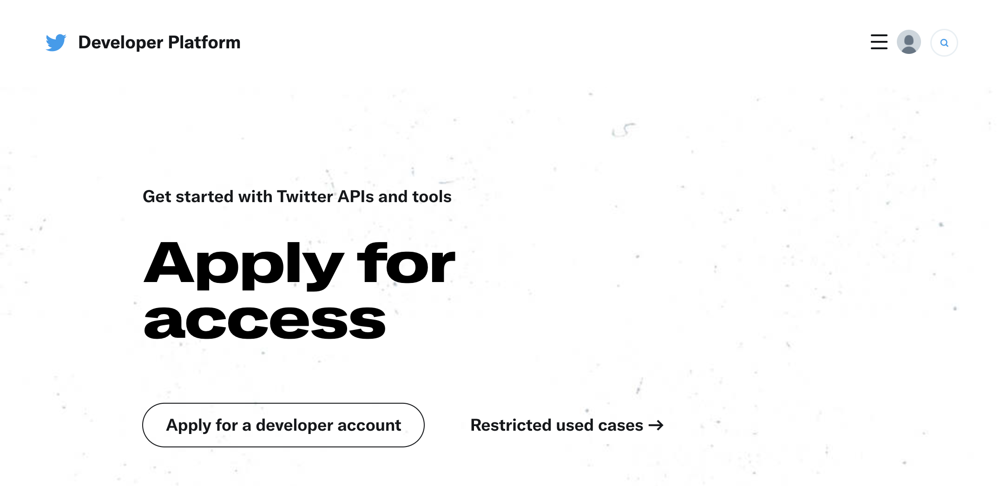

1. If you are not already signed in, Twitter prompts you to sign in to your account.

1. Twitter first asks what your intended use for the developer account is. For this tutorial, we have chosen the **Hobbyist** option, followed by the **Making a bot** option.

    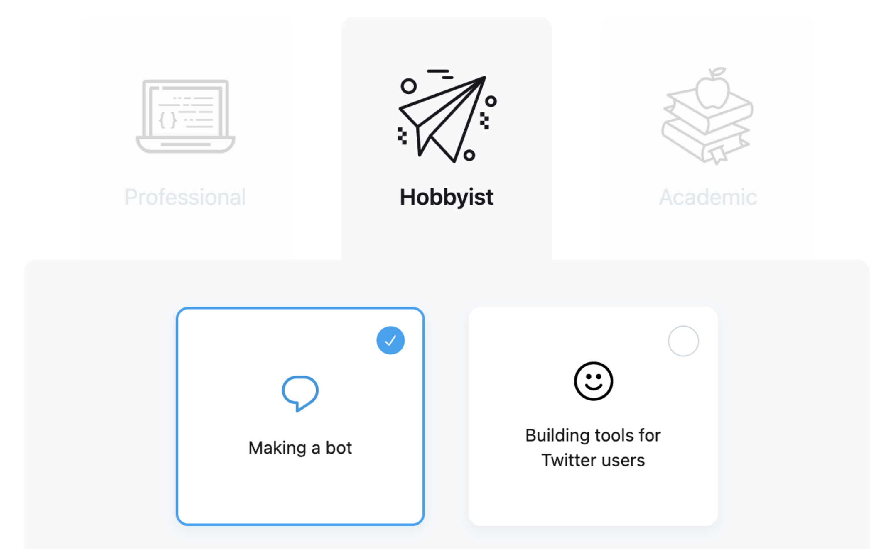

1. Complete the remaining questions in the **Basic info**, **Indended use**, **Review**, and **Terms** screens. The **Indended use** screen asks you for more detail about your application. For this tutorial, these are the answers that were entered for each prompt:

    - **In your words**: Let Twitter know that you’re applying for developer access as a hobby, and it’s just for learning to code and practicing a bot.

    - **Are you planning to analyze Twitter data?**: No

    - **Will your app use Tweet, Retweet, Like, Follow, or Direct Message functionality?**: Yes. In the description, let Twitter know that your bot responds to users that @ mention it, and that it also periodically sends out Tweets on its own. The bot tweets and respond to Tweets with links to video game soundtracks on YouTube.

    - **Do you plan to display Tweets or aggregate data about Twitter content outside Twitter?**: No

    - **Will your product, service, or analysis make Twitter content or derived information available to a government entity?**: No

1. Because you're not giving information to the government or consuming streaming data for analytical purposes, the application should be more straightforward. Follow the instructions on screen until you have an authenticated developer account.

A later section in this guide shows how to create an app within the Twitter developer portal and fill out the descriptions for it.

## Create and Clone a GitHub Repository

As mentioned in the Before You Begin section, this tutorial records the code for the Twitter bot in a Git repository. Specifically, we first create a new repository on GitHub.com and then pull it down to your workstation. By doing this, we can populate the repository with some helpful files, like a .gitignore and a README:

1. Visit GitHub.com, then follow the [Create a repository](https://docs.github.com/en/get-started/quickstart/create-a-repo#create-a-repository) section in GitHub's official [Create a repo](https://docs.github.com/en/get-started/quickstart/) document. When creating the repository, make these selections:

    - You can name the repository whatever you would like, but later code examples in the tutorial assume it is named `snes-soundtracks`.

    - The repository can be public or private. If you make it private, *and if you also want to use the Git command line tools*, then you need to authenticate with GitHub inside your terminal. This authentication requires a few extra steps, and these steps are outlined in the note below. For a simpler experience, it's recommended to make the repository public.

        
To authenticate with Github inside the terminal, see the [Authenticating with the command line](https://docs.github.com/en/github/authenticating-to-github/keeping-your-account-and-data-secure/about-authentication-to-github#authenticating-with-the-command-line) section of GitHub's [About authentication to GitHub](https://docs.github.com/en/github/authenticating-to-github/keeping-your-account-and-data-secure/about-authentication-to-github) document.

Specifically, [personal access tokens](https://docs.github.com/en/github/authenticating-to-github/keeping-your-account-and-data-secure/creating-a-personal-access-token) are the recommended method of authenticating for this tutorial. [Working with public keys](https://docs.github.com/en/github/authenticating-to-github/connecting-to-github-with-ssh/generating-a-new-ssh-key-and-adding-it-to-the-ssh-agent) is not demonstrated.


    - Enable the README file toggle.

    - Choose a license. [choosealicense.com](https://choosealicense.com/) has helpful recommendations for which license to use. This tutorial recommends the MIT License.

    - Enable the `.gitignore` toggle and choose **Node** from the available options.

        
A Git repository's `.gitignore` file allows you to specify certain files or file types that should not be checked into source control. Node.js projects feature some of these files. GitHub's `.gitignore` template for Node.js sets up some appropriate default files to exclude. For more information about `.gitignore` file options, see [this document from git-scm.com](https://git-scm.com/docs/gitignore).


1. After you finish the create repository form, the new repository appears in your browser. From this page, download a copy of the repository to your workstation:

    - **To use GitHub Desktop**, follow GitHub's [Cloning a repository from GitHub to GitHub Desktop](https://docs.github.com/en/desktop/contributing-and-collaborating-using-github-desktop/adding-and-cloning-repositories/cloning-a-repository-from-github-to-github-desktop) document. Here's an example screenshot of where the **Open with GitHub Desktop** option is in your repository:

        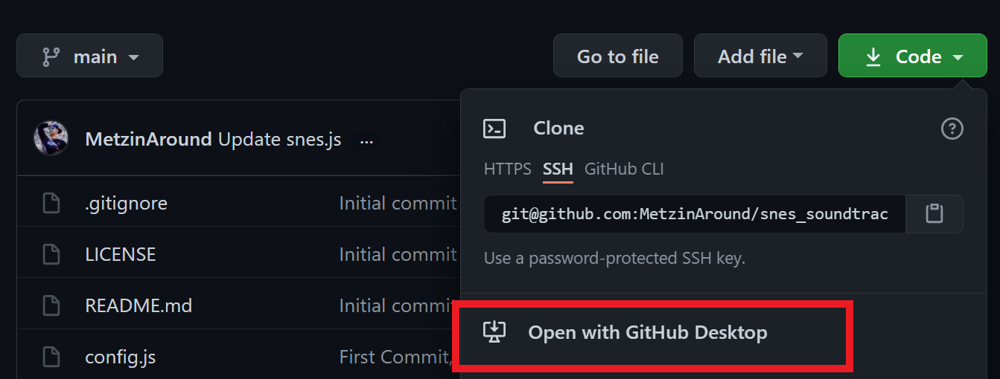

    - **To use the command line**, run the `git clone` command in your terminal as follows:

            git clone https://github.com/your-github-username/snes-soundtracks.git

        Before running the command, be sure to substitute your own GitHub username in for `your-github-username`. If you chose a different name for your repository, substitute that in for `snes-soundtracks`.

        
If you created a private repository, remember to set up a [personal access token](https://docs.github.com/en/github/authenticating-to-github/keeping-your-account-and-data-secure/creating-a-personal-access-token) for GitHub. When referencing a private repository, the above `git clone` command prompts for a GitHub username and password. You should enter the *personal access token* (**not** your normal GitHub password) when prompted for the password.


At this point, your source control is present on both your machine and on GitHub.

## Create an App in the Twitter Developer Portal

After your developer account has been registered, you can create an app within the developer portal. When you create the app, Twitter creates a set of keys that your Node.js project uses to authenticate with the service. This section shows how to create your Twitter app and where to store the app's keys.

1. Create a file named `.env` inside your code repository on your workstation. Paste the following snippet into the file.

    
consumer_key=
consumer_secret=
access_token=
access_token_secret=


    Later in this section, the keys that are provided by the Twitter developer portal are recorded in this file. Your `.env` file serves as your one source of truth for these keys. The `.gitignore` for your project excludes the `.env` file from source control, so you won’t accidentally upload your keys to GitHub.

    
In a later section, a Node.js module named `dotenv` is used by your application code to read the secret keys in the `.env` file.


1. Return to the [Twitter developer portal dashboard](https://developer.twitter.com/en/portal/dashboard) in your browser.

1. Click the **Create Project** button.

    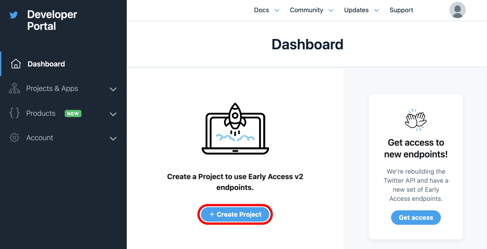

    Twitter's developer portal has two concepts that are used to manage your access to the Twitter API: *projects* and *apps*. A project contains an app. For earlier versions of the Twitter API, standalone apps were created, and projects were not required. A project and corresponding app are both required to access the v2 Twitter API, which this tutorial uses.

    
Review Twitter's [Developer Apps](https://developer.twitter.com/en/docs/apps/overview) documentation for more information about projects and apps.


1. Complete the forms that appear:

    - **Name your Project**: The name of your project needs to be unique.

    - **Which bests describes you?**: Choose **Making a bot**.

    - **Describe your new Project**: Enter a brief description of the bot's abilities: periodically tweeting links to video game soundtracks on YouTube, and responding to users that @ mention the bot.

    - **Add your App**: You may see a screen that looks like the following, which asks you to pick an app to add to the new project:

        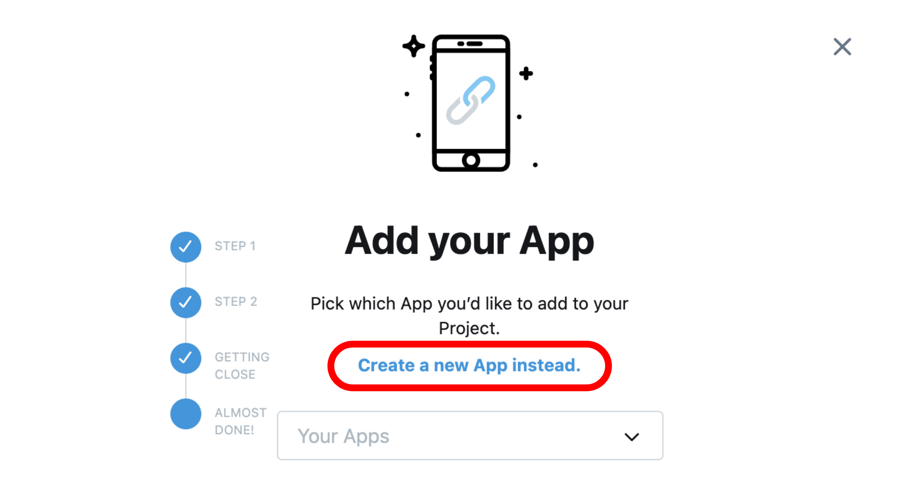

        Because you don't have any apps yet, the dropdown menu on this page is empty. Click the **Create new App instead** button above the dropdown menu.
        A text field appears that allows you to enter an app name. Enter a unique name in this field.

        
You may not see the dropdown menu, and the text field might appear right away instead.


        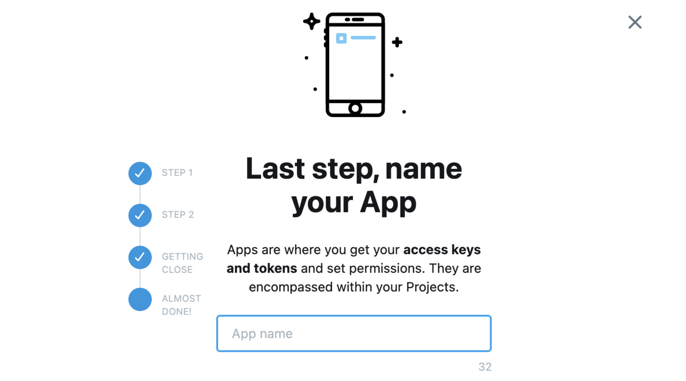

1. After completing the forms, a page with secret keys appears:

    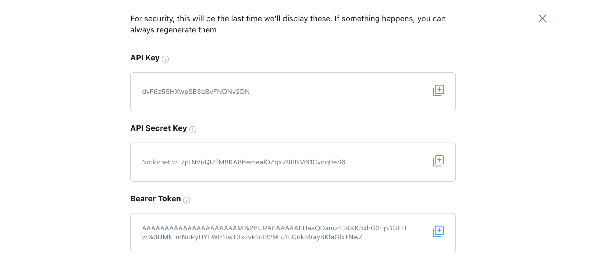

1. Copy and paste the keys into your `.env` file as follows:

    - Copy the **API Key** and paste it at the end of the `consumer_key=` line. No extra spaces or quotes should be added. For example, if your API Key was `dvF6z55HXwpSE3qBVFNONV2DN`, then the line would be written like `consumer_key=dvF6z55HXwpSE3qBVFNONV2DN`.

    - Copy the **API Secret Key** and paste it at the end of the `consumer_secret=` line. As with the previous line, do not add extra spaces or quotes.

    
This tutorial does not need the Bearer Token, but you can record that somewhere outside of your project if you'd like to. It can also be regenerated from inside the developer portal later if you don't record it.


1. Close the dialog that displays the secret keys. The developer portal should now look like this:

    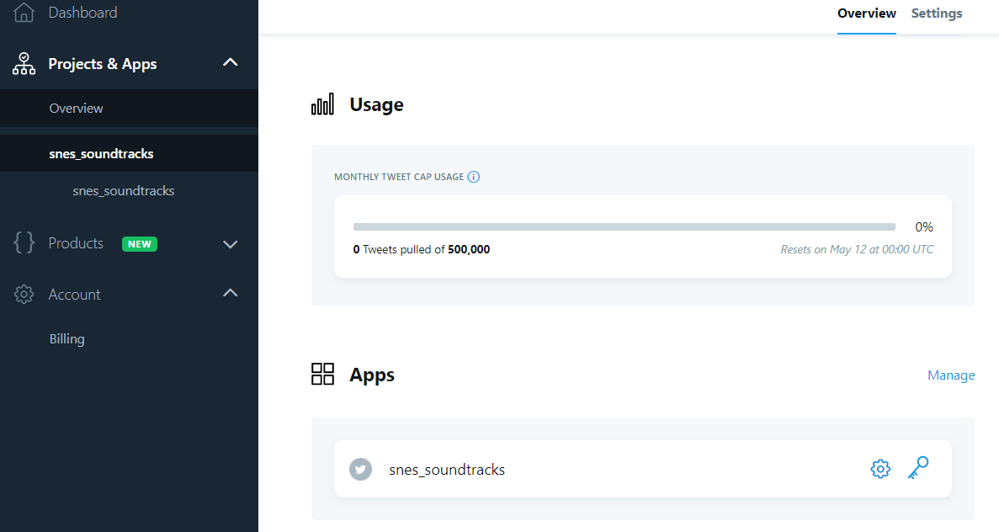

### Give your Twitter App Read and Write Permissions

By default, the app that you created has Read Only permissions. Apps that are set to Read Only are not able to create Tweets, which is the primary function of the bot in this tutorial. With Read and Write permissions, your bot is able to create Tweets. Follow these instructions to give your bot Read and Write permissions:

1. Navigate to the app (not the project) in the Twitter developer portal. The app is listed under the project in the sidebar navigation of the developer portal.

1. Scroll down to the **App permissions** heading. This section should display your app as **Read Only**. Click on the **Edit** button in this section.

    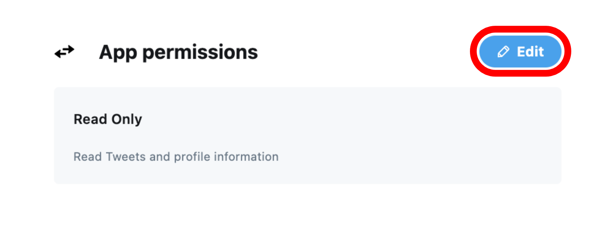

1. In the form that appears, choose the **Read and Write** option and then click **Save**.

1. Navigate to the **Keys and Tokens** tab at the top of the page.

1. Scroll down to the **Access Token and Secret** pane. Click the **Generate keys** button for the access token and secret.

1. A dialog appears that displays secret keys. Copy and paste the keys into your `.env` file as follows:

    - Copy the **Access Token** and paste it at the end of the `access_token=` line in your `.env` file, with no extra spaces or quotes.

    - Copy the **Access Token Secret** and paste it at the end of the `access_token_secret=` line in your `.env` file, with no extra spaces or quotes.

1. Dismiss the dialog.

## Initialize the Node Project and Install npm Dependencies

Right now, your local repository contains four files: your `.env` secrets, a `.gitignore`, a `README.md`, and a `LICENSE` file. It does not have any Node.js project files yet. To initialize your Node.js project:

1. Navigate to your local code repository in your terminal:

        cd snes-soundtracks

    
If you are using VS Code's built-in terminal and have your code repository folder open, then you do not need to run this `cd` command. This is because VS Code's terminal automatically starts inside the folder for your editor's workspace.


1. Run npm's `init` command:

        npm init -y

    The following output appears:

    
npm init -y
Wrote to /home/username/snes-soundtracks/package.json:

{
  "name": "snes-soundtracks",
  "version": "1.0.0",
  "description": "",
  "main": "index.js",
  "scripts": {
    "test": "echo \"Error: no test specified\" && exit 1"
  },
  "repository": {
    "type": "git",
    "url": "git+https://github.com/username/snes-soundtracks.git"
  },
  "keywords": [],
  "author": "",
  "license": "ISC",
  "bugs": {
    "url": "https://github.com/username/snes-soundtracks/issues"
  },
  "homepage": "https://github.com/username/snes-soundtracks#readme"
}


    This output shows the contents of a new `package.json` file that was created by the `npm init` command. The `package.json` file contains metadata about your Node.js project. For more information about this file, see the [What is the file `package.json`](https://nodejs.org/en/knowledge/getting-started/npm/what-is-the-file-package-json/) article in the official Node.js documentation, and the [`package.json` reference](https://docs.npmjs.com/cli/v7/configuring-npm/package-json) in the npm documentation.

1. The application code for your bot relies on a few different dependencies from npm. To install these dependencies, enter these commands in your terminal while still inside the code repository:

        npm install node
        npm install node-schedule
        npm install twit
        npm install dotenv

    These dependencies provide everything needed to have a functional Twitter bot:

    - [node](https://www.npmjs.com/package/node): Installing the `node` package provides a local Node.js binary inside your project folder. This is installed locally so that the project doesn't depend on your system-wide version of Node.js. This makes your project more portable, because other systems that you install the project on may run a different version of Node.js.

    - [node-schedule](https://www.npmjs.com/package/node-schedule): This package is used by the tutorial to schedule new Tweets periodically.

    - [dotenv](https://www.npmjs.com/package/dotenv): This package is used to read the secrets that you stored in your `.env` file.

    - [twit](https://www.npmjs.com/package/twit): This is a Twitter API client for Node.js.

    At this point, the contents of your directory should now look like the following:

        ls -a

    
.                 .env              .gitignore        README.md         package-lock.json
..                .git              LICENSE           node_modules      package.json


### Update Scripts in package.json

Before we can start adding our code, we should adjust a few parts of the `package.json` file in the new Node.js project.

1. Currently, the `scripts` section of your `package.json` should look like:

    
  "scripts": {
    "test": "echo \"Error: no test specified\" && exit 1"
  },


    The `scripts` section contains commands that can be used to invoke your project. For more information about this part of `package.json`, see the [`scripts` reference](https://docs.npmjs.com/cli/v7/using-npm/scripts) in the npm documentation.

    Open this file and modify the `scripts` section to look like the following snippet:

    
  "scripts": {
    "test": "snes.js",
    "start": "node ./snes.js",
    "develop": "NODE_ENV=develop node snes.js"
  },


1. Scroll to the `main` section of the same file. This should currently look like:

    
  "main": "index.js",


    Update this line so that it instead says:

    
  "main": "snes.js",


1. These changes reference an `snes.js` file that doesn’t exist yet. Create an empty placeholder file with this name in your code repository. The [`touch` command](https://en.wikipedia.org/wiki/Touch_(command)) can do this from your terminal (or you can just create the empty file with your text editor):

        touch snes.js

    
The `snes.js` file can be named whatever you want it to be. If you want to use a different name, just make sure that your `package.json` is updated to reference that new name.


## Add the Twitter Bot Application Code

Your Node.js project is now prepared for the Twitter bot application code. Open `snes.js` in your text editor, then proceed through the next sections:

### Reading .env Secrets, Setting Up node-schedule, and Specifying YouTube Videos

Copy and paste this snippet into `snes.js`. After copying and pasting, **make sure to replace the `@SnesSoundtracks` string on line 3 with your own Twitter username**:


console.log("SNES Soundtracks booting up");

const twitterUsername = '@SnesSoundtracks';

//making sure npm run develop works
if (process.env.NODE_ENV === "develop") {
  require("dotenv").config();
};

//rules for node-schedule
var schedule = require("node-schedule");
var rule = new schedule.RecurrenceRule();
rule.dayOfWeek = 1,
rule.hour = 10;
rule.minute = 0;
rule.tz = "Etc/GMT+4";

//array to pull soundtracks from
var soundtrackArray = [
    "https://www.youtube.com/watch?v=85u34SUh05Y", // Legend of Zelda
    "https://www.youtube.com/watch?v=85u34SUh05Y", // Chrono Trigger
    "https://www.youtube.com/watch?v=UyNufyV3VCo", // Super Metroid
    "https://www.youtube.com/watch?v=Y2VJeZDejtc", // Final Fantasy VI
    "https://www.youtube.com/watch?v=wgUmFPnkoHU", // Super Mario World
    "https://www.youtube.com/watch?v=-QsysJwzod4", // Super Street Fighter II
    "https://www.youtube.com/watch?v=oRxgYC5zrV4", // Super Mario World 2: Yoshi's Island
    "https://www.youtube.com/watch?v=rJJk9Zk2h_U", // Super Mario Kart
    "https://www.youtube.com/watch?v=byIjMomjWkA", // Star Fox
    "https://www.youtube.com/watch?v=wpchBo75N68", // Super Mario RPG: Legend of the Seven Stars
  ];
var soundtrackArrayLength = soundtrackArray.length;


Here's what the code does:

- On line 1, the code logs a start up message to the console just so we know it’s running.

- On line 7, the dotenv module is included using [the built-in Node.js `require()` function](https://nodejs.org/en/knowledge/getting-started/what-is-require/). The dotenv module's [`config()` function](https://github.com/motdotla/dotenv#config) is used on the same line to read the values from your `.env` file. The values are placed in the [`process.env` Node.js property](https://nodejs.org/dist/latest-v8.x/docs/api/process.html#process_process_env). For example, the `consumer_key` secret can be accessed inside `process.env.consumer_key` within the code.

    The `if` statement on lines 6-8 ensures this only happens when the Node.js environment is set to `develop`. This is handled by the `"develop": "NODE_ENV=develop node snes.js"` line in the `scripts` section of your package.json file.

- On lines 11-15, we set up a few variables for the node-schedule package. These variables declare the day and time when the bot should periodically tweet. Specifically, the scheduled time is every Monday at 10 am Eastern Daylight Savings Time. A `RecurrenceRule` is created to facilitate this.

    
Documentation for this method of scheduling is found in the [Recurrence Rule Scheduling](https://github.com/node-schedule/node-schedule#recurrence-rule-scheduling) section of the node-schedule package's README. Creating the `RecurrenceRule` does not actually schedule the bot's tweeting function. This function is scheduled at the end of the bot's application code, in the [Scheduling Tweets](#scheduling-tweets) section.


- Lines 18-30 set up an array of soundtrack links for the bot to pull from at random.

### Authenticating with Twitter and Listening for Tweets

1. Append this snippet to the bottom of `snes.js`:

    
// ... append to bottom of file:

// Create a Twitter client object to connect to the Twitter API
var Twit = require('twit');

// Pulling keys from another file
var config = require('./config.js');
// Making a Twit object for connection to the API
var T = new Twit(config);

// Setting up a user stream
var stream = T.stream('statuses/filter', { track: twitterUsername });

// Now looking for Tweet events
// See: https://dev.Twitter.com/streaming/userstreams
stream.on('tweet', pressStart);


    We start using Twit in this section of code:

    - Line 4 includes the `twit` Twitter API client module.

    - Line 7 uses another `config.js` file to create a new configuration object. The `config.js` file is created in the next step of this section.

    - Line 9 uses [JavaScript's `new` operator](https://developer.mozilla.org/en-US/docs/Web/JavaScript/Reference/Operators/new) to create an instance of the Twitter API client. The configuration object from line 7 is passed to the *constructor function* for the new instance.

        This instance is stored in the variable `T`. From now on, when we want to use something from the `twit` module, we simply reference the `T.propertyName` syntax. This syntax allows us to access any property, field, or method we need from the API client's library.

    - Line 12 sets up a stream that monitors for Tweet mentions of your Twitter username from other Twitter users while the code is running.

    - Line 16 creates an event listener with the `stream.on` method. The `stream.on` method accepts two arguments:

        - A string parameter that represents the type of [event](https://github.com/ttezel/twit#event-tweet) that should be listened for.

        - Another function that handles the events from the stream. The function that handles the events is called `pressStart`. The `pressStart` function is defined in the next section of this tutorial.

1. In your code repository, make a file named `config.js` and paste this snippet into it:

    
module.exports = {
  consumer_key: process.env.consumer_key,
  consumer_secret: process.env.consumer_secret,
  access_token: process.env.access_token,
  access_token_secret: process.env.access_token_secret,
};


    This file exports an object that matches the configuration object accepted by the constructor function in the `twit` module. Specifically, `twit` expects a configuration object with the following form, as described in [the `twit` README on GitHub](https://github.com/ttezel/twit#var-t--new-twitconfig):

    ```
    {
        consumer_key:         '...',
        consumer_secret:      '...',
        access_token:         '...',
        access_token_secret:  '...'
    }
    ```

    In order to generate the configuration object, this file reads the values encoded in the `process.env` property by the dotenv module.

### Replying to Tweets

Append this snippet to the bottom of `snes.js`:


// ... append to bottom of file:

function pressStart(tweet) {

  var id = tweet.id_str;
  var text = tweet.text;
  var name = tweet.user.screen_name;

  let regex = /(please)/gi;


  let playerOne = text.match(regex) || [];
  let playerTwo = playerOne.length > 0;

  //this helps with errors, so you can see if the regex matched and if playerTwo is true or false
  console.log(playerOne);
  console.log(playerTwo);


  // checks text of tweet for mention of SNESSoundtracks
  if (text.includes(twitterUsername) && playerTwo === true) {

    // Start a reply back to the sender
    var soundtrackArrayElement = Math.floor(Math.random() * soundtrackArrayLength);
    var replyText = ("@" + name + " Here's your soundtrack: " + soundtrackArray[soundtrackArrayElement]);

    // Post that tweet
    T.post('statuses/update', { status: replyText, in_reply_to_status_id: id }, gameOver);

  } else {
    console.log("uh-uh-uh, they didn't say the magic word.");
  };

  function gameOver(err, reply) {
    if (err) {
      console.log(err.message);
      console.log("Game Over");
    } else {
      console.log('Tweeted: ' + reply.text);
    }
  };
}


This section of code defines a `pressStart` function that's called when another Twitter user mentions the bot. It contains a few local variables, a bit of logic, and another callback function that must be included in the `T.post` method:

- On line 3, the `pressStart` function is defined. It takes a `tweet` object as a parameter. This represents a Tweet that another Twitter user has mentioned the bot in. The `tweet` object has tons of data attached to it, and the Twit client helps us parse through this data.

- Lines 5-7 parse three variables from this object: the id of the Tweet, the text of the Tweet, and the username of the person who wrote the Tweet. We need those three variables in order to respond as a comment to the original Tweet.

- Lines 9-13 define and use a [*regular expression*](https://en.wikipedia.org/wiki/Regular_expression) (abbreviated *regex*) to analyze the text of the Tweet object. This regex looks for a keyword that you want to be present in Tweet mentions. If it matches the text of the Tweet, then the bot is activated and creates a reply Tweet. The tutorial code checks for the word `please`, but you can choose another word if you prefer. As long as other Twitter users are polite and include this word, they’ll get a random soundtrack in response.

    - The `gi` characters at the end of the `/(please)/gi` regex definition represent two different options that are used when executing the expression:

        - By default, a regex only looks for the first match that it finds in the text string that it examines. The `g` option tells the regex to return all matches throughout the string. For example, if a Tweet includes the word `please` three times, then the regex in this tutorial returns all three matches.

        - The `i` option ignores capitalization.

    - The `playerOne` variable is set to an array of the regex's matches. If there are no matches, then it is set to an empty array.

    - The `playerTwo` variable is a boolean that verifies whether the array `playerOne` has anything in it. In other words, `playerTwo` is set to true if the regex matched with the Tweet text.

- The `if` block on line 21-30 composes the reply Tweet:

    - The `if` statement requires that the Tweet text contains the bot’s name and the keyword from the regex (via the `playerTwo` boolean).

    - If both of these conditions are true, then we proceed with creating the reply Tweet. The variable `replyText` is a text string created with a random element of the soundtrack list array, the Twitter username of the person being replied to, and a short message.

    - On line 28, the [`T.post` method](https://github.com/ttezel/twit#tpostpath-params-callback) sends a POST request to [the `statuses/update` Twitter API endpoint](https://developer.twitter.com/en/docs/twitter-api/v1/tweets/post-and-engage/api-reference/post-statuses-update).

    - An object with a `status` property and an `in_reply_to_status_id` property is passed to the `T.post` method. `status` is the actual text to be posted in the reply Tweet. In our code, it is set to the `replyText` variable. `in_reply_to_status_id` specifies a unique identifier of a Tweet from Twitter’s API. This allows Twit to identify which Tweet the bot replies to as a comment. In our code, it is set to the `id` variable from the beginning of the `pressStart` function.

    - A `gameOver` callback function is also passed to the `T.post` method, and this function is defined on lines 34-41. This function prints the reply Tweet to your console, or it prints any errors that the Twitter API may have returned from the POST request.

        
Where the `gameOver` function is passed to `T.post`, you could use an anonymous function instead, and it would do the same thing. The tutorial code defines it separately for better readability.


    - The `else` block on lines 30-32 is invoked if the Tweet mention doesn't say `please`. It logs [a quote from Jurassic Park](https://youtu.be/RfiQYRn7fBg) to the console, just so we can see why the bot didn't tweet back.

### Scheduling Tweets

Append this snippet to the bottom of `snes.js`:


// ... append to bottom of file:

function pressSelect() {
  var now = new Date();
  const dateOptions = { weekday: 'long', year: 'numeric', month: 'long', day: 'numeric' };
  const timeOptions = { timeZoneName: 'short' };
  const dateString = now.toLocaleDateString("en-US", dateOptions) + " at " + now.toLocaleTimeString("en-US", timeOptions);

  var soundtrackArrayElement = Math.floor(Math.random() * soundtrackArrayLength);
  var weeklyText = soundtrackArray[soundtrackArrayElement] + " Here's your soundtrack for " + dateString;
  T.post('statuses/update', { status: weeklyText }, gameOver2);

  function gameOver2(err, reply) {
    if (err) {
      console.log(err.message);
      console.log("Game Over");
    } else {
      console.log('Tweeted: ' + reply.text);
    }
  }
}

const job1 = schedule.scheduleJob(rule, pressSelect);


This section of code defines a `pressSelect` function that sends new Tweets with a link to a soundtrack. It then schedules the function to be called periodically:

- Lines 4-10 compose a `weeklyText` string, which is similar to the `replyText` variable from the `pressStart` function. The text is slightly changed to be an original Tweet, rather than a comment on a different Tweet. It also pulls an element from the same soundtrack list array.

- On line 11, The `T.post` method is invoked with the same `statuses/update` API endpoint. There is no `in_reply_to_status_id` property passed, because the function composes an original Tweet and not a reply.

- The `gameOver` callback function is also present on lines 13-20, but it has been renamed to `gameOver2` to avoid name conflicts. Since `gameOver` and `gameOver2` are local variables within their respective functions, there shouldn’t be any issues. But, we've changed the name just to be safe.

- After the `pressSelect` definition, line 23 invokes [the node-schedule module's `scheduleJob` function](https://github.com/node-schedule/node-schedule#jobs-and-scheduling) and stores the result in the `job1` variable. This is the last step needed to set up periodic scheduled Tweets. This function accepts two arguments:

    - The `rule` variable created earlier in the code, which describes when the scheduled job should be run (once a week on Monday).

    - The `pressSelect` function.

## Commit the Code and Push to GitHub

Now that the bot code has been added to your workstation's copy of the repository, we should make a new *commit*. A commit in Git records your file changes in the version control history. After making the new commit, you can then **push** it to your repository on GitHub.


A commit that you make locally is not automatically synced to GitHub. The push operation demonstrated in this tutorial needs to be done manually.


In the next two sections, this tutorial demonstrates two methods for creating a commit and pushing it to GitHub. Use the one you prefer: [Commit and Push with GitHub Desktop](#commit-and-push-with-github-desktop), or [Commit and Push with the Git Command Line](#commit-and-push-with-github-command-line).

### Commit and Push with GitHub Desktop

1. Open GitHub Desktop on your workstation. The new files that you created are shown under the **Changes** tab on the left, and they are automatically selected for the new commit.

    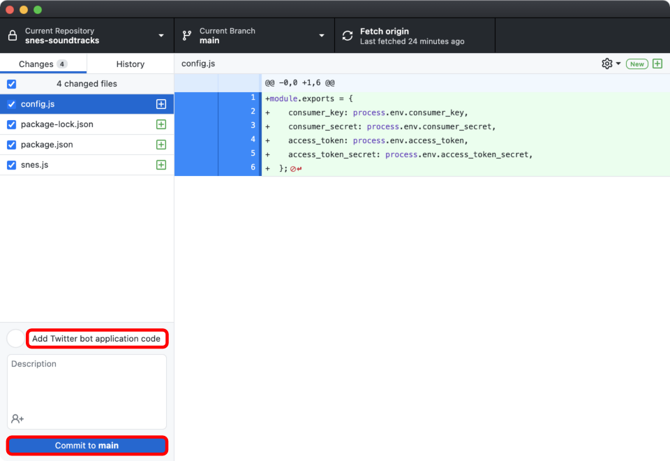

    
Not all of the files that are in your Node.js project, like the `node_modules` folder, or the `.env` secrets file, are shown. This is because they are excluded by the `.gitignore` file.


1. Below the changed files, enter a brief summary message for the new commit. For example: `Add Twitter bot application code`.

1. Press the **Commit to main** button below the summary and description fields. This creates the new commit on the *main* branch of your repository, which is the default branch name for repositories created on GitHub.

    
Branches in Git allow you to work on new features for your projects without altering the files in your other branches.


1. After creating the commit, the **Changes** tab is empty:

    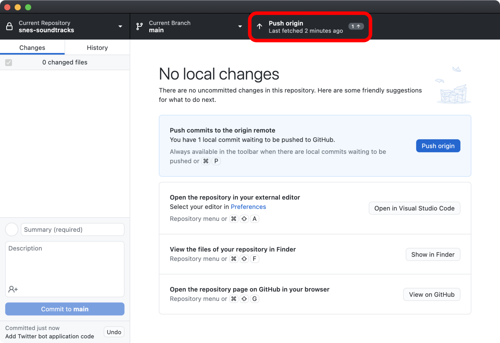

1. Click on the **Push origin** that appears in the top navigation. This pushes the new commit to your GitHub repository.

    
*Origin* is how Git is referring to the remote repository on GitHub. This is a naming convention for Git.


1. If you visit your repository on GitHub, the new files for your Node.js project are present.

### Commit and Push with the Git Command Line

1. Return to your local code repository in your terminal, then run:

        git status

    The following output appears:

    
On branch main
Your branch is up to date with 'origin/main'.

Untracked files:
  (use "git add <file>..." to include in what will be committed)
    config.js
    package-lock.json
    package.json
    snes.js


    Your new application files are listed under the `Untracked files` line, which means that they don't exist yet in Git's version history.

    
Not all of the files that are in your Node.js project, like the `node_modules` folder, or the `.env` secrets file, are shown. This is because they are excluded by the `.gitignore` file.


1. Before you can commit the files, you need to *stage* them. Staging tells Git that you want to include the files in the next commit that you make. To stage your files, run:

        git add .

    
The period at the end of this command tells git to add all the files in your current directory to the stage.


1. Then run the `status` command again:

        git status

    The output now appears as:

    
On branch main
Your branch is up to date with 'origin/main'.

Changes to be committed:
  (use "git restore --staged <file>..." to unstage)
    new file:   config.js
    new file:   package-lock.json
    new file:   package.json
    new file:   snes.js


    The output above mentions that you are on the `main` branch, which is the default branch name for repositories created on GitHub.

    
Branches in Git allow you to work on new features for your projects without altering the files in your other branches.


1. Git now knows to include the new files in your next commit. To make the commit, run:

        git commit -m "Add Twitter bot application code"

    This output appears:

    
[main e5d6839] Add Twitter bot application code
 4 files changed, 599 insertions(+)
 create mode 100644 config.js
 create mode 100644 package-lock.json
 create mode 100644 package.json
 create mode 100644 snes.js
 

 1. Next, push the new commit to your repository on GitHub:

        git push origin main

    
*Origin* is how Git is referring to the remote repository on GitHub. This is a naming convention for Git.


    This output appears:

    
Enumerating objects: 7, done.
Counting objects: 100% (7/7), done.
Delta compression using up to 12 threads
Compressing objects: 100% (6/6), done.
Writing objects: 100% (6/6), 7.57 KiB | 1.08 MiB/s, done.
Total 6 (delta 0), reused 0 (delta 0)
To https://github.com/your-github-username/snes-soundtracks.git
   735ecd1..e5d6839  main -> main


1. If you visit your repository on GitHub, the new files for your Node.js project are present.

## Run the Code

To test your code for the first time and ensure it works, type `npm run develop` into the terminal:

    npm run develop

If successful, the following output appears:


> snes-soundtracks@1.0.0 develop
> NODE_ENV=develop node snes.js

SNES Soundtracks booting up


If any errors appear, they are likely related to an authentication failure with the Twitter API. If this happens, then your `.env` file might have syntax errors, or your secret keys may have been incorrectly pasted into it. Review the [Troubleshooting consumer_key Twit Config Error](#troubleshooting-consumer_key-twit-config-error) and [Troubleshooting Twitter Error 401 Unauthorized](#troubleshooting-twitter-error-401-unauthorized) sections for solutions.

### Test the Tweet Function

At this point, the bot is running, and if you wait long enough, then it should send a scheduled Tweet. We can also test `pressSelect` on its own and make sure the tweeting function works, To do this, you need to modify the code slightly.

1. Comment out the last line of the code in `snes.js` and call `pressSelect` directly:

    
// ... modify end of file as follows:

// const job1 = schedule.scheduleJob(rule, pressSelect);

pressSelect();


    By doing this, the tweeting function runs immediately, and you don’t have to wait until the next scheduled Tweet.

1. Type `CTRL-c` to interrupt and stop the bot. Then run the code again:

        npm run develop

    If successful, output like the following output appears:

    
> snes-soundtracks@1.0.0 develop
> NODE_ENV=develop node snes.js

SNES Soundtracks booting up
Tweeted: https://t.co/Y2AOzzkUm0 Here's your soundtrack for Tuesday, June 1, 2021 at 10:59:19 AM UTC


    
Note that Twitter has automatically shortened the link to the soundtrack in the Tweet.


    If you don't see the above output, you might instead see this error: `Read-only application cannot POST.`. If so, then your app's permissions are set to Read Only in the Twitter developer portal. Revisit the earlier [Give your Twitter App Read and Write Permissions](#give-your-twitter-app-read-and-write-permissions) section and then return to this section.

### Test Tweet Replies

Lastly, you can test the way the bot responds to other users:

1. Undo the code changes you made in the [Test the Tweet Function](#test-the-tweet-function) section: remove the `pressSelect();` line that was added, uncomment the last line, and save the file.

1. Type `CTRL-c` to interrupt and stop the bot. Then run the code again:

        npm run develop

1. Log in to another Twitter account and tweet at your bot, including the keyword (`please`). You should be able to see some action in the terminal that tells you it’s working, followed by the response on Twitter.

## Host the Code

You could certainly let this code run for a long while from your local machine, but it’s better if you host it somewhere else. This section shows how to create a compute instance on Linode, install the bot on it, and then run it.

### Create a Linode

1. Visit the [Linode Cloud Manager](https://cloud.linode.com). If you haven't created any Linodes before, the home page looks like this:

    

1. Follow the [Creating a Compute Instance](/docs/products/compute/compute-instances/guides/create/) guide. When creating your instance, use the following options:

    - Pick Ubuntu 20.04 as your Linux distribution.

    - Select the region closest to you.

    - Choose Nanode (the smallest option) as your Linode plan. It’s only $5 a month and has more than enough space and RAM for your Twitter bot and any other projects you’d want on it.

    - Pick a long, unique, and complex root user password. The root user for your server can take any administrative action on the system. Using a strong root password is important to prevent malicious attackers from accessing your system.

    - When it asks for a Linode label, name it after your project.

1. After you create the Linode, it takes a few moments to boot up. Once it boots up it’s time to get inside and clean up a bit.

### Log In and Secure the Server

1. To log into the server, follow the [Connect to Your Linode via SSH](/docs/products/compute/compute-instances/guides/set-up-and-secure/#connect-to-the-instance) section of our [Getting Started](/docs/products/platform/get-started/) guide. If you do not have access to an SSH client, or if SSH connections are firewalled on your local network, you can also opt to use [the Lish console](/docs/products/compute/compute-instances/guides/lish/) from the Cloud Manager in your web browser. To do so, follow the [Use a Web Browser](/docs/products/compute/compute-instances/guides/lish/#through-the-cloud-manager-weblish) instructions in our Lish guide.

    
Our [Connecting to a Remote Server Over SSH](/docs/guides/connect-to-server-over-ssh/) guide series has a few other options for SSH clients, like SSH extension for the Chrome web browser.


    When logging in for the first time, you use the `root` username and the root password that you set when creating the Linode. However, it's important to create a non-root-user with limited permissions to run your programs from.

    
If you were to run your programs as root, and if they were to be compromised by someone malicious, then the rest of your server could be compromised. If your server isn't running anything else, then it may not be important to you. However, an attacker could install malicious programs that target other people's servers, like a botnet script that sends denial-of-service attacks.


1. To create a non-root-user, follow the [Add a Limited User Account](/docs/products/compute/compute-instances/guides/set-up-and-secure/#add-a-limited-user-account) section of our [Setting Up and Securing a Compute Instance](/docs/products/compute/compute-instances/guides/set-up-and-secure/) guide. This guide assumes that the name of the new user is `tutorialbotuser`, but you can name it whatever you'd like. The instructions in this section also show how to give your user `sudo` privileges, so it is still able to perform software updates and other administrative tasks.

    
Here's a video that also shows how to create a limited user: [Tech Republic: How to create a new user with admin privileges](https://youtu.be/fDHHKR0nVQg).


1. After you have created the limited user, log out of your current SSH (or Lish) session by running the `exit` command. Then, log back in as the new user.

    
The rest of the steps in the [Setting Up and Securing a Compute Instance](/docs/products/compute/compute-instances/guides/set-up-and-secure/) guide are optional for this tutorial, but they are still recommended if you intend to leave your server running.


### Perform Software Updates and Prepare for the Bot

1. Once you’re logged in with your limited user, you should run `sudo apt update` to check for updates available, and then `sudo apt dist-upgrade.`

1. Node.js and NPM are not preinstalled on Ubuntu 20.04, so you need to install those in order to run the bot. As on your workstation, the recommended way is to use nvm:

    1. On the Linode, run the nvm installer:

            wget -qO- https://raw.githubusercontent.com/nvm-sh/nvm/v0.38.0/install.sh | bash

    1. Log out of the Linode and then log back in again. This is needed to start using the nvm command.

    1. Install the latest Node.js and npm via nvm:

            nvm install --lts

The server is now ready to run the bot, but you still need to upload the bot's code to the server. We present two ways to do this:

- **Filezilla**: You can transfer your code to the Linux instance from your workstation, via the [Filezilla](/docs/guides/filezilla/) GUI desktop application. Because you're using a desktop application, this can be a little more user-friendly for beginners. Follow the [Upload the Bot Using Filezilla](#upload-the-bot-using-filezilla) section to do this.

- **git clone**: You can directly clone your repository on GitHub to your Linode with the Git command line tool. Follow the [Upload the Bot with Git Clone](#upload-the-bot-with-git-clone) section to do this.

### Upload the Bot Using Filezilla

1. Install the Filezilla client by downloading the installer for your workstation from their [downloads page](https://filezilla-project.org/download.php).

1. Here's how Filezilla looks once you open it:

    

1. Inside Filezilla, you can see input fields for **Host**, **Username**, **Password**, and **Port**. Set values for these fields as follows:

    | Field | Value |
    |-------|-------|
    | Host | The IP Address for your Linode. Use the [Find your Linode's IP Address](/docs/guides/find-your-linodes-ip-address/) guide to locate your IP address in the Cloud Manager. |
    | Username | This should be the name for the limited non-root-user you created. |
    | Password | The password for the limited non-root-user you created. |
    | Port | This should be set to 22. |

1. Upon connecting, you’ll get a message saying the key is unknown. This is normal, but you should double-check that the IP address is correct. If it is, check the box to remember your Linode in Filezilla.

1. The left half of the Filezilla window shows your local files, and the right half of the window shows your Linode's files. On the left side, go to the directory where you’re keeping the files for your Twitter bot. You’ll need the `.env` file, `config.js` file, `package.json` file, `package-lock.json` file, `node_modules` folder, and `snes.js` application code file for your bot. The files we're moving over are highlighted in the following picture.

    

1. By default, the right side of the FileZilla window shows the files in the home directory of your Linode's user. This is also where we want to install the bot. Once you highlight the files you want to transfer on the left side, click and drag them to the right.

After finishing the file transfer, proceed to the [run the bot](#run-the-bot-on-your-linode) section.

### Upload the Bot with Git Clone

1. Git is preinstalled on Ubuntu 20.04, but you still need to configure it like you did on your workstation. While inside your SSH or Lish connection to your Linode, follow the [Configure Git](/docs/guides/how-to-configure-git/#configure-git) section of our [Getting Started with Git](/docs/guides/how-to-configure-git/) guide. When doing this, you don't need to set the `core.editor` option, but it is important to set your username and email for Git.

1. To clone your GitHub repository to your Linode, run the `git clone` command from your SSH or Lish connection. Be sure to substitute your own GitHub username in for `your-github-username` and the name you chose for the repository for `snes-soundtracks` before running the command:

        git clone https://github.com/your-github-username/snes-soundtracks.git

    
If you previously created a private GitHub repository, then the above command prompts for your password. You should enter the *personal access token* (and not your normal GitHub password) that you created when setting up [command line authentication for GitHub](https://docs.github.com/en/github/authenticating-to-github/keeping-your-account-and-data-secure/about-authentication-to-github#authenticating-with-the-command-line) earlier.


1. Cloning the repository does not install the NPM dependencies for your project. This is because they were contained in the `node_modules` folder of your project, which was excluded from version control in your `.gitignore` file. The required dependencies are still outlined in your `package.json`, which we can use to reinstall them on your Linode. Navigate to the new cloned repository and then install them:

        cd snes-soundtracks
        npm install

    The `npm install` command looks at your package.json and installs every dependency that it finds into the `node_modules` folder.

1. The `.env` file was also excluded from version control, so it needs to be copied to your Linode separately. On your workstation, open your local `.env` and copy its contents to your clipboard. Then inside the code repository on the Linode, create a new `.env` file. You can use [the `nano` command line text editor](/docs/guides/use-nano-to-edit-files-in-linux/) to do this:

        nano .env

    The `nano` editor's interface looks like this when first opened:

    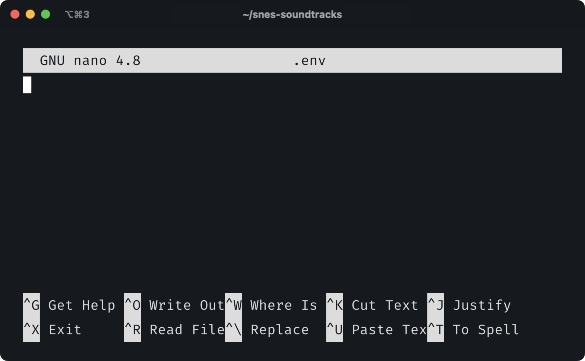

1. Paste the contents of your clipboard into the editor.

1. Type `CTRL-o` to save the file, and hit `Enter` when the editor prompts you to confirm the `.env` filename.

1. Type `CTRL-x` to exit the editor.

1. Remove file system read and write [file permissions](/docs/guides/modify-file-permissions-with-chmod/) for groups and other users on the Linode for the `.env` file:

        chmod go-rw .env

    Doing this ensures that your secret keys can't be read by other users on the system.

After cloning the repository and installing the dependencies, proceed to the [run the bot](#run-the-bot-on-your-linode) section.

### Run the Bot on your Linode

Once you’ve transferred the files, you can use your SSH connection or Lish console to run the bot in the same way as on your workstation:

    npm run develop

However, the bot does not stay running if you close your SSH connection (for example, if you put your workstation to sleep), or if you need to perform some other action in the Lish console.

To keep your bot running uninterrupted, you can start a Screen session. [Screen](/docs/guides/using-gnu-screen-to-manage-persistent-terminal-sessions/) is a useful tool for creating terminal sessions that stay alive and that can be accessed from any SSH or Lish connection. It's also preinstalled on Ubuntu 20.04, so you can start using it immediately:

1. If you ran `npm run develop` on your Linode, type `CTRL-c` to stop the bot.

1. From your Linode, run:

        screen

1. This creates a new Screen session. A welcome message for the new session is presented. Close this message by hitting `Enter` on your keyboard.

1. You are now in your Screen session. Run the bot again:

        npm run develop

1. Then, *detach* from the Screen session by typing `CTRL-a`, followed by the `d` key. This brings you back to your previous terminal history. After detaching, a message like this appears:

    
[detached from 38905.pts-0.localhost]


1. Your bot continues to run, and it runs even if you close your SSH or Lish connection. You can later return to your bot from the same SSH or Lish connection, or from a new connection. This command *reattaches* to your screen session:

        screen -r

1. If you want to halt your bot, reattach to the screen session, then type `CTRL-c`.

## Troubleshooting

### Troubleshooting consumer_key Twit Config Error

When starting the bot, you may see an error like this:


> snes-soundtracks@1.0.0 develop
> NODE_ENV=develop node snes.js

SNES Soundtracks booting up
/home/tutorialbotuser/snes-soundtracks/node_modules/twit/lib/twitter.js:511
      throw new Error(err_msg)
      ^

Error: Twit config must include `consumer_key` when using user auth.
    at /home/tutorialbotuser/snes-soundtracks/node_modules/twit/lib/twitter.js:511:13
    at Array.forEach (<anonymous>)
    at Twitter._validateConfigOrThrow (/home/tutorialbotuser/snes-soundtracks/node_modules/twit/lib/twitter.js:508:17)
    at new Twitter (/home/tutorialbotuser/snes-soundtracks/node_modules/twit/lib/twitter.js:58:8)
    at Object.<anonymous> (/home/tutorialbotuser/snes-soundtracks/snes.js:26:9)
    at Module._compile (node:internal/modules/cjs/loader:1109:14)
    at Object.Module._extensions..js (node:internal/modules/cjs/loader:1138:10)
    at Module.load (node:internal/modules/cjs/loader:989:32)
    at Function.Module._load (node:internal/modules/cjs/loader:829:14)
    at Function.executeUserEntryPoint [as runMain] (node:internal/modules/run_main:76:12)
    at node:internal/main/run_main_module:17:47


This Twit error about your `consumer_key` means there may be a syntax error in your `.env` file. In your `.env`, ensure there are no spaces between the variable, equals sign, and key itself in your .env file. As an example, here's what your `.env` might look like when correctly formatted (your keys are different):


consumer_key=rA8yWhr4ZnuWoKGDmmdbhF4Su
consumer_secret=BVMRjkQRTzlkBRC8qVZQKkWsEIEzPE9XAV1egY2D86yrQqadXH
access_token=1399573085406306304-PkDdzGOQu6ikxbwbhpmsLoP4W87jaE
access_token_secret=gf6ohLUT06RqcvfB4H6qQRZstcc6UgkouszIiLxHLGtGj


If the error persists after correcting any syntax issues, you may have copied your keys incorrectly. Review the [Troubleshooting Twitter Error 401 Unauthorized](#troubleshooting-twitter-error-401-unauthorized) section for further guidance.

### Troubleshooting Twitter Error 401 Unauthorized

When starting the bot, you may see an error like this:


> snes-soundtracks@1.0.0 develop
> NODE_ENV=develop node snes.js

SNES Soundtracks booting up
node:events:342
      throw er; // Unhandled 'error' event
      ^

Error: Bad Twitter streaming request: 401
    at Object.exports.makeTwitError (/home/tutorialbotuser/snes-soundtracks/node_modules/twit/lib/helpers.js:74:13)
    at Request.<anonymous> (/home/tutorialbotuser/snes-soundtracks/node_modules/twit/lib/streaming-api-connection.js:96:29)
    at Request.emit (node:events:377:35)
    at Gunzip.<anonymous> (/home/tutorialbotuser/snes-soundtracks/node_modules/request/request.js:1076:12)
    at Object.onceWrapper (node:events:471:28)
    at Gunzip.emit (node:events:365:28)
    at endReadableNT (node:internal/streams/readable:1312:12)
    at processTicksAndRejections (node:internal/process/task_queues:83:21)
Emitted 'error' event on StreamingAPIConnection instance at:
    at Request.<anonymous> (/home/tutorialbotuser/snes-soundtracks/node_modules/twit/lib/streaming-api-connection.js:99:14)
    at Request.emit (node:events:377:35)
    [... lines matching original stack trace ...]
    at processTicksAndRejections (node:internal/process/task_queues:83:21) {
  code: null,
  allErrors: [],
  twitterReply: '<html>\\n<head>\\n<meta http-equiv="Content-Type" content="text/html; charset=utf-8"/>\\n<title>Error 401 Unauthorized</title>\n' +
    '</head>\n' +
    '<body>\n' +
    '<h2>HTTP ERROR: 401</h2>\n' +
    "<p>Problem accessing '/1.1/statuses/filter.json'. Reason:\n" +
    '<pre>    Unauthorized</pre>\n' +
    '</body>\n' +
    '</html>\n',
  statusCode: 401
}


This error indicates that incorrect keys were copied into your `.env` file. You may have also associated the `.env` key names with the wrong credential from the Twitter developer portal. Review the table below for the correct associations between the `.env` file and the Twitter developer portal credentials.

| .env Key Name | Twitter Developer Portal Credential Name |
|---------------|------------------------------------------|
| consumer_key  | API Key                                  |
| consumer_secret | API Secret Key                         |
| access_token | Access Token                              |
| access_token_secret | Access Token Secret                |

If you're not sure whether your keys are correct, you can regenerate them inside the Twitter developer portal. See the [Regenerate API Keys and Tokens](https://developer.twitter.com/en/docs/authentication/guides/authentication-best-practices) section of Twitter's documentation for instructions.

### Troubleshooting Twitter Read Only Application Cannot POST Error

When your bot attempts to tweet, you may see an error like this in its logs:


Read-only application cannot POST.


This error indicates that your app's permissions are set to Read Only in the Twitter developer portal. Follow the instructions in the [Give your Twitter App Read and Write Permissions](#give-your-twitter-app-read-and-write-permissions). This section shows how to switch to Read and Write permissions and how to regenerate your Access Token and Access Token Secret.