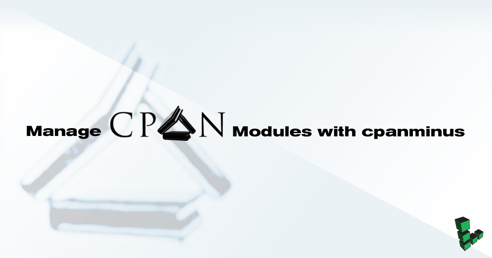

CPAN, the Comprehensive Perl Archive Network, is the primary source for publishing and fetching the latest modules and libraries for the Perl programming language. The default method for installing Perl modules, using the **CPAN Shell**, provides users with a great deal of power and flexibility, but this comes at the cost of a complex configuration and an inelegant default setup.

The `cpanm` client attempts to make the power of CPAN accessible to all users, particularly those who aren't Perl developers, but have experience with the CPAN shell. This document outlines the procedures for installing cpanminus and demonstrates a number of basic use cases. If you're new to the world of Linux systems administration, you may want to review our [introduction to Linux concepts guide](/docs/guides/introduction-to-linux-concepts/) and [administration basics guide](/docs/guides/linux-system-administration-basics/) before completing this guide.

## Install Dependencies

* Debian and Ubuntu:

        apt-get update
        apt-get upgrade
        apt-get install perl build-essential libssl-dev

* CentOS and Fedora:

        yum update
        yum install perl perl-devel curl gcc

## Install cpanminus

1. Curl the latest cpanminus and use it to bootstrap itself:

        curl -L https://cpanmin.us | perl - --sudo App::cpanminus

2.  Update cpanminus:

        cpanm --self-upgrade --sudo

## Use cpanminus

### Basic Usage

The basic syntax to install a module with cpanminus is:

    cpanm [Module::Name]

By default, Perl modules will be installed to `~/perl5` rather than the more customary `/usr/local/bin` directory. This will cause a warning during the installation process. You can avoid this warning by adding the `--sudo` option, which will run the installation with root privileges and install to `/usr/local/bin`. If you would like to continue installing Perl modules to `~/perl5` without the warning, use the following command:

    cpanm --local-lib=~/perl5 local::lib && eval $(perl -I ~/perl5/lib/perl5/ -Mlocal::lib)

### Skip Installed

You can also use the `--skip-installed` option to avoid reinstalling modules when the latest version is already installed. Consider the following example:

    cpanm --sudo --skip-installed Catalyst::Runtime Class::Inspector

This installs the specified modules to the system location (with `--sudo`), but only if they haven't been installed already.

### Install from Remote URL

You can also specify the url of a Perl module and CPAN will fetch the module from that location, build the dependencies, and install it:

    cpanm --sudo https://cpan.metacpan.org/authors/id/O/OL/OLIVER/App-Netdisco-2.036011.tar.gz


You may need to run `cpanm Net::SSLeay` first in order to request a url with `https`.


### Get Package Information

Use the `--info` option to view information regarding a package in CPAN:

    cpanm --info [Module::Name]
