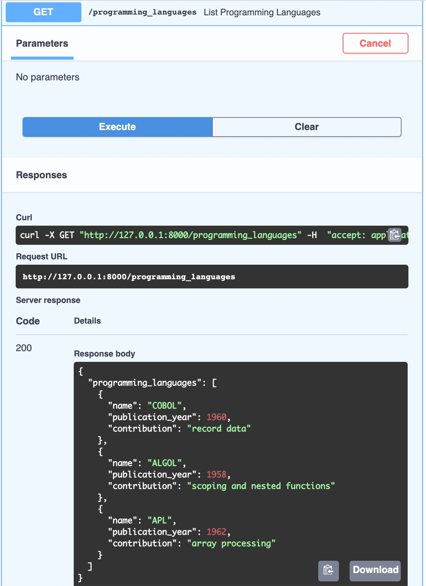
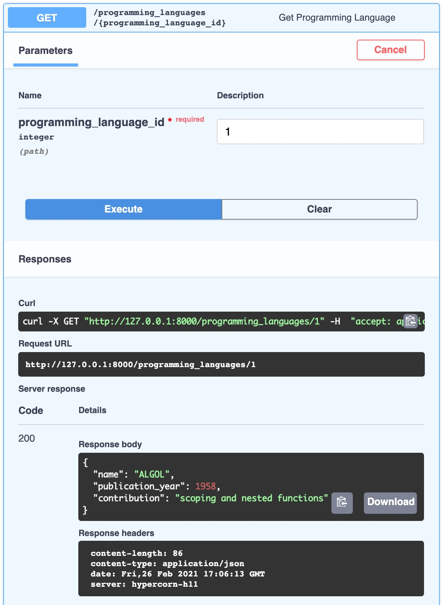

## FastAPI Features

FastAPI is a modern Python *micro-framework* with all the functionality to support production applications. If you are building a REST API to serve data to an app, FastAPI is a good choice. It includes the following features that make it popular among developers:

- **Fast to code**: Its design and ease-of-use enable developers to build their APIs quickly.
- **Fast performance**: As its name suggests, this framework delivers fast speed and performance.
- **Minimal**: Provides a minimalist toolset, and reduces code duplication.
- **Automatic docs**: Interactive API documentation is automatically generated for decorated endpoints.
- **Easy:** You can get started coding without a large amount of upfront time investment.

This guide shows you how to build a REST API that returns information about programming languages, [courtesy of Hillel Wayne's research](https://www.hillelwayne.com/post/influential-dead-languages/) on influential programming languages. The finished read operations allow clients to list programming languages, fetch a specific programming language, and filter languages based on their publication year.

## In This Guide

Throughout this guide you learn how to use FastAPI to create the following REST API endpoints:

1. **List Programming Languages**: retrieves all the Programming Language records or filters the Programming Language records using a path parameter.
1. **View Programming Language**: fetches a specific record based on a unique identifier.


The [REST protocol](https://en.wikipedia.org/wiki/Representational_state_transfer) allows servers to expose data that a client can access and manipulate. This protocol allows clients to perform create, read, update, and delete (CRUD) operations.



This guide does not cover integrating FastAPI with a database. FastAPI uses an in-memory data store by default. However, you can integrate FastAPI with a [long list of different database providers](https://fastapi.tiangolo.com/tutorial/sql-databases/).


## Install FastAPI

### Prerequisites

FastAPI requires the following items to be installed on your system:

- Python 3.6+  and [pip](https://pypi.org/project/pip/)
- [Gunicorn](/docs/guides/flask-and-gunicorn-on-ubuntu/#install-and-configure-gunicorn) or [Hypercorn](https://pypi.org/project/Hypercorn/). These tools are used as the web server gateway for your API.

### Install FastAPI and Hypercorn

Install FastAPI and Hypercorn using pip:

    pip install fastapi
    pip install hypercorn

## Writing your API's Read Operations

### Create the List Programming Languages Endpoint

In this section, you create the List and View endpoints. These endpoints return information about programming languages. You can adopt these steps for your own data.

1. Create a new directory to store your API and move into the new directory.

        mkdir fastapi_demo
        cd fastapi_demo

1. Using your preferred text editor, create a new file named `main.py` and add the following contents to the file:

    
from fastapi import FastAPI

app = FastAPI()


    In the first line, you import the FastAPI module. Then, you instantiate the `FastAPI` class and assign the new instance to the `app` variable.

1. Instantiate your API's in-memory data store and populate it with data:

    
from fastapi import FastAPI

app = FastAPI()

in_memory_datastore = [
  {"name": "COBOL", "publication_year": 1960, "contribution": "record data"},
  {"name": "ALGOL", "publication_year": 1958, "contribution": "scoping and nested functions"},
  {"name": "APL", "publication_year": 1962, "contribution": "array processing"},
]


    The previous code adds the following to your API:

    - `in_memory_datastore = []` instantiates a Python list of objects.
    - Each dictionary item contains the following data:
        - the name of the programming language
        - the approximate year it was published
        - its conceptual contributions to the design of modern programming languages

    
Each record within the `in_memory_datastore` list is a Python dictionary. RESTful APIs are generally organized around a *resource*. A resource is a type of database record that can be accessed by a client.


1. Add the List Programming Languages endpoint to your `main.py` file. This endpoint fetches all the records in the data store and returns them to the client as a JSON object. The JSON object has the label `programming_languages`.

    
from fastapi import FastAPI

app = FastAPI()

in_memory_datastore = [
  {"name": "COBOL", "publication_year": 1960, "contribution": "record data"},
  {"name": "ALGOL", "publication_year": 1958, "contribution": "scoping and nested functions"},
  {"name": "APL", "publication_year": 1962, "contribution": "array processing"},
]

@app.get('/programming_languages')
def get_programming_languages():
   return {"programming_languages" : in_memory_datastore }


    The List endpoint returns an object instead of a raw array because this makes it easier to maintain the return body. An object provides the freedom to add more attributes to the return body later. For example, if you want to return a count of objects in your data store, you cannot add a `count` attribute to a raw array. However, you can add a `count` attribute to an enclosing JSON object with one key that points to an array. This becomes especially useful in APIs that allow clients to filter sections of data or request aggregate metrics for the data or sections of data.

1. Navigate to the root of your FastAPI project and start the app.

        hypercorn main:app --reload

1. Open a new browser window and navigate to `http://127.0.0.1:8000/programming_languages`. Your browser displays the `programming_languages` results in a JSON object containing the contents of the datastore.

    
{"programming_languages":[{"name":"COBOL","publication_year":1960,"contribution":"record data"},{"name":"ALGOL","publication_year":1958,"contribution":"scoping and nested functions"},{"name":"APL","publication_year":1962,"contribution":"array processing"}]}


1. Navigate to `http://127.0.0.1:8000/docs`, to access the API documentation automatically generated by FastAPI. You can use the interactive documentation to test queries, and view their responses.

    

### Create the View Programming Language Endpoint

In this section you create an endpoint to retrieve an individual programming language record from the datastore.

1. Add the example code to the bottom of the `main.py` file.

    
...
@app.get('/programming_languages/{programming_language_id}')
def get_programming_language(programming_language_id: int):
   return in_memory_datastore[programming_language_id]


    This endpoint includes an interpolated variable (`{programming_language_id}`) that allows you to query for a specific item in the data store. The `id` in this example points to an index value in the programming languages list.

1. Run your FastAPI app if it is not still running.

        hypercorn main:app --reload

1. Navigate to `http://127.0.0.1:8000/docs`, to access the API documentation automatically generated by FastAPI. Notice that a new entry is available in the documentation. The `id` of `1` points to the second record in your data store.

    

1. If you navigate to `http://127.0.0.1:8000/programming_languages/1` in a browser the output also returns the second record in your data store.

    
{"name":"ALGOL","publication_year":1958,"contribution":"scoping and nested functions"}


### Adding Filters to the List Endpoint

This section shows you how to add filtering capabilities to your API. These changes require you to update your `main.py` file to add new functionality and refactor the existing code.

1. Update the `main.py` file to import the `BaseModel` class from the `pydantic` module.

    
from fastapi import FastAPI
from pydantic import Basemodel


    To allow clients to filter your API's data on the `publication_year` your code is updated to retrieve resources as objects rather than as dictionaries. FastAPI provides an object mapper that allows you to define attributes on a data type. The `BaseModel` class accesses the object mapper. With this capability, FastAPI attempts to automatically convert those objects to and from the input and output format, in this case, a dictionary.

1. Update your `main.py` file to add more entries to your data store.

    
...
in_memory_datastore = [
   {"name": "COBOL", "publication_year": 1960, "contribution": "record data"},
   {"name": "ALGOL", "publication_year": 1958, "contribution": "scoping and nested functions"},
   {"name": "APL", "publication_year": 1962, "contribution": "array processing"},
   {"name": "BASIC", "publication_year": 1964, "contribution": "runtime interpretation, office tooling"},
   {"name": "PL/1", "publication_year": 1966, "contribution": "constants, function overloading, pointers"},
   {"name": "SIMULA67", "publication_year": 1967, "contribution": "class/object split, subclassing, protected attributes"},
   {"name": "Pascal", "publication_year": 1970, "contribution": "modern unary, binary, and assignment operator syntax expectations"},
   {"name": "CLU", "publication_year": 1975, "contribution": "iterators, abstract data types, generics, checked exceptions"}
]
...


1. Create your instance of the `BaseModel` class. Add the example line below your data store list.

    
class ProgrammingLanguage(BaseModel):
    name: str
    publication_year: int
    contribution: str


    The model includes the attributes that the data store defined. The base model supports a constructor that takes all the keyword arguments out of a dictionary. It also supports a `to_dict()` method for turning an object into a dictionary representation.

1. Modify the `list_programming_languages` method as displayed below:

    
...
@app.get('/programming_languages')
def list_programming_languages(before_year: int = 30000, after_year: int = 0):
   object_store = map(
       lambda pl_as_data: ProgrammingLanguage(**pl_as_data),
       in_memory_datastore
   )
   qualifying_data = list(
       filter(
          lambda pl: before_year > pl.publication_year > after_year,
           object_store
       )
   )
   return {"programming_languages" : qualifying_data }
...


    Clients can now filter the programming languages with two query parameters: `before_year` and `after_year`. FastAPI automatically treats all parameters passed to a routed method as *query parameters* (except interpolated path parameters). If a client does not pass a query parameter in its request, the default start year of `0` is used. The default end year of `30000` automatically captures all languages.

    Upon receiving a request, the method converts all the items in the data store from dictionaries into `ProgrammingLanguage` objects. This would make the request take a long time if the datastore had a lot of items in it. The resulting objects then go through a filter that returns only the items with a `publication_year` between the `before_year` and the `after_year`.

1. In a browser enter `http://127.0.0.1:8000/programming_languages?before_year=1965&after_year=0` and notice the data returned by the API. It is filtered by the query parameters used in your HTTP request.

    
{"programming_languages":[{"name":"COBOL","publication_year":1960,"contribution":"record data"},{"name":"ALGOL","publication_year":1958,"contribution":"scoping and nested functions"},{"name":"APL","publication_year":1962,"contribution":"array processing"},{"name":"BASIC","publication_year":1964,"contribution":"runtime interpretation, office tooling"}]}


You have now seen how to create the two most common read requests for a RESTful endpoint; the List and View endpoints. You can apply what you learned in this guide to begin creating an API for your own data and use case.

