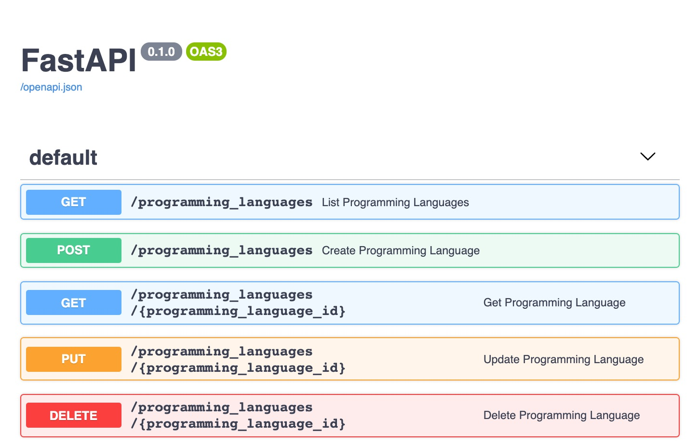

FastAPI is a high-performance Python *micro-framework* designed to help developers build APIs quickly. Out-of-the-box, it generates interactive API documentation powered by the [Swagger UI](https://github.com/swagger-api/swagger-ui). This Python framework is minimal by default, but can be configured, and extended to fit your API's use case.

## In this Guide

This guide shows you how to create write operations for your RESTful API. Its examples continue from the [CRUD Read Operations: Use FastAPI to Write an API](/docs/guides/crud-read-operations-use-fastapi-to-write-an-api/) guide. Throughout this guide you learn how to use FastAPI to create the following REST API endpoints:

1. **Create Programming Languages**: creates a new Programming Languages resource using JSON payload data.
1. **Update Programming Language**: updates a resource with new data.
1. **Delete Programming Language**: deletes an existing resource.

## Install FastAPI

### Prerequisites

FastAPI requires the following items to be installed on your system:

- Python 3.6+  and [pip](https://pypi.org/project/pip/)
- [Gunicorn](/docs/guides/flask-and-gunicorn-on-ubuntu/#install-and-configure-gunicorn) or [Hypercorn](https://pypi.org/project/Hypercorn/). These tools are used as the web server gateway for your API.


If you have not followed the steps in the [CRUD Read Operations: Use FastAPI to Write an API](/docs/guides/crud-read-operations-use-fastapi-to-write-an-api/) guide, ensure that you have created a `main.py` file with [the code](/docs/guides/crud-read-operations-use-fastapi-to-write-an-api/main.py) included in the previous guide's examples.


### Install FastAPI and Hypercorn

Install FastAPI and Hypercorn using pip:

    pip install fastapi
    pip install hypercorn

## Creating your API's CRUD Write Operations

### Write the Create Programming Languages Endpoint

In keeping with RESTful resource conventions, the `POST` HTTP verb is used by clients to create a resources. The Create Programming Languages endpoint that you create in this section expects a `POST` verb and a *request body*. A request body is a payload of data that is sent along to an endpoint. The payload specifies the attributes to add to the new resource. In this case, the attributes required by the Create Programming Languages endpoint are `name`, `publication_year`, and `contribution`.

1. In your `main.py` file, add the Create Programming Languages endpoint by inserting the function in the example file. Notice that this function is annotated with `@app.post` instead of `@app.get`.

    
@app.post('/programming_languages')
def create_programming_language(programming_language: ProgrammingLanguage):
   in_memory_datastore.append(programming_language.dict())
   return programming_language.dict()


    The `create_programming_language` function accepts a `programming_language` with the type hint `ProgrammingLanguage`. FastAPI accepts the data passed to the request body and tries to cast it to a `ProgrammingLanguage`. At this point, the code turns the object right back into a dictionary to store it in the data store and return the information to the client.

### Refactor your API's Data Store

In the previous section, you added the Create Programming Languages endpoint. The code receives the payload data as an object and changes it into a dictionary to store in the data store. In this section, you revisit your data store's design and List Programming Languages endpoint to make your code more performant.

1. Update your `in_memory_datastore` to store your data as objects instead of a list of dictionaries.

    
in_memory_datastore = [
  ProgrammingLanguage(name = "COBOL", publication_year = 1960, contribution = "record data"),
  ProgrammingLanguage(name = "ALGOL", publication_year = 1958, contribution = "scoping and nested functions"),
  ProgrammingLanguage(name = "APL", publication_year = 1962, contribution = "array processing"),
  ProgrammingLanguage(name = "BASIC", publication_year = 1964, contribution = "runtime interpretation, office tooling"),
  ProgrammingLanguage(name = "PL/I", publication_year = 1966, contribution = "constants, function overloading, pointers"),
  ProgrammingLanguage(name = "SIMULA67", publication_year = 1967, contribution = "class/object split, subclassing, protected attributes"),
  ProgrammingLanguage(name = "Pascal", publication_year = 1970, contribution = "modern unary, binary, and assignment operator syntax expectations"),
  ProgrammingLanguage(name = "CLU", publication_year = 1975, contribution = "iterators, abstract data")
]


1. Refactor your List Programming Languages endpoint code to no longer convert the dictionaries into objects.

    
@app.get('/programming_languages')
def list_programming_languages(before_year: int = 30000, after_year: int = 0):
   qualifying_data = list(
       filter(
           lambda pl: before_year > pl.publication_year > after_year,
           in_memory_datastore
       )
   )
   return {"programming_languages" : qualifying_data }


    Notice that the `object_store` function has been removed from the `list_programming_languages()` function. This is no longer needed since your data store now stores objects instead of dictionaries.

1. Refactor your Create Programming Languages endpoint to no longer convert `programming_language` to a dictionary.

    
@app.post('/programming_languages')
def create_programming_language(programming_language: ProgrammingLanguage):
   in_memory_datastore.append(programming_language)
   return programming_language.dict()


Your code has now been completely refactored to convert the payload into an object during the write operation (using the Create Programming Languages endpoint). This conversion only has to happen one object at a time.

The previous `list_programming_languages()` function converted all data in your data store into objects at the same time. Eventually, as your data grows, you would see a lag in performance when sending requests to the List Programming Languages endpoint. Your refactored code is much more performant, since it no longer requires converting data to a different type when accessing the List Programming Languages endpoint.

### Write the Update Programming Languages Endpoint

RESTful services conventionally use the `PUT` verb for the update endpoint. The Update Programming Languages endpoint, like the Create Programming Languages endpoint, expects a request body containing the full set of attributes that the updated resource should have.

1. Update your `main.py` file with the Update Programming Languages endpoint code.

    
@app.put("/programming_languages/{programming_language_id}")
async def update_programming_language(programming_language_id: int, updated_programming_language: ProgrammingLanguage):
   in_memory_datastore[programming_language_id] = updated_programming_language
   return updated_programming_language


    
The update endpoint replaces the *entire object*. When a client sends a request to this endpoint, it needs to send the *entire updated object*. Your code can also be written to accept partial updates; that is, to only update the resource at the given id with the fields sent in the request body. With a partial updates implementation, the associated endpoint accepts the `PATCH` HTTP verb instead of `PUT`.


### Write the Delete Programming Languages Endpoint

RESTful services conventionally use a `DELETE` verb for the delete endpoint. The code to write the Delete Programming Languages Endpoint is similar to the Update Programming Languages Endpoint endpoint.

1. Update your `main.py` file with the Delete Programming Languages endpoint code.

    
@app.delete("/programming_languages/{programming_language_id}")
async def delete_programming_language(programming_language_id: int):
   del in_memory_datastore[programming_language_id]


You should now have all write operations available in your code. The next section covers the topic of *idempotence* and ways that you can update your API code to conform to RESTful best practices.

### Deleting an API Resource

The Delete Programming Languages endpoint reveals a problem with storing data in a list and using the numeric index as the id for each resource.

When you use the View Programming Languages endpoint the resource is retrieved using the resource's `id`. For example, to send a request to your API to view a specific resource by id you use the following curl command and request URL:

    curl -X 'GET' \
    'http://127.0.0.1:8000/programming_languages/0' \
    -H 'accept: application/json'

The response returns the COBOL record:


{
  "name": "COBOL",
  "publication_year": 1960,
  "contribution": "record data"
}


Now, delete the record associated with id `0`:

    curl -X 'DELETE' \
    'http://127.0.0.1:8000/programming_languages/0' \
    -H 'accept: application/json'

The response body returns `null`. When you attempt to again retrieve the resource associated with id `0`, notice the response body that is returned:


{
  "name": "APL",
  "publication_year": 1962,
  "contribution": "array processing"
}


The response body returns a different resource. This happens because when you delete the first item from the list, the second item is moved to the next empty index position. Since the View Programming Language id references a resource's position in the data store's list, the same id can point to a different programming language after the data store changes.

### Web API Best Practices: Idempotence

The behavior in the above section violates the **idempotence rule.**  An operation that is **idempotent** changes a system's state in the same way, whether it is run one time or many times. Update and delete requests in RESTful services should be idempotent in order to avoid confusing states or accidents. In particular, when a resource at a given id is deleted, that id should no longer fetch a resource. It should not fetch a *different* resource from the original one.

To fix this behavior, the API must use an immutable attribute as the id, rather than the resource's position in the list. There are many ways to fix it:

- Instantiate the app with a counter that starts at zero and assign every new and created resource the next number in the counter as its id. Then, if the resource at id `3` is deleted, the available ids are `0, 1, 2, 4, 5`. The id of `3` would no longer fetch a resource.

- The id does not have to be an incrementing integer, or an integer of any kind. It's common for resources to have a universally unique identifier (UUID), for example, `aa3f-2b3d-7sgw-a216`. A UUID is unique, and does not have an additional meaning.

- A meaningful and unique attribute of the resources can be used as the id. Perhaps, you could use the `name` attribute. If you are concerned that two programming languages can have the same name, you could use a combination of the `name` and the `publication_year`.

In any of the implementations mentioned above, rather than indexing from a list, the `get_programming_language` method searches for the `ProgrammingLanguage` whose id attribute matches the one passed in the path.

Alternatively, using a dictionary instead of a list for the data store would facilitate faster lookup. Each programming language's id could serve as a key and point to the `ProgrammingLanguage` object as the value.

In practice, most APIs use some a database rather than a collection object in-memory to store data. Database solutions universally have a robust id solution that does not pluck items out of the database based on their position. Most database solutions also provide some freedom to choose what kind of id to use for your data.

## View your Create, Update, and Delete Endpoints

In your the same directory as your project's `main.py` file, run your FastAPI app if it is not already running.

    hypercorn main:app --reload

Visit your API's documentation (`http://127.0.0.1:8000/docs`) to view all the endpoints you created throughout this guide.

FastAPI's syntax is similar to the syntax used by [Flask or Bottle](/docs/guides/how-to-choose-python-api-framework/). With a few adjustments, much of the example code used in this guide would work with those frameworks. Regardless of framework, the RESTful web API conventions covered i this guide, like data lookup efficiency, and idempotence apply across any backend stack.

