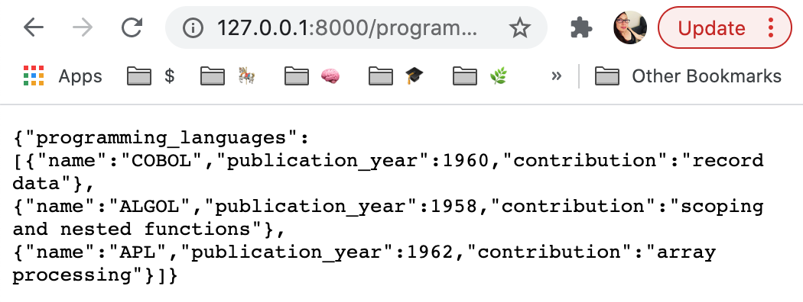

# CRUD READ operations in Python Using FastAPI: View, List

The [last post](https://www.linode.com/docs/guides/development/python/choosing-python-api-framework) in this series compared four Python frameworks for writing an API: Django, Flask, FastAPI, and Bottle. Each framework has unique strengths, and the right choice depends on the use case.

FastAPI is the newest Python framework on the list that has the requisite functionality to support production applications. It boasts asynchronous operations as the default as well as built-in API documentation for decorated endpoints. This makes it a strong choice as a framework for a REST API.

To demonstrate this, let&#39;s build a REST API that serves up information about programming languages, [courtesy of Hillel Wayne&#39;s research](https://www.hillelwayne.com/post/influential-dead-languages/) on influential programming languages. The finished product allows clients to list programming languages, fetch a _specific_ programming language, or filter languages based on publication year. It's an educational data set to use for our exploration.

## How to implement read requests in a REST API with FastAPI

Running a FastAPI server requires, at a minimum, two dependencies: FastAPI itself as well as either `gunicorn` or `hypercorn` for running the server. The Python Package Index has both dependencies, installable via pip:

```
pip install fastapi
pip install hypercorn
```

FastAPI is a **microframework.** Rather than prescribing a structure for an app, it provides the minimum toolset and allows developers to build up whatever structure of server they want, piece by piece. This means that an entire server _could_ live in one file.

Create a directory for the app to live in, and inside that directory create a file. In this example, the file is called main.py, but it can have any name:

```
touch main.py
```

The REST protocol is well-suited for servers that connect to a database and provide endpoints that allow client applications to perform operations on that database. Those operations have an acronym: CRUD, which stands for &quot;create, read, update, destroy.&quot;

The acronym lacks nuance, however. In practice, RESTful services tend to have _two_ endpoints for reading operations: a `list` endpoint, which either gets all the records or filters them according to some criterion; or a `detail` endpoint, which fetches a specific record based on a unique identifier.

By the end of this tutorial, `main.py` will contain the code for both of those routes.

## List Endpoint in FastAPI

Inside the `main.py` file, at the top, import FastAPI:

```
from fastapi import FastAPI
```

Then, below that, it&#39;s time to instantiate the app. We can instantiate the class FastAPI and assign it to a name (traditionally, `app`, like so):

```python
app = FastAPI()
```

Given that this is a RESTful API, it will serve data from a database. This tutorial does not cover the details of integrating with a database; FastAPI [allows integrations](https://fastapi.tiangolo.com/tutorial/sql-databases/) with a long list of different database providers and paradigms. To limit scope, create a small in-memory data store in our app by instantiating a list:

```
in_memory_datastore = []
```

The list endpoint fetches, to start, _all_ of the data from this in-memory datastore.

To fast-forward to the interesting parts, we can &quot;cheat&quot; and add some starting data so that we have something to work with for the read endpoints:

```python
in_memory_datastore = [
  {"name": "COBOL", "publication_year": 1960, "contribution": "record data"},
  {"name": "ALGOL", "publication_year": 1958, "contribution": "scoping and nested functions"},
  {"name": "APL", "publication_year": 1962, "contribution": "array processing"},
]
```

The data records three attributes for each programming language: its name, the approximate year it was published, and its conceptual contributions to the design of modern programming languages. Note that each record is a Python dictionary.

For now, below the in-memory datastore, we can write a rudimentary list endpoint that fetches all the records in the database and displays them as JSON. RESTful APIs are generally organized around a _resource_ —a name for the type of database records that it allows clients to access. We follow the conventions described in the RESTful routes chart for accessing the resource:


In this case, the resource is a programming language. So the list endpoint has the name `/programming_languages`, all lowercase. Use the `get` HTTP verb, and for now the request has no parameters.

```python
@app.get('/programming_languages')
def get_programming_languages():
   return {"programming_languages" : in_memory_datastore }
```

This app fetches all the records in the datastore and returns them to a client that hits this endpoint with in a JSON object with the label `programming_languages`.

**Nota bene:** Why bother with putting the list into an object with a label, rather than returning the raw array? There are two reasons.

- The first reason is a _maintainability_ reason: an object provides the freedom to add more attributes to the return body later. For example, suppose we wanted to return a count of the objects in the database. We cannot add a count attribute to a raw array, but we can add a count attribute to an enclosing JSON object with one key that points to an array. This becomes _especially_ useful in APIs that allow clients to filter sections of data or to request aggregate metrics for the data or sections of data.

- The historical reason we don&#39;t do it, though, is a _security_ reason. Ten years ago, browsers didn&#39;t guard against malicious actors redefining the JSON array and obtaining access to raw JSON array payloads. They have all patched it now, but the programming community kept on wrapping arrays in objects because of the maintainability benefit.

Let&#39;s start the app and look at the existing endpoint.

On the command line, navigate to the directory where the app lives. Then run the following command:

```
hypercorn main:app --reload
```

`Hypercorn` invokes our server runner (or `gunicorn` if you installed `gunicorn` instead). `Main` refers to the name of the `main.py` file. `App` refers to the name in our file that points to our instance of the FastAPI app. And `--reload` asks hypercorn to reload the app every time we change the `main.py` file.

Once this runs, the app is up at the following address:

```
go to http://127.0.0.1:8000/
```

Visiting the endpoint shows that the request to `programming_languages` results in a JSON object containing the contents of the datastore:



We can visit the endpoint http://127.0.0.1:8000/docs to test out queries and see the responses, too:


## Detail Endpoint in FastAPI

The next step is to add an endpoint to retrieve a specific programming language from the datastore. This endpoint has an interpolated variable in the endpoint string called `programming_language_id` that allows us to query for a specific item in our datastore. The id refers, in this example, to the index in the list that refers to the programming language. This presents a problem once clients can delete items from the datastore; we fix it later.

In the meantime, this code goes underneath the code for listing the programming languages:

```python
@app.get('/programming_languages/{programming_language_id}')
def get_programming_language(programming_language_id: int):
   return in_memory_datastore[programming_language_id]
```

Running the app again results in a new entry on the `/docs` page:


Here, the `id` of `1` points to the second item in the list, ALGOL. So requesting `programming_languages/1` fetches the ALGOL data.

## Adding Filters to the List Endpoint

Suppose we need to filter the programming language results to those from a certain time period. One way to do so is to increase the size of the datastore to include a few more languages:

```python
in_memory_datastore = [
   {"name": "COBOL", "publication_year": 1960, "contribution": "record data"},
   {"name": "ALGOL", "publication_year": 1958, "contribution": "scoping and nested functions"},
   {"name": "APL", "publication_year": 1962, "contribution": "array processing"},
   {"name": "BASIC", "publication_year": 1964, "contribution": "runtime interpretation, office tooling"},
   {"name": "PL/1", "publication_year": 1966, "contribution": "constants, function overloading, pointers"},
   {"name": "SIMULA67", "publication_year": 1967, "contribution": "class/object split, subclassing, protected attributes"},
   {"name": "Pascal", "publication_year": 1970, "contribution": "modern unary, binary, and assignment operator syntax expectations"},
   {"name": "CLU", "publication_year": 1975, "contribution": "iterators, abstract data types, generics, checked exceptions”},
]
```
Let&#39;s allow clients to filter on the `publication_year` parameter. To do so, start treating programming languages as objects rather than as dictionaries at fetch time.
FastAPI provides an object mapper that allows us to define the attributes on a data type. FastAPI then attempts to automatically convert those objects to and from the input-output format, in this case a dictionary. To access the object mapper, import `BaseModel` from `pydantic` at the top of the file, just below the import line for FastAPI:
```python
from pydantic import Basemodel
```
An appropriate base model for the programming language would include the attributes that the dictionary defines:
```python
class ProgrammingLanguage(BaseModel):
   name: str
   publication_year: int
   contribution: str
```
This base model supports a constructor that takes all the keyword arguments out of a dictionary. It also supports a `to_dict()` method for turning an object into a dictionary representation.
To demonstrate that, change the `list_programming_languages` method like so:
```python
@app.get('/programming_languages')
def list_programming_languages(before_year: int = 30000, after_year: int = 0):
   object_store = map(
       lambda pl_as_data: ProgrammingLanguage(**pl_as_data),
       in_memory_datastore
   )
   qualifying_data = list(
       filter(
          lambda pl: before_year > pl.publication_year > after_year,
           object_store
       )
   )
   return {"programming_languages" : qualifying_data }
```
From now on, clients can filter the programming languages with two query parameters: `before_year` and `after_year`. FastAPI automatically treats all parameters passed to a routed method, besides interpolated path parameters, as query parameters. If a client does not pass those, the default start year of 0 and our default end year of 30,000 automatically captures all languages. The benefit: no edge cases to check. The cost: if computers still exist in the year 30000, this app will break.
Upon receiving a request, this method converts all the items in the data store from dictionaries into `ProgrammingLanguage` objects. This would make the request take a long time if the datastore had a lot of items in it—a problem worth reconsidering when we implement the write methods. In the meantime, this demonstrates some of the utility of the ORM.
The resulting objects then go through a filter that picks out only the ones with a `publication_year` between the `before_year` and the `after_year`. A request without these query parameters continues to deliver all of the programming languages:

While setting one or both of them limits the selection (in this case, the request limits the results to programming languages published before 1965):

## FastAPI gives us nice affordances for building RESTful read requests
This tutorial has specifically discussed the two most common read requests for a RESTful endpoint: the list endpoint and the detail endpoint. It also exemplified including query parameters in a request, for example, to filter the results from a list endpoint. It points out some weaknesses in the approach, though, and leaves open questions.
The next installment about [implementing write requests](https://www.linode.com/docs/guides/development/python/write-requests-rest-fastapi) for the `programming_languages` API returns to those questions and introduces additional important concepts in building a FastAPI REST API.