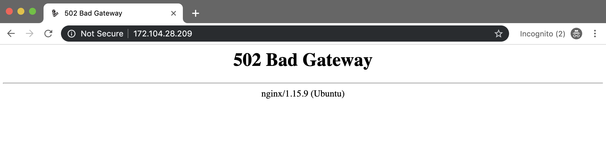
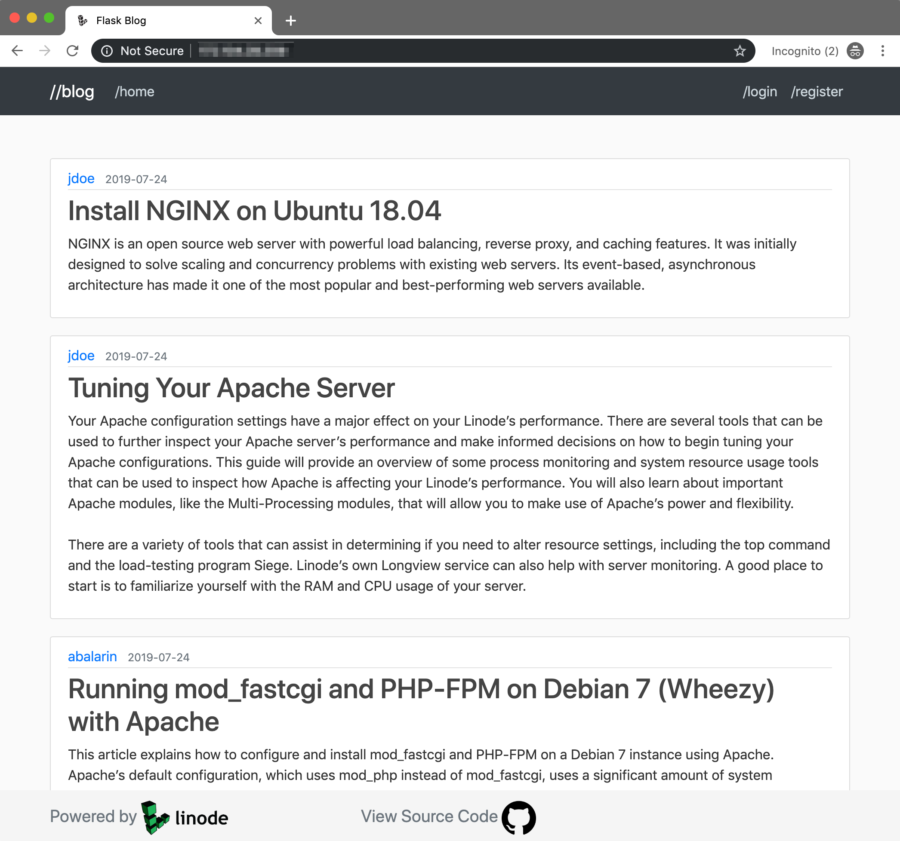

Flask is a light-weight web framework for Python that includes several utilities and libraries you can use to create a web application. After you have developed a Flask application in a local environment, you need to prepare the application's production environment in order to run the application and serve it to the users of the application through the internet.

This guide walks you through the steps to deploy a Flask application to a production environment running on a Linode. The production environment uses [NGINX](/docs/guides/getting-started-with-nginx-part-1-installation-and-basic-setup/) as the web server and reverse proxy, [Gunicorn](https://gunicorn.org/) as the web server gateway interface (WSGI) application server, and [Supervisor](http://supervisord.org/) for monitoring and auto-reloading Gunicorn should it go down. This guide does not cover creating a Flask application or related Python concepts.

In this guide you complete the following:

- [Copy an existing Flask application from a local development environment to a production environment](#copy-your-flask-app-to-your-linode)
- [Install and configure NGINX](#install-and-configure-nginx)
- [Configure the Flask application's production environment variables](#configure-flask)
- [Install and configure Gunicorn](#install-and-configure-gunicorn)
- [Install and configure Supervisor](#install-and-configure-supervisor)

    
This guide assumes you are familiar with the following concepts and skills:

* The [Python programming language](https://docs.python.org/3/tutorial/index.html)
* [Setting up a local virtual environment](https://docs.python-guide.org/dev/virtualenvs/) for Python programming
* [Creating applications using Flask](https://flask.palletsprojects.com/en/1.1.x/quickstart/#)
* Using a local and remote version control system, like [Git and GitHub](/docs/guides/how-to-use-git/).
    

## Before You Begin
1.  [Create a Flask Application](https://flask.palletsprojects.com/en/1.1.x/tutorial/) or use this [Example Blog Application](https://github.com/abalarin/Flask-on-Linode). Clone and run it on the local machine [using GitHub](/docs/guides/how-to-use-git/).

        git clone https://github.com/abalarin/Flask-on-Linode.git flask_app_project

    
  The [Example Flask Blog Application](https://github.com/abalarin/Flask-on-Linode) is used throughout this guide. The root directory of the application is `flask_app_project`.
    

1. If you are not using the example application, host the Flask application code on a remote version control system, such as GitHub. This guide uses GitHub for all examples.

1.  If you have not already done so, create a Linode account and Compute Instance. See our [Getting Started with Linode](/docs/products/platform/get-started/) and [Creating a Compute Instance](/docs/products/compute/compute-instances/guides/create/) guides.

1.  Follow our [Setting Up and Securing a Compute Instance](/docs/products/compute/compute-instances/guides/set-up-and-secure/) guide to update your system. You may also wish to set the timezone, configure your hostname, create a limited user account, and harden SSH access.

## Copy the Flask App to Linode

After creating the Flask application in the local development environment, you are now ready to deploy it to a production environment. You need to copy the local Flask application code to the Linode. You can accomplish this by either [cloning the GitHub project to the Linode](#clone-your-app-from-source-control) using Git or by using the [secure copy method](#secure-copy-your-app-from-a-local-machine) to directly transfer the application files to the Linode. This section provides steps for both options.


This guide's examples transfer the Flask application files to the Linode's `/home` directory. If you prefer, you can store the application files in a different directory, however, ensure you run the examples in the directory of the application.


### Clone the App From Source Control

1. Ensure that the latest Flask application code is available in the project's remote repository.

1.  SSH into the Linode. Replace the example IP address with the IP address of the Linode:

        ssh user@192.0.2.0

1. Navigate to the home directory of Linode:

        cd ~

1. Clone the project from the remote version control system. If you are not using the example repository, [Example Flask Blog Application](https://github.com/abalarin/Flask-on-Linode), replace the example repo with the name of the repo that you want to use:

        git clone https://github.com/abalarin/Flask-on-Linode.git flask_app_project

    
example_users@localhost:~# git clone https://github.com/abalarin/Flask-on-Linode.git
Cloning into 'Flask-on-Linode'...
remote: Enumerating objects: 79, done.
remote: Counting objects: 100% (79/79), done.
remote: Compressing objects: 100% (57/57), done.
remote: Total 79 (delta 26), reused 66 (delta 16), pack-reused 0
Unpacking objects: 100% (79/79), done.
Checking connectivity... done.


### Secure Copy the App From a Local Machine

1.  From the local machine, secure copy (SCP) the project into the `/home` directory of the Linode. Replace the example IP address with the IP address of the Linode and `flask_app` with the name of the root directory of the project:

        scp -r flask_app_project/ user@192.0.2.0:/~

1. After the application is copied, navigate to the `/home` directory of the Linode and view the contents of the directory that you copied:

        ls flask_app_project

    An output similar to the following appears:

    
    flask_app  FlaskDeployment.md  README.md
    

    Now that the Linode contains the application files, you can move on to prepare the production environment.

## Prepare the Production Environment
### Install and Configure NGINX
[NGINX](/docs/guides/getting-started-with-nginx-part-1-installation-and-basic-setup/) is open-source software that can be used as a high-performance web server, reverse proxy, load-balancer, and more. In this section you configure NGINX as a web server and reverse proxy for the Flask application. This means that NGINX sits between the Flask application and external clients and forwards all client requests to the running Flask application.

1. Install NGINX:

        sudo apt install nginx

2. Using an editor of choice, create an NGINX configuration file for the app with the example content and save it. This example uses the [nano](/docs/guides/use-nano-to-edit-files-in-linux/) text editor. Replace `flask_app` with the name of the application and `192.0.2.0` with the IP address of the Linode or the fully qualified domain name (FQDN):

        sudo nano /etc/nginx/sites-enabled/flask_app

    
server {
    listen 80;
    server_name 192.0.2.0;

    location / {
        proxy_pass http://127.0.0.1:8000;
        proxy_set_header Host $host;
        proxy_set_header X-Forwarded-For $proxy_add_x_forwarded_for;
    }
}


3. Disable the NGINX's default configuration file by removing its symlink:

        sudo unlink /etc/nginx/sites-enabled/default

4. Reload the NGINX configuration file:

        sudo nginx -s reload

5. Navigate to the IP address of the Linode in a web browser. You should see a similar NGINX Gateway error. This error appears because you have not set up the WSGI application server yet. You set up the application server in the [Install and Configure Gunicorn](#install-and-configure-gunicorn) section of the guide.

    

### Install Python and Packages

To run the Flask application, you need to install Python, Flask, pip3 and any other required package dependencies on the Linode.


This guide was created using Python 3.6.8


1. In the Linode's `/home` directory, install Python 3:

        sudo apt install python3

1. Install pip3, the standard package manager for Python:

        sudo apt install python3-pip

1. Navigate to the project's root directory:

        cd ~/flask_app_project

1. Install Flask packages and libraries using pip3. If you are using the [Example Flask Blog Application](https://github.com/abalarin/Flask-on-Linode.git), then the packages that the application need are listed in the [`/home/flask_app_project/flask_app/requirements.txt`](https://github.com/abalarin/Flask-on-Linode/blob/master/flask_app/requirements.txt) file. You can use pip to install all listed packages.

        pip3 install -r flask_app/requirements.txt

    While the packages and libraries are being installed, an output similar to the following appears:
    
example_user@localhost:~/flask_app_project# pip3 install -r flask_app/requirements.txt
Collecting flask-sqlalchemy (from -r flask_app/requirements.txt (line 1))
  Downloading https://files.pythonhosted.org/packages/08/ca/582442cad71504a1514a2f053006c8bb128844133d6076a4df17117545fa/Flask_SQLAlchemy-2.4.0-py2.py3-none-any.whl
Collecting sqlalchemy (from -r flask_app/requirements.txt (line 2))
  Downloading https://files.pythonhosted.org/packages/55/98/56b7155bab287cd0c78dee26258835db36e91f2efef41f125ed6f6f1f334/SQLAlchemy-1.3.6.tar.gz (5.9MB)
    100% |████████████████████████████████| 5.9MB 218kB/s
Collecting flask-security (from -r flask_app/requirements.txt (line 3))
  Downloading https://files.pythonhosted.org/packages/88/47/4908a5040120768ff4fb2465c7eeafeb9239c27d2919bd67c4ccc1b43e14/Flask_Security-3.0.0-py2.py3-none-any.whl (68kB)
    100% |████████████████████████████████| 71kB 8.7MB/s
Collecting flask-wtf (from -r flask_app/requirements.txt (line 4))
  Downloading https://files.pythonhosted.org/packages/60/3a/58c629472d10539ae5167dc7c1fecfa95dd7d0b7864623931e3776438a24/Flask_WTF-0.14.2-py2.py3-none-any.whl
...


    Now that the Linode has all required dependencies, you configure Flask in the next section.

### Configure Flask
Depending on the environment of the Flask application, there are different settings you may need to configure, like toggling the debug mode, setting the secret key, setting the database URI, etc. For more information on Flask's available configuration options see the [configuration docs](https://flask.palletsprojects.com/en/1.1.x/config/#builtin-configuration-values).

In this section, you create a JSON file to store the configuration of the environment and then load that configuration into the Flask app. The configuration created in this section is a basic example of some Flask environment variables you might include in the application.


You should keep sensitive configuration files **outside of source control**. If you source control the configuration file, which contains sensitive values, in a remote repository, then someone could access it and use that information to compromise security of the Linode server or the application. To keep the configuration file out of the Git repository, add it to the `.gitignore` file.


1.  Create a JSON configuration file with a text editor:

        sudo nano /etc/config.json

1. Store the environment variables of the application in the JSON configuration file with the example content:

    
{
  "SECRET_KEY": "1A37BbcCJh67",
  "SQLALCHEMY_DATABASE_URI": "sqlite:///site.db"
}


    - The `SECRET_KEY` is used to keep client-side sessions secure using a session cookie that can only be modified if the secret key is known and used for signing. Replace the value included in the example with a randomly generated value.

    - The `SQLALCHEMY_DATABASE_URI` defines the database URI that should be used for the application's connection to SQLite.

2.  Modify the `__init__.py` file to import the newly created JSON configuration:

    
from flask import Flask
from flask_sqlalchemy import SQLAlchemy
from flask_login import LoginManager
import json
import urllib3

app = Flask(__name__)

with open('/etc/config.json') as config_file:
  config = json.load(config_file)

app.config['SECRET_KEY'] = config.get('SECRET_KEY')
app.config['SQLALCHEMY_DATABASE_URI'] = config.get('SQLALCHEMY_DATABASE_URI')
db = SQLAlchemy(app)

login_manager = LoginManager()
login_manager.init_app(app)

from flask_app import routes
    

### Install and Configure Gunicorn
[Gunicorn](https://gunicorn.org/), *Green Unicorn*, is a Python web server gateway interface (WSGI) HTTP Server for UNIX. It is used to forward requests from the NGINX web server to the Flask application.

1. Install Gunicorn on Linode:

        sudo apt-get install gunicorn

2. Run Gunicorn from the root directory of the application, `flask_app_project`. The command tells Gunicorn to look for the WSGI instance named **app** in the **flask_app** directory. In the example project, the WSGI instance named **app** is located in [`/home/Flask-on-Linode/flask_app/__init__.py`](https://github.com/abalarin/Flask-on-Linode/blob/master/flask_app/__init__.py).

        gunicorn -w 3 flask_app:app

    
example_user@localhost:~/Flask-on-Linode# gunicorn -w 3 flask_app:app
[2019-07-25 15:09:04 +0000] [32421] [INFO] Starting gunicorn 19.9.0
[2019-07-25 15:09:04 +0000] [32421] [INFO] Listening at: http://127.0.0.1:8000 (32421)
[2019-07-25 15:09:04 +0000] [32421] [INFO] Using worker: sync
[2019-07-25 15:09:04 +0000] [32424] [INFO] Booting worker with pid: 32424
[2019-07-25 15:09:04 +0000] [32425] [INFO] Booting worker with pid: 32425
[2019-07-25 15:09:04 +0000] [32426] [INFO] Booting worker with pid: 32426


    
You can specify the number of workers you want Gunicorn to use with the `--workers` flag. A good rule of thumb to determine [worker](http://docs.gunicorn.org/en/stable/design.html#server-model) count is to double the system's CPU cores and add 1. For a 1GB Linode (Nanode) with 1 CPU core you should use 3 workers.


1. After running Gunicorn, the Flask application should be live and available over the internet. Open a web browser and enter the IP address of the Linode to access the application. If you used the example Flask blog application, you should see the following:

    

    Continue on to the next section to configure Supervisor to monitor and control the Flask app.

### Install and Configure Supervisor
[Supervisor](http://supervisord.org/) is a client/server system that allows its users to monitor and control a number of processes on UNIX-like operating systems. Supervisor can handle auto-reloading Gunicorn if it crashes or if the Linode is rebooted unexpectedly. In this section, you install and configure Supervisor.

1. Open a new shell session and SSH into the Linode:

        ssh user@192.0.2.0

1. Install Supervisor:

        sudo apt install supervisor

2. Create a Supervisor script. Replace any instances of `flask_app` with the name of the application:

        sudo nano /etc/supervisor/conf.d/flask_app.conf

    
[program:flask_app]
directory=/home/flask_app_project
command=gunicorn3 --workers=3 flask_app:app
autostart=true
autorestart=true
stopasgroup=true
killasgroup=true
stderr_logfile=/var/log/flask_app/flask_app.err.log
stdout_logfile=/var/log/flask_app/flask_app.out.log


3. Create the log directories and files listed in the `flask_app.conf` file. Make sure to replace `flask_app` if it was modified in the Supervisor script above:

        sudo mkdir /var/log/flask_app
        sudo touch /var/log/flask_app/flask_app.out.log
        sudo touch /var/log/flask_app/flask_app.err.log

4. Reload Supervisor to apply the changes:

        sudo supervisorctl reload

     An output similar to the following appears:
    
Restarted supervisord
    

    
The application should now be accessible again through the IP address of the Linode. If you are unable to access the application or receive a bad gateway error, Gunicorn is likely not running. Check the log files to further investigate the issue.

    cat /var/log/flask_app/flask_app.err.log
    cat /var/log/flask_app/flask_app.out.log
    

    The Flask application is now deployed to the production environment and available to anyone for viewing. You can follow a similar workflow to deploy any Flask application to a Linode.
