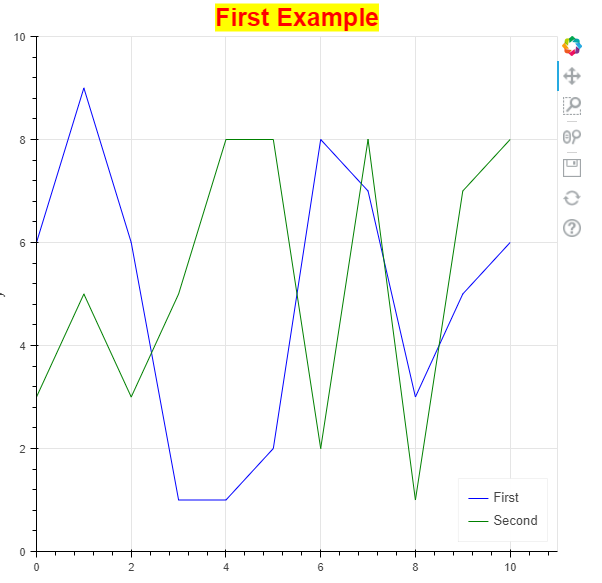
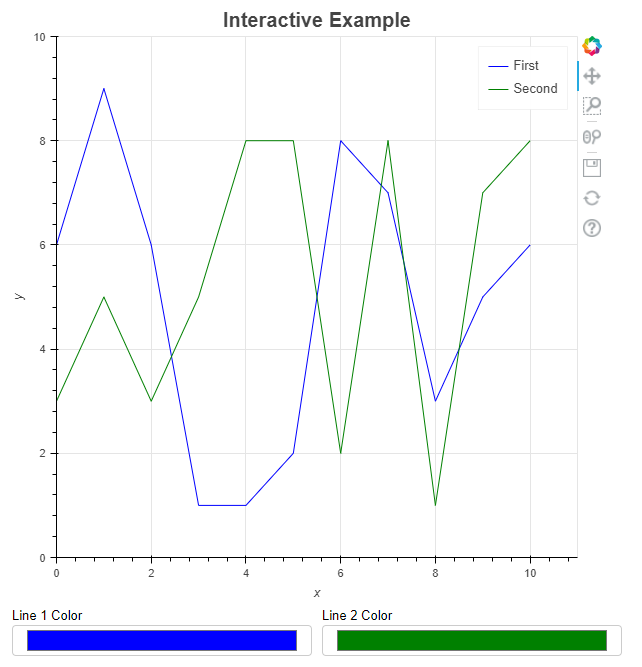
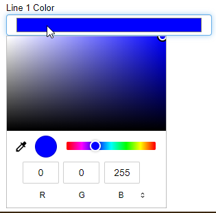
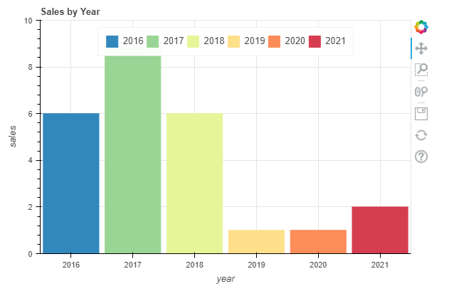

[Bokeh](https://bokeh.org/) is an interactive visualization library that focuses on browser output. This guide introduces you to Bokeh with example code that creates line and bar graphs.

## Bokeh vs. Matplotlib

While Bokeh and Matplotlib both help you plot data, these two libraries are different tools for different purposes. If your focus is on website interactivity, then Bokeh is the better choice. Matplotlib, on the other hand, provides Python visualizations that integrate well with Jupyter Notebook. Bokeh can produce Jupyter Notebook output or send its output to a file. This functionality is explored later in the guide.

From a support perspective, Matplotlib enjoys far greater community support than Bokeh does. This may be because Bokeh has not been around as long as Matplotlib. However, given its age, Bokeh has a strong community.

When you use Bokeh, you find that it produces beautiful interactive graphics with less code than Matplotlib requires. In addition, Bokeh has an extensive library of glyphs that can be added to your visualizations. Matplotlib lacks such an extensive glyph library. Matplotlib provides additional drawing flexibility that allows you to make modifications directly to various axes. This reduces the effort needed to apply special effects and eases the addition of labels to pie charts. Bokeh is a very low-level product where you specify precisely how you want things drawn.

## Install Bokeh

This section shows you how to install Bokeh using Pip and Anaconda or Miniconda.


If you are not familiar with Pip, see our [Managing Python Packages and Versions on Linux](/docs/guides/how-to-manage-packages-and-virtual-environments-on-linux/#what-is-pip) guide. To learn how to install Anaconda, see our [How to Install Anaconda on Ubuntu](/docs/guides/how-to-install-anaconda/) guide.


1. Install Bokeh on your computer using Anaconda or Miniconda:

        conda install bokeh

    To install Bokeh using Pip, issue the following command:

        pip install bokeh

## Create Graph Visualizations with Bokeh

This guide's examples use Bokeh version 2.3.2, however, the examples should work with other versions of Bokeh. The example code in this section is meant to showcase a few of the capabilities you can expect from Bokeh.

1. To view which version of Bokeh you have installed on your system, open your Python interpreter and enter the following code:

    import bokeh as b
    print(b.__version__)

1. Create a new file named `main.py` and insert the following code:

    
import numpy as np
np.random.seed(1)

x = range(0, 11)
y1 = np.random.randint(1, 10, size=11)
y2 = np.random.randint(1, 10, size=11)

plot = figure(x_axis_label='x', y_axis_label='y',
              x_range=(0, 11), y_range=(0,10))

plot.title.text = "First Example"
plot.title.align = "center"
plot.title.text_color = "red"
plot.title.text_font_size = "25px"
plot.title.background_fill_color = "yellow"

plot.line(x, y1, color="blue", legend_label="First")
plot.line(x, y2, color="green", legend_label="Second")

plot.legend.location = "bottom_right"
plot.legend.click_policy="hide"

show(plot)
    

The code generates a series of random numbers to be used for the visualizations. To experiment with the same numbers in the code, call `np.random.seed(1)`.

The plotting process begins with a call to the `figure()` function. This function defines the characteristics of the plot as a whole, which includes the `x` and `y` axis labels, and the range of values for each axis.

The code defines styles for the plot's title. In this case, the title should appear in the center of the display, located above the plot, in red letters with a yellow background. The font size is a 25 point version of the default font.

Next, the code creates an interactive legend. When you click on one of the lines in the legend, that line disappears from view and its legend entry is grayed out. Click a second time and the line comes back.

The image below displays the graph that is rendered by the code above.

Like other plotting applications, you get some interesting controls by default. Unlike other plotting applications, you can change the tools to meet your needs using the techniques found in the [Bokeh user guide](https://docs.bokeh.org/en/latest/docs/user_guide/tools.html). For example, you can change the box zoom to a lasso tool, instead.

The right-hand column of the graph includes all of Bokeh's default tools. The list below outlines each one in order from top to bottom:

- A link to the Bokeh site.
- A panning tool that allows you to move the entire plot around as needed.
- The box zoom expands the area you select for better viewing.
- The wheel zoom uses the scroll wheel on the mouse to zoom into the area selected by the mouse cursor. This button stays on even if you select another tool, so you can pan and zoom, for example.
- A tool to save the current plot to disk.
- A button that resets the plot to a default condition.
- A link to view more information about configuring the plot tools.

### Add Controls to Your Bokeh Graph

The steps in this section show you how to add controls to a Bokeh graph. Before adding the controls, you should determine what these controls should do in your web browser environment. The example below shows one of many ways to create and use a control in Bokeh.

1. Create a new file named `main.py` and insert the following code:

    
from bokeh.layouts import column, row
from bokeh.models import ColorPicker

np.random.seed(1)

x = range(0, 11)
y1 = np.random.randint(1, 10, size=11)
y2 = np.random.randint(1, 10, size=11)

plot = figure(x_axis_label='x', y_axis_label='y',
              x_range=(0, 11), y_range=(0,10))

plot.title.text = "Interactive Example"
plot.title.align = "center"
plot.title.text_font_size = "20px"

line1 = plot.line(x, y1, color="blue", legend_label="First")
line2 = plot.line(x, y2, color="green", legend_label="Second")

picker1 = ColorPicker(title="Line 1 Color")
picker1.js_link('color', line1.glyph, 'line_color')
picker1.color='blue'
picker2 = ColorPicker(title="Line 2 Color")
picker2.js_link('color', line2.glyph, 'line_color')
picker2.color='green'

show(column(plot, row(picker1, picker2)))
    

The example above lets you change the graph's line colors using a `ColorPicker` control. The code generates two controls, one for each line. Instead of using the default color of black for the `ColorPicker`, it uses the colors defined earlier in the code. When you show the figure on screen using `show()`, you define how to display the controls using rows and columns. The output `column()` has two rows in it and the second row within the column contains a `row(`) with two columns: `picker1` and `picker2`.

The image below displays the rendered Bokeh graph with controls:

When you click one of the ColorPicker controls, Bokeh displays a color dropdown like the one shown in the image below. It's possible to choose any color just by selecting it using the various controls. When you close the dropdown, the line appears in the selected color.

Bokeh gives access to a considerable number of widgets that you can add to the plot, as described in the [Bokeh user guide](https://docs.bokeh.org/en/latest/docs/user_guide/interaction/widgets.html).

### Output your Graph to a Jupyter Notebook

You aren't restricted to web pages to display your Bokeh-generated visualizations. Bokeh also makes it possible to output to a Jupyter notebook using the `output_notebook()` function. You can also output to a file using the `output_file()` function.

Bokeh's built-in support of different output methods means the majority of your code can remain the same. The code below outputs a bar graph to a Jupyter notebook.

1. Create a new file named `main.py` and insert the following code:

    
from bokeh.plotting import output_notebook
output_notebook()

from bokeh.models import ColumnDataSource
from bokeh.palettes import Spectral6

years = ['2016', '2017', '2018', '2019', '2020', '2021']
np.random.seed(1)
number = np.random.randint(1, 10, size=6)

source = ColumnDataSource(data=dict(sales=years, amounts=number,
                                    year_color=Spectral6))

plot = figure(x_range=years, y_range=(0,10), title="Sales by Year", x_axis_label='year', y_axis_label='sales')
plot.height = 400
plot.width = 600

plot.vbar(x='sales', top='amounts', width=0.9, color='year_color',
          legend_field='sales', source=source)

plot.legend.orientation = "horizontal"
plot.legend.location = "top_center"

show(plot)
    

    The code above introduces a few features not yet explored in this guide. The code creates labels for the `x-axis` instead of using numbers. The `ColumnDataSource()` function contains a dictionary with the x-axis, y-axis, and the colors to use for them. Creating the `figure()` is the same as before, except you use the list of `x-axis` label names in place of numeric labels this time.

    The `vbar()` function call uses the dictionary keys for the `x-axis`, `y-axis`, `colors`, and `legend` values. You do this by specifying the source argument with the source of the information.

    The rendered example below displays the legend in a horizontal format at the top of the display. The bar graph colors make it easier to distinguish between years.

    

## Conclusion

This guide highlights a few of Bokeh's features. However, there are many more visualization tools provided by Bokeh that you can discover by viewing the [Bokeh gallery](https://docs.bokeh.org/en/latest/docs/gallery.html). If you use Jupyter Notebook to create your Python code, explore the [Binder live tutorials](https://mybinder.org/v2/gh/bokeh/bokeh-notebooks/master?filepath=tutorial%2F00%20-%20Introduction%20and%20Setup.ipynb) to learn more.

Bokeh is a unique plotting tool that deserves a place in your toolbox. It's also not a replacement for Matplotlib, which is more of a general-purpose tool. It also does not replace [seaborn](https://seaborn.pydata.org/), which is often used for machine learning output. This is the tool to use when you need to create graphical output to explain the abstractions of your latest code. With Bokeh, the output looks great and provides interesting user interactivity tools.
