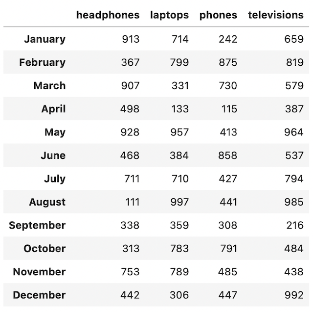
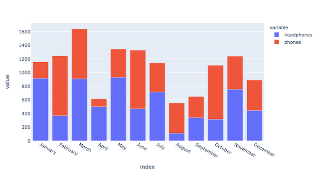
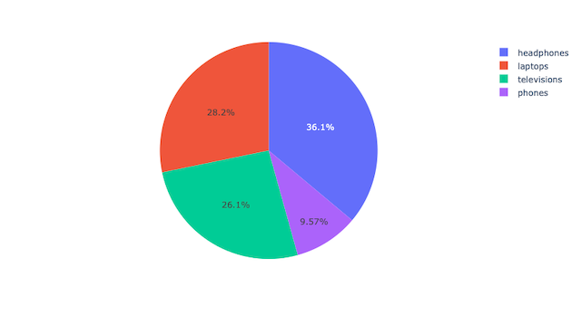

Python has a wide variety of visualization libraries some of which you might already be familiar with such as Matplotlib. However, this article will instead be going over one of the lesser known visualization libraries called **Plotly**. Plotly is an interactive, easy to use graphing library. It can fulfill all your data visualization needs in place of Matplotlib. It also integrates with Python’s Pandas library to further streamline the data visualization process. The following guide will show you how to use Plotly’s Express module to quickly get you started with Plotly.

## Before You Begin

In order to fully comprehend the benefits of using Plotly, it is recommended to use *JupyterLab* as your IDE of choice. The following code examples in this guide uses JupyterLab to demonstrate the interactive nature of the Plotly library. 

1.  You must first install Plotly since it is not one of Python's default libraries. Plotly installation can be done within an open jupyter notebook file. To begin installation, open JupyterLab and run the following command inside an empty cell:

		!pip install plotly

2.  You must also import the required Python libraries. In the next empty cell, import the following libraries:

		import pandas as pd
		import plotly.express as px
		import random
		import calendar

## Creating Data
In order to start using Plotly, you will need to construct a Pandas dataframe with the following data points in order to create some sample data. For this example, the data here represents electronic product sales over the course of one year:


df = pd.DataFrame(
    {
        "headphones": random.sample(range(100,1000), 12),
        "laptops": random.sample(range(100,1000), 12),
        "phones": random.sample(range(100,1000), 12),
        "televisions": random.sample(range(100,1000), 12)
    },
    index=[calendar.month_name[i] for i in range(1,13)]
)


The dataframe you just created should resemble the following:


Due to the random nature of the data, you may have different values in your dataframe and in the following visualizations. Don't worry, different values do not matter for this guide.


## Using Plotly
With the data stored in a pandas dataframe, you are ready to begin using Plotly. The first and most appropriate visualization for this sample data is a bar chart.

### Generate a Bar Chart
To create a bar chart with plotly, you need to create a variable (`fig`) instantiating the Plotly Express module with the dataframe you just created.

		fig = px.bar(df)

Run the following code in the same or next cell to display the bar chart:

		fig.show()

You should now see a bar chart resembling the one below:

As you can see, Plotly's integration with Pandas makes visualizing any dataframe that much easier. In just two lines of code, you were able to create a great looking bar chart. If the chart was created within JupyterLab, feel free to interact and play around with your newly created bar chart.

## Visualization Options
If you need to alter the look of the bar chart you just created, Plotly has several parameters allowing you to manipulate the chart visualizations.

### Select Columns
You can specify distinct columns from the dataframe to visualize instead of all of them. Provide a list of names of the columns you wish to visualize in the `y` parameter within the plotly object you instantiated:


fig = px.bar(
	df,
	y=['headphones', 'phones']
)

fig.show()



**Output result:**

### Bar Mode 
For Plotly’s bar chart, there is a parameter called `barmode` which changes the look of the bar chart. The options allowed for this parameter are either one of `"group"`, `"overlay"`, or `"relative"`. By default, `barmode` is set to `"relative"`. Enter `"group"` for the `barmode` parameter to show the bars side-by-side instead of stacked:


fig = px.bar(
	df,
	y=['headphones', 'phones'],
	barmode='group'
)

fig.show()



**Output result:**

### Labeling
You can also add a title and labels to the bar chart. Enter a string for the `title` parameter and pass a dictionary for the `labels` parameter. The dictionary’s keys should be the words you wish to replace and their respective values are the words you wish to use instead:


fig = px.bar(
    df,
    y=['headphones', 'phones'],
    barmode='group',
    title="Product Sales in a Year",
    labels={
        "value": "# of Units",
        "index": "Month",
        "variable": "Item"
    }
)

fig.show()



**Output result:**

## Other Chart Examples
Plotly offers more than just bar charts for data visualization. For this example dataset, you can also view the data as a line chart or pie chart. 

### Line Chart
Plotly’s line graphs are very similar to the bar charts. There are a lot of overlapping parameters between the two and it can be customized the same way. To represent the example data as a line chart, take the initial example of Plotly's bar chart object but instead of instantiating a bar chart object, you must instantiate a line chart object:

		fig = px.line(df)

		fig.show()

**Output result:**

### Pie Chart
For pie charts, you need to specify a specific portion of the dataframe in order to appropriately graph the data. Plotly’s pie charts have different parameters which you need to consider. To plot a pie chart, you need to specify variables for the `values` and `names` parameters. In the context of the example data, the `values` parameter is provided a specific month to view its share of product sales. The `names` parameter is provided the dataframe columns to view the specific products sold during that month. Enter the following code and display the results:


​​fig = px.pie(
    df,
    values=df.loc['January'],
    names=df.columns
)

fig.show()



**Output result:**

The example can also be done inversely so that you may see the results of one product’s share of sales over each month. Instead of designating a month for the `values` parameter, designate a column. Pass the dataframe’s index for the `names` parameter:


​​fig = px.pie(
    df,
    values=df['laptops'],
    names=df.index
)

fig.show()



**Output result:**

## Next Steps
Plotly has many other chart options for you to explore. Feel free to check out the links at the end of this guide to discover more of what Plotly has to offer.

