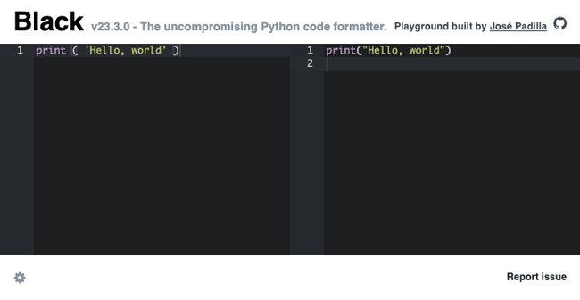

[Python](/docs/guides/development/python/) is one of the world's most widely used programming languages, with general acceptance in web development, data science, and embedded systems. Python's formal syntax is somewhat open, as it permits a considerable range of styles. This allows programmers to indent, punctuate, and name according to their personal preferences.

However, projects spanning larger teams benefit from consistency. While an application written in a number of different styles is no less correct, these different styles becomes a distraction to those maintaining the code. For instance, the following two example Python fragments execute identically:

```file {lang="python"}
if is_late :
  print(    'It's late.')
else :
      print("On-time."  )
```

```file {lang="python"}
if is_late:
  print("It's late.")
else:
  print("On-time.")
```

However, the unusual punctuation of the first example draws attention away from what the code actually accomplishes.

Many organizations respond to such realities by adopting written [Style Guides](https://google.github.io/styleguide/). These internal policies dictate the inclusion of copyright notices, choice of tab stop, and more. Experience shows that Style Guides are most closely observed when their adherence is automatic. That's where [Black](https://github.com/psf/black) and [isort](https://github.com/PyCQA/isort) come into play. Both are formatting tools that automatically apply to Python code. They help Python programmers express themselves in a consistent and readable style that promotes clear understanding across an entire team.

isort's scope is narrow. It mostly concentrates on `import` statements, which Python programs use to refer to external packages.

Black is more ambitious. It addresses nearly everything about a Python source, such as spacing within and between statements, and punctuation selections.

## What Do Black and isort Do?

In the simplest terms, Black and isort both *format* Python code. The closest synonyms to "format" would be "prettify" (e.g. JavaScript) or "standardize". However, Black's inventor [Łukasz Langa](https://lukasz.langa.pl/), the [CPython Developer in Residence](https://realpython.com/podcasts/rpp/82/), consistently describes Black as a "formatter".

Black and isort both help Python programs look better and conform to a standard. They restyle Python code that doesn't match that standard. Think of them as spellcheckers for programmers. Like spellcheckers, they don't change the content of what you write, they simply polish its rough edges.

### Using Black and isort Online

The simplest possible Python program is "Hello, World":

```file {lang="python"}
print ( 'Hello, World.' )
```

```output
Hello, World.
```

Open a web browser and navigate to [this URL](https://black.vercel.app/?version=stable&state=_Td6WFoAAATm1rRGAgAhARYAAAB0L-Wj4AB9AFNdAD2IimZxl1N_WmOQqEcOUg5PabNV_4VCnlTimMkQYl49QWCrlz2TpRZTkGLPX6fSXiLn3AB5RNZFp-lv2yEhf3pqorrWzVuXIUI6dF-MWQb_ELsAAADgXdNgINz_0AABb354nl51H7bzfQEAAAAABFla):

[](Black-Playground.png)

The "Hello, World" Python program from above appears in the left-hand pane. Meanwhile, the right-hand pane displays this subtly transformed version:

```file {lang="python"}
print("Hello, world")
```

It eliminated blank spaces and replaced single quotes with double quotes. This Guide explains how the [Black](https://github.com/psf/black) and [isort](https://pycqa.github.io/isort/) Python formatting tools work, and their implications for your own programming.

The web application above is able to do much more. Enter any Python code in the left-hand pane, and the right-hand pane outputs slightly different formatting without affecting the code's function.

[The Black Playground web application](https://black.vercel.app/) and the similar [live isort editor](https://pycqa.github.io/isort/docs/quick_start/0.-try.html) are wonderful assets. They allow anyone with web access to use Black and isort within seconds.

### Installing Black and isort Locally

While the web-based tools are easily accessible, frequent use of Black and isort deserves local installation. Despite the extra effort involved, a local installation integrated within your working environment is far more efficient. This might entail configuration of an [Integrated Development Environment (IDE)](https://www.linode.com/docs/guides/development/), a [Continuous Integration (CI)](https://www.linode.com/docs/guides/development/ci/) platform, or other minor complexities.

Any environment with [Package Installer for Python (pip)](https://pypi.org/project/pip/) can immediately install Black and isort.

1.  Use the following command to install both Black and isort:

    ```command
    pip install black isort
    ```

    
    Some environments require a version number on the `pip` command, so you may need to use an alternate form:

    ```command
    pip3 install black isort
    ```

    Or perhaps:

    ```command
    python3.10 –m pip install black isort
    ```
    

1.  Issue the following command to confirm the installations:

    ```command
    black –version; isort –version
    ```

    ```output
    black, 23.3.0 (compiled: yes)
    Python (CPython) 3.9.2

                     _                 _
                    (_) ___  ___  _ __| |_
                    | |/ _/ / _ \/ '__  _/
                    | |\__ \/\_\/| |  | |_
                    |_|\___/\___/\_/   \_/

          isort your imports, so you don't have to.

                        VERSION 5.12.0

    ```

## Benefits of Black and isort usage

In broad terms, stylistic standardization is desirable in many programming contexts. Python is a flexible language as many possible variations can end in the same result equally well. However, adopting conventions simplifies programming chores, allowing you to focus on the end result.

### Benefits of Consistent Coding Practices

There is extensive research published on ["Why you should use Black …"](http://www.locallyoptimal.com/blog/2019/08/23/why-you-should-use-black-for-your-python-style-linting/), and the benefits of ["Consistent Python code with Black"](https://www.mattlayman.com/blog/2018/python-code-black/). ["Using Black …"](https://hackernoon.com/using-black-to-auto-format-your-python-8cu338f) even floats the possibility that an employer might choose you for your well-formatted source. If you are ["Tired of Pointless Discussions on Code Formatting …"](https://towardsdatascience.com/tired-of-pointless-discussions-on-code-formatting-a-simple-solution-exists-af11ea442bdc), Black is a simple low-cost response. ["Why Prettier?"](https://towardsdatascience.com/tired-of-pointless-discussions-on-code-formatting-a-simple-solution-exists-af11ea442bdc) summarizes these arguments concisely, and while it applies to JavaScript, nearly all of the arguments apply equally to Python.

For even more from people with real-world experience, study these threads on [HackerNews](https://news.ycombinator.com/item?id=30130315) and [Reddit](https://www.reddit.com/r/Python/comments/8lmnzr/thoughts_on_black/). As one of the contributors declares, ["...Black is truly a huge blessing in the Python ecosystem"](https://news.ycombinator.com/item?id=30131185).

### Black vs. isort

As both Black and isort are Python formatters, their usage is quite similar.

-   To have Black act on an `example.py` file, enter this command:

    ```command {title="Black"}
    black example.py
    ```

-   To perform the same function in isort, issue this nearly identical command:

    ```command {title="isort"}
    isort example.py
    ```

By default, both Black and isort write changes directly to the specified file. Both formatters also follow similar syntaxes for managing multiple sources.

Neither changes the function of the code they format. Black takes this so seriously that, by default, it [executes a specific test to confirm "code equivalence"](https://black.readthedocs.io/en/stable/the_black_code_style/current_style.html#ast-before-and-after-formatting) each time it's invoked.

However, the two utilities assume different responsibilities:

-   Black addresses nearly all stylistic questions, including tabs versus spaces, indentation count, quote characters, lexeme separators, and much more. Black is opinionated. It makes choices, even between close alternatives.

-   In contrast, isort only does one thing. As its name implies, isort literally just sorts [`import` statements](https://docs.python.org/3/reference/import.html) ("isort" = "`import` sort").

    Import statements tell Python programs how to use external resources. When first learning Python, `import` has little importance, as the focus is on Python's built-in features, and how to use them. However, as Python programs grow, their content increasingly changes from stand-alone algorithms to coordination between external assets. Commercial-grade Python programs often start with a full page of references to other modules. In such situations, sorting and formatting `import` statements is a significant advantage.

### Who Uses Black and isort?

Many of the most celebrated open source [Python projects use Black](https://github.com/psf/black#used-by), including such recognizable names as Twisted, [Django](https://www.linode.com/marketplace/apps/linode/django/), and [Pytest](https://www.linode.com/docs/guides/python-testing-frameworks-for-software-unit-testing/). Mozilla, Facebook, and Tesla are among the thousands of commercial Python users that count on Black.

### When to Use Black and isort

If your programming work is [collaborative](https://simpleprogrammer.com/working-on-a-team/), you're likely to benefit from using Black and isort. For example, if you're a member of a larger project, cooperate with others on a common goal, or simply want to [style your work more consistently](https://sunnysingh.io/blog/readable-code).

Black and isort's potential goes far beyond what's been demonstrated so far. Experiment with them both for a few minutes to learn their actions and discover what they can do for you. You might find why [celebrated Python contributors testify](https://github.com/psf/black#testimonials) that Black is the single greatest productivity tool for their programming.

### When Not to Use Black and isort

As a Python programmer, Black and isort are entirely optional. If your formatting already satisfies you or your Python programs are completely private, perhaps Black and isort aren't for you. These tools don't functionally improve your programming, they simply restyle it.

## Black and isort Examples

Black and isort can be used in a number of different ways. Use the following command to invoke both Black and isort as command line utilities on your local desktop or [Linode server](/docs/guides/use-a-linode-for-web-development-on-remote-devices/):

```command
black example.py; isort example.py
```

This results in an updated `example.py` file that is restyled to the Black and isort standards.

### Quotes

The earlier web-based demonstration showed a simple change in quoting, but Black is capable of much more. Python supports four distinct quoting sequences and at least as many continuation styles. The example below illustrates Black's standardized formatting among all these choices:

```file {title="Before" lang="python"}
def my_func():
    '''This is the docstring'''
    print('I\'m glad we made it this far.')
```

```file {title="After" lang="python"}
def my_func():
        """This is the docstring"""
        print("I'm glad we made it this far.")
```

### Lists

Black indents long lists consistently, for example:

```file {title="Before" lang="python"}
mylonglist = [first_variable, second_variable,
                "a literal", other_stuff, 42,
                long_variable_name, None]
```

```file {title="After" lang="python"}
mylonglist = [
    first_variable,
    second_variable,
    "a literal",
    other_stuff,
    42,
    long_variable_name,
    None
   ]
```

### Comprehensions

Comprehensions (i.e. [list comprehensions](https://docs.python.org/3/tutorial/datastructures.html#list-comprehensions) and [set comprehensions](https://docs.python.org/3/tutorial/datastructures.html#sets)) have a reputation of being difficult. Black helps by formatting comprehensions in a consistent and relatively understandable way, for example:

```file {title="Before" lang="python"}
return [factory.configuration["private"].decode()[0] for factory in factories if factor.is_active()]
```

```file {title="After" lang="python"}
return [
    factory.configuration["private"].decode()[0]
    for factory in factories
    if factor.is_active()
   ]
```

### Default Arguments

Black parses default arguments as such:

```file {title="Before" lang="python"}
def myfunc(a, b = None, c:dict|None=None)->Result:
    return X
```

```file {title="After" lang="python"}
def myfunc(a, b=None, c: dict | None = None) -> Result:
    return X
```

### Continued Lines

Black works around most line continuations, for example:

```file {title="Before" lang="python"}
result = ridiculously_long_variable_name01234567890123456789012345678901234567890 + \
b / 13
```

```file {title="After" lang="python"}
result = (
    ridiculously_long_variable_name01234567890123456789012345678901234567890 + b / 13
   )
```

### Operators

Black reinforces Python's rules for operator precedence with judicious formatting whenever possible:

```file {title="Before" lang="python"}
    result=base ** exponent*3
    return model(** model_args+x)
```

```file {title="After" lang="python"}
    result = base**exponent * 3
    return model(**model_args + x)
```

### Other White Space

Black punctuates consistently and aesthetically, particularly in regard to white space, for example:

```file {title="Before" lang="python"}
transposed_1,transposed_2=original_2,original_1
```

```file {title="After" lang="python"}
transposed_1, transposed_2 = original_2, original_1
```

### Imports

isort both alphabetizes and groups:

```file {title="Before" lang="python"}
import .tests, requests, my_module, sys
```

```file {title="After" lang="python"}
import sys

     import my_module
     import requests

     import .tests
```

In this example, the [built-in](https://www.tutorialsteacher.com/python/python-builtin-modules) `sys` comes first. Third-party references appear next, and the [relative](https://docs.python.org/3/reference/import.html#package-relative-imports) reference to the local `tests` module appears last. Many commercial Python programming teams find this sorting and grouping improves the readability of their `import` statements.

## Black and isort Configuration Options

Part of the philosophy common to Black and isort is ["… that configurability … is purposefully limited"](https://black.readthedocs.io/en/stable/usage_and_configuration/index.html).

### Useful Default Options

Black's `target-version` specifies the version of Python you target. Black behaves differently in a Python 3.10 context than it does for Python 3.6. Those differences deserve to be an early focus of your own Black use.

isort supports a dozen different options for [formatting multiline imports](https://pycqa.github.io/isort/docs/configuration/multi_line_output_modes.html). Using "Vertical Hanging Indent" has the best compatibility record with Black, configured as:

```command
multi_line_output = 3
```

### Choice of Editor

Both Black and isort are compatible with popular [Interactive Development Environments (IDEs)](https://www.linode.com/community/questions/6576/ide-with-linode). A plugin is available for IntelliJ, PyCharm, and VS Studio that allows Black and isort to automatically format code as you type. Search your IDE's plugin catalog for details.

### Line Length Configuration

[Black defaults to 88 characters per line](https://test-black.readthedocs.io/en/latest/the_black_code_style.html#line-length). Large organizations are known to use values from 80 to 120, and Black makes it easy to adjust `max-line-length`.

Make sure to align any line length setting for both Black and isort, along with other tools such as Flake8 and Pylint. When not aligned, they attempt to correct each other, causing confusion. Different tools may not have the same default settings for line length, so be sure to configure them appropriately.

### Black and isort in Continuous Integration (CI)

Part of the enthusiasm for Black and isort has to do with their role in transforming source code reviews. In the absence of automated formatters, human reviewers take responsibility for enforcement of organizational style guides and policies. The conversations which result are a big part of what gives source reviews their [reputation for dysfunction](https://blog.submain.com/code-review-horror-stories/).

Automatic source formatting transforms those conversations. When Black and isort are part of [Continuous Integration (CI)](https://www.linode.com/docs/guides/development/ci/) pipelines, automatic processes take care of most formatting matters.

Black and isort are straightforward command line tools that are already widely used in CI. Whether your platform of choice is GitHub, GitLab, or Jenkins, plugins for Black and isort are likely available.