Pandas is a popular library for Python programming. Data Scientists, Data Analysts, and Data Engineers alike are ardent users of the Pandas library. This guide goes over the basics of Pandas, how to use it for simple data processing and transformation, as well as some key commands to get you started. In the end, you should feel confident in using Pandas for your own custom dataset.

## Before You Begin

Pandas can be used with any Python compatible IDE. To follow along with this guide, it is recommended to use JupyterLab or Jupyter Notebooks as your IDE. JupyterLab and Jupyter Notebooks are able to immediately output the results of the various Pandas code used throughout this guide.

## Installing Pandas

Pandas is not one of Python’s standard libraries so you must install Pandas separately. The process of installation is simple, run the following code within an empty cell in Jupyter:
	
	!pip install pandas

## Importing the Required Libraries

In the following cell, import the following libraries:

	import pandas as pd
	import random

## Creating Data

Create some example data in order to utilize Pandas. In this guide, Python’s random library is used to construct the 100 data points representing food sales at a restaurant. 


# Food sales
hotdogs = random.sample(range(1,100), 99)

burgers = random.sample(range(1,100), 99)

pizza = random.sample(range(1,100), 99)

# Appetizers
fries = random.sample(range(1,100), 99)

chips = random.sample(range(1,100), 99)

# Desserts
donuts = random.sample(range(1,100), 99)

ice_cream = random.sample(range(1,100), 99)


## Loading Data into a Pandas DataFrame

A Pandas DataFrame is used to store and present data in an organized way. The look and appearance of a DataFrame is similar to an Excel spreadsheet or any other data table. In order to simplify the process of creating a Pandas DataFrame, follow these steps:

1. Create a simple Python dictionary containing the names of the food and their respective variables of lists.


# Creating the food dictionary
food_dict = {
    'hotdogs': hotdogs,
    'burgers': burgers,
    'pizza': pizza
}

# Creating the appetizer dictionary
app_dict = {
    'fries': fries,
    'chips': chips
}

# Creating the dessert dictionary
dessert_df = {
    'donuts': donuts,
    'ice_cream': ice_cream
}


2. Instantiate the Pandas DataFrame method with the dictionaries in order to complete the construction of three separate DataFrames.


# Creating the food dataframe
food_df = pd.DataFrame(food_dict)

# Creating the app dataframe
app_df = pd.DataFrame(app_dict)

# Creating the dessert dataframe
dessert_df = pd.DataFrame(dessert_df)


3. Use the `display()` function and run the cell to view the newly created DataFrames.


# Viewing the DFs
display(food_df)

display(app_df)

display(dessert_df)


*See below the result of displaying these DataFrames:*

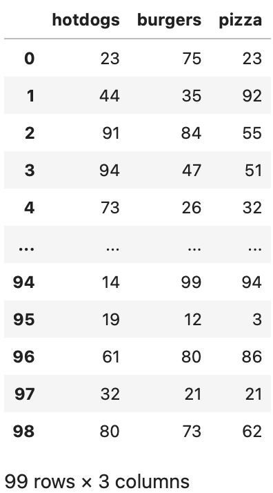 
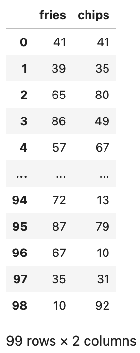 
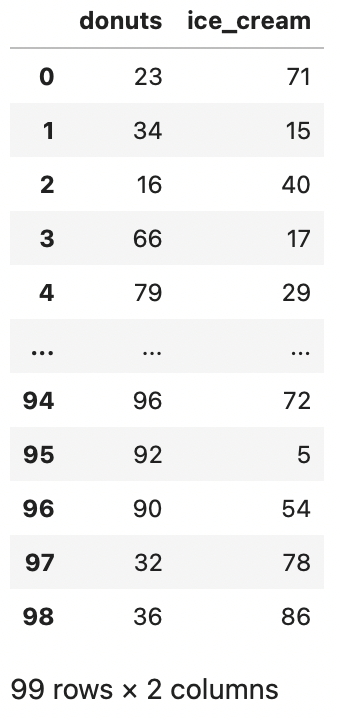

## Combining DataFrames
One of the first things to know about Pandas is its ability to join, merge, or concatenate DataFrames together. Create a new variable called `df` to get started. In this variable, use the `pd.concat()` function and input the three DataFrames as a list. Designate the axis as one to combine the data on their shared indexes rather than adding a new row.


df = pd.concat(
    [food_df, app_df, dessert_df],
    axis=1
)


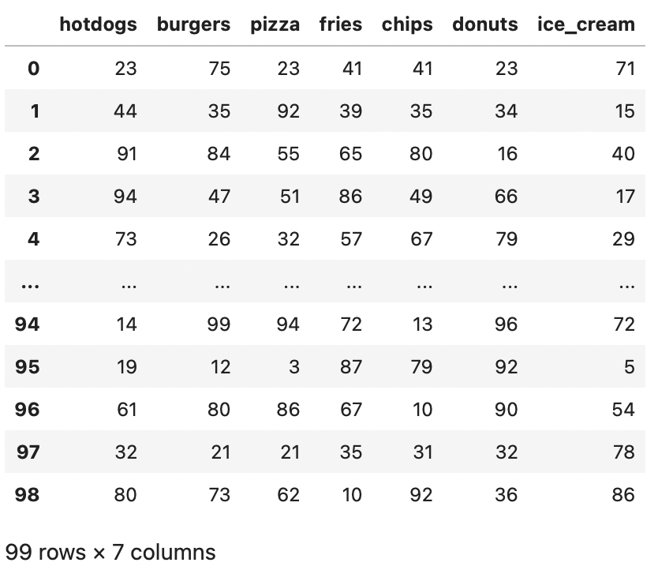

## Adding New Data to a DataFrame

### Adding a New Column
To add data to an existing DataFrame, enter a new column name and assign the data you wish to add. Start by creating a new column called `candies` and assign it a value of 99. Every row in this column will now display a value of 99.


# Adding new column with one value
df['candies'] = 99


### Adding a New Row
Adding a new row is a little more complex than adding a new column. Create a dictionary containing the names of all the columns in the existing DataFrame with the values being the value to add for a specific row and column pair. The example below adds the value of 99 for every column in the new row.


# Adding new row
new_row = {
    'hotdogs': [99],
    'burgers': [99],
    'pizza': [99],
    'fries': [99],
    'chips': [99],
    'donuts': [99],
    'ice_cream': [99],
    'candies': [99]
}


With the dictionary, use the `pd.concat()` function again the same way as before. However, this instance of the concat function will have different values for the `axis` and `ignore_index` parameters. These values will allow a new row to be added to the existing DataFrame.


# Appending the new row
df = pd.concat(
    [df, pd.DataFrame(new_row)], 
    axis=0, 
    ignore_index=True
)


*Once the new column and row have been added, the DataFrame should appear like so:*
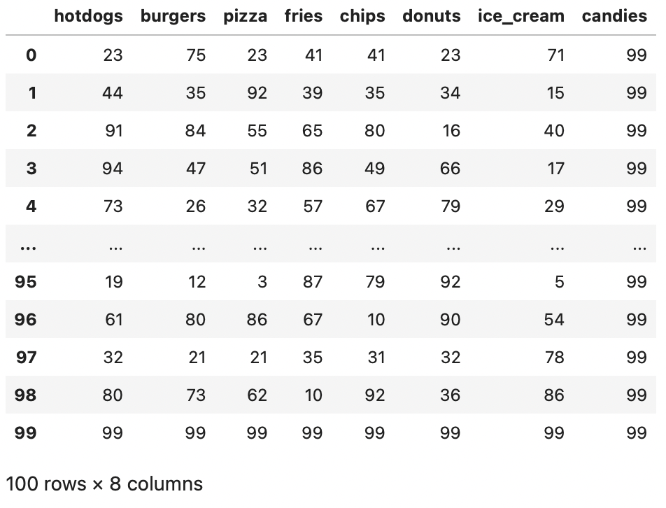

## Selecting a DataFrame Column or Columns
### Selecting One Column

State the column name next to the DataFrame variable to select a specific column and view its data.


# Just one column
df['fries']


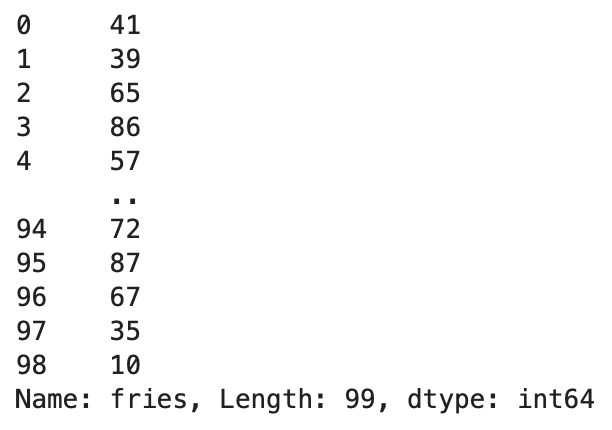

### Selecting Multiple Columns

Provide a list of the column names in the same manner as you have done for just one column name. This will return a DataFrame containing the columns specified.


# Multiple columns
df[['fries', 'chips']]


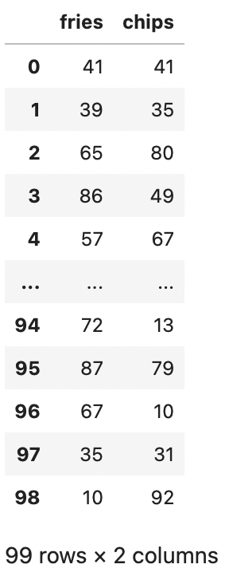

## Filtering Data from the DataFrame
You must apply filters to view or select rows containing or not containing a specific set of values. In the same way you selected a column, you can designate a column to select a specific set of data. Select all rows with the column `fries` having a value greater than or equal to ten.


# Removing low count of fries
df[df['fries']>=10]


*Notice the lower count of rows in the DataFrame output below:*
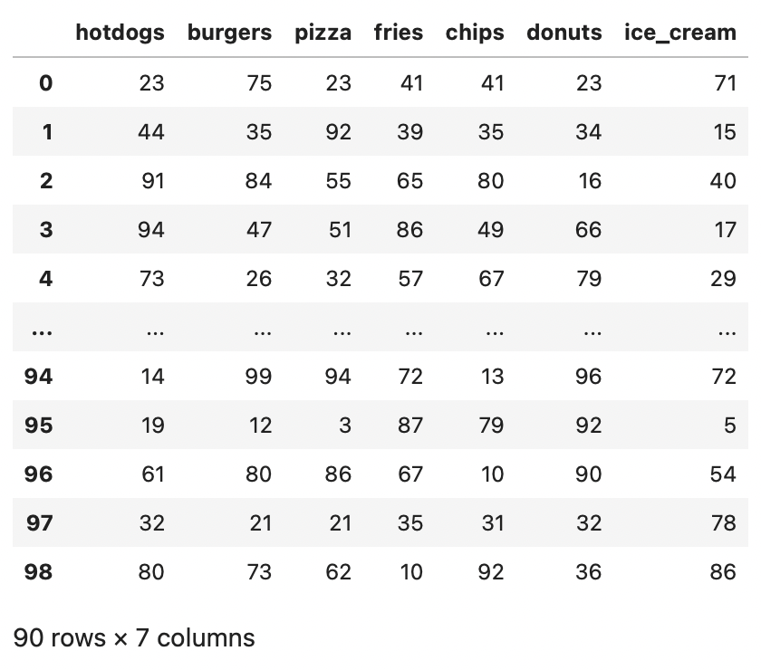

Another method is to use the `query` function and input a string command similar to other query languages. Inverse the previous statement to select all rows less than ten.


# Remove rows (query method)
df.query('fries<10')


*These are the remaining rows after the query:*
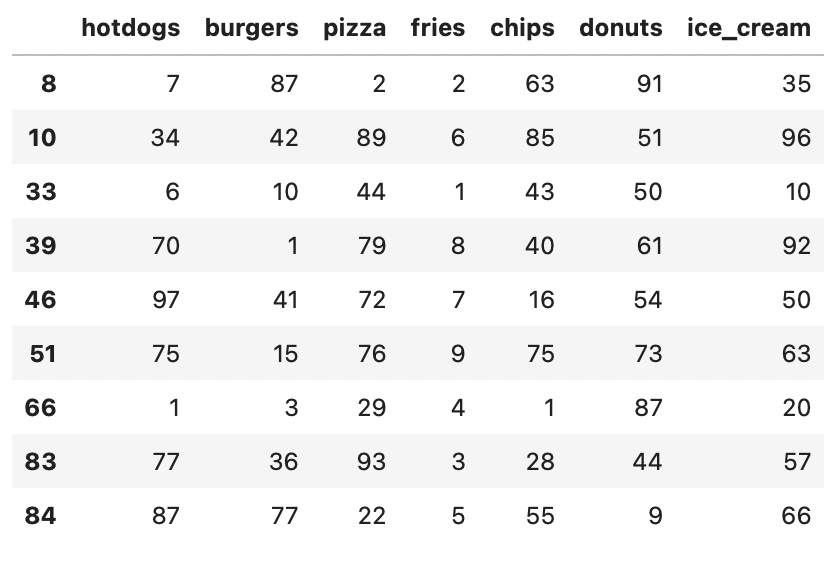

## Handling Missing Data
Filtering out too much data may result in missing or null values. In the following example, the DataFrame has been filtered to output values greater than 25. This action resulted in many null values within the DataFrame.


# Filtering out too much and creating missing data
nan_df = df[df>25]


*See the missing (NaN) values below:*
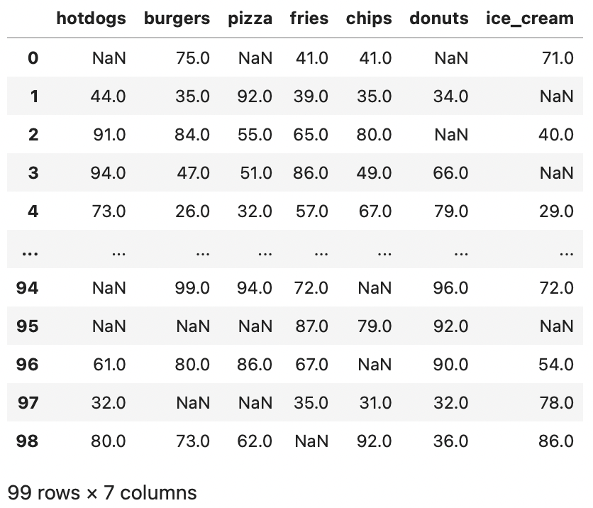

There are many approaches to handling missing or null data within a DataFrame. This guide goes over four basic techniques for dealing with null values.

### Filling in Null Values 
Fill the missing data with any given value. In this example, the missing data is filled or replaced with a value of zero.


# Filling with zeroes
fill_0 = nan_df.fillna(0)


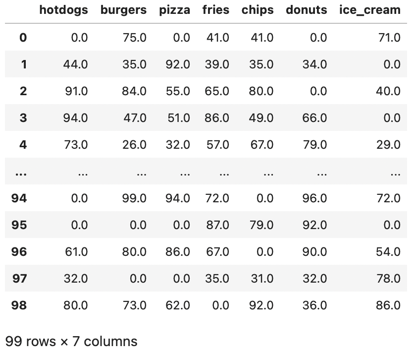

### Filling in with Previous Value
Fill the missing data with the value from the prior row. However, this technique may result in the *first* row still containing a missing value (if it has one) since there is no prior row to draw data.


# Filling with previous value
prev_fill = nan_df.ffill()


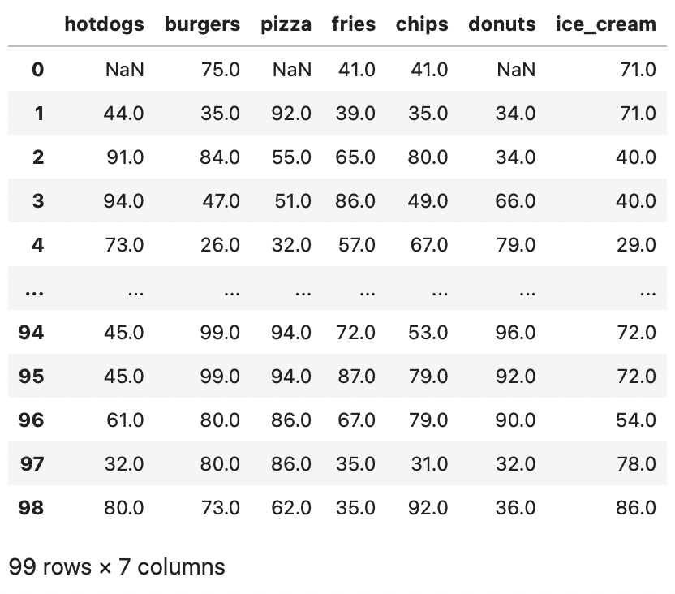

### Filling in with Succeeding Value
Fill the missing data with the value from the next row. However, similar to before, this approach may result in the *last* row still containing a missing value (if it has one) since there is no succeeding row to use.


# Filling with future value
next_fill = nan_df.bfill()


### Dropping the Missing Values
Drop any row containing a null value. This method drops any row with a missing value. However, this method may eliminate many rows of data and shrink the resulting DataFrame.


# Dropping the missing data
dropped = nan_df.dropna()


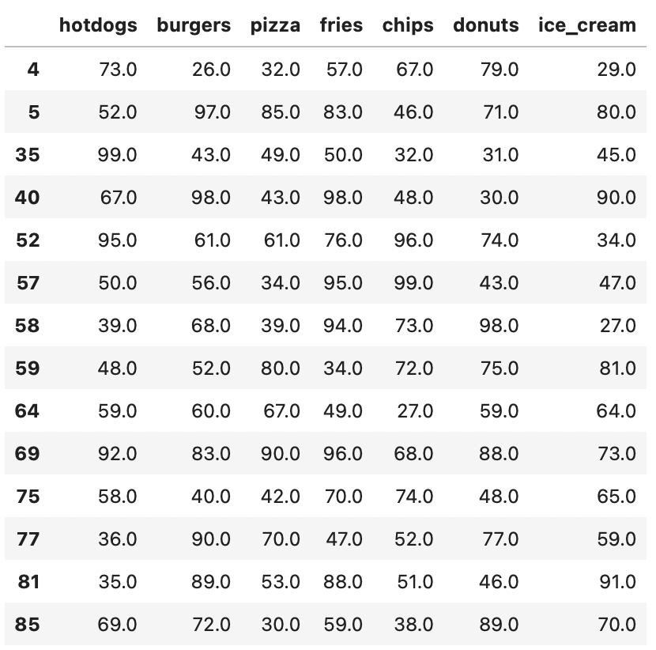

## Transforming the Data
Data manipulation can be performed within the DataFrame. In the following example, all the values in the DataFrame are doubled using Pandas’ `apply` method. This method uses a provided function, in this case a Python Lambda function, to apply to the entire DataFrame. The example below uses the `apply` method to double all the values in the DataFrame.


# Double the values from the dropped dataframe
doubled = dropped.apply(lambda x: x * 2)


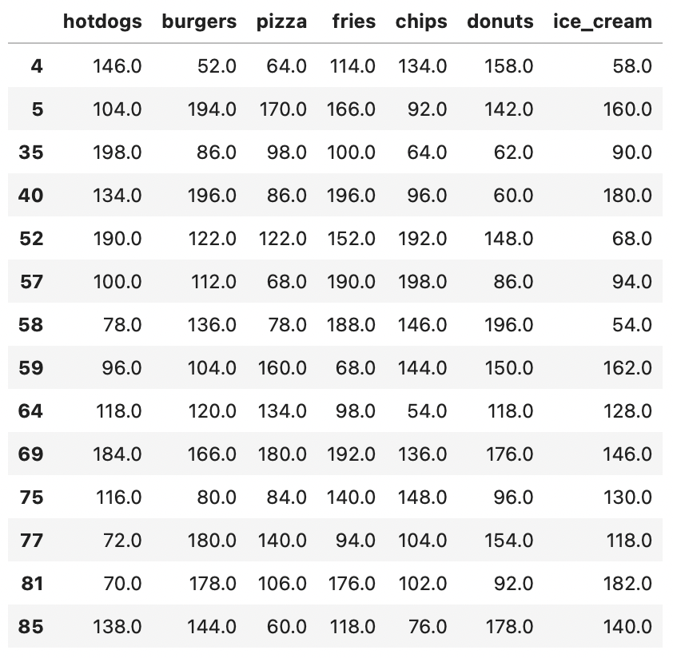

If the index values are not what is desired, you can reset them. Use the `reset_index` function with the parameters `inplace` and `drop` set to True. This makes sure the `reset_index` function applies the changes to the DataFrame and drops the previous index.


# Resetting the index
doubled.reset_index(inplace=True, drop=True)


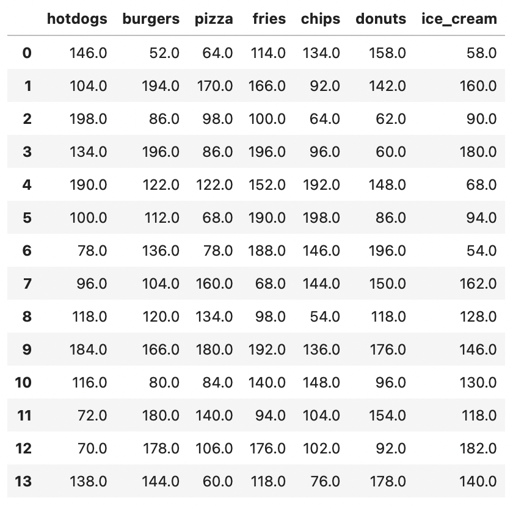

## Saving the DataFrame
Use Pandas’ `to_csv` method and enter a filename to save the DataFrame for later use. This function creates a CSV file containing the data from the provided DataFrame.


# Saving the dataframe
doubled.to_csv('intro_df.csv')


To make sure the data was saved correctly, view the recently made CSV file using Pandas’ `read_csv` function and providing the appropriate filename.


# Viewing the saved dataframe
pd.read_csv('intro_df.csv', index_col=0)


*The resulting DataFrame should be exactly the same as the one just saved.*

