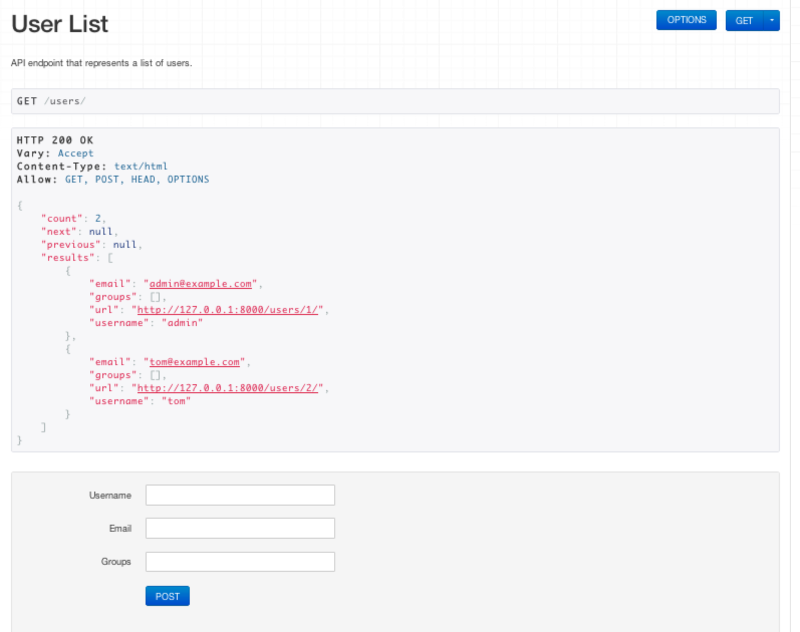
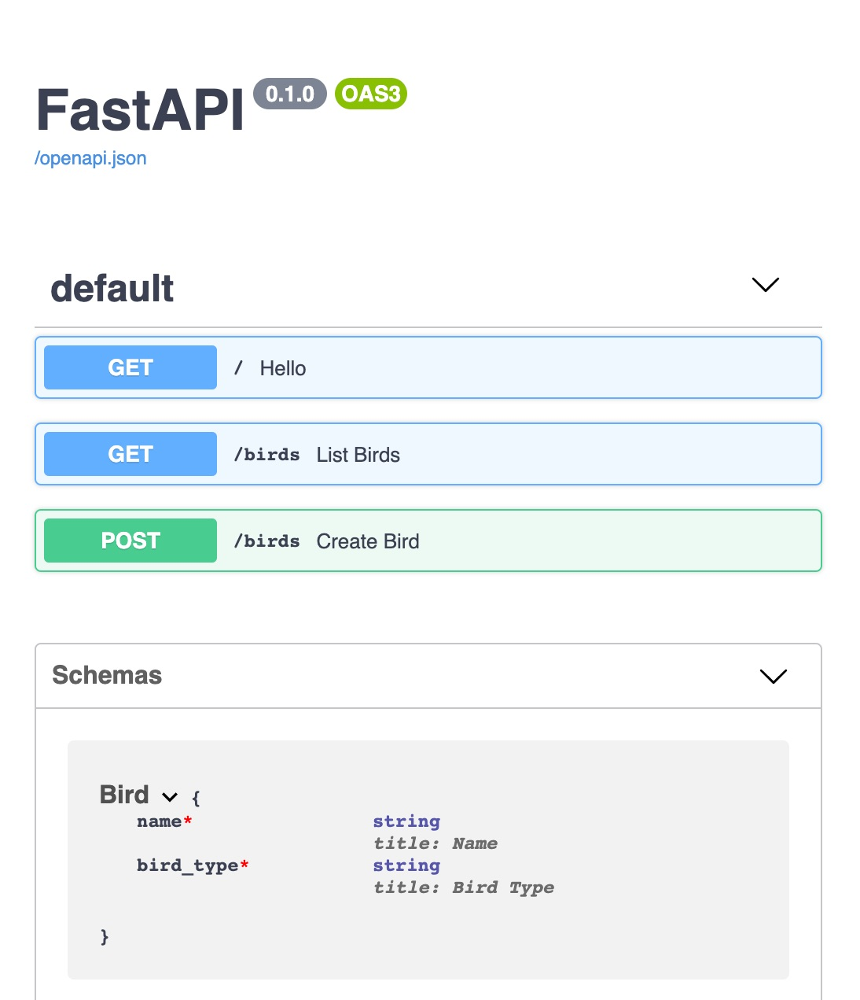

As one of the most popular programming languages, the Python ecosystem offers a variety of frameworks to help you build a web API. You may need to build an API to serve data to a mobile application, a frontend website, or a machine learning project. Your project may only require routing functionality provided by a framework, or it may require an admin interface and a templating system, as well. Which framework you choose depends on your specific use case. To help you choose a Python framework, this guide provides an overview on some well-known Python frameworks used to build APIs and discusses their differences and strengths.

## Django-REST

Django is a full-featured web development framework that includes out-of-the-box solutions for user management, security, and database connections. To build a web API, you can use the [Django REST framework](https://www.django-rest-framework.org/tutorial/quickstart/) that is built on top of standard Django. If you ever wrote an API using [Ruby on Rails](/docs/guides/development/ror/), [Spring with Kotlin](https://spring.io/guides/tutorials/spring-boot-kotlin/), or Java, then Django will feel familiar.

### When to Choose Django-REST to Build Your API

Django-REST is an excellent option if your API needs to integrate with multiple databases, handle complex and numerous schema migrations, benefit from admin capabilities, or provide discovery endpoints. It is a front runner framework if you are building an enterprise-level application. Developer collaboration on a single Django project without merge conflicts is possible due to its modular design.

If you are looking for a slim, minimalist tool for building a REST API, Django is not the right choice. It is by far the *heaviest* of the four frameworks discussed in this guide. Django requires the most up-front expertise and knowledge about the framework to get started. However, it does include the most built-in functionality compared to the other frameworks. For example, it has its own *template engine* that you can use to build a user interface. It comes with an object-relational mapper (ORM), and it handles database migrations automatically from model schema changes. It provides an admin interface by default, with a UI that you can use to add objects to the database. Out-of-the-box, Django also provides a UI to try out your endpoints:

### Django-REST Quickstart

To begin using the Django-REST framework, install [Django](https://docs.djangoproject.com/en/3.1/intro/install/) and [Django REST framework](https://www.django-rest-framework.org/tutorial/quickstart/) using [pip](https://pypi.org/project/pip/), the package installer for Python:

        pip install django
        pip install djangorestframework

After the installation, create a directory to store your API and move into the directory:

        mkdir my-api
        cd my-api

Generate a Django project with the following command:

        django-admin startproject my-api
        django-admin startapp api

The previous commands create a collection of files and nested directories:


my-api/
    manage.py
    api/
        __init__.py
        settings.py
        urls.py
        asgi.py
        wsgi.py


The Django project contains one application named, `api`. Your project can contain several separate apps for different resources or services, if necessary. Refer to the official [Django documentation](https://docs.djangoproject.com/en/3.1/) to learn which files to update to add new routes, views, and models. Once you have initiated your local Django project, you can begin building out your REST API.

## Flask

[Flask](https://flask.palletsprojects.com/en/1.1.x/) is a popular Python API micro-framework with minimal dependencies. It boasts the ability to get an app running with just one file and a few lines of code. For example, an app with a single "Hello, world!" endpoint can be written with the following five lines of code:


from flask import Flask
app = Flask(__name__)

@app.route('/')
def hello_world():
    return 'Hello, World!'


Compared to Django, Flask has much fewer out-of-the-box features. If your Flask app requires HTML templates, for example, you must configure an additional dependency. Similarly, you must configure a database integration, and create an admin interface from scratch when using Flask.

You can get started quickly with Flask and you can iterate on the framework's original design. If you are familiar with Python, you can learn to work with Flask with less upfront effort. If your team develops machine learning models in Python, you can create services to deliver your ML results using Flask. Writing the service would require minimal investment of time for learning, since Python is used across both areas of your ML project.

Flask has an immense body of documentation and video tutorials. Its large amount of documentation gives Flask an advantage over similar micro-frameworks, since there is so much existing information on how to use it.

## FastAPI

[FastAPI](https://fastapi.tiangolo.com/) is a newer web framework that resembles Flask. A single "Hello, world!" endpoint in FastAPI can be written with the following five lines of code:


from fastapi import FastAPI

app = FastAPI()

@app.get('/')
def hello_world():
   return {'Hello' : 'world!'}


Because it's newer and less widely used, FastAPI doesn't have the organic documentation growth around it that Flask does. It does, however, carry a few distinct operational advantages. FastAPI is built for asynchrony by default. This means developers don't have to use an async/await model when creating their endpoints. The asynchronous default behavior opens up options for building a speedy API with less overhead than Flask or Django.

FastAPI relies on type hints to automatically serialize between models and JSON. As a result, this is all it takes to convert between a database model and a JSON response:


class Bird(BaseModel):
   name: str
   bird_type: str

@app.get('/birds')
def list_birds():
   return app.db.all()


FastAPI, like Django, provides built-in documentation with your API's endpoints where you can test out requests:

Its maintainer-provided documentation is [remarkably clear and complete](https://fastapi.tiangolo.com/). The FastAPI team appears to have observed the pitfalls of other frameworks and attempted to remediate those weaknesses.

This framework is designed for building APIs. Web applications with user interfaces are not this library's target use case. If your app requires a fair amount of interface development, this framework is probably not the right choice.

## Bottle

[Bottle](https://bottlepy.org/docs/dev/) is the self-designated *micro-est* of the micro-frameworks. The whole library comprises one file that boasts zero dependencies besides Python itself. A "Hello, world!" implementation in Bottle can be written with the following three lines of code:


From bottle import run, route

@route(‘/’)
def index():
    return ('<h1>Hello, world!</h1>')


When using Bottle, anything beyond route definition requires either a from-scratch implementation or the inclusion of another dependency. This is the case for templates, database integrations, and asynchronous operations.

Since Bottle is fairly new, the framework has little organic documentation. Its [maintainer-provided documentation](https://bottlepy.org/docs/dev/tutorial.html), while extensive, currently lacks the clarity and discoverability of the FastAPI documentation. Although this framework makes a great choice for students thanks to its minimalism, it lacks the versatility or support that business applications usually require.

## Comparing Django, Flask, FastAPI, and Bottle

- Django's tenure and track record as a framework that can solve a wide variety of business application problems makes it a good choice for complex, long-lived applications to be maintained by a large developer team.

- Flask's simplicity and wealth of documentation make it an excellent choice for lightweight APIs. Especially APIs where the *logic* is the focus rather than the versatility of the API itself.

- FastAPI stands out with its built-in asynchrony and a API documentation endpoint. Its maintainer-written documentation makes up quite a bit for the lack of organic documentation that comes with its younger age. Its use case is strictly  APIs, and it does that one thing remarkably well.

- Bottle's sheer minimalism makes it an excellent teaching framework for introducing APIs to students. It needs more documentation and more versatility to find a broader base of use cases.

### Get Started Writing an API

If you'd like to learn how to write an API using the FastAPI framework, take a look at the following guide:

- [CRUD READ operations in Python Using FastAPI: View, List](/docs/guides/crud-read-operations-use-fastapi-to-write-an-api/)
