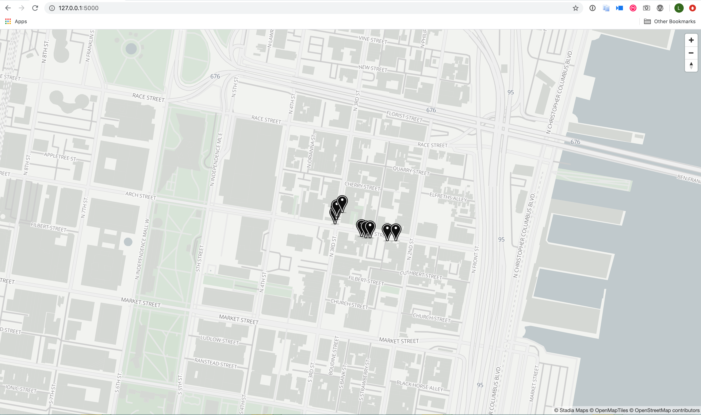

Geographic Information system (GIS) based applications require a beautiful mapping experience for users. [Stadia Maps](https://stadiamaps.com/) provides digital mapping that you can easily and affordably integrate into your web or mobile applications. They offer hosted map tiles, offline map tiles, static maps, and a few other [core products](https://stadiamaps.com/products/). If you would like to test their services, you can use a local development environment along with their free tier plan. For more details on pricing and service limits, see their [pricing plans](https://stadiamaps.com/pricing/).

## In this Guide

This guide will use Stadia Maps free tier plan and [hosted vector map tiles](https://stadiamaps.com/products/map-tiles/) to create a GIS web app using Flask. Your Flask application will use a MongoDB database to store [GeoJSON](https://tools.ietf.org/html/rfc7946) data to display as markers on your Stadia Map powered map. GeoJson is a format for encoding a variety of geographic data structures based on JavaScript Object Notation (JSON).

The GeoJSON data that you will use is a subset of [Philadelphia's Street Tree Inventory](https://www.opendataphilly.org/dataset/philadelphia-street-tree-inventory) dataset. Since the entire dataset is very large, a subset was used to keep this example simple and to reduce MongoDB storage requirements. When you are finished with this guide, you will have a Stadia Maps powered map with markers displaying the location of the trees that surround Linode's headquarters in Philadelphia, USA.

While the example in this guide is simple, its components can be adopted to build a GIS app that maps any data you would like to display to your users.

The sections in this guide will cover the following topics:

- Setting up your development environment
- Starting a local MongoDB instance and importing a data set to your database
- Creating a Flask app that uses Stadia Maps to display your GeoJSON data as markers on your map.

    
This guide assumes a basic familiarity with programming concepts, Python, HTML, CSS, and JavaScript.
    

### Before you Begin


This guide was written using Python version 3.7.


1. You can optionally [create an account with Stadia maps](https://client.stadiamaps.com/signup/). When developing locally, you are not required to create an account with Stadia Maps. Once you are ready to deploy your app, you will be required to sign up and select an appropriate service plan.

1. [Install MongoDB](https://docs.mongodb.com/manual/installation/#tutorial-installation) following the link's instructions. This installation will also give you access to the [mongoimport](https://docs.mongodb.com/manual/reference/program/mongoimport/) command line tool.

1. We recommend [Installing Conda](https://docs.conda.io/projects/conda/en/latest/user-guide/install/index.html), an open source package and environment management system. Conda lets you easily switch between development environments that have different Python versions and packages installed. While this isn't a strict requirement for setting up your GIS application, it is a great way to isolate your development environment and keep your system's global Python version and packages untouched.

## Setup Your Development Environment
In this section, you will prepare your development environment by creating your project directories, activating your conda environment, installing the required Python packages, and importing your GeoJSON data to your MongoDB database.

1. Create a project folder to store your Flask app files and move into that folder:

        mkdir ~/stadia-maps && cd ~/stadia-maps

1. If you are using conda, create a new environment running Python 3.7:

        conda create --name py37 python=3.7

1. Activate your new conda environment:

        conda activate py37

1. Install pip if it is not already available with your Python installation. A Python 3 installation (>=3.4) should automatically include pip. Follow the instructions in [pip's official documentation](https://pip.pypa.io/en/stable/installing/) to install pip, if needed.

1. Install the required Python packages:

        pip install flask flask-session geojson pymongo Flask-PyMongo

### Import your GeoJSON File to MongoDB

Before creating your Flask App, you will set up your MongoDB database to store the example data set. This data set was created from the  [Philadelphia Street Tree inventory GeoJSON data set](https://www.opendataphilly.org/dataset/philadelphia-street-tree-inventory).

1. Run your local MongoDB instance. The instance will need to run so that your Flask app can connect to your project's database. Follow  the steps in [MongoDB's official documentation](https://docs.mongodb.com/guides/server/install/#run-mongodb). These steps vary depending on your computer's operating system.

1. In your `stadia-maps` project directory, create a file named `linodeStreetTrees.geojson` to store your GeoJSON data. Using the text editor of your choice, copy and paste the data located in [this linked file](linodeStreetTrees.geojson). Your file's final locations should be `~/stadia-maps/linodeStreetTrees.geojson`. You will use the data stored in your local file in the next step.

1. Open a new terminal window and use the `mongoimport` command line tool to import your GeoJSON data to your database. The import will create a database and collection named `linodeStreetTrees` and will use the data stored in the `linodeStreetTrees.geojson` file to create your collection's documents. In MongoDB, databases hold collections of documents. Collections are analogous to tables in relational databases. Documents store data records of field-value pairs in BSON format, a binary representation of JSON.

        mongoimport --db linodeStreetTrees --collection linodeStreetTrees --file ~/stadia-maps/linodeStreetTrees.geojson

1. Connect to your MongoDB database to verify that all the data was imported as expected. By default, MongoDB will use port `27017` for database connections.

        mongo mongodb://localhost:27017/linodeStreetTrees

    From the MongoDB prompt, use the `find()` collection method to query your database.

        db.linodeStreetTrees.find()

    You should see all the data from your imported GeoJSON file returned.

      
{ "_id" : ObjectId("5e2a0c20b4d6fb3be09261c0"), "type" : "FeatureCollection", "features" : [ { "type" : "Feature", "properties" : { "OBJECTID" : 36391, "SPECIES" : null, "STATUS" : null, "DBH" : null }, "geometry" : { "type" : "Point", "coordinates" : [ -75.14457809997165, 39.95216128175947 ] } }, { "type" : "Feature", "properties" : { "OBJECTID" : 36392, "SPECIES" : null, "STATUS" : null, "DBH" : null }, "geometry" : { "type" : "Point", "coordinates" : [ -75.14446882894926, 39.95213340459382 ] } }, { "type" : "Feature", "properties" : { "OBJECTID" : 36388, "SPECIES" : null, "STATUS" : null, "DBH" : null }, "geometry" : { "type" : "Point", "coordinates" : [ -75.14436203227342, 39.95213350981046 ] } }, { "type" : "Feature", "properties" : { "OBJECTID" : 36387, "SPECIES" : null, "STATUS" : null, "DBH" : null }, "geometry" : { "type" : "Point", "coordinates" : [ -75.14391916318196, 39.95207850652248 ] } }, { "type" : "Feature", "properties" : { "OBJECTID" : 36385, "SPECIES" : null, "STATUS" : null, "DBH" : null }, "geometry" : { "type" : "Point", "coordinates" : [ -75.14371036845057, 39.95207848246513 ] } }, { "type" : "Feature", "properties" : { "OBJECTID" : 34552, "SPECIES" : null, "STATUS" : null, "DBH" : null }, "geometry" : { "type" : "Point", "coordinates" : [ -75.14525481375121, 39.952402827669786 ] } }, { "type" : "Feature", "properties" : { "OBJECTID" : 34553, "SPECIES" : null, "STATUS" : null, "DBH" : null }, "geometry" : { "type" : "Point", "coordinates" : [ -75.14522060144313, 39.95249257200717 ] } }, { "type" : "Feature", "properties" : { "OBJECTID" : 34554, "SPECIES" : null, "STATUS" : null, "DBH" : null }, "geometry" : { "type" : "Point", "coordinates" : [ -75.14521115802674, 39.95254397352744 ] } }, { "type" : "Feature", "properties" : { "OBJECTID" : 34556, "SPECIES" : null, "STATUS" : null, "DBH" : null }, "geometry" : { "type" : "Point", "coordinates" : [ -75.14507538603768, 39.952630343085694 ] } } ] }
        

    Now that your MongoDB database is set up, you can move on to creating your Flask app.

## Create your Flask App

Now that your development environment is set up and your MongoDB data is stored in a database collection, you will create a simple GIS Flask application that will include a single Python file, `app.py`, a template file `base.html`, and some css styling stored in a `map.css` file. At the end of this section, you will be able to render a running Stadia Maps powered map in a browser window.
### Create your Project Layout

1. Ensure you are in your `stadia-maps` project directory:

        cd ~/stadia-maps

1. Create your Flask App's project layout. The `styles` directory will store your app's stylesheets, while the `templates` directory will store any [Flask templates](https://flask.palletsprojects.com/en/1.1.x/templating/).

        mkdir -p static/styles && mkdir templates

### Create your app.py File

In this section, you will write the code for your Flask application. Since this is a simple Flask app example, all your app code will be located in a file named `app.py`. If you are interested in viewing a more in-depth example of a Flask project layout, you can refer to Flask's [project layout documentation](https://flask.palletsprojects.com/en/1.1.x/tutorial/layout/).

1. In the root of your `stadia-maps` directory create a file named `app.py` and add the following import statements. This will ensure that your app has access to all the necessary Python packages and their methods.

    
from flask import Flask, request, render_template
from flask_session import Session
from geojson import Point
from flask_pymongo import PyMongo
from bson.json_util import dumps
import json
    

1. Below your import statements, add the Python code to set up the Flask app and connect to your MongoDB database. The code creates an instance of the `Flask` class, connects to your MongoDB server and `linodeStreetTrees` database running on port `27017`. Finally, an instance of the `PyMongo` class is created, which manages connections from MongoDB to your Flask app.

    

from flask import Flask, request, render_template
from flask_session import Session
from geojson import Point
from flask_pymongo import PyMongo
from bson.json_util import dumps
import json

app=Flask(__name__)
app.config["MONGO_URI"] = "mongodb://localhost:27017/linodeStreetTrees"
mongo = PyMongo(app)
    

1. Register your [view function](https://flask.palletsprojects.com/en/1.1.x/tutorial/views/#blueprints-and-views) for your app's index page by adding the example's remaining lines to your `app.py` file. The `route()` decorator signals to Flask which URL should trigger the defined function `def index()`. When a user visits your app's index (i.e. `http://127.0.0.1:5000/`), the code defined in the `index()` function will execute. This code retrieves all the data in your MongoDB `linodeStreetTress` collection and makes the data available to the `base.html` template in the `street_trees_points` template variable. The `base.html` template will be created in the next section.

    The final block of code provides a way for Python to handle both script execution and importing. Finally, if the conditional evaluates to `true`, it will execute Flask's `run()` method to run your app.

    
from flask import Flask, request, render_template
from flask_session import Session
from geojson import Point
from flask_pymongo import PyMongo
from bson.json_util import dumps
import json

app=Flask(__name__)
app.config["MONGO_URI"] = "mongodb://localhost:27017/linodeStreetTrees"
mongo = PyMongo(app)

@app.route('/')
def index():
    street_trees_points_query = dumps(mongo.db.linodeStreetTrees.find({}, {'_id': False}))
    street_trees_points = json.loads(street_trees_points_query)
    return render_template('base.html', street_trees_points=street_trees_points)

if __name__ == '__main__':
    app.debug=True
    app.run()

    

### Create your Template File

In this section you will create your Flask app's template. Flask templates are used to render the front end portion of your app. You can make use of the [Jinja templating language for Python](https://jinja.palletsprojects.com/en/2.10.x/) to add additional functionality to your templates.

In this example, the `base.html` template connects to Stadia Maps to retrieve their vector map tiles and renders them on your site's index page. Stadia Map's implementation relies on the [Mapbox GL JavaScript library](https://docs.mapbox.com/mapbox-gl-js/api/). The template accesses your database's data and uses it to render marker's on your map with the help of Mapbox GL and Stadia Maps. This example utilizes [Stadia Map's boiler plate vector maps example](https://docs.stadiamaps.com/vector/) as a foundation. The example file is heavily commented, which you can use to better understand each section of the file.

1. Create a file named `base.html` in your root project's `templates` directory with the example file content.

      
<html>
<head>
    <title>Stadia Maps + Flask + MongoDB Demo</title>
    <meta charset="utf-8">
    <meta name="viewport" content="initial-scale=1,maximum-scale=1,user-scalable=no" />
    
    <link href="//cdnjs.cloudflare.com/ajax/libs/mapbox-gl/0.52.0/mapbox-gl.css" rel="stylesheet" />
    <link rel="stylesheet" type="text/css" href="{{ url_for('static', filename='../static/styles/map.css') }}" />
    
</head>
<body>
    <h1>
        Stadia Maps + Flask + MongoDB Demo
    </h1>
    

    
</body>
</html>
      

      Key portions of the file that you should take note of are the following:

      - The `<head>` element contains a call to the Mapbox GL JavaScript file that the rest of the template makes use of. Other needed external scripts and files, like jQuery, are called in this section.
      - The call to the app's stylesheet contains an `href` attribute (line 8) whose value makes use of the Jinja templating language. The code `"{{ url_for('static', filename='../static/styles/map.css') }"` allows Flask to generate URLs for any [static files](https://flask.palletsprojects.com/en/1.1.x/quickstart/#static-files).
      - Line 15 (`

`) creates the div element that will contain the rendered map.
      - The script beginning on line 16 creates a new `mapboxgl` instance whose methods will be used throughout the script to construct your map. Notice that upon instantiation, Stadia Map's theme URL is called to retrieve their [Alidade Smooth theme](https://tiles.stadiamaps.com/themes/). For details on all the MapBox GL methods that are used throughout the template, see the [MapBox GL reference](https://docs.mapbox.com/mapbox-gl-js/api/).
      - Line 29 is responsible for grabbing your databases data, using Jinja, from the `street_trees_points` variable that was exposed in the `app.py` file. The data is serialized and passed to the `markerCollection` variable. The `forEach()` method is then used to create markers for each collection document (from your database's serialized data) and render them on your map.

### Create your App's Styling

In the previous section, the `base.html` template file calls your app's style sheet. You are now ready to create the stylesheet.

1. Create a file named `map.css` in your project's `~/stadia-maps/static/styles` directory and add the example file's content. The marker that will be rendered on your map is provided by Stadia Map.

    
body {
  margin: 0;
  padding: 0;
}

#map {
  position: absolute;
  top: 0;
  bottom: 0;
  width: 100%;
}

/* We recommend using an icon that is 2x the intended display size, so that it renders nicely on retina displays.
* The icon used in the background-image property is owned by Stadia Maps. While you maintain an account with us, we grant you royalty-free use of
* this image when displayed on our maps.
*/
.marker {
background-image: url('data:image/png;base64,iVBORw0KGgoAAAANSUhEUgAAADQAAABUCAYAAADNjBSxAAAACXBIWXMAAAsTAAALEwEAmpwYAAAAGXRFWHRTb2Z0d2FyZQBBZG9iZSBJbWFnZVJlYWR5ccllPAAACE1JREFUeNrUW0tsFEcQHQ/2wbZsIyUHJD62OAQJB+IzH2HlFD5KfMSAFKRE4nfxDeGTufA5ZS98DpFiJMN5EZ+zDZxyssG+Ii9WJA5B8lqyI4hgUm/Utaqp7Zmdnpn9pKSWd2G2p1+9rlfV3TNdQRB4Rdjg4OAI/Rk3DZ+PJVxeobZKbR5tY2Nj3ivIuvIAIhDb6c95077LMY4qtTK12bzgMgEyQErUJqgNecXaEvomYLMtAURgZujPVByQPXv2eAcPHvQOHDjgDQ8Ph9+lvXz50qtWq96bN2/Czwm2gPsQsMWmACIgY5gStqkFAGfPnvVOnTrl7d6928lBz549854+fRo2ALXYdQI1UyggAnPeTLEIK0ePHvWuXbvmHTlyJPa3kgUbY2w0aO/OnTve3bt3bcAwDcfpmvWGgwWgpDYwMDBDLZBtdHQ0oIEG2paWloIbN24Ex48fD/RvZDt06FBw4cKFYG5uLlhfX4/0QWCCq1ev2n63Sm2s0XgbgZnVHV+8eDG8KRsGRJ4N9u/fnwgiqQHcixcvIsBev34dOk5du94IVBKYKX3jhw8fRm4KD+/cuTMzEN1Onz4dVCqVCFsnTpywgRpxAkQ/mJCd7Nq1K6CgjbDSaFplbXAQHCUNs0Jdt0htu23sdaJgMv6iFID79+97Z86cCT/TVPDIa2EQN9NwP9xXfocSCntAYzivf+db+pqVYG7fvt1yMLBHjx55xIwnnYr0IOxncv5Eomwbef6DvyOvoONWg4ljam1tzSOFlLKOmnBMyrlvKWdCGxoaqnWEDtoBhpm6efNm+BlJe3p6Wv73sKla6hkiQPiP32xxMzk5GWZ0V8MUOXnyZJiA3717F7JMShlXETSsKNAPDIkcfYnCdqTGklC2VZk42Z48eeKsVFoVdeIkBzn3iWTMhqSu/n8qIttapmW+yZIw48BIs+SXhk3K+eHDhyNVBAPiGJqQscNTDdMDgehiKFIxzRqZlOS0RmVV7fPly5cjsWSK53pAUDY2AHI1+fskQ4BzTKQ1OJdzkeU+IQbfIBvSA0IQv3r1yhkQGE5rWDO5GgOicWtQ48zQuF4S6LK/WZZF7WS1oBxyjAGNSZkF8jyAXAaJVaurIRdi9kjny7LNNzs0ddOFf+RqWKCljQeRS5yMf4cFo7IRP25OZ70ZmOVyKcmQrLMaM2tZ7oeAjtkYylPmoKi8d+9eLDOQ9awOa2Aj3c0KeFpGh3sEUCJ2FKZxllTgYt3N7BwA0sZUUeab/S/bTo/3P7TViCjIRKoWUx1lLF6WOA8BrdpySNz+WScYj80iLOsRQPIC1zqrVYZQ4Nmjkz+2jX1zpBFZSHUyIFm/qUoj1AJfH18watCapXhsFSDEj9oFmpfLh8e24k+tOdpuqAwYkAIDK0tAZZk7eNphseZ6mtBMO3fuXFzNWOFjF9/QN2s2G+oulp20Wwx4xiC9KIUr2TYaSzKOOCehk05IsleuXKmVUKp8qprNUSugGku8F4ZO1F5YW9lBcasAlawbjeYfY1lqZyxJduRGibFZ60aj2D1d5T0G5CIWCKgK7wa1WtlWVlZqsYMdXGF1G/a+yrR1LDEgyGXS0WOzTG53cRiI2JnR19uOUyIsIcEuLy/XSqNWgsK9nj9/HseO9TDZt2xCrEvkyEu8pEYNdenSpbawI49WDDuluPWQbWcFF1fk6pNLdSheK2Qcp+tcVWM5rzZtSnEn4n5Cn1NyWYHlNMs4DsGaLQQs03CkUrZK0nMLfsL+V1muZhGQvM+NkqiZsQSHSZlWe31TjZbgSRbxhPTUrVu3miYEXIDCgapmWzCOzgbILC0e8HdkaE62zRIIKQSI3SQHZ2GorhOZC4oWCCkEcJzl1Hs+NyDqBDnpuq0kwjxHWVJ0vWZJoqnYSctQXeEqcwK8WkSdB7ZZCOAwtV9w3Ti2GEC6JJLJlgdTlEy7JNE8DDFLFZvi5V3ZSofAUWmTaC5ASSVRHpbgCDjE5ihXdlwZ4qV6oSwVyY4zIK02eVnS7FiW1iXXwWUBVJaKJweBwbnkJbkBY1E2Z3YyAUpaqvNyOa1JZVMlTiZ2sjJUl5c0S2kMy3nOO/L5A54FWdjJDMjcrCwBcSWO0iXNkySSHV6auFYFRTJUd9O5ubnULEEM5PmTEoOFtFVBoYDMTRdsg0L5nyQOMs6gkmq9U8rh5FwMRfbE9KM0SSzJIxEVO5VG651mAyq7igOOaHiJYDkSKeccTz5AWhzk4BAjtsohIZFGGG8XQxGvIhbko5y2R80SHl9bcn0TpSmAzJyv2ljSx5pyulme9ZktwLmFMOTFTTutdpIdy9Ne5Y4EhGkn1U6yJBOuEoOlPLmncEBaam3TTh7HWwDNF+TYwhiCPZaVs9xn00xZHv0sdyKgmpcR7Fzb8VOSEpBip1rka59FAop4WQY9wMhnHhRD8wWOoThAJqgrNkBQN8mQkuvOBKQHJx9bkdWBJX46GtCiZMH2mKfKP9UiqoOWMGQJ/tDUWy6LXtHW6DXKxDcSKb1Q+8q0vdT2DQwM/CXfUuHXQ22vc/b392MfbB+1HaKfnjxjSvVibldXFwb+tQHQZ/722K7t7e39sbu7+9cUvtza3Nz85cuXL5txOkPtX2ofTK24QWPdajjWOEAEAgP/xnivx4V18vyU7/vfJ4H5+PHj9KdPn966iim1tzTmtSyAfnAFIq2vr29y27ZtPxlG5RRfJiC/ZwAjbYX6eesKaNTERXbF8f3+np6evQTsW7rP5ufPn5dzAoH9Q+1P6m/DCZCYdjtMG8zDWAEg/qb2nsb7PlMMJQDsNQLhKZBf5RwwB/yW+L5F4/vg0tF/AgwACuIdiHmTJCAAAAAASUVORK5CYII=');
background-size: cover;
width: 27px;
height: 42px;
cursor: pointer;
}
    

### Run your Flask App

You are now ready to run your Flask app locally to view your rendered Stadia Map.

1. Open a new terminal window and navigate to your `stadia-maps` root directory.

        cd ~/stadia-maps

1. Run your Flask application with the following command:

        python3 app.py

    You will see that your Flask server runs with the following output:

    
* Serving Flask app "app" (lazy loading)
* Environment: production
  WARNING: This is a development server. Do not use it in a production deployment.
  Use a production WSGI server instead.
* Debug mode: on
* Running on http://127.0.0.1:5000/ (Press CTRL+C to quit)
* Restarting with stat
* Debugger is active!
* Debugger PIN: 140-560-688
    

1. Open a browser and navigate to the local URL. In our example, this is: `http://127.0.0.1:5000/`. You should see a Stadia Map render that displays the location of Linode's headquarters and the location of some of the neighborhood's surrounding trees.

    

## Next Steps

- Consult the [Prepare Your Production Environment](/docs/guides/flask-and-gunicorn-on-ubuntu/#prepare-the-production-environment) section of our [Deploy A Flask Application on Ubuntu](/docs/guides/flask-and-gunicorn-on-ubuntu/) guide to familiarize yourself with some of the tools you can use to prepare a Flask application for production.

- Adopt the example app to use a different data set. Many cities provide open GIS data that you can easily consume and create your own GIS app. See [Philadelphia's Open Data site](https://www.opendataphilly.org/) for possible sources.

- [Create a Stadia Maps](https://client.stadiamaps.com/signup/) account and continue to explore their mapping services.

- [Explore the PyMongo documentation](https://api.mongodb.com/python/current/) to learn more advanced ways to work with MongoDB data using Python.