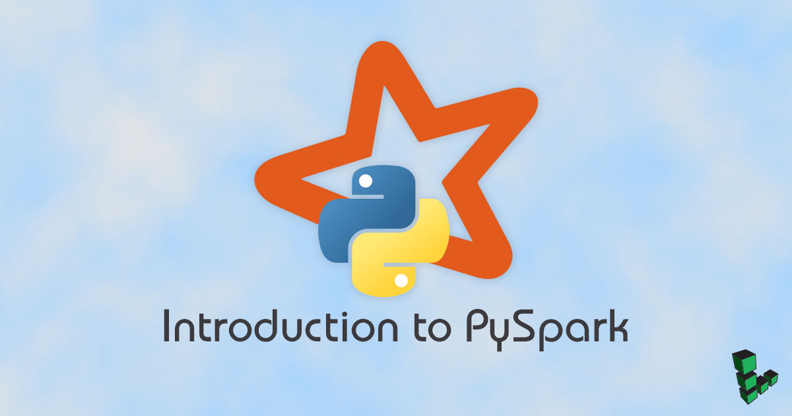

## What is PySpark?

[Apache Spark](https://spark.apache.org/) is a big-data processing engine with several advantages over MapReduce. Spark offers greater simplicity by removing much of the boilerplate code seen in Hadoop. In addition, since Spark handles most operations in memory, it is often faster than MapReduce, where data is written to disk after each operation.

PySpark is a Python API for Spark. This guide shows how to install PySpark on a single Linode. PySpark's API will be introduced through an analysis of text files by counting the top five most frequent words used in every Presidential inaugural address.

## Install Prerequisites

The installation process requires the installation of Scala, which has Java JDK 8 as a dependency. Miniconda will be used to handle PySpark installation as well as downloading the data through NLTK.

### Miniconda



### Java JDK 8



### Scala

When used with Spark, Scala makes several API calls to Spark that are not supported with Python. Although Scala offers better performance than Python, Python is much easier to write and has a greater range of libraries. Depending on the use case, Scala might be preferable over PySpark.

1.  Download the Debian package and install.

        wget https://downloads.lightbend.com/scala/2.12.4/scala-2.12.4.deb
        sudo dpkg -i scala-2.12.4.deb

## Install PySpark

1.  Using Miniconda, create a new virtual environment:

        conda create -n linode_pyspark python=3
        source activate linode_pyspark

2.  Install PySpark and the [Natural Language Toolkit (NLTK)](http://www.nltk.org/):

        conda install -c conda-forge pyspark nltk

3.  Start PySpark. There will be a few warnings because the configuration is not set up for a cluster.

        pyspark

    
Python 3.6.3 |Anaconda, Inc.| (default, Nov 20 2017, 20:41:42)
[GCC 7.2.0] on linux
Type "help", "copyright", "credits" or "license" for more information.
Using Spark's default log4j profile: org/apache/spark/log4j-defaults.properties
Setting default log level to "WARN".
...
Welcome to
      ____              __
     / __/__  ___ _____/ /__
    _\ \/ _ \/ _ `/ __/  '_/
   /__ / .__/\_,_/_/ /_/\_\   version 2.2.1
       /_/

Using Python version 3.6.3 (default, Nov 20 2017 20:41:42)
SparkSession available as 'spark'.
>>>


## Download Sample Data

The data used in this guide is a compilation of text files of every Presidential inaugural address from 1789 to 2009. This dataset is available from NLTK. Miniconda and the NLTK package have built-in functionality to simplify downloading from the command line.

1.  Import NLTK and download the text files. In addition to the corpus, download a list of stop words.

        import nltk
        nltk.download('inaugural')
        nltk.download('stopwords')

2.  Import the file objects and show a list of available text files downloaded from the NLTK package.

        from nltk.corpus import inaugural, stopwords
        inaugural.fileids()

    This should return a list of text files of the Inaugural Address from George Washington to Barack Obama.

    
The files are located in `/home/linode/nltk_data/corpora/inaugural/` where `linode` is the username.


Although it is possible to accomplish most objectives of this guide purely with Python, the aim is to demonstrate the PySpark API, which will also work with data distributed across a cluster.

## PySpark API

Spark utilizes the concept of a Resilient Distributed Dataset (RDD). The RDD is characterized by:

 - Immutability - Changes to the data returns a new RDD rather than modifying an existing one
 - Distributed - Data can exist on a cluster and be operated on in parallel
 - Partitioned - More partitions allow work to be distributed among the cluster but too many partitions create unnecessary overhead in scheduling

This portion of the guide will focus on how to load data into PySpark as an RDD. Then, some of the PySpark API is demonstrated through simple operations like counting. Finally, more complex methods like functions like filtering and aggregation will be used to count the most frequent words in inaugural addresses.

### Read Data into PySpark

Since PySpark is run from the shell, SparkContext is already bound to the variable `sc`. For standalone programs running outside of the shell, SparkContext needs to be imported. The SparkContext object represents the entry point for Spark's functionality.

1.  Read from the collection of text files from NLTK, taking care to specify the absolute path of the text files. Assuming the corpus was downloaded though the method described above, replace `linode` with your Unix username:

        text_files = sc.textFile("file:///home/linode/nltk_data/corpora/inaugural/*.txt")

2.  There are two types of operations in Spark: __transformations__ and __actions__. Transformations are lazy loaded operations that return an RDD. However, this means Spark does not actually compute the transformations until an __action__ requires returning a result. An example of an action is the `count()` method, which counts the total number of lines in all the files:

        >>> text_files.count()
        2873

### Clean and Tokenize Data

1.  To count words, the sentences must be tokenized. Before this can be done, remove all punctuation and convert all of the words to lowercase to simplify counting:

        import string
        removed_punct = text_files.map(lambda sent: sent.translate({ord(c): None for c in string.punctuation}).lower())

    Since `map` is a transformation, the function is not applied until an action takes place.

    
If a step is unclear, try `.collect()` to see the intermediary outputs.


2.  Tokenize the sentences:

        tokenize = removed_punct.flatMap(lambda sent: sent.split(" "))

    
Similar to Python's `map` function, PySpark's `map` returns an RDD with an equal number of elements (2873, in this example). `flatMap` allows transformation of an RDD to another size which is needed when tokenizing words.


### Filter and Aggregate Data

1.  Through method chaining, multiple transformations can be used instead of creating a new reference to an RDD each step. `reduceByKey` is the transformation that counts each word by aggregating each word value pair.

        result = tokenize.map(lambda word: (word, 1))\
        .reduceByKey(lambda a, b: a + b)

2.  Stopwords (such as "a", "an", "the", etc) should be removed because those words are used frequently in the English language but provide no value in this context. While filtering, clean the data by removing empty strings. Results are then sorted via `takeOrdered` with the top five most frequent words returned.

        words = stopwords.words('english')

        result.filter(lambda word: word[0] not in words and word[0] != '')\
        .takeOrdered(5, key = lambda x: -x[1])

    
[('government', 557), ('people', 553), ('us', 455), ('upon', 369), ('must', 346)]


    Among the top five words, "government" is the most frequent word with a count of 557 with "people" at a close 553. The transformations and action can be summarized concisely. Remember to replace `linode` with your Unix username.

3.  The operations can be summarized as:

        import string
        from nltk.corpus import stopwords

        words = stopwords.words('english')

        sc.textFile("file:///home/linode/nltk_data/corpora/inaugural/*.txt")\
          .map(lambda sent: sent.translate({ord(c): None for c in string.punctuation}).lower())\
          .flatMap(lambda sent: sent.split(" "))\
          .map(lambda word: (word, 1))\
          .reduceByKey(lambda a, b: a + b)\
          .filter(lambda word: word[0] not in words and word[0] != '')\
          .takeOrdered(5, key = lambda x: -x[1])

PySpark has many additional capabilities, including DataFrames, SQL, streaming, and even a machine learning module. Refer to the [PySpark documentation](https://spark.apache.org/docs/latest/api/python/) for a comprehensive list.
