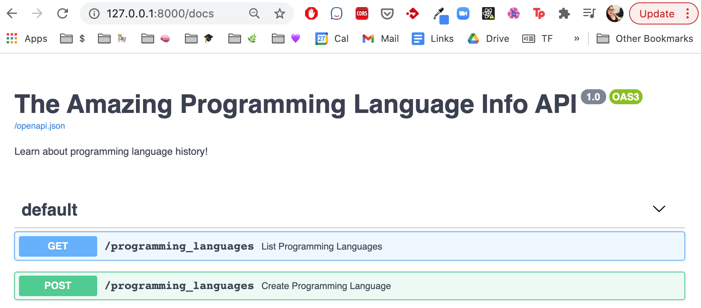

FastAPI automatically generates an OpenAPI schema that can be accessed by your API's users to learn about your API's features. This guide introduces how FastAPI creates documentation from your code. It also shows you how to provide custom information related to your API, if necessary. For example, you may want to modify an endpoint's description or label a field if they are deprecated.


The examples in this guide rely on the code created in the [CRUD Read Operations: Use FastAPI to Write an API](/docs/guides/crud-read-operations-use-fastapi-to-write-an-api/) and [CRUD Write Operations: Use FastAPI to Write an API](/docs/guides/crud-read-operations-use-fastapi-to-write-an-api/) guides. To run the examples in this guide, ensure you follow the [FastAPI Installation Prerequisites](/docs/guides/crud-read-operations-use-fastapi-to-write-an-api/#install-fastapi) section of those guides.


## How to Document FastAPI Endpoints

FastAPI provides automatic documentation that follows the [OpenAPI specification](https://swagger.io/specification/). In our [CRUD Write Operations: Use FastAPI to Write an API](/docs/guides/crud-read-operations-use-fastapi-to-write-an-api/#create-the-view-programming-language-endpoint) guide, you write a List Programming Languages endpoint with the annotation, `@app.get('/programming_languages')` as as seen in the following example:


@app.get('/programming_languages')
def list_programming_languages(before_year: int = 30000, after_year: int = 0):
   qualifying_data = list(
       filter(
           lambda pl: before_year > pl.publication_year > after_year,
           in_memory_datastore
       )
   )
   return {"programming_languages" : qualifying_data }



If you run the example code above and visit `localhost:8000/docs`, you see the documentation displayed as shown below:

If you click on the endpoint entry, an interface to try out the endpoint appears.

An API with endpoints to GET, PUT, POST, and DELETE a resource (in this example, `programming_languages`), would have documentation automatically generated by FastAPI as follows:

The automatic documentation is generated from the [OpenAPI Specification (OAS)](https://spec.openapis.org/oas/v3.1.0), an API description format for REST APIs. In perfectly conventional REST API applications, this automatic documentation might suffice to help clients understand how to use it. But in some cases, it’s helpful to customize the documentation. Some reasons you may want to manually update your automatically generated API documentation are:

- Some of the fields that a client can submit on the POST request require an explanation.

- One of the fields is deprecated and is still in the response to avoid backward-breaking changes. The field is eventually removed from the API, so any clients should switch to using non-deprecated fields.

- The list route provides summary information (like a count or a cumulative sum or average) as a convenience for clients who need it. However, that kind of information isn’t expected in a purely RESTful response, so maintainers want to make sure that clients know about this helpful feature.

FastAPI allows for customizing the documentation in cases like those listed above.

## How the Open API Integration Works with FastAPI

FastAPI apps expect the presence of an instance method, `app.openapi`, whose return value gets set on an instance attribute, `app.openapi_schema`. This happens automatically for the default documentation, but a developer can override that attribute to customize the documentation.

To get an idea of what the schema looks like by default, go to the app and click the `openapi.json` link.

The app shows the schema in its JSON format. This is the shape of the object that developers can modify to create custom documentation.

The [OpenAPI Swagger Specification](https://swagger.io/specification/) (OpenAPI started with the name "Swagger") provides full details on all of the attributes that this object can have.

## Override the Default Summary Documentation

To begin overriding the default documentation, import the `get_openapi` function at the top of the file that declares the app as seen in the following example:


from fastapi import FastAPI
from fastapi.openapi.utils import get_openapi

Then, write a function that sets app.openapi_schema:

def my_schema():
   openapi_schema = get_openapi(
       title="The Amazing Programming Language Info API",
       version="1.0",
       description="Learn about programming language history!",
       routes=app.routes,
   )
   app.openapi_schema = openapi_schema
   return app.openapi_schema



This function uses the `get_openapi` function imported earlier to set a new title, version, and description for the documentation. Reboot the app to see the changes.

Once a developer has obtained the schema object from `get_openapi`, they can directly modify the documentation object as seen in the following example:


def my_schema():
   openapi_schema = get_openapi(
       title="The Amazing Programming Language Info API",
       version="1.0",
       routes=app.routes,
   )
   openapi_schema["info"] = {
       "title" : "The Amazing Programming Language Info API",
       "version" : "1.0",
       "description" : "Learn about programming language history!",
       "termsOfService": "http://programming-languages.com/terms/",
       "contact": {
           "name": "Get Help with this API",
           "url": "http://www.programming-languages.com/help",
           "email": "support@programming-languages.com"
       },
       "license": {
           "name": "Apache 2.0",
           "url": "https://www.apache.org/licenses/LICENSE-2.0.html"
       },
   }
   app.openapi_schema = openapi_schema
   return app.openapi_schema

app.openapi = my_schema


The changes produce a more detailed set of documentation.

Unfortunately, the `title` and `version` arguments to `get_openapi` are required arguments and the app throws an error if they are excluded. However, they must be redeclared when setting the schema info, or else they won’t show up on the documentation page.

Extracting two local variables reduces the opportunity for error.


def my_schema():
   DOCS_TITLE = "The Amazing Programming Language Info API"
   DOCS_VERSION = "1.0"
   openapi_schema = get_openapi(
       title=DOCS_TITLE,
       version=DOCS_VERSION,
       routes=app.routes,
   )
   openapi_schema["info"] = {
       "title" : DOCS_TITLE,
       "version" : DOCS_VERSION,
       "description" : "Learn about programming language history!",
       "termsOfService": "http://programming-languages.com/terms/",
       "contact": {
           "name": "Get Help with this API",
           "url": "http://www.programming-languages.com/help",
           "email": "support@programming-languages.com"
       },
       "license": {
           "name": "Apache 2.0",
           "url": "https://www.apache.org/licenses/LICENSE-2.0.html"
       },
   }
   app.openapi_schema = openapi_schema
   return app.openapi_schema

app.openapi = my_schema


## Override the Default Route Documentation

Modifying the inner details of the documentation requires some more understanding of the docs object. The JSON object that comes back from `openapi.json` has four attributes.

Each of the four attributes documents a different thing:

- `openapi`—contains the open API schema version as a string.
- `info`—is the one that we have modified so far.
- `paths`—describes the documentation for each of the API routes.
- `components`—contains schemas, the object that delineates the models used in the API such as "ProgrammingLanguage" and "HTTPValidationError".

Refer to the shape of the object at the `/openapi.json` route or to the [OpenAPI Swagger Specification](https://swagger.io/specification/) to know exactly what can be modified on an object. For example, there’s a way to mark a field as `deprecated`.


def my_schema():
…

#insert this line below the other code in this function, immediately before the attribute assignment and return value
      openapi_schema["paths"]["/programming_languages"]["get"]["parameters"]["deprecated"] = True
   app.openapi_schema = openapi_schema
   return app.openapi_schema


The result? Visit the `localhost:8000/docs` page, the attribute shows as "*deprecated*".

## Cache the Documentation Object

Finally, to keep the docs page loading quickly, cache the documentation object so it doesn't need to be recreated each time the app loads.


def my_schema():

   #Insert these two lines at the beginning of the function
   if app.openapi_schema:
       return app.openapi_schema
   …



The Swagger Documentation, plus a function override, make it possible to customize FastAPI documentation. No FastAPI tutorial would be complete without an explanation of how to provide detailed, complete documentation. The framework allows developers to change the `title` and `description`, add `contact` information and other notes, and even add, or change details for each route, and model. The Swagger docs provide visibility into the OpenAPI schema, and a glance at `/openapi.json` reveals the structure of the default documentation object. From there, a few lines of dictionary assignments allow developers to design the docs of their dreams.
