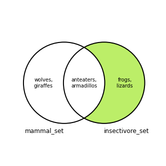

Pythons sets are unordered collections modeled on mathematical sets, in which elements are unique. Python sets support the logical operations of mathematical sets, like union, intersection, and difference. This example code declares a new set and adds the elements of a second set to it, showing that the updated set contains unique elements:

```file {lang="python"}
example_set = {1, 3, 5, 7}

example_set.update({1, 2, 3, 4})

print(example_set)
```

```output
{1, 2, 3, 4, 5, 7}
```

This guide explains:

- [What Python sets are](#what-are-sets-in-python) and what kinds of elements they can contain

- [How to fetch an element from a Python set](#fetch-from-a-set), check if an element exists in a set, and iterate through the elements of a set.

- [How to create a Python set](#create-a-python-set) with set literals, the `set()` constructor function, and the set comprehension syntax.

- [How to add elements to and remove elements from Python sets](#modify-a-set)

- [How to combine sets](#combine-sets) with the union, intersection, difference, and symmetric difference Python set operations.

- [How to compare Python sets](#checking-python-set-relationships) with the subset, superset, and disjoint relationships.

## What Are Sets in Python?

In Python, a set is an unordered, mutable collection of unique elements. Mathematical set operations like union, intersection, and difference can be performed on them. Two different sets can be compared with the subset, superset, and disjoint relations.

This example set uses the *set literal* syntax and contains the even integers between 2 and 8:

    {2, 4, 6, 8}

Sets can contain elements of different types. This set contains some integers and some strings:

    {2, "hello", 4, "world"}

The members of a set must be *[hashable](https://docs.python.org/3/glossary.html#term-hashable)*. Hashable objects are generally *[immutable](https://docs.python.org/3/glossary.html#term-immutable)*. Hashable objects must implement the [`__eq__()` method](https://docs.python.org/3/reference/datamodel.html#object.__eq__), so two different hashable objects and can be compared to check if they are equal in value to each other. For example, two string objects can be compared to check if they are the same string.


Technically, a hashable object's `__hash__()` function must always return the same value for the lifetime of the object, rather than the object itself being immutable. [This blog post](https://inventwithpython.com/blog/2019/02/01/hashable-objects-must-be-immutable/) describes why, in practice, hashable objects used with sets are also immutable.


Integers and strings are built-in Python types that are hashable and can be stored in a set. Mutable container types like lists, dictionaries, and sets are not hashable, because their contents can change. A [Python tuple](/docs/guides/python-tuples/) is hashable if each of its values is hashable.

## Create a Python Set

Python provides a few ways to create sets:

- A Python set can be declared with the *set literal* syntax. A set literal consists of a comma-separated list of unique, hashable objects wrapped in curly braces.

    ```file {lang="python"}
    example_set = {2, 4, 6, 8}
    ```

    An empty set cannot be expressed with the set literal syntax. An empty pair of curly braces `{}` represents an empty [Python dictionary](/docs/guides/python-3-dictionaries/). Use the `set()` constructor (below) to create an empty set.

- The [`set()` constructor function](https://docs.python.org/3/library/stdtypes.html#set) accepts a Python list (or any other [iterable](https://docs.python.org/3/glossary.html#term-iterable) object) as input and returns a set with unique values from the list. The items in the input list/iterable must be hashable.

    ```file {lang="python"}
    example_set = set([2, 4, 6, 8, 8, 6, 4, 2])
    print(example_set)
    ```

    ```output
    {8, 2, 4, 6}
    ```

    If no argument is passed to the constructor function, an empty set is created:

    ```file {lang="python"}
    example_set = set()
    print(example_set)
    ```

    ```output
    set()
    ```

- Like the `set()` constructor function, the [*set comprehension* syntax](https://docs.python.org/3.0/tutorial/datastructures.html?highlight=comprehension#sets) can be used to construct a set from another iterable. A set comprehension allows you to apply an expression to the elements of the iterable before they are added to the new set. A condition can also be enforced on the members of the iterable before they are included in the new set.

    The general syntax for using a set comprehension is:

    ```file {lang="python"}
    { <element expression> for <element> in <iterable> if <condition> }
    ```

    This example creates a set of all the even numbers from a list of even and odd integers:

    ```file {lang="python"}
    even_integers_set = { x for x in [1, 2, 3, 4, 5] if x % 2 == 0 }
    print(even_integers_set)
    ```

    ```output
    {2, 4}
    ```

    This example multiplies the even integers by 2 when adding them to the new set:

    ```file {lang="python"}
    double_even_integers_set = { x*2 for x in [1, 2, 3, 4, 5,] if x % 2 == 0 }
    print(double_even_integers_set)
    ```

    ```output
    {8, 4}
    ```

## Python Set Operations

The operations for Python sets differ from those available for lists and arrays. Lists and arrays are ordered collections, while the elements in a set are unordered. As a result, the methods for accessing elements and adding elements are different between sets and lists/arrays. As well, the mathematical operations of Python sets are not available for lists and arrays.


The Linode docs library has guides for learning about Python lists and arrays:

- [Python Lists and How to Use Them](/docs/guides/python-lists-and-how-to-use-them/)
- [Python Arrays: What They Are and How to Use Them](/docs/guides/python-arrays/)


## Fetch from a Set

Because Python sets are unordered, elements cannot be accessed based on an index into the set. Instead, elements can be accessed using the `pop` method. This method returns an arbitrary value from the set while. **Note that the returned item is removed from the set.**

```file {lang="python"}
example_set = {"a", 2, "c", 4, "b", 6}

popped_element = example_set.pop()
print(popped_element)
print(example_set)
```

```output
2
{'b', 4, 6, 'c', 'a'}
```

You can check if a value exists in a set by using Python's `in` operator. Expressions with this operator return `True` if the provided value is found in the set:

```file {lang="python"}
example_set = {"a", 2, "c", 4, "b", 6}
if 4 in example_set:
    print("Match found!")
```

```output
Match found!
```


Python sets are implemented with a form of [hash table](https://en.wikipedia.org/wiki/Hash_table), so checking if a value exists within a set is an efficient operation. In comparison, to check if an value exists in a list or array, the list/array must be looped through or sorted.


Like lists and arrays, Python sets can be looped through. Use a `for` loop to iterate through the elements in a set:

```file {lang="python"}
example_set = {"a", 2, "c", 4, "b", 6}
for item in example_set:
    print(item)
```

```output
2
c
b
4
6
a
```

As an alternative to using the `pop` method, a `for` loop with a `break` statement can be used to retrieve an arbitrary value from a set. By doing this, the value is not removed from the set (unlike with the `pop` method, which does remove the value):

```file {lang="python"}
example_set = {"a", 2, "c", 4, "b", 6}
for value in example_set:
    break

print(value)
print(example_set)
```

```output
2
{2, 'c', 'b', 4, 6, 'a'}
```

## Modify a Set

Python sets are *mutable*, meaning items can be added to and removed from them as needed.

### Add an Element to a Set

To add an element to a Python set, use the `add` method. The `add` method accepts a single new element to add to the set:

```file {lang="python"}
example_set = {"this", "is", "a"}
example_set.add("set")
print(example_set)
```

```output
{'a', 'this', 'is', 'set'}
```

If the new element is already in the set, then the `add` method has no effect:

```file {lang="python"}
example_set = {"this", "is", "a", "set"}
print(example_set)
example_set.add("set")
print(example_set)
```

```output
{'a', 'this', 'is', 'set'}
{'a', 'this', 'is', 'set'}
```

### Add Multiple Elements to a Set

To add multiple values to a set at the same time, use the `update` method. The `update` method takes one (or more) Python iterables (lists, arrays, sets) as arguments. The `update` method adds any values that are not already in the set. Only unique values are added to the set.

This example adds elements from a list to a set:

```file {lang="python"}
example_set = {1, 3, 5, 7}
example_set.update([1, 2, 3, 4])

print(example_set)
```

```output
{1, 2, 3, 4, 5, 7}
```

Multiple arguments can be passed to `update`. This example passes two arguments: a list and another set. The elements from the list and the other set are added to the original set:

```file {lang="python"}
example_set = {1, 3, 5, 7}
example_set.update([1, 2, 3, 4], {'a', 'b', 'c'})

print(example_set)
```

```output
{1, 2, 3, 4, 5, 7, 'b', 'a', 'c'}
```

Individual new elements can also be passed as arguments. This example adds elements from a list and three individual elements to a set:

```file {lang="python"}
example_set = {1, 3, 5, 7}
example_set.update([1, 2, 3, 4], 'a', 'b', 'c')

print(example_set)
```

```output
{1, 2, 3, 4, 5, 7, 'b', 'a', 'c'}
```

### Remove an Element from a Set

In the [Fetch from a Set](#fetch-from-a-set) section, the `pop` method was demonstrated, which removes an arbitrary element from a set. Python sets also have two methods for removing specific values:

The `remove` method accepts an element to be removed from the set:

```file {lang="python"}
example_set = {1, 3, 5, 7}
example_set.remove(3)
print(example_set)
```

```output
{1, 5, 7}
```

If the value that is passed is not in the set, then a `KeyError` is thrown:

```file {lang="python"}
example_set = {1, 3, 5, 7}
example_set.remove(2)
```

```output
Traceback (most recent call last):
  File "<stdin>", line 1, in <module>
KeyError: 2
```

The `discard` method works like the `remove` method, but it does not throw an error when the passed value is missing from the set:

```file {lang="python"}
example_set = {1, 3, 5, 7}
example_set.discard(1)
example_set.discard(2) # no KeyError is thrown

print(example_set)
```

```output
{3, 5, 7}
```

## Combine Sets

One of the benefits of Python sets is their ability to use mathematical set operations like union, intersection, and difference. The next sections cover each of the logical operations available for Python sets. These operations can be implemented using either a method call or an operator, both of which are shown.

The examples that follow use two example sets:

```file {lang="python"}
mammal_set = {"wolves", "giraffes", "anteaters", "armadillos"}
insectivore_set = {"frogs", "lizards", "anteaters", "armadillos"}
```

`mammal_set` is a set of four mammals and `insectivore_set` is a set of four insectivores (animals that eat insects).

### Python Set Union

The *union* of two different sets is a new set that includes all of the contents of the constituent sets.

In the Venn diagram below there are two overlapping circles, corresponding to the `mammal_set` and `insectivore_set` sets. The shaded green area represents the union of the `mammal_set` and `insectivore_set` sets.


The Python set `union` method is called on one set and takes another set as an argument. It returns the new union of those two sets:

```file {lang="python"}
mammals_and_insectivores_set = mammal_set.union(insectivore_set)
print(mammals_and_insectivores_set)
```

```output
{'lizards', 'anteaters', 'giraffes', 'wolves', 'frogs', 'armadillos'}
```

Calling the `union` method on the `insectivore_set` set instead is equivalent to the previous example:

```file {lang="python"}
mammals_and_insectivores_set = insectivore_set.union(mammal_set)
print(mammals_and_insectivores_set)
```

```output
{'lizards', 'anteaters', 'giraffes', 'wolves', 'frogs', 'armadillos'}
```

The union *operator* ` | ` also returns the union of two different sets. This is equivalent to using the `union` method:

```file {lang="python"}
mammals_and_insectivores_set = mammal_set | insectivore_set
print(mammals_and_insectivores_set)
```

```output
{'lizards', 'anteaters', 'giraffes', 'wolves', 'frogs', 'armadillos'}
```

### Python Set Intersection

The *intersection* between two sets includes the elements that are in both sets.

In the Venn diagram below there are two overlapping circles, corresponding to the `mammal_set` and `insectivore_set` sets. The shaded green area represents the intersection for the `mammal_set` and the `insectivore_set` set:


The Python set `intersection` method is called on one set and takes another set as an argument. It returns the intersection between the two sets. This code creates a set of mammals that are insectivores, as in the diagram above. It excludes mammals that do not eat insects and non-mammals that do:

```file {lang="python"}
mammals_that_are_insectivores_set = mammal_set.intersection(insectivore_set)
print(mammals_that_are_insectivores_set)
```

```output
{'anteaters', 'armadillos'}
```


Changing which set is passed as an argument to `intersection` does not change the returned value.


The intersection *operator* ` & ` also returns the intersection between two sets. This is equivalent to using the `intersection` method:

```file {lang="python"}
mammals_that_are_insectivores_set = mammal_set & insectivore_set
print(mammals_that_are_insectivores_set)
```

```output
{'anteaters', 'armadillos'}
```

### Python Set Difference

The *difference* between two sets includes the elements from the first set that are *not* in the second set. The overlap between the two sets is excluded.

In the Venn diagram below there are two overlapping circles, corresponding to the `mammal_set` and `insectivore_set` sets. The shaded green area represents the difference between the `mammal_set` and the `insectivore_set` set:


There is also a second difference between the sets, where the second set's elements are included instead of the first:



The Python set `difference` method is called on one set and takes another set as an argument. It returns the difference between the two sets, where the argument set is subtracted from the set that the method is called on. This code creates a set of mammals that are not insectivores, as in the diagram above:

```file {lang="python"}
mammals_that_are_not_insectivores_set = mammal_set.difference(insectivore_set)
print(mammals_that_are_not_insectivores_set)
```

```output
{'wolves', 'giraffes'}
```

The order that the sets are listed in the code matters, and reversing the order produces a different result. The code below instead calls `difference` on the `insectivore_set` and passes `mammal_set` as the argument. The returned difference is the set of insectivores that are not mammals:

```file {lang="python"}
insectivores_that_are_not_mammals_set = insectivore_set.difference(mammal_set)
print(insectivores_that_are_not_mammals_set)
```

```output
{'frogs', 'lizards'}
```

The difference *operator* ` - ` also returns the difference between two sets. This is equivalent to using the `difference` method:

```file {lang="python"}
# Same as mammal_set.difference(insectivore_set)
insectivores_that_are_not_mammals_set = mammal_set - insectivore_set
print(insectivores_that_are_not_mammals_set)
```

```output
{'wolves', 'giraffes'}
```

### Python Set Symmetric Difference

The *symmetric difference* between two sets includes the elements from either set that are *not* in both sets. In other words, the symmetric difference is the union of two sets, minus their intersection. It can also be thought of as the union of the two differences between the sets.

In the Venn diagram below there are two overlapping circles, corresponding to the `mammal_set` and `insectivore_set` sets. The shaded green area represents the symmetric difference for the `mammal_set` and the `insectivore_set` set:


The Python set `symmetric_difference` method is called on one set and takes another set as an argument. It returns the symmetric difference between the two sets. This code creates a set of mammals that are not insectivores and insectivores that are not mammals, as in the diagram above:

```file {lang="python"}
symmetric_difference_mammal_insectivores = mammal_set.symmetric_difference(insectivore_set)
print(symmetric_difference_mammal_insectivores)
```

```output
{'giraffes', 'frogs', 'lizards', 'wolves'}
```


Changing which set is passed as an argument to `symmetric_difference` does not change the returned value.


The symmetric difference *operator* ` ^ ` also returns the symmetric difference between two sets. This is equivalent to using the `symmetric_difference` method:

```file {lang="python"}
symmetric_difference_mammal_insectivores = mammal_set ^ insectivore_set
print(symmetric_difference_mammal_insectivores)
```

```output
{'giraffes', 'frogs', 'lizards', 'wolves'}
```

## Checking Python Set Relationships

Another way that Python sets resemble mathematical sets is that they support the subset, superset, and disjoint comparative operations. Each of these operations allows you to check on the relationship between two sets.

### Python Subset

A set is a *subset* of another set is a set if all the elements in the first set are also in the second set. The `issubset` method can be used to verify if a Python set is a subset of another set.

In this example, `issubset` is called on `set_A`, and `set_B` is passed as an argument. The method returns True because `set_A` is a subset of `set_B`:

```file {lang="python"}
set_A = {"a", "b", "c"}
set_B = {"a", "b", "c", "d", "e", "f", "g"}

set_A.issubset(set_B)
```

```output
True
```

### Python Superset

A set is a *superset* of another set is a set if the first set contains all the elements in the second set. The `issuperset` method can be used to verify if a Python set is a superset of another set.

In this example, `issuperset` is called on `set_B`, and `set_A` is passed as an argument. The method returns True because `set_B` is a superset of `set_A`:

```file {lang="python"}
set_A = {1, 2, 3, 4}
set_B = {1, 2, 3, 4, 5, 6, 7, 8, 9, 0}

set_B.issuperset(set_A)
```

```output
True
```

### Python Disjoint Sets

Two sets are *disjoint* if they share no elements in common. The `isdisjoint` method can be used to verify if a Python set is disjoint with another set.

In this example, `isdisjoint` is called on `set_A`, and `set_B` is passed as an argument. The method returns True because `set_A` does not contain any of the elements in `set_B`, and `set_B` does not contain any of the elements in `set_A`:

```file {lang="python"}
set_A = {"a", "b", "c", "d"}
set_B = {1, 2, 3, 4}

set_A.isdisjoint(set_B)
```

```output
True
```

## Conclusion

By following and referencing this guide, you can now get started using sets in your applications. Have more questions or want some help getting started? Consider searching for or asking your questions on the [Linode Q&A forum](https://www.linode.com/community/questions/).