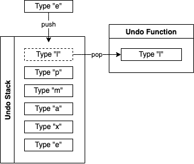

Stacks are convenient data structures, collecting items in a last-in-first-out order like you see for browsers, and other activity histories. But you may be wondering how exactly stacks work. Or you may be curious how you can start implementing a stack in Python.

In this guide, learn more about what makes a stack data structure and about Python stack implementations. Get an explanation of the stack concept, and see the example code for putting stacks to use in Python.

## What Is a Stack Data Structure?

The stack data structure consists of a linear collection. The main distinguishing feature of a stack, however, is how data is stored, and removed. Stacks use a Last-In-First-Out (LIFO) approach, where items are "popped" (retrieved and simultaneously removed) from newest to oldest.

An easy way to think about the stack data structure is through the undo list in an editor. Typing in an editor adds a new action to a stack. When you then choose the "undo" action, the last item added to that stack gets removed from the stack. The action that item represents then gets undone.

The diagram below shows this in action, using a character-by-character undo stack. The example shows two possible actions, each applying one of the core stack operations. Continuing to type "example" *pushes* a new item to the end of the stack. Taking the undo action, instead, *pops* the latest item off of the stack for processing by an undo function.



### Stack Operations

You can see in the example above, the two main stack operations: push and pop. These essentially mean "add" and "remove," respectively. However, the specific terms reflect that these actions have a bit more to them when it comes to stacks.

- The *push* operation involves adding a new item to a stack. Push places the item at the end of the stack. This is important for stacks to work effectively, as newer items need to be consistently removed first, before older items.

- The *pop* operation removes an item from the end of the stack. At the same time, importantly, pop returns the item removed. This lets you perform some operations with each item as it gets removed.

The last part with the pop operation is important for most stack implementations. The fact that pop returns the removed item lets you immediately start working with it. In the case of the undo stack example above, pop removes the "Type 'l'" item from the stack. But pop also returns that item so that the undo function can perform some operations with it.

## How to Implement a Stack in Python

The section above covers what the stack data structure is generally. But what does a stack look like in Python? What is the syntax for stacks in Python?

There are actually several ways of implementing the stack data structure in Python. These next three sections each show you a different way, each using a different Python module. Along the way, you can also see what sets each method apart, to help you decide between them.

Each of these sections includes code with examples. These code blocks are divided into three essential operations for working with stacks:

- Creating the initial stack

- Push, adding elements to the end of the stack

- Pop, removing and returning elements from the end of the stack

### Using a `list` to Create a Python Stack

The simplest Python stack implementation uses the built-in *list* type. Its simplicity comes from the fact that it is built in and frequently used. In the example below, instead of the `push()` function, you use the `append` function to add new items at the end of the stack. The `pop` function removes the elements from the end of the stack in LIFO. If you have worked with Python much, you have likely used lists a good deal.

``` python
# Creating a stack as a blank list.
example_stack = []

# Pushing elements to the stack using the append method.
example_stack.append("First Item")
example_stack.append("Second Item")
example_stack.append("Third Item")

# Poping an element from the stack using the pop method.
popped_item = example_stack.pop()

# Displaying the results
print("The stack now contains: " + ", ".join(example_stack) + ".")
print("The popped item is: " + popped_item + ".")
```


The stack now contains: First Item, Second Item.
The popped item is: Third Item.


Using the list type for Python stacks has two drawbacks:

- The Python list was not designed for working as a stack, and it does not store items efficiently how stacks store and retrieve items. This can make stack operations slower than expected sometimes.

- Python includes numerous methods for lists which, if used, would undermine your stacks' proper functioning. Take the `insert` method. It allows you to add an item to a list at a specific index. Using this method on a list operating as a stack could cause significant problems.

That said, lists can still support Python stacks well for most needs.

### Using `collections.deque` to Create a Python Stack

Python installations come with a `collections` module by default. This module includes `deque`, which is an excellent tool for creating and managing stacks in Python. `deque` is pronounced as "deck" and stands for "double-ended queue". As demonstrated in the list example above, you can use the same `append` and `pop` functions on deque.

``` python
# Importing deque.
from collections import deque

# Creating a blank stack using deque.
example_stack = deque()

# Pushing elements to the stack using the append method.
example_stack.append("First Item")
example_stack.append("Second Item")
example_stack.append("Third Item")

# Poping an element from the stack using the pop method.
popped_item = example_stack.pop()

# Displaying the results
print("The stack now contains: " + ", ".join(example_stack) + ".")
print("The popped item is: " + popped_item + ".")
```


The stack now contains: First Item, Second Item.
The popped item is: Third Item.


This example only differs from the list example in the first two lines — the requirement to import `deque` and the use of the `deque` function to initiate the stack.

What really sets the `deque` implementation apart is its efficiency specifically to work with the stack data structure. The way `deque` stores items tend to make it better and more consistently performing for stack operations. It also avoids index-related list methods, which can disturb how a stack functions. That is especially nice to have in a team environment, where hard restrictions can help ensure consistent usage across developers.

### Using `queue.LifoQueue` to Create a Python Stack

Another module that comes with Python installations is a `queue`, which includes `LifoQueue` for thread-safe stacks. The use of the `LifoQueue` follows the same structure as seen with the `deque` above. However, note that `LifoQueue` uses `put` instead of `append` and `get` instead of `pop`.

``` python
# Importing LifoQue.
from queue import LifoQueue

# Creating a blank stack using LifoQueue.
example_stack = LifoQueue()

# Pushing elements to the stack using the put method.
example_stack.put("First Item")
example_stack.put("Second Item")
example_stack.put("Third Item")

# Poping an element from the stack using the pop method.
popped_item = example_stack.get()

# Displaying the results
print("The stack now contains: " + ", ".join(example_stack.queue) + ".")
print("The popped item is: " + popped_item + ".")
```


The stack now contains: First Item, Second Item.
The popped item is: Third Item.


The main reason to use `LifoQueue` is for its thread safety. Lists are not thread-safe, and while the `append` and `pop` methods for `deque` may be, `deque` as a whole is not. So, if you need to implement a stack in a multi-threaded environment, you should opt to go with `LifoQueue` over the other two options.

## Conclusion

You now have what you need to get started with stacks in Python. This guide has covered what stacks are and Python stack implementations. These range from using Python lists to using `deque` for better performance to using `LifoQueue` for multi-threaded environments.

Have more questions or want some help getting started? Feel free to reach out to our [Support](https://www.linode.com/support/) team.
