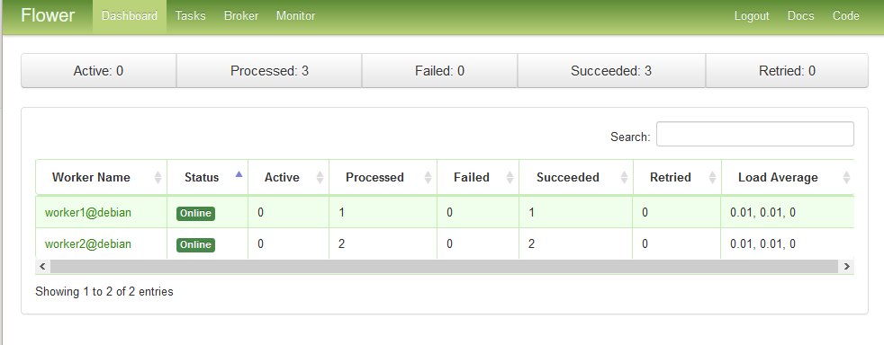

Celery is a Python Task-Queue system that handle distribution of tasks on workers across threads or network nodes. It makes asynchronous task management easy. Your application just need to push messages to a broker, like RabbitMQ, and Celery workers will pop them and schedule task execution.

Celery can be used in multiple configuration. Most frequent uses are horizontal application scaling by running resource intensive tasks on Celery workers distributed across a cluster, or to manage long asynchronous tasks in a web app, like thumbnail generation when a user post an image. This guide will take you through installation and usage of Celery with an example application that delegate file downloads to Celery workers, using Python 3, Celery 4.1.0, and RabbitMQ.

## Before You Begin

1.  If you have not already done so, create a Linode account and Compute Instance. See our [Getting Started with Linode](/docs/products/platform/get-started/) and [Creating a Compute Instance](/docs/products/compute/compute-instances/guides/create/) guides.

1.  Follow our [Setting Up and Securing a Compute Instance](/docs/products/compute/compute-instances/guides/set-up-and-secure/) guide to update your system. You may also wish to set the timezone, configure your hostname, create a limited user account, and harden SSH access.


This guide is written for a non-root user. Commands that require elevated privileges are prefixed with `sudo`. If you’re not familiar with the `sudo` command, see the [Users and Groups](/docs/guides/linux-users-and-groups/) guide.


## Install a Python 3 Environment



## Install Celery

Celery is available from PyPI. The easiest and recommended way is to install it with `pip`. You can go for a system wide installation for simplicity, or use a virtual environment if other Python applications runs on your system. This last method installs the libraries on a per project basis and prevent version conflicts with other applications.

### System Wide Installation

Chose a system wide installation if your host won't run other python applications with specific version libraries requirements. Install Celery with the following command:

    pip install celery

### Installation in a Python Virtual Environment

If other Python application are running on your host and you prefer to manage your libraries on a per project basis, use a virtual environment installation. This guide will use Anaconda but Virtualenv is also a good choice.

2. Create your virtual environment:

        conda create -n celeryenv

3. Activate your virtual environment:

        source activate celeryenv

    Your shell prompt will change to indicate which environment you are using

4. Install Celery in the virtual environment:

        pip install celery


If you use a virtual environment, don't forget to activate your environment with step 3 when working on your project. All command in this guide assume the Celery virtual environment is activated.


## Install RabbitMQ

* On Debian/Ubuntu:
  - Install RabbitMQ with `apt`. The following command will install and start RabbitMQ with an acceptable default configuration:

            sudo apt-get install rabbitmq-server

* On CentOS:
  - Install the `rabbitmq-server.noarch` package, enable the service to start at boot time and start the RabbitMQ server:

            sudo yum install rabbitmq-server.noarch
            systemctl enable rabbitmq-server
            systemctl start rabbitmq-server

      This will install RabbitMQ with the default configuration.

## Write a Celery Application

A Celery application is composed of two parts:

- *Workers* that wait for messages from RabbitMQ and execute the tasks.

- *Client* that submit messages to RabbitMQ to trigger task execution, and eventually retrieve the result at a later time

The tasks are defined in a module that will be used both by the workers and the client. Workers will run the code to execute tasks, and clients will only use function definitions to expose them and hide the RabbitMQ publishing complexity.

1.  Create a directory `downloaderApp` to hold our new python module, and a directory `downloadedFiles` where the downloaded files will be stored:

        mkdir ~/downloadedFiles ~/downloaderApp; cd ~/downloaderApp

2.  Create a `downloaderApp.py` module that will contain two functions, `download` and `list`, that will be the asynchronous tasks. Replace `celery` in the `BASEDIR` path with your system username.

    
from celery import Celery
import urllib.request
import os

# Where the downloaded files will be stored
BASEDIR="/home/celery/downloadedFiles"

# Create the app and set the broker location (RabbitMQ)
app = Celery('downloaderApp',
             backend='rpc://',
             broker='pyamqp://guest@localhost//')

@app.task
def download(url, filename):
    """
    Download a page and save it to the BASEDIR directory
      url: the url to download
      filename: the filename used to save the url in BASEDIR
    """
    response = urllib.request.urlopen(url)
    data = response.read()
    with open(BASEDIR+"/"+filename,'wb') as file:
        file.write(data)
    file.close()

@app.task
def list():
    """ Return an array of all downloaded files """
    return os.listdir(BASEDIR)

    

All the magic happens in the `@app.task` annotation. This tells celery that this function will not be run on the client, but sent to the workers via RabbitMQ. All the Celery configuration happens in following line:

    app = Celery('downloaderApp', backend='rpc://', broker='pyamqp://guest@localhost//')

This line creates:

- A Celery application named `downloaderApp`

- A `broker` on the localhost that will accept message via **Advanced Message Queuing Protocol* (AMQP), the protocol used by RabbitMQ

- A response `backend` where workers will store the return value of the task so that clients can retrieve it later (remember that task execution is asynchronous). If you omit `backend`, the task will still run, but the return value will be lost. `rpc` means the response will be sent to a RabbitMQ queue in a *Remote Procedure Call* pattern.

## Start the Workers

The command `celery worker` is used to start a Celery worker. The `-A` flag is used to set the module that contain the Celery app. The worker will read the module and connect to RabbitMQ using the parameters in the `Celery()` call.

1.  Start a worker in debug mode with the following command:

        celery -A downloaderApp worker --loglevel=debug

2.  Open another ssh session to run the client (don't forget to activate your virtual environment if needed), go to your module folder and start a python shell:

        cd ~/downloaderApp
        python

3.  In the python shell, call the `delay()` method to submit a job to RabbitMQ, and then use the `ready()` function to determine if the task is finished:

        from downloaderApp import download,list
        r = download.delay('https://www.python.org/static/community_logos/python-logo-master-v3-TM.png', 'python-logo.png')
        r.ready()

4.  Exit the python shell, and check that the python logo has been downloaded:

        ls ~/downloadedFiles

5. Start the python shell again and run the `list` task. Get the result with the `get()` function:

        from downloaderApp import download,list
        r = list.delay()
        r.ready()
        r.get(timeout=1)

    If you omit the `timeout` parameter, the client will wait for the task to complete in a synchronous manner. This is bad practice and should be avoided.

## Start the Workers as Daemons

In a production environment with more than one worker, the workers should be daemonized so that they are started automatically at server startup.

1.  Using `sudo`, create a new service definition file in `/etc/systemd/system/celeryd.service`. Change the `User` and `Group` properties according to your actual user and group name:

    
[Unit]
Description=Celery Service
After=network.target

[Service]
Type=forking
User=celery
Group=celery
EnvironmentFile=/etc/default/celeryd
WorkingDirectory=/home/celery/downloaderApp
ExecStart=/bin/sh -c '${CELERY_BIN} multi start ${CELERYD_NODES} \
  -A ${CELERY_APP} --pidfile=${CELERYD_PID_FILE} \
  --logfile=${CELERYD_LOG_FILE} --loglevel=${CELERYD_LOG_LEVEL} ${CELERYD_OPTS}'
ExecStop=/bin/sh -c '${CELERY_BIN} multi stopwait ${CELERYD_NODES} \
  --pidfile=${CELERYD_PID_FILE}'
ExecReload=/bin/sh -c '${CELERY_BIN} multi restart ${CELERYD_NODES} \
  -A ${CELERY_APP} --pidfile=${CELERYD_PID_FILE} \
  --logfile=${CELERYD_LOG_FILE} --loglevel=${CELERYD_LOG_LEVEL} ${CELERYD_OPTS}'

[Install]
WantedBy=multi-user.target
    

2.  Create a`/etc/default/celeryd` configuration file:

    
# The names of the workers. This example create two workers
CELERYD_NODES="worker1 worker2"

# The name of the Celery App, should be the same as the python file
# where the Celery tasks are defined
CELERY_APP="downloaderApp"

# Log and PID directories
CELERYD_LOG_FILE="/var/log/celery/%n%I.log"
CELERYD_PID_FILE="/var/run/celery/%n.pid"

# Log level
CELERYD_LOG_LEVEL=INFO

# Path to celery binary, that is in your virtual environment
CELERY_BIN=/home/celery/miniconda3/bin/celery
    

3.  Create log and pid directories:

        sudo mkdir /var/log/celery /var/run/celery
        sudo chown celery:celery /var/log/celery /var/run/celery

4.  Reload systemctl daemon. You should run this command each time you change the service definition file.

        sudo systemctl daemon-reload

5.  Enable the service to startup at boot:

        sudo systemctl enable celeryd

6.  Start the service

        sudo systemctl start celeryd

7. Check that your workers are running via log files:

        cat /var/log/celery/worker1.log
        cat /var/log/celery/worker2.log

8. Send some tasks to both workers, in a python shell from the directory `/home/celery/downloaderApp`:

        from downloaderApp import download,list
        r1 = download.delay('https://www.linode.com/media/images/logos/standard/light/linode-logo_standard_light_large.png', 'linode-logo.png')
        r2 = list.delay()
        r2.get(timeout=1)

    Depending on how quickly you enter the commands, the worker for `list` task may finish before the worker for `download` task and you may not see the Linode logo in the list. Have a look at log files, like in step 7, and you will see which worker handled each task.

## Monitor your Celery Cluster

The `celery` binary provide some commands to monitor workers and tasks, far more convenient than browsing log files:

1.  Use the **status** command to get the list of workers:

        celery -A downloaderApp status

    
worker1@celery: OK
worker2@celery: OK
celery@celery: OK


2.  Use the **inspect active** command to see what the workers are currently doing:

        celery -A downloaderApp inspect active

    
-> worker1@celery: OK
    - empty -
-> worker2@celery: OK
    - empty -
-> celery@celery: OK
    - empty -


3.  Use the **inspect stats** command to get statistics about the workers. It gives lot of information, like worker resource usage under `rusage` key, or the total tasks completed under `total` key.

        celery -A downloaderApp inspect stats

## Monitor a Celery Cluster with Flower

Flower is a web-based monitoring tool that can be used instead of the `celery` command.

1.  Install Flower:

        pip install wheel flower

2. If you run CentOS, you need to open your firewall on Flower port (default 5555). Skip this step if you are on Debian:

    1.  Get your current zone, which will normally be `public`:

            firewall-cmd --get-active-zones

    2.  Open port 5555. Change the zone according to your configuration:

            sudo firewall-cmd --zone=public --add-port=5555/tcp --permanent

    3.  Reload the firewall:

            sudo firewall-cmd --reload



3.  Navigate to the directory with your Celery app and start Flower. 5555 is the default port, but this can be changed using the `--port` flag:

        cd /home/celery/downloaderApp
        celery -A downloaderApp flower --port=5555

4. Point your browser to `localhost:5555` to view the dashboard:

      

    
If Flower is exposed through a public IP address, be sure to take additional steps to secure this through a [reverse proxy](https://flower.readthedocs.io/en/latest/reverse-proxy.html).


## Start Celery Tasks from Other Languages

Celery's ease of use comes from the decorator `@task` that adds Celery methods to the function object. This magic cannot be used in every programming language, so Celery provides two other methods to communicate with workers:

1.  [**Webhooks**](https://en.wikipedia.org/wiki/Webhook): Flower provides an API that allow you to interact with Celery by means of REST HTTP queries.

2.  [**AMQP**](https://www.amqp.org/): The `@task` decorator sends message to the broker when you call celery methods like `.delay()`. Some languages provide modules that perform this task for you, including [node-celery](https://github.com/mher/node-celery) for NodeJS, or [celery-php](https://github.com/gjedeer/celery-php) for PHP.

You can use `curl` to practice interacting how to use the Flower API.

1. Start Flower, if it's not already running:

        cd /home/celery/downloaderApp
        celery -A downloaderApp flower --port=5555

3. Submit a download via the task API:

        curl -X POST -d '{"args":["http://www.celeryproject.org/static/img/logo.png","celery-logo.png"]}' 'http://localhost:5555/api/task/async-apply/downloaderApp.download?refresh=True'

    
{"task-id": "f29ce7dd-fb4c-4f29-9adc-f834250eb14e", "state": "PENDING"}


    The `/api/task/async-apply` endpoint makes an asynchronous call to one of the app's tasks, in this case `doanloaderApp.download`. You can make a synchronous call with `/task/api/apply`.

4. Open Flower UI in your browser and see that the task has been accepted.

You can find a complete list of Flower API endpoints in the [official API documentation](http://flower.readthedocs.io/en/latest/api.html).
