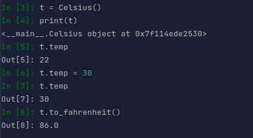
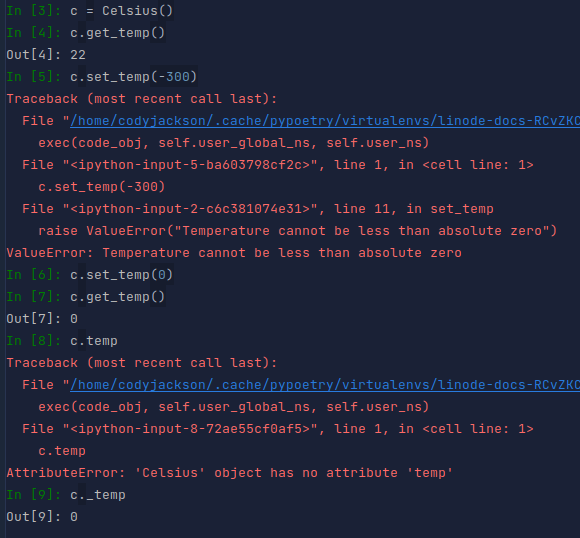
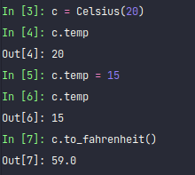

Getting and setting data values are a key component of software development. While there are several ways to perform the
operations, Python uses properties to retrieve, assign, and modify data. 

## Before You Begin

1. This guide assumes you have a Linux OS with at least Python 3.6 installed; most Linux versions have it installed by 
default. If you don't have ready access to a system, create a Linode account and Compute Instance. See our 
[Getting Started with Linode](/docs/guides/getting-started/) and 
[Creating a Compute Instance](/docs/guides/creating-a-compute-instance/) guides. 

2. This guide is written for a non-root user. Commands that require elevated privileges are prefixed with `sudo`. 
If you’re not familiar with the `sudo` command, see the 
[Users and Groups](/docs/tools-reference/linux-users-and-groups/) guide and  follow our 
[Setting Up and Securing a Compute Instance](/docs/guides/set-up-and-secure/) guide to update your system. You may also 
wish to set the timezone, configure your hostname, create a limited user account, and harden SSH access.

## Example Problem
To understand getters, setters, and Python properties, we will start with the following code example.
```python
class Celsius:
    def __init__(self, temp=22):
        self.temp = temp
    
    def to_fahrenheit(self):
        return (self.temp * 1.8) - 32
```
We create a class to define temperature in Celsius. The `__init__` method takes `temp` as an argument and provides a 
default value if no value is provided. A method to convert to Fahrenheit returns the conversion value but does not 
assign values to any variables. 

Below, we make an instance of the class and perform some basic tests to ensure it works as intended.



Line 3 creates the object, line 4 just verifies the object in memory, and line 5 provides the default value of the 
current temperature variable. In line 6, we change the value of `temp` and show that the change was made in line 7. 
Finally, in line 8 we confirm that the conversion formula works correctly.

## Getters and Setters
If we want to improve this class with new features, we want to ensure that users aren't adversely affected by those
changes. This is the purpose of getters and setters. Normally, direct access to the `temp` variable is hidden by the
get/set methods, making a method call the only way to interact with `temp`.

The following updated Celsius class provides new get/set methods and variables to handle make these changes.
```python
class Celsius:
    def __init__(self, temp=22):
        self._temp = temp
        self.set_temp(temp)

    def to_fahrenheit(self):
        return (self.get_temp() * 1.8) + 32

    def set_temp(self, temp):
        if temp < -273.15:
            raise ValueError("Temperature cannot be less than absolute zero")
        self._temp = temp

    def get_temp(self):
        return self._temp
```
The new class now includes both `get_temp()` and `set_temp()` methods. By changing `self.temp` to `self._temp`, those
methods are now the only way to interact with `temp`. The underscore tells Python that it is a private variable that 
should only be accessed by this class.

Next, we perform some basic function checks to ensure the changes work correctly.



Line 3 sets a new instance and line 4 shows that the default value is set. If we try to change the value to an 
unreasonable value (line 5), an error message is returned. We can set a more reasonable value and confirm it was 
properly set in lines 6 and 7. 

However, if we try to access the temperature value directly (line 8), the resulting error message informs us that the 
Celsius class doesn't have a variable `temp`. You can access the value if you provide the underscore (line 9) but a user
would have to know the actual private name to do this.

The problem with using getters and setters is that users have to update their programs to use the new methods rather
than direct variable access. As more and more get/set methods are added, especially as part of refactoring old code, 
backwards compatibility is broken.

## Properties
To alleviate this problem, Python used `properties`. A property uses built-in functionality to perform get/set without
the user being required to know the actual method names. All changes remain internal to the program so users don't need
to worry about the actual implementation.

The code below shows how the example is updated to use Python properties.
```python
class Celsius:
    def __init__(self, temp=22):
        self._temp = temp

    def to_fahrenheit(self):
        return (self._temp * 1.8) + 32

    @property
    def temp(self):
        return self._temp

    @temp.setter
    def temp(self, value):
        if value < -273.15:
            raise ValueError("Temperature cannot be less than absolute zero")
        self._temp = value
```

The `__init__()` method has been changed from calling `set_temp()` to simply assigning the `temp` argument to a variable.
The conversion method `to_fahrenheit()` accesses the variable directly rather than using the `get_temp()` method.

The `@property` decorator tells Python that the subsequent method defines the getter functionality for the variable. The
setter is denoted by `@temp.setter`. 

Decorators can be any callable object that can modify a function or method. They essentially wrap a function or method
within another function/method. The wrapper can provide new functionality, modify arguments or results, etc. Decorators 
always start with `@` and are always on the line prior to defining a method or function.

If we look at the commands below, we can see how Python properties compare to traditional get/set methods.



Line 3 creates the new instance while also providing an input value, as confirmed in line 4. In line
5 we change the value and confirm in line 6. Finally, line 7 runs the conversion.

## Conclusion
We can see that properties perform just like get/set but the user only needs to know the variable name; no method calls
are used. This means the developer can modify the get/set functionality within the code but the user won't be aware of 
it; this is a good thing as refactoring the code won't break the API for the user. Their get and set operations remain 
the same even if things are modified behind the scenes.