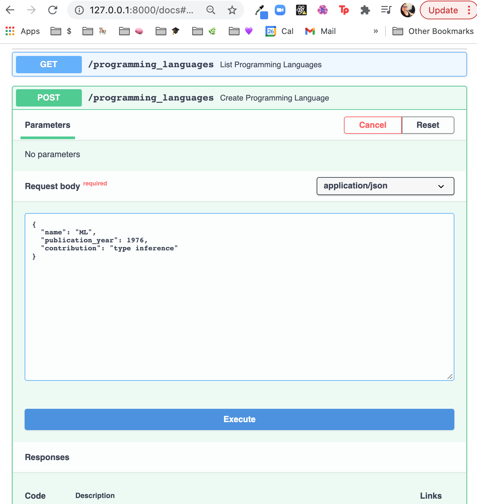
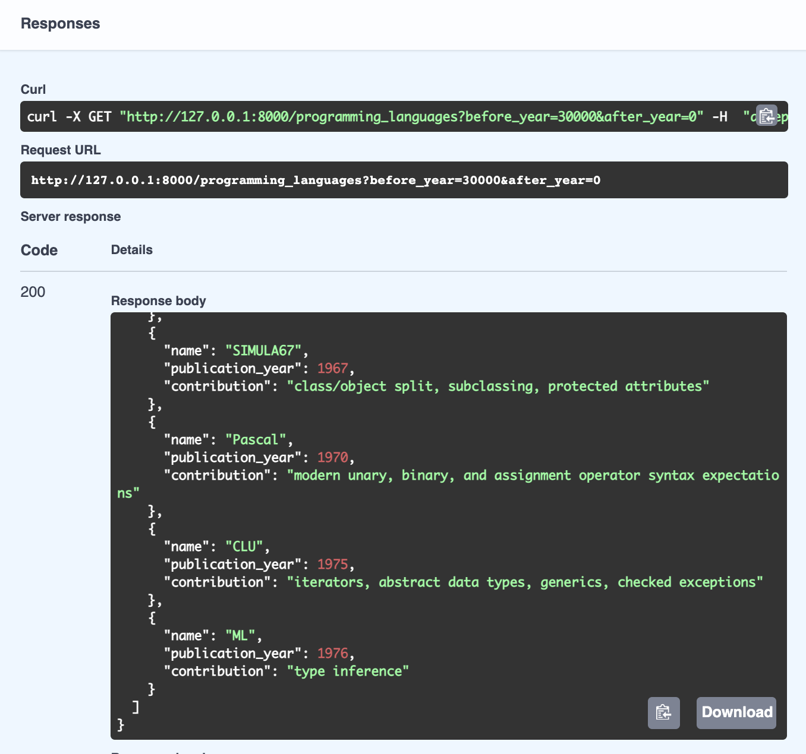
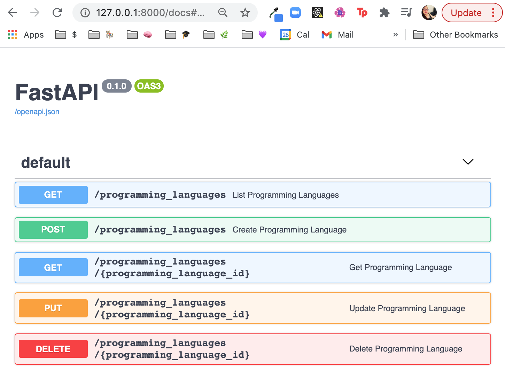

# CRUD Write Operations in Python Using FastAPI: Create, Update, Delete

The REST protocol is well-suited for servers that connect to a database and allow client applications to perform operations on that database. Those operations have an acronym: CRUD, which stands for &quot;create, read, update, destroy.&quot;

The [last post](https://www.linode.com/docs/guides/development/python/read-requests-rest-fastapi) began a process of writing RESTful endpoints to handle the reading portion of the CRUD acronym. We created a brand new server with FastAPI, instantiated a small in-memory data store of historical information about programming languages, and created endpoints to get information about a specific language or to list them all—or to list the ones published before or after a certain year.

This guide continues the process, by making endpoints to add, delete, or update a record in our in-memory datastore.

For reference, this is our starting point:

```python
from fastapi import FastAPI
from pydantic import BaseModel

app = FastAPI()

class ProgrammingLanguage(BaseModel):
   name: str
   publication_year: int
   contribution: str

in_memory_datastore = [
  {"name": "COBOL", "publication_year": 1960, "contribution": "record data"},
  {"name": "ALGOL", "publication_year": 1958, "contribution": "scoping and nested functions"},
  {"name": "APL", "publication_year": 1962, "contribution": "array processing"},
  {"name": "BASIC", "publication_year": 1964, "contribution": "runtime interpretation, office tooling"},
  {"name": "PL/I", "publication_year": 1966, "contribution": "constants, function overloading, pointers"},
  {"name": "SIMULA67", "publication_year": 1967, "contribution": "class/object split, subclassing, protected attributes"},
  {"name": "Pascal", "publication_year": 1970, "contribution": "modern unary, binary, and assignment operator syntax expectations"},
  {"name": "CLU", "publication_year": 1975, "contribution": "iterators, abstract data types, generics, checked exceptions"},

]

@app.get('/programming_languages')
def list_programming_languages(before_year: int = 30000, after_year: int = 0):
   object_store = map(
       lambda pl_as_data: ProgrammingLanguage(**pl_as_data),
       in_memory_datastore
   )
   qualifying_data = list(
       filter(
           lambda pl: before_year > pl.publication_year > after_year,
           object_store
       )
   )
   return {"programming_languages" : qualifying_data }

@app.get('/programming_languages/{programming_language_id}')
def get_programming_language(programming_language_id: int):
  return in_memory_datastore[programming_language_id]
```

## Creating a Resource in a RESTful API

So far, all of our endpoints expect clients to use the `GET HTTP` verb to make their requests. This is in keeping with RESTful resource conventions; for listing or fetching specific resources, a verb like `GET` makes semantic sense. This chart exemplifies the RESTful resource conventions for an API that serves up items from a database of photos:


That chart indicates a _different_ verb for creating a resource: the `POST` verb. The create endpoint expects a `POST` verb as well as a _request body:_ a payload of data sent along with the request to the endpoint which specifies the attributes of the new resource that the client wants to add. In this case, those attributes need to come in as a JSON object. They should include the name, publication\_year, and contribution of the programming language to be added.

Enter the rest of the code, add a function to create a programming language, and annotate it with `@app.post` instead of `@app.get`:

```python
@app.post('/programming_languages')
def create_programming_language(programming_language: ProgrammingLanguage):
   in_memory_datastore.append(programming_language.dict())
   return programming_language.dict()
```

This is where the magic of the FastAPI base model really helps. The `create_programming_language` function accepts a `programming_language` with the type hint `ProgrammingLanguage`, so FastAPI takes whatever the request body is and tries to cast it to a `ProgrammingLanguage`. We&#39;re not using that yet in this function. Instead, the code turns the object right back into a dict to put it into the datastore and return to the client.

Should that change? Maybe. It&#39;s time to revisit some earlier API design choices.

The datastore, in particular, currently stores a list of dictionaries. When the list endpoint fetches the contents of the datastore, it converts all those dictionaries into objects:

```python
@app.get('/programming_languages')
def list_programming_languages(before_year: int = 30000, after_year: int = 0):
   object_store = map(
       lambda pl_as_data: ProgrammingLanguage(**pl_as_data),
       in_memory_datastore
   )
 …
```

As the datastore gets larger, the list request takes longer. A more performant solution might store the resource instances as objects and only convert them to dictionaries when necessary. Our in-memory datastore would become this:

```python
in_memory_datastore = [
  ProgrammingLanguage(name = "COBOL", publication_year = 1960, contribution = "record data"),
  ProgrammingLanguage(name = "ALGOL", publication_year = 1958, contribution = "scoping and nested functions"),
  ProgrammingLanguage(name = "APL", publication_year = 1962, contribution = "array processing"),
  ProgrammingLanguage(name = "BASIC", publication_year = 1964, contribution = "runtime interpretation, office tooling"),
  ProgrammingLanguage(name = "PL/I", publication_year = 1966, contribution = "constants, function overloading, pointers"),
  ProgrammingLanguage(name = "SIMULA67", publication_year = 1967, contribution = "class/object split, subclassing, protected attributes"),
  ProgrammingLanguage(name = "Pascal", publication_year = 1970, contribution = "modern unary, binary, and assignment operator syntax expectations"),
  ProgrammingLanguage(name = "CLU", publication_year = 1975, contribution = "iterators, abstract data types, generics, checked exceptions"),
]
```

So now, instead of dictionaries, it stores instances of the programming language itself. Then the list endpoint no longer needs to convert all the items for filtering:

```python
@app.get('/programming_languages')
def list_programming_languages(before_year: int = 30000, after_year: int = 0):
   qualifying_data = list(
       filter(
           lambda pl: before_year > pl.publication_year > after_year,
           in_memory_datastore
       )
   )
   return {"programming_languages" : qualifying_data }
```

The function that allows clients to create a programming language already converts the request body into a `ProgrammingLanguage`, so we don&#39;t have to convert it to a dict before storage:

```python
@app.post('/programming_languages')
def create_programming_language(programming_language: ProgrammingLanguage):
   in_memory_datastore.append(programming_language)
   return programming_language.dict()
```

This way, the conversion happens on _writes_—when a client puts something into the database—and it only has to happen for one object at a time rather than all of them at once.

When a client makes a request to the create endpoint, such as this one:



That new programming language gets added to the data store and gets returned with the rest of the records when a client asks for the full list:



## Updating a Record

The endpoint for updating a record looks similar to the detail endpoint that clients use to fetch a specific record. There are two differences. First, there&#39;s the `HTTP` verb. RESTful services conventionally use a `PUT` verb for the update endpoint. Second, the update endpoint, like the create endpoint, expects a request body containing the full set of attributes that the updated resource should have.

```python
@app.put("/programming_languages/{programming_language_id}")
async def update_programming_language(programming_language_id: int, updated_programming_language: ProgrammingLanguage):
   in_memory_datastore[programming_language_id] = updated_programming_language
   return updated_programming_language
```

**Nota Bene:** This update endpoint replaces the _entire object_, so a client needs to pass in the _entire updated object_. The server could also be constructed to accept _partial updates_—that is, to only update the resource at the given id with the fields sent in the request body. Sometimes when servers do this, the associated endpoint will accept the `PATCH` HTTP verb instead of `PUT`.

## Updating a Record

The endpoint for deleting a record is similar to the update endpoint. The difference: the HTTP verb. RESTful services conventionally use a DELETE verb for the delete endpoint:

```python
@app.delete("/programming_languages/{programming_language_id}")
async def delete_programming_language(programming_language_id: int):
   del in_memory_datastore[programming_language_id]
```

There&#39;s a problem, though. Specifically, this implementation reveals a problem with storing the data in a list and using the numeric index as the id for each resource.

At the outset, the first programming language in the data store (fetched with the id `0`) is COBOL:


But then, consider what happens after we delete COBOL from the data store.


If we again get the programming language with the id of zero, we get a _different_ programming language:


This happens because when we delete the first item from the list, the second item becomes the first item. Since the ids reference their position in the list, the same id can point to a different programming language after the data store changes.

This violates the **idempotency rule.** An operation that is **idempotent** changes the system&#39;s state in the same way, whether it is run one time or many times. Update and delete requests in RESTful services should be idempotent in order to avoid confusing states or accidents. And in particular, when the resource at a given id is deleted, that id should no longer fetch a resource. It _certainly_ should not fetch a _different_ resource from the original one.

To fix this, the app must use an immutable attribute as the id, rather than the resource&#39;s position in the list. There are many ways to fix it:

- Instantiate the app with a counter that starts at zero and assign every new, created resource the next number in the counter as its id. Then, if the resource at id 3 were deleted, the ids would go 0, 1, 2, 4, 5. The id of 3 would no longer fetch a resource.
- The id does not even have to be an incrementing integer, or an integer of any kind. It&#39;s common for resources to have UUIDs instead, such as `aa3f-2b3d-7sgw-a216`. These UUIDs are unique, but they have no meaning, and they&#39;re unlikely to be mistaken for having meaning (which is sometimes a problem with incrementing counter ids).
- A _meaningful and unique_ attribute of the resources might be used as the id instead—perhaps the name, or, if we&#39;re worried about two programming languages having the same name, a combination of the name and the publication year.

In any of these cases, rather than indexing from a list, the `get_programming_language` method would search for the `ProgrammingLanguage` whose id attribute matched the one passed in on the path. Alternatively, using a dictionary instead of a list for the data store would facilitate faster lookup. Each programming language&#39;s id could serve as a key and point to the `ProgrammingLanguage` object as the value.

In practice, most APIs use some sort of database rather than a collection object in memory to store things. Database solutions universally have a robust id solution that does not pluck items out of the database based on their position. That said, most database solutions also provide some freedom to choose what kind of id to use for the data.

## The Create, Update, and Destroy endpoints complete our RESTful API

A visit to `127.0.0.1/docs` shows them alongside the list and detail endpoints.



While this post and the [previous post](https://www.linode.com/docs/guides/development/python/read-requests-rest-fastapi) specifically covered how to implement a RESTful service in FastAPI, the FastAPI syntax is similar to that used by Flask or Bottle. With a few adjustments, much of the example code would hold for those frameworks. And regardless of framework, the concepts of conventional RESTful endpoints, data lookup efficiency, and idempotency apply across any backend stack.

In the next piece (the final one of this series), we cover [when it is a good idea to follow RESTful protocol in API design](https://www.linode.com/docs/guides/development/python/restful-vs-non-restful-apis), and when it may make more sense to do something else.
