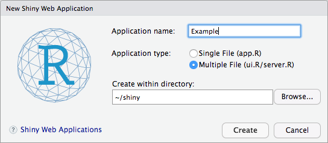
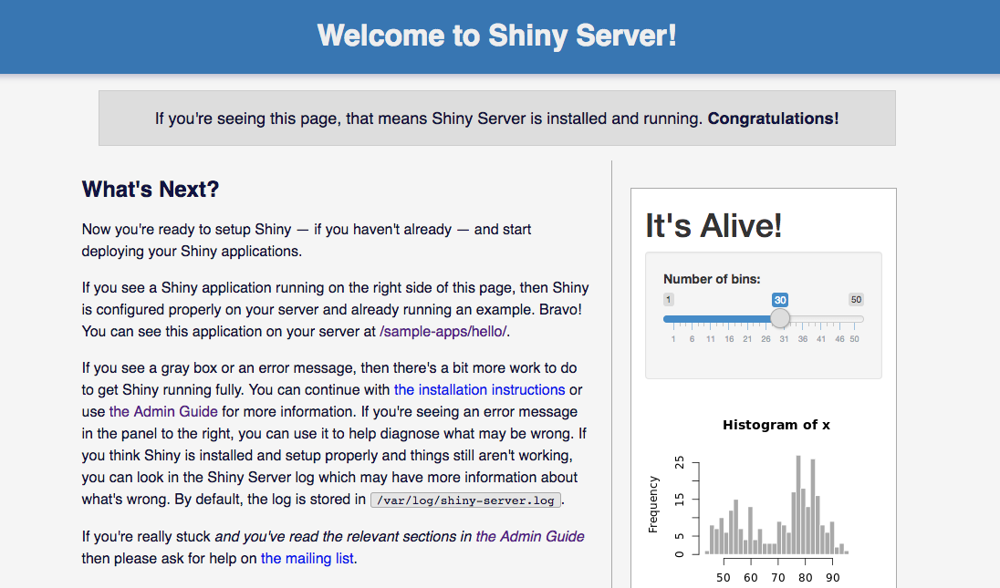
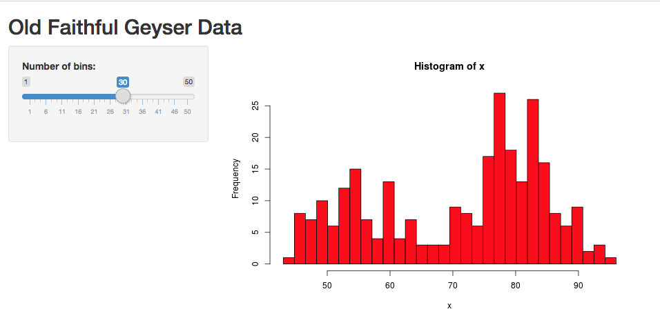

## What is Shiny?

[Shiny](https://shiny.rstudio.com/) is a library for the R programming language that allows you to create interactive web apps in native R, without needing to use web technologies such as HTML, CSS, or JavaScript. There are many ways to deploy Shiny apps to the web; this guide uses Shiny Server to host an example Shiny app on a Linode.

## Before You Begin

If you do not have RStudio installed on your local computer, follow our [How to Deploy RStudio Using an NGINX Reverse Proxy](/docs/guides/how-to-deploy-rstudio-server-using-an-nginx-reverse-proxy/) guide to set up a remote workstation on a Linode.

## Build a Shiny Test App

Shiny Server comes with pre-installed demo apps. However, in order to demonstrate the process of deploying an app, you will create an app locally and deploy it to a Shiny Server on a Linode.

1.  Open RStudio and install the Shiny package:

    ```command
    install.packages('shiny')
    ```

1.  In the **File** menu, under **New File**, select **Shiny Web App...**. When prompted, choose a name for your project. Select **Multiple File** and choose a directory to store the new app's files.

    

1.  Rstudio automatically opens two new files: `ui.R` and `server.R`. These files are pre-filled with a demo app that will create an interactive histogram of R's built-in Old Faithful data set. Edit `server.R` to adjust the formatting of the histogram according to your tastes. For example, to change the bars to red with a black border:

    ```command
    hist(x, breaks = bins, col = 'red', border = 'black')
    ```

1.  To test the project locally, click **Run App** in the upper right corner of the text editor.

1.  Save the project and copy the files to your Linode. Replace `username` with your Unix account username and `linodeIP` with the public IP address or domain name of your Linode:

    ```command
    scp -r ~/shiny/Example username@linodeIP:/home/username
    ```

## Deploy a Shiny App to a Remote Server

The steps in this section should be completed on your Linode.

### Install R

Install the R package that's included in your distribution's main package repository. For Ubuntu and Debian, run the following command:

```command
sudo apt update && install r-base
```

If you need R developer tools, also install the `r-base-dev` package. To install an older version or to learn more about the installation process, review the [Ubuntu Packages For R - Full Instructions](https://cran.r-project.org/bin/linux/ubuntu/fullREADME.html#installing-r) guide.

### Add the Shiny Package

Use `install.packages()` to add the Shiny package:

```command
sudo su - \
-c "R -e \"install.packages('shiny', repos='https://cran.rstudio.com/')\""
```

### Install Shiny Server

1.  Install `gdebi`:

    ```command
    sudo apt install gdebi-core
    ```

1.  Download Shiny Server:

    ```command
    wget https://download3.rstudio.org/ubuntu-12.04/x86_64/shiny-server-1.5.6.875-amd64.deb
    ```

1.  Use `gdebi` to install the Shiny Server package:

    ```command
    sudo gdebi shiny-server-1.5.6.875-amd64.deb
    ```

1.  The `shiny-server` service should start automatically. Check its status:

    ```command
    sudo systemctl status shiny-server.service
    ```

1.  In a browser, navigate to your Linode's public IP address or FQDN on port `3838` (e.g. `example.com:3838`). You should see the Shiny Server welcome page:

    

### Deploy Your App

By default, Shiny Server uses `/srv/shiny-server/` as its site directory. Any Shiny apps in this directory will be served automatically.

1.  Copy the example app directory into `/srv/shiny-server/`:

    ```command
    sudo cp -r Example/ /srv/shiny-server/
    ```

1.  In a web browser, navigate to the app's address. Replace `example.com` with your Linode's public IP address or FQDN:

    ```command
    example.com:3838/Example
    ```

    You should see your app displayed:

    

### Configure Shiny Server

Shiny Server's configuration file is stored at `/etc/shiny-server/shiny-server.conf`:

```file {title="/etc/shiny-server/shiny-server.conf"}
# Instruct Shiny Server to run applications as the user "shiny"
run_as shiny;

# Define a server that listens on port 3838
server {
  listen 3838;

  # Define a location at the base URL
  location / {

    # Host the directory of Shiny Apps stored in this directory
    site_dir /srv/shiny-server;

    # Log all Shiny output to files in this directory
    log_dir /var/log/shiny-server;

    # When a user visits the base URL rather than a particular application,
    # an index of the applications available in this directory will be shown.
    directory_index on;
  }
}
```

You can edit the port that Shiny Server will listen on, or change the site directory from which apps are served. The `directory_index` option allows visitors to view the contents of a directory by navigating to that path (for example, visiting `example.com:3838/sample-apps` will show a list of the example apps included in the Shiny Server installation). You can disable this behavior and hide the contents of directories by setting this option to `off`. For more information about configuring Shiny Server, see the official [Administrator's Guide](http://docs.rstudio.com/shiny-server/).

After making changes to this file, restart the `shiny-server` service:

```command
sudo systemctl restart shiny-server.service
```

## Next Steps

In order to keep the deployed app up-to-date with changes made in your local environment, consider using a more sophisticated deployment method such as Git or Rsync. Production deployments may also want to run Shiny Server behind a reverse proxy to make use of additional security and optimization features.