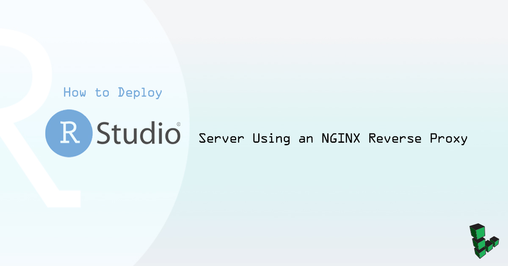
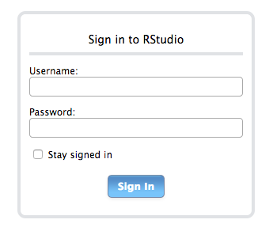
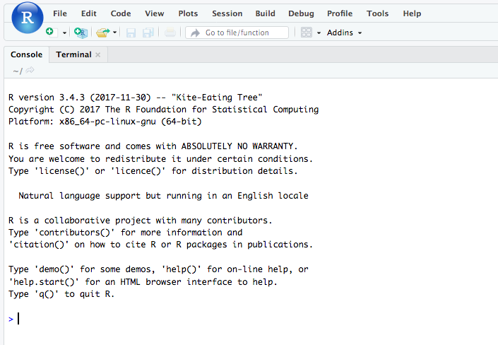

## What is RStudio Server?

[RStudio](https://www.rstudio.com) is an integrated development environment (IDE) for [R](https://www.r-project.org/), an open source statistical computing language. It includes debugging and plotting tools that make it easy to write, debug, and run R scripts. The IDE is available in both desktop and server configurations. By hosting the server configuration (RStudio Server) on a Linode, you can access the IDE from any computer with internet access. Since data analysis often uses large datasets and can be computationally expensive, keeping your data and running R scripts from a remote server can be more efficient than working from your personal computer. In addition, a professional edition is available that allows project sharing and simultaneous code editing for multiple users.

## Before You Begin

This guide assumes an R installation version of R 3.0.1+ and will show how to install RStudio Server 1.1. See our guide on [installing R on Ubuntu and Debian](/docs/guides/how-to-install-r-on-ubuntu-and-debian/) for steps on installing the latest version of R.

The steps in this guide are for Ubuntu 16.04 and should be adapted to your specific distribution installation.

## Install RStudio Server

1.  Download RStudio 1.1:

        wget https://download2.rstudio.org/rstudio-server-1.1.414-amd64.deb

2.  Install and use the gDebi package installer for the downloaded Debian package file:

        sudo apt install gdebi
        sudo gdebi rstudio-server-1.1.414-amd64.deb

    If successful, the output should show `rstudio-server.service` as active.

    
Created symlink from /etc/systemd/system/multi-user.target.wants/rstudio-server.service to /etc/systemd/system/rstudio-server.service.
● rstudio-server.service - RStudio Server
   Loaded: loaded (/etc/systemd/system/rstudio-server.service; enabled; vendor preset: enabled)
   Active: active (running) since Tue 2018-01-23 21:18:44 UTC; 1s ago
  Process: 13676 ExecStart=/usr/lib/rstudio-server/bin/rserver (code=exited, status=0/SUCCESS)
 Main PID: 13677 (rserver)
   CGroup: /system.slice/rstudio-server.service
           └─13677 /usr/lib/rstudio-server/bin/rserver

Jan 23 21:18:44 localhost systemd[1]: Starting RStudio Server...
Jan 23 21:18:44 localhost systemd[1]: Started RStudio Server.


3.  In a browser, navigate to your Linode's public IP address on port 8787 (i.e. `public-ip:8787`). Use your Unix user's username and password to log in when prompted:

    

4.  Because you will be accessing RStudio through a reverse proxy, set RStudio Server to listen on localhost instead of a public IP. Open `rserver.conf` in a text editor and add the following content:

    
# Server Configuration File
www-address=127.0.0.1


5.  You can also set the configuration for each individual session. For example, the default session timeout is two hours. Change this to 30 minutes to conserve server resources:

    
# R Session Configuration File
session-timeout-minutes=30


6.  Check your configuration:

        sudo rstudio-server verify-installation

7.  If there are no issues, restart RStudio server to apply the changes:

        sudo rstudio-server restart

## Set Up the Reverse Proxy

Running Rstudio server behind a reverse proxy offers benefits such as being able to pick the URL endpoints and load balancing.

1.  Install NGINX:

        sudo apt install nginx

2.  Open `nginx.conf` in a text editor and add the following configuration:

    
http {
        # Basic Settings
        # ...

        map $http_upgrade $connection_upgrade {
            default upgrade;
            ''      close;
        }
}


3.  Create an NGINX configuration in `/etc/nginx/conf.d/` called `rstudio.conf` with the following configuration. Replace `example.com` with the public IP address or FDQN of your Linode:

    
server {
        listen 80;
        listen [::]:80;

        server_name example.com;

        location / {
             proxy_pass http://localhost:8787/;
             proxy_redirect http://localhost:8787/ $scheme://$host/;
             proxy_http_version 1.1;
             proxy_set_header Upgrade $http_upgrade;
             proxy_set_header Connection $connection_upgrade;
             proxy_read_timeout 20d;
        }
}


4.  Check the NGINX configuration:

        sudo nginx -t

5.  If there are no errors, restart NGINX to apply the changes:

        sudo systemctl restart nginx

6.  In a browser, navigate to the public IP or FDQN of your Linode. After logging in, the RStudio IDE should be available from your browser:

    


If Rstudio does not load in the browser, you may need to clear your browser cache.

