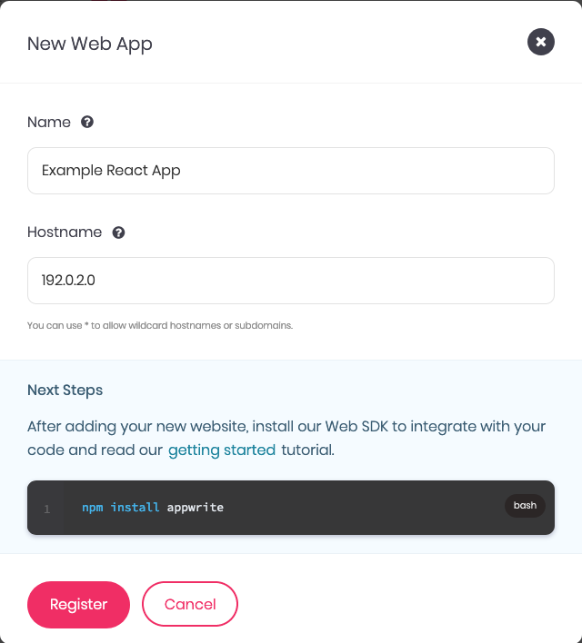
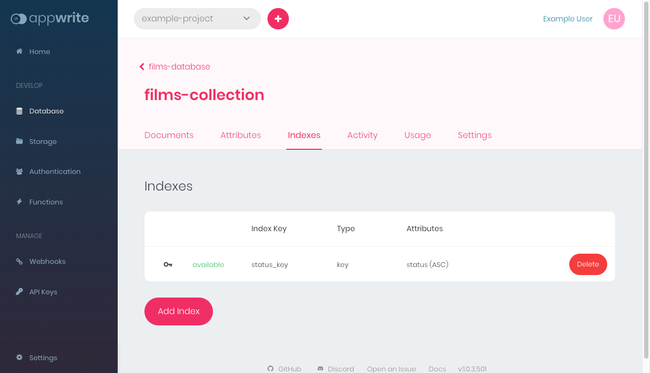

[React](https://reactjs.org/) has established itself as one of the most prominent frameworks for developing web frontends. It gives developers a range of tools for effectively working with web APIs and displaying the results.

[Appwrite](https://appwrite.io/) boasts an interface for simplifying the development of backend web APIs. It is an open-source, self-hosted solution that provides a web-based interface for managing user authentication, databases, and server functions. All with a full-featured API.

The two tools work excellently together. Appwrite provides a simple-to-use backend server that gives you a full web API without any backend development. This lets you focus on your frontend development, helping you to make the most of what React has to offer.

This tutorial helps you get started making your own application using Appwrite and React. It covers all the steps for setting up both an Appwrite and a React project, then walks your through everything you need to have the two interact.

## Before You Begin

1. Familiarize yourself with our [Getting Started with Linode](/docs/getting-started/) guide, and complete the steps for setting your Linode's hostname and timezone.

1. This guide uses `sudo` wherever possible. Complete the sections of our [How to Secure Your Server](/docs/security/securing-your-server/) guide to create a standard user account, harden SSH access, and remove unnecessary network services.

1. Update your system.

    - On Debian and Ubuntu, you can do this with:

            sudo apt update && sudo apt upgrade

    - On AlmaLinux, CentOS (8 or later), or Fedora, use:

            sudo dnf upgrade

1. Follow our guide on how to [Install and Use the Node Package Manager (NPM) on Linux](/docs/guides/install-and-use-npm-on-linux/). The React development process tends to use NPM, and an NPM-based React project is especially helpful for integrating Appwrite.


This guide is written for a non-root user. Commands that require elevated privileges are prefixed with `sudo`. If you’re not familiar with the `sudo` command, see the [Users and Groups](/docs/tools-reference/linux-users-and-groups/) guide.


## How to Create an Appwrite Backend

To start out building your React application, you can build its backend using Appwrite. Aside from some command-line setup, most of the steps for creating your Appwrite backend have your working right in the Appwrite web dashboard.

### Setting Up Appwrite

You need to install your own self-hosted Appwrite instance and have everything set up for React to be able to access the backend. These next series of steps show you how.

1. Follow the steps in our guide [Getting Started with Appwrite as a Backend Server](/docs/guides/getting-started-appwrite/). This shows you how to install and configure your own Appwrite instance.

1. Make sure that the Docker services are started and enabled. Enabling the services ensures that they initiate at system startup:

        sudo systemctl start docker
        sudo systemctl enable docker

1. Start running the Appwrite instance. This first requires you to change into the Appwrite directory, which here is assumed to be `~/appwrite`:

        cd ~/appwrite
        sudo docker compose up -d

### Preparing the Appwrite Project

Next, Appwrite is project based, and you thus need to create a project to build your backend within. These steps explain lead you through creating the project and configuring it for use with your React application.

1. Open up your Appwrite dashboard by navigating to your instance's hostname or IP address. Detailed instructions for doing that are given in the guide linked above.

1. Navigate to an existing project or create a new one, steps for which are also given in the guide linked above.

1. From the project dashboard, click the **Add Platform** button. Select **New Web App** from the menu that appears, and complete the prompt with information for your new application.

    This guides uses the title "Example React App" and has the application hosted on the IP address `192.0.2.0`.

    
This should be your server's IP address or hostname. It should match both the address/hostname for the Appwrite instance as well as your React application.
    

    

1. Create a user specifically for accessing the Appwrite API from the React application. You can do so by selecting **Users** from the left menu, clicking the **Add User** button, and completing the prompt. For this guide, this user's name is `react-app-user` and email is `react-app-user@mail.example.com`.

    

### Populating Appwrite

With that, you're ready to start populating your Appwrite instance with data, which it in turn can provide to your React application.

1. Select the **Database** option from the left menu, and click the **Add Database** button. This presents you with a prompt to create a database. Give the database a name — this guide uses `films-database` — and complete the prompt.

    

1. From the page for the new database, click the **Add Collection** button, which gives you a prompt for creating a new collection within the database. Name the new collection, and complete the prompt. This guide uses the name `films-collection`.

    

1. Create two attributes for the collection, by navigating to the **Attributes** tab of the new collection's page. Clicking the **Add Attribute** button present a menu for attribute data types, and selecting one of these gives you a prompt for creating the attribute.

    The first attribute should be a string attribute, and it should be given `name` as the key and a length of `64`. It should also have the **Required** toggle turned on.

    The second attribute should also be a string attribute. Give it `status` as the key, a length of `64`, and a **Default Value** of `To Watch`.

    Appwrite automatically provides each created document with an ID attribute, so there is no need to create a separate attribute for that.

    

1. Navigate to the **Settings** tab of the collection, and make sure that **Collection Level** is selected. Then, enter `role:all` for both the **Read Access** and **Write Access** fields.

    

1. Navigate to the **Indexes** tab of the collection, and use the **Add Index** button to add an index. Give the index a key of `status_key`, make sure that *Key* is the type, and under **Attributes** select *status*.

    

1. Finally, navigate to the collection's **Documents** tab and use the **Add Document** button to add some data. This guide assumes you have created three documents, with the names and status shown in the image below. The IDs here were automatically generated by Appwrite.

    

## How to Create a React Frontend

Now that you have the backend prepped and populated, you are ready to start building out a React frontend to interface with the data.

The example application built here shows two lists, one of films marked "To Watch" and another of films marked "Watched." The interface then gives the user the ability to add new films to a list and change film statuses.

### Setting Up the React Project

1. Follow our guide on how to [Install and Use the Node Package Manager (NPM) on Linux](/docs/guides/install-and-use-npm-on-linux/). This guide uses NPM to bootstrap a React project, to install the Appwrite web SDK, and to run the React frontend.

1. Create the React project. This command uses `create-react-app` to bootstrap a new React project and names the new project `example-app`. The results is a directory with that name being created in the current directory.

    For this guide, the new React application's directory is created in the current user's home directory:

        cd ~/
        npx create-react-app example-app

    
Need to install the following packages:
  create-react-app@5.0.1
Ok to proceed? (y)
    

1. Change into the new directory. The rest of this tutorial assumes you are still in this directory unless otherwise noted:

        cd example-app

1. Install the Appwrite web SDK through the `appwrite` NPM package. The React frontend can use this SDK to simplify interfacing with the Appwrite backend:

        npm install appwrite --save

### Developing the React Frontend

This React frontend primarily consists of three JSX files, all stored in the `src` subdirectory in the React project directory. Each of these files serves a particular role, and each is dealt with in its own section below to help break it down.

#### App.js

The new React project comes with an `App.js` file. This acts as the entry point for your React application, importing more specific components.

In this case, there is only one other component, the `Films` component, so the `App.js` file is more straightforward.

Remove the existing contents of the file, and give the file the following contents. You can also find the example file [here](/example-app-src/App.js). Follow along with the in-code comments to see what each part of the code is doing.


// Import React and the stylesheet.
import React from 'react';
import './App.css';

// Import the component to be used for fetching, updating,
// and displaying the list of films from Appwrite.
import Films from './Films';

// Initialize the application display, giving a
// placeholder for the Films component.
function App() {
  return (
    

      <Films />
    

  );
}

export default App;


#### Utils.js

Before diving into the `Films` component, it is useful to have a tool put together for making the connection to the Appwrite database.

For this purpose, create a new file in the `src` subdirectory, naming the file `utils.js`. Give the file the following contents, and find the example file [here](/src/example-app-src/utils.js). The code is marked with comments to elucidate each part.


// Import the necessary modules from the Appwrite SDK.
import { Account, Client, Databases } from 'appwrite';

// Establish an Appwrite client connection to the server.
const appwriteClient = new Client();
const appwriteAccount = new Account(appwriteClient);

// Assign the server's API endpoint and the project ID.
appwriteClient
    .setEndpoint('http://170.187.150.148/v1')
    .setProject('62c07c0108a544a939a8');

// Use the credentials of the react-app-user to connect
// to the Appwrite API. Replace `example-password` with
// the password you used when creating the user.
const appwriteAccountPromise = appwriteAccount.createEmailSession('react-app-user@mail.example.com', 'example-password');

// Have the response printed to the JavaScript console
// for debugging. You can remove this later.
appwriteAccountPromise.then(function (response) {
    console.log(response);
}, function (error) {
    console.log(error);
});

// Establish the database to use via its ID. Then
// export the database object so that it can be
// imported by other parts of the React project.
export const appwriteDatabase = new Databases(appwriteClient, '62c07d797833a3b0b8cb');


#### Films.js

Now everything is ready for the `Films` component. For this example application, this component makes up most of the frontend. It interacts with the API and displays the results.

This section walks through the file in parts to make it easier to digest. If you want to see the whole example file, you can find it [here](/src/example-app-src/Films.js).

First, the component makes its imports and gets defined as a class extending on the `Component` module. Here also the code sets up the `Film` component's state variables and has the component call a function on load.


// Import the necessary modules. The React component
// is necessary for the Films component to extend on.
// The Appwrite Query module allows the component to
// filter results fetched from the API. Finally, the
// `appwriteDatabase` object is imported from utils.
import { Query } from 'appwrite';
import React, { Component } from 'react';
import { appwriteDatabase } from './utils';

// Create the Films class, which extends component.
class Films extends Component {
    // Establish the component's state variables.
    state = {
        newFilmName: '',
        filmsToWatchList: [],
        filmsWatchedList: []
    }

    // Have the component call the `fetchFilms`
    // function when the component loads.
    componentDidMount() {
        this.fetchFilms();
    }


Above, the component calls the `fetchFilms` function on load. Here is that method. It queries the Appwrite database to fetch both a list of films marked "To Watch" and a list of films marked "Watched." Each it assigns to a state variable that is used to control the display.

(The `...this.state` throughout ensures that state variable assignments only overwrite the named state variable, preserving the rest of the `state` object.)


    // Fetch the lists of films, assigning them to
    // the component's appropriate state variables.
    fetchFilms = () => {
        // Clear the films lists to start.
        this.setState({
            filmsToWatchList: [],
            filmsWatchedList: []
        });

        // Query the database for films where `status`
        // is `To Watch`.
        const promiseFilmsToWatch = appwriteDatabase.listDocuments('62c07d887ad99dfc50f0', [
            Query.equal('status', 'To Watch')
        ]);

        // Handle the query's promise. Update the
        // state variable based on the results.
        promiseFilmsToWatch.then( (response) => {
            if (response.documents && response.documents.length > 0) {
                this.setState({ ...this.state, filmsToWatchList: response.documents });
            } else {
                this.setState({ ...this.state, filmsToWatchList: [] });
            }
        }, function (error) {
            console.log(error);
        });

        // Query the database for films where `status`
        // is `Watched`.
        const promiseFilmsWatched = appwriteDatabase.listDocuments('62c07d887ad99dfc50f0', [
            Query.equal('status', 'Watched')
        ]);

        // Handle the query's promise. Update the
        // state variable based on the results.
        promiseFilmsWatched.then( (response) => {
            if (response.documents && response.documents.length > 0) {
                this.setState({ ...this.state, filmsWatchedList: response.documents });
            } else {
                this.setState({ ...this.state, filmsWatchedList: [] });
            }
        }, function (error) {
            console.log(error);
        });
    }


The films component also needs to post information to the Appwrite backend. It needs to be able to update film statuses, which it can do using the `markFilmWatched` function below. And it needs to be able to add new films, which it can do using the `addNewFilm` function.

The `addNewFilm` method uses a state variable to fetch the film name entered by the user. Doing so makes the contents of the text field easier and more consistent to fetch.


    // Update a film with a new status.
    markFilmWatched = (filmId, doMarkWatched) => {
        // Send the update to the API.
        const promiseMarkFilmStatus = appwriteDatabase.updateDocument('62c07d887ad99dfc50f0', filmId, doMarkWatched ? { 'status': "Watched" } : { 'status': "To Watch" });

        // Display the results from the promise
        // on the JavaScript console.
        promiseMarkFilmStatus.then( (response) => {
            console.log("Successfully updated the document.");
        }, function (error) {
            console.log(error);
        });

        // Refresh the films lists.
        this.fetchFilms();
    }

    // Add a new film.
    addNewFilm = () => {
        // Send the new film to the API.
        const promiseMarkFilmStatus = appwriteDatabase.createDocument('62c07d887ad99dfc50f0', 'unique()', { 'name': this.state.newFilmName });

        // Display the results from the promise
        // on the JavaScript console.
        promiseMarkFilmStatus.then( (response) => {
            console.log("Successfully submitted the new film.");
        }, function (error) {
            console.log(error);
        });

        // Refresh the films lists.
        this.fetchFilms();
    }


Finally, the component needs to render the display. First, this example uses a method for processing the films list, neatly rendering each film entry with an HTML element. The `render` method then gives the containing elements and feeds the lists through the `renderFilmsList` function.

The last line exports the Films component, which is what gets imported in the `App.js` file.


    // Process a list of films to assign
    // an appropriate HTML element to each.
    renderFilmsList = (filmsList) => {
        if (filmsList.length > 0) {
            return (filmsList.map((film) => {
                const filmStatusCheckbox = <input type="checkbox" onChange={ (e) => this.markFilmWatched(film.$id, e.target.checked) } checked={ film.status === "Watched" ? 'checked' : '' } />
                return (
                    

                        <strong>{film.name}</strong>
                        {filmStatusCheckbox}Watched?
                    

                );
            }))
        } else {
            return (
<strong>Empty!</strong>
)
        }
    }

    // Render the Films component display.
    render () {
        return (
            

                

                    

                        <h2>Films to Watch</h2>
                        
{ this.renderFilmsList(this.state.filmsToWatchList) }

                    

                    

                        <h2>Films Watched</h2>
                        
{ this.renderFilmsList(this.state.filmsWatchedList) }

                    

                

                

                    <h2>Add New Film</h2>
                    

                        <input type="text" onChange={ (e) => { this.setState({ ...this.state, newFilmName: e.target.value }) } } />
                        <button onClick={this.addNewFilm}>Add</button>
                    

                

            

        )
    }
}

export default Films;


### Deploying the React Application

You are now about ready to run the React application.

First, you need to open port `3000` on your server's firewall. This is the default port for React to serve your frontend on, and it is the port this guide uses to get you started.

- For Debian and Ubuntu, refer to our guide on [How to Configure a Firewall with UFW](/docs/guides/configure-firewall-with-ufw/).

- For AlmaLinux, CentOS, and Fedora, refer to our guide on [Enabling and Configuring FirewallD on CentOS](/docs/guides/introduction-to-firewalld-on-centos/)

Once you have done that, you can start up the React server with the following command:

    npm start

## How to Run the Application

With both Appwrite and React up and running, you are ready to see the application in action. You can do so by navigating to port `3000` of your server's hostname or IP address.

For instance, using the IP address given as an example above, you would navigate to `192.0.2.0:3000` in your browser.

Initially, the application has the data as entered on the Appwrite database dashboard.

The application gives you the ability to update this data as well, and you can see those updates immediately. Here, the film "The Maltese Falcon" has been marked "Watched," and a new film, "Alien vs Predator," has been added.

## Conclusion

With that, you have a fully-functioning application, taking advantage of the simplicity of the Appwrite backend and the power of the React frontend. The example application built above is relatively simple, but highlights all the pieces you need to have Appwrite and React interact effectively. It gives you the basis you need to any application you want to build with these two powerful and capable tools.

Have more questions or want some help getting started? Feel free to reach out to our [Support](https://www.linode.com/support/) team.
