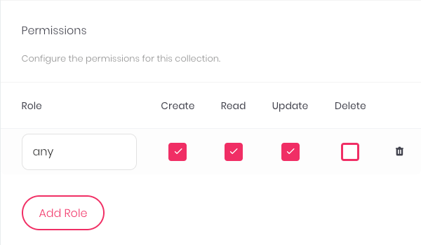
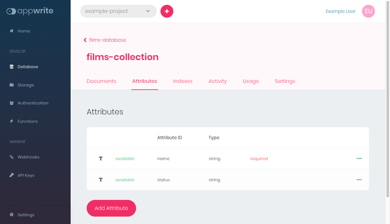
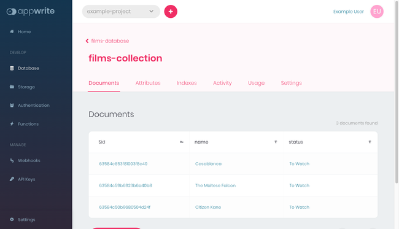

[React](https://reactjs.org/) has established itself as one of the most prominent frameworks for developing web frontends. Its component-based approach is especially effective at working with web APIs.

[Appwrite](https://appwrite.io/) is an open source, self-hosted solution that boasts an interface for simplifying the development of backend web APIs. It provides a web-based interface for managing user authentication, databases, and server functions, and it's all accessible through a RESTful web API.

The two tools work excellently together. Appwrite's simple-to-use backend server gives you a full web API without any backend development. This lets you focus on your frontend development, helping you make the most of what React has to offer.

This tutorial gets you started making your own application using Appwrite and React. It covers all the steps for setting up both an Appwrite and a React project, then walks your through everything you need for connecting them.

## Before You Begin

1.  If you have not already done so, create a Linode account and Compute Instance. See our [Getting Started with Linode](/docs/products/platform/get-started/) and [Creating a Compute Instance](/docs/products/compute/compute-instances/guides/create/) guides.

    
    To automatically install Appwrite on a Compute Instance, consider deploying [Appwrite through the Linode Marketplace](/docs/products/tools/marketplace/guides/appwrite/).
    

1.  Follow our [Setting Up and Securing a Compute Instance](/docs/products/compute/compute-instances/guides/set-up-and-secure/) guide to update your system. You may also wish to set the timezone, configure your hostname, create a limited user account, and harden SSH access.

1.  Update your system.

    ```command {title="Debian / Ubuntu"}
    sudo apt update && sudo apt upgrade
    ```

    ```command {title="AlmaLinux / CentOS Stream / Fedora / Rocky Linux"}
    sudo dnf upgrade
    ```


This guide is written for a non-root user. Commands that require elevated privileges are prefixed with `sudo`. If you’re not familiar with the `sudo` command, see the [Users and Groups](/docs/guides/linux-users-and-groups/) guide.


## How to Create an Appwrite Backend

To start out building your application, you should craft its Appwrite backend. Aside from some command line setup, most of the steps for creating your Appwrite backend are done right in the Appwrite web dashboard.

The goal of these steps is to give you a fully operational Appwrite backend server. This server has a ready-to-use database, which you can populate to support your React frontend.

### Setting Up Appwrite

First, you need to install your own self-hosted Appwrite instance. You also need to do some specific set up to prepare Appwrite to support your React application. The next series of steps show you how.

1.  Follow the steps in our guide [Getting Started with Appwrite as a Backend Server](/docs/guides/getting-started-appwrite/). This shows you how to install and configure your own Appwrite instance.

1.  Make sure that the Docker services are started and enabled. Enabling the services ensures that they initiate at system startup:

    ```command
    sudo systemctl start docker
    sudo systemctl enable docker
    ```

1.  Start running the Appwrite instance. This first requires you to change into the Appwrite directory, which here is assumed to be `~/appwrite`:

    ```command
    cd ~/appwrite
    sudo docker compose up -d
    ```

### Preparing the Appwrite Project

Appwrite is project based, so you need to create a project to build your backend within. These steps lead you through creating a project and configuring it for use with your React application.

1.  Open your Appwrite dashboard by navigating to your instance's hostname or IP address. Detailed instructions for doing that are given in the guide linked above.

1.  Navigate to an existing project or create a new one, steps for which are also given in the guide linked above.

1.  From the project dashboard, click the **Add Platform** button. Select **New Web App** from the menu that appears, and complete the prompt with information for your new application.

    This guides uses the title `Example React App` and has the application hosted on the IP address `192.0.2.0`. You should replace the second value with your server's IP address or hostname. It should match both the address/hostname for the Appwrite instance as well as your React application.

    

1.  Create a user specifically for accessing the Appwrite API from the React application. You can do so by selecting **Authentication** from the left-hand sidebar, clicking the **Add User** button, and completing the prompt. For this guide, this user's name is `react-app-user` and email is `react-app-user@mail.example.com`.

    

### Populating Appwrite

You're now ready to start populating your Appwrite instance with data, which it can provide to your React application.

1.  Select the **Database** option from the left-hand sidebar, and click the **Add Database** button. This presents you with a prompt to create a database. Give the database the name `films-database` and complete the prompt.

    

1.  From the page for the new database, click the **Add Collection** button, which gives you a prompt for creating a new collection within the database. Name the new collection `films-collection` and complete the prompt.

    

1.  This should put you in the **Settings** tab of the collection. Under **Permissions**, click the **Add Role** button. Choose `any` for the **Role** field and check the boxes for **Create**, **Read**, and **Update**. Scroll down and click the **Update** button to save the changes.

    

1.  Create two attributes for the collection by navigating to the **Attributes** tab. Clicking the **Add Attribute** button presents a menu of attribute data types, and selecting one of these gives you a prompt for creating the attribute.

    -   The first attribute should be a `string attribute`, and it should be given `name` as the **Attribute ID** and a **Size** of `64`. It should also have the **Required** toggle turned on.

    -   The second attribute should also be a `string attribute`. Give it `status` as the **Attribute ID**, a **Size** of `64`, and a **Default Value** of `To Watch`.

    [](appwrite-collection-attributes.png)

1.  Navigate to the collection's **Documents** tab and use the **Add Document** button to add some data. This guide assumes you have created three documents, with the names and status shown in the image below. The IDs here were automatically generated by Appwrite.

    [](appwrite-collection-documents.png)

1.  Finally, navigate to the **Indexes** tab of the collection, and use the **Add Index** button to add an index. Set the **Index Key** to `status_key`, make sure that **Type** is set to `Key`, and select `status` under **Attributes**.

    [](appwrite-collection-indices.png)

## How to Create a React Frontend

Now that you have the backend prepped and populated, you're ready to start building out a React frontend to interface with the Appwrite backend.

The example application built here shows two lists, one of films marked "To Watch" and another of films marked "Watched". The interface then gives the user the ability to add new films and change film statuses.

### Setting Up the React Project

This guide assumes you are creating a fresh React application to interact with the Appwrite backend. The next steps show you how to initialize and perform the necessary setup for putting together the new React application.

1.  Follow our tutorial on how to [Install and Use the Node Package Manager (NPM) on Linux](/docs/guides/install-and-use-npm-on-linux/). This example uses NPM to bootstrap a React project, to install the Appwrite web SDK, and to run the React frontend.

1.  Create the React project. This example uses `create-react-app` to bootstrap a new React project and names the new project `example-app`. The command results in an `example-app` directory being created in the current directory.

    For this guide, the new React application's directory is created in the current user's home directory:

    ```command
    cd ~/
    npx create-react-app example-app
    ```

    
Need to install the following packages:
  create-react-app@5.0.1
Ok to proceed? (y)
    

1.  Change into the new React application directory. The rest of this tutorial assumes you are still in this directory unless otherwise noted:

    ```command
    cd example-app
    ```

1.  Install the Appwrite web SDK through the `appwrite` NPM package. The React frontend can use this SDK to simplify interfacing with the Appwrite backend:

    ```command
    npm install appwrite
    ```

### Developing the React Frontend

This tutorial's React frontend primarily consists of three JSX files, all stored in the `src` subdirectory of the React project's directory. Each of these files serves a particular role, and each is dealt with in its own section below to help break it down.

#### App.js

The new React project comes with an `App.js` file which acts as the entry point for your React application. It contains the application's structure and imports more specific components.

In this case, there is only one other component, the `Films` component, so the `App.js` file is more straightforward.

Remove the existing contents of the file, and give the it the contents shown below. You can also find the full example file [here](example-app-src/App.js).

You can follow along with the in-code comments to see what each part of the code is doing.

```file {title="src/App.js" lang="jsx"}
// Import React and the stylesheet.
import React from 'react';
import './App.css';

// Import the component to be used for fetching, updating,
// and displaying the list of films from Appwrite.
import Films from './Films';

// Initialize the application display, giving a
// placeholder for the Films component.
function App() {
  return (
    <div className="App">
      <Films />
    </div>
  );
}

export default App;
```

#### Utils.js

Before diving into the `Films` component, it's useful to build a tool for making the connection to the Appwrite database.

For this purpose, create a new file in the `src` subdirectory, naming the file `utils.js`. Then, give the file the contents you see below, with necessary changes highlighted. You can find the full example file [here](example-app-src/utils.js).

```file {title="src/utils.js" lang="jsx" hl_lines="10,11,16,29"}
// Import the necessary modules from the Appwrite SDK.
import { Account, Client, Databases } from 'appwrite';

// Create an Appwrite client for connecting to the server.
const appwriteClient = new Client();
const appwriteAccount = new Account(appwriteClient);

// Assign the server's API endpoint and the project ID.
appwriteClient
    .setEndpoint('Your-API-Endpoint')
    .setProject('Your-Project-ID');

// Use the credentials of the react-app-user to connect
// to the Appwrite API. Replace `example-password` with
// the password you used when creating the user.
const appwriteAccountPromise = appwriteAccount.createEmailSession('react-app-user@mail.example.com', 'example-password');

// Have the response printed to the JavaScript console
// for debugging. You can remove this later.
appwriteAccountPromise.then(function (response) {
    console.log(response);
}, function (error) {
    console.log(error);
});

// Establish the database to use via its ID. Then
// export the database object so that it can be
// imported by other parts of the React project.
export const appwriteDatabase = new Databases(appwriteClient, 'Your-Database-ID');
```

#### Films.js

Now everything is ready for the `Films` component. This component makes up most of the frontend in this example, interacting with the API and displaying the results.

This section walks you through the file in parts to make it easier to digest. If you want to see the whole example file, you can find it [here](example-app-src/Films.js).

-   First, the component makes its imports and gets defined as a class extending on the `Component` module. The code sets up the `Film` component's state variables and has the component call a function on load.

    ```file {title="src/Films.js" lang="jsx"}
    // Import the necessary modules. The React component
    // is necessary for the Films component to extend on.
    // The Appwrite Query module allows the component to
    // filter results fetched from the API. Finally, the
    // `appwriteDatabase` object is imported from utils.
    import { Query } from 'appwrite';
    import React, { Component } from 'react';
    import { appwriteDatabase } from './utils';

    // Create the Films class, which extends component.
    class Films extends Component {
        // Establish the component's state variables.
        state = {
            newFilmName: '',
            filmsToWatchList: [],
            filmsWatchedList: []
        }

        // Have the component call the `fetchFilms`
        // function when the component loads.
        componentDidMount() {
            this.fetchFilms();
        }
    ```

-   Above, the component calls the `fetchFilms` function on load. Below is that function. The function queries the Appwrite database to fetch both a list of films marked "To Watch" and a list of films marked "Watched". It then assigns each list to a state variable that the application uses to control the display.

    The `...this.state` throughout ensures that state variable assignments only overwrite the named state variable, preserving the rest of the `state` object. Necessary changes are highlighted:

    ```file {title="src/Films.js" lang="jsx" linenostart="25" hl_lines="12,30"}
        // Fetch the lists of films, assigning them to
        // the component's appropriate state variables.
        fetchFilms = () => {
            // Clear the films lists to start.
            this.setState({
                filmsToWatchList: [],
                filmsWatchedList: []
            });

            // Query the database for films where `status`
            // is `To Watch`.
            const promiseFilmsToWatch = appwriteDatabase.listDocuments('Your-Database-ID', 'Your-Collection-ID', [
                Query.equal('status', 'To Watch')
            ]);

            // Handle the query's promise. Update the
            // state variable based on the results.
            promiseFilmsToWatch.then( (response) => {
                if (response.documents && response.documents.length > 0) {
                    this.setState({ ...this.state, filmsToWatchList: response.documents });
                } else {
                    this.setState({ ...this.state, filmsToWatchList: [] });
                }
            }, function (error) {
                console.log(error);
            });

            // Query the database for films where `status`
            // is `Watched`.
            const promiseFilmsWatched = appwriteDatabase.listDocuments('Your-Database-ID', 'Your-Collection-ID', [
                Query.equal('status', 'Watched')
            ]);

            // Handle the query's promise. Update the
            // state variable based on the results.
            promiseFilmsWatched.then( (response) => {
                if (response.documents && response.documents.length > 0) {
                    this.setState({ ...this.state, filmsWatchedList: response.documents });
                } else {
                    this.setState({ ...this.state, filmsWatchedList: [] });
                }
            }, function (error) {
                console.log(error);
            });
        }
    ```

-   The films component also needs to post information to the Appwrite backend. It needs to be able to update film statuses, which it can do using the `markFilmWatched` function below. It also needs to be able to add new films, which it can do using the `addNewFilm` function.

    The `addNewFilm` function uses a state variable to fetch the film name entered by the user. Doing so makes the contents of the text field easier and more consistent to fetch. Once again, necessary changes are highlighted:

    ```file {title="src/Films.js" lang="jsx" linenostart="71" hl_lines="4,21"}
        // Update a film with a new status.
        markFilmWatched = (filmId, doMarkWatched) => {
            // Send the update to the API.
            const promiseMarkFilmStatus = appwriteDatabase.updateDocument('Your-Database-ID', 'Your-Collection-ID', filmId, doMarkWatched ? { 'status': "Watched" } : { 'status': "To Watch" });

            // Display the results from the promise
            // on the JavaScript console.
            promiseMarkFilmStatus.then( (response) => {
                console.log("Successfully updated the document.");
            }, function (error) {
                console.log(error);
            });

            // Refresh the films lists.
            this.fetchFilms();
        }

        // Add a new film.
        addNewFilm = () => {
            // Send the new film to the API.
            const promiseMarkFilmStatus = appwriteDatabase.createDocument('Your-Database-ID', 'Your-Collection-ID', 'unique()', { 'name': this.state.newFilmName });

            // Display the results from the promise
            // on the JavaScript console.
            promiseMarkFilmStatus.then( (response) => {
                console.log("Successfully submitted the new film.");
            }, function (error) {
                console.log(error);
            });

            // Refresh the films lists.
            this.fetchFilms();
        }
    ```

-   Finally, the component needs to render the display. First, this example uses a function for processing the films list, neatly rendering each film entry with an HTML element. The `render` method then creates the layout, feeding the lists through the `renderFilmsList` function.

    The last line exports the Films component, which is what gets imported in the `App.js` file.

    ```file {title="src/Films.js" lang="jsx" linenostart="105"}
        // Process a list of films to assign
        // an appropriate HTML element to each.
        renderFilmsList = (filmsList) => {
            if (filmsList.length > 0) {
                return (filmsList.map((film) => {
                    const filmStatusCheckbox = <input type="checkbox" onChange={ (e) => this.markFilmWatched(film.$id, e.target.checked) } checked={ film.status === "Watched" ? 'checked' : '' } />
                    return (
                        <div class="filmContainer">
                            <strong>{film.name}</strong>
                            {filmStatusCheckbox}<span>Watched?</span>
                        </div>
                    );
                }))
            } else {
                return (<div><strong>Empty!</strong></div>)
            }
        }

        // Render the Films component display.
        render () {
            return (
                <div>
                    <div style={{ display: 'grid', columnGap: '.5em', rowGap: '1em', padding: '3em' }}>
                        <div style={{ gridColumnStart: 1, gridColumnEnd: 2 }}>
                            <h2>Films to Watch</h2>
                            <div>{ this.renderFilmsList(this.state.filmsToWatchList) }</div>
                        </div>
                        <div style={{ gridColumnStart: 2, gridColumnEnd: 3 }}>
                            <h2>Films Watched</h2>
                            <div>{ this.renderFilmsList(this.state.filmsWatchedList) }</div>
                        </div>
                    </div>
                    <div style={{ width: '50%', margin: 'auto' }}>
                        <h2>Add New Film</h2>
                        <div>
                            <input type="text" onChange={ (e) => { this.setState({ ...this.state, newFilmName: e.target.value }) } } />
                            <button onClick={this.addNewFilm}>Add</button>
                        </div>
                    </div>
                </div>
            )
        }
    }

    export default Films;
    ```

### Deploying the React Application

You are now about ready to run the React application.

First, you need to open port `3000` on your server's firewall. This is the default port for React to serve your frontend on, and it is the port this guide uses to get you started.

-   **Debian / Ubuntu**: Refer to our guide on [How to Configure a Firewall with UFW](/docs/guides/configure-firewall-with-ufw/).

-   **AlmaLinux / CentOS Stream / Fedora / Rocky Linux**: Refer to our guide on [Enabling and Configuring FirewallD on CentOS](/docs/guides/introduction-to-firewalld-on-centos/)

Once you have done that, you can start up the React server with the following command:

```command
npm start
```

## How to Run the Application

With both Appwrite and React up and running, you are ready to see the application in action. You can do so by navigating to port `3000` of your server's hostname or IP address.

For instance, using the IP address given as an example above, you would navigate to `192.0.2.0:3000` in your browser.

Initially, the application has the data as entered on the Appwrite database dashboard.

[](react-appwrite-example-app-1.png)

However, the application gives you the ability to update this data as well, and you can see those updates immediately. Here, the film "The Maltese Falcon" has been marked "Watched," and a new film, "Alien vs Predator," has been added.

[](react-appwrite-example-app-2.png)

## Conclusion

You now have a fully functioning application, taking advantage of the simplicity of the Appwrite backend and the efficacy of the React frontend.

The example application is relatively straightforward, but highlights all the pieces you need to have Appwrite and React interact effectively. It gives you the basis for any application you may want to build with these two powerful and capable tools.