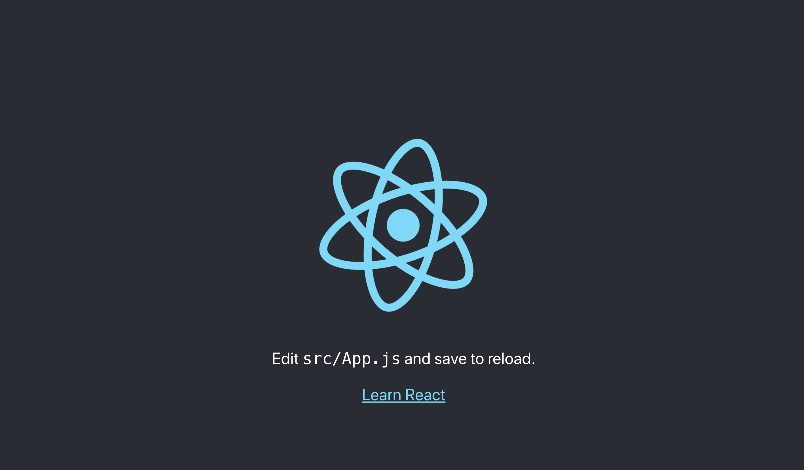

## What is React?

[React](https://reactjs.org/) is a popular JavaScript library for building user interfaces. While React is often used as a frontend for more complex applications, it's also powerful enough to be used for full client-side applications on its own.

Since a basic React app is static (it consists of compiled HTML, CSS, and JavaScript files), it is easy to deploy from a local computer to a Linode using [Rsync](/docs/guides/introduction-to-rsync/). This guide shows how to set up your CentOS 8 Linode and local machine so that you can easily deploy your app whenever changes are made.

## Before You Begin

1.  If you have not already done so, create a Linode account and Compute Instance. See our [Getting Started with Linode](/docs/products/platform/get-started/) and [Creating a Compute Instance](/docs/products/compute/compute-instances/guides/create/) guides.

1.  Follow our [Setting Up and Securing a Compute Instance](/docs/products/compute/compute-instances/guides/set-up-and-secure/) guide to update your system. You may also wish to set the timezone, configure your hostname, create a limited user account, and harden SSH access.

1.  Install and configure a [web server](/docs/web-servers/) to host a website on your Linode. This guide's examples will use the Apache and NGINX web servers. Complete the steps in the [Installing Apache Web Server on CentOS 8](/docs/guides/how-to-install-apache-web-server-centos-8/) guide or the [Installing NGINX on CentOS 8](/docs/guides/how-to-install-nginx-centos-8/) guide.

1.  This guide assumes you already have a React app you'd like to deploy. If you don't have one, you can quickly bootstrap a project following the steps in the [Create an Example React App](#create-an-example-react-app) section of this guide. This step should be completed on your local system.

1. Install the Rsync program on your Linode server.

        sudo yum install rsync

1.  Install [Git](/docs/guides/how-to-configure-git/) on your local computer if it is not already installed.

        sudo yum install git

1. Install the SELinux core policy Python utilities if you have not already done so. This will give you the ability to manage SELinux settings in a fine-grained way.

        sudo yum install -y policycoreutils-python-utils

## Configure your Linode for Deployment

The steps in this section should be performed on your Linode.

### Create your Host Directory

1.  If it does not yet exist, create your site's web root directory. Most of the time, it will be located in the `/var/www` directory.

        sudo mkdir -p /var/www/example.com

1.  Set permissions for the new directory to allow your regular user account to write to it:

        sudo chmod 755 -R /var/www/example.com

1.  The Rsync program will execute its commands as the user you designate in your deployment script. This user must be the owner of your site's web root. Replace `example_user` with your own user's name and `/var/www/example.com` with the location of your site's web root.

        sudo chown -R example_user:example_user /var/www/example.com

1. Use SELinux’s `chcon` command to change the file security context for web content if you have not already done so.

        sudo chcon -t httpd_sys_content_t /var/www/example.com -R
        sudo chcon -t httpd_sys_rw_content_t /var/www/example.com -R

### Configure your Web Server

In this section, you will update your web server configuration to ensure that it is configured to point to your site's web root.

1.  Update your configuration file to point to your site's web root.

    >    **Apache**

    >  Modify the `DocumentRoot` in your virtual host file with the path to your site's web root.

    >  
  <VirtualHost *:80>
      ServerAdmin webmaster@example.com
      ServerName example.com
      ServerAlias www.example.com
      DocumentRoot /var/www/example.com/ ## Modify this line as well as others referencing the path to your app
      ErrorLog /var/www/example.com/logs/error.log
      CustomLog /var/www/example.com/logs/access.log combined
  </VirtualHost>
  

    >  **NGINX**

    >  Modify the `root` parameter with the path to your site's web root.

    >  
  server {
      listen 80;
      listen [::]:80;

      root /var/www/example.com; ## Modify this line
      index index.html index.htm;

  }
  

1. Open the firewall for traffic if you have not already done so.

        sudo firewall-cmd --zone=public --permanent --add-service=http
        sudo firewall-cmd --zone=public --permanent --add-service=https
        sudo firewall-cmd --reload

1.  Restart the web server to apply the changes.

    > **Apache**

    >     sudo systemctl restart apache2

    >  **NGINX**

    >     sudo systemctl restart nginx

## Configure your Local Computer

### Install the Node Version Manager and Node.js

You will need Node.js installed on your local computer in order to build your React app prior to copying your site files to the remote Linode server.



### Create an Example React App

If you already have a React App that you would like to deploy to your Linode, you can skip this section. Otherwise, follow the steps in this section to create a basic React app using the [create-react-app](https://github.com/facebook/create-react-app#create-react-app--) tool.

1. Use the Node Package Manager to create your React app.

        npm init react-app ~/my-app

### Create your Deployment Script

1.  Navigate to your app's directory. Replace `~/my-app` with the location of your React app's directory.

        cd ~/my-app

1.  Using a text editor, create a deployment script called `deploy.sh` in your app's root directory. Replace the following values in the example file:
  - `example_user` with the username of your limited user account.
  - `example.com` with your Linode's fully qualified domain name (FQDN) or public IP address.
  - `/var/www/example.com/` with the location of your site's web root. This is where all of your React app's local `build/` files will be copied to on the remote server.

    
#!/bin/sh

echo "Switching to branch master"
git checkout master

echo "Building app"
npm run build

echo "Deploying files to server"
rsync -avP build/ example_user@example.com:/var/www/example.com/
echo "Deployment complete"


    This script will check out the `master` branch of your project on Git, build the app using `npm run build`, and then sync the build files to the remote Linode using Rsync. If your React app was not built with `create-react-app`, the build command may be different and the built files may be stored in a different directory (such as `dist`). Modify the script accordingly.

    
If your React app's directory is not initialized as a Git repository, the command `git checkout master` will return a `fatal: not a git repository (or any of the parent directories): .git` error. However, the script will continue on to the next commands and the files should still be transferred to your remote Linode server. See our [Getting Started with Git](/docs/guides/how-to-configure-git/#use-git-with-a-local-repository) guide to learn how to initialize a Git repository.
    

1.  Make the script executable:

        sudo chmod u+x deploy.sh

1.  Run the deployment script. Enter your Linode user's password when prompted by the script.

        ./deploy.sh

1.  In a browser, navigate to your Linode's domain name or public IP address. If the deploy was successful, you should see your React app displayed.

      

1.  Make a few changes to your app's `src` directory and then re-run the `deploy` script. Your changes should be visible in the browser after reloading the page.

## Next Steps

Deployment can be a complex topic and there are many factors to consider when working with production systems. This guide is meant to be a simple example for personal projects, and isn't necessarily suitable on its own for a large scale production application.

More advanced build and continuous integration tools such as [Jenkins](https://jenkins.io) or [Travis](https://travis-ci.org/) can be used to automate a more complicated deployment workflow. This can include running unit tests before proceeding with the deployment and deploying to multiple servers (such as test and production boxes). See our guide on [Jenkins](/docs/guides/automate-builds-with-jenkins-on-ubuntu/) to get started.
