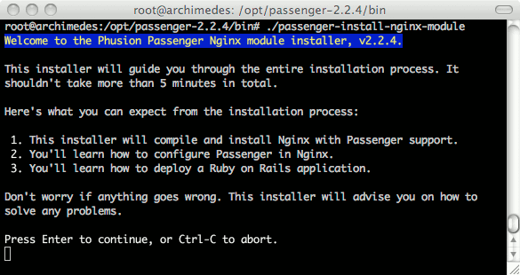

Ruby on Rails is a popular rapid development web framework that allows web designers and developers to implement fully featured dynamic web applications using the Ruby programming language. This guide describes the required process for deploying Ruby on Rails with Passenger and the nginx web server on CentOS 5.

## Set the Hostname

Before you begin installing and configuring the components described in this guide, please make sure you've followed our instructions for [setting your hostname](/docs/products/platform/get-started/#setting-the-hostname). Issue the following commands to make sure it is set properly:

    hostname
    hostname -f

The first command should show your short hostname, and the second should show your fully qualified domain name (FQDN).

## Install Required Packages

Make sure your system is up to date by issuing the following command:

    yum update

Issue the following series of commands to install packages required for Ruby on Rails.

    yum groupinstall "Development Tools"
    yum install zlib-devel wget openssl-devel pcre pcre-devel make gcc gcc-c++ curl-devel

The version of Ruby in the CentOS repositories is fairly old; we'll need to download and compile it ourselves. Check the [Ruby language site](http://www.ruby-lang.org/en/downloads/) for a link to the newest stable version and substitute it for the link shown below. Execute the following sequence of commands to get Ruby installed.

    cd /opt
    wget ftp://ftp.ruby-lang.org/pub/ruby/1.9/ruby-1.9.1-p376.tar.gz
    tar -zxvf ruby-1.9.1-p376.tar.gz
    cd ruby-1.9.1-p376
    ./configure --bindir=/usr/bin --sbindir=/usr/sbin/
    make -j3
    make install

Now we'll need to install gems. Issue the following series of commands to download and install a fresh version. You may wish to check the [RubyForge files page](http://rubygems.org/gems/rubyforge) for the most recent version.

    cd /opt
    wget http://production.cf.rubygems.org/rubygems/rubygems-1.5.1.tgz
    tar -zxvf rubygems-1.5.1.tgz
    cd /opt/rubygems-1.5.1/
    ruby setup.rb

Update rubygems:

    gem update --system

Install the `rake`, `rack`, and `fastthread` gems:

    gem install rake rack
    gem install fastthread --no-rdoc --no-ri

Finally, install the version of Ruby On Rails that your application requires. Issue one the following commands for the version you need:

    gem install rails --version 2.1.2
    gem install rails --version 2.2.2
    gem install rails --version 2.3.5
    gem install rails --version 3.0.4

If you are unsure of the version you require, you can install the latest version with the following command:

    gem install rails

Additionally, the application you deploy will likely have additional dependencies. Install these dependencies before proceeding.

## Install Passenger and Nginx

Proceed to the [Phusion Passenger](http://www.modrails.com/install.html) site and locate the link for the current source code tarball. Download it as follows (substitute the link for the current version):

    cd /opt
    wget http://rubyforge.org/frs/download.php/73563/passenger-3.0.1.tar.gz
    tar xzvf passenger-3.0.1.tar.gz

Run the Phusion Passenger installer for Nginx:

    cd /opt/passenger-3.0.1/bin
    ./passenger-install-nginx-module

You'll be greeted by the Phusion Passenger Nginx installer program. Press "Enter" to continue with the installation.

When prompted for the Nginx installation method, we recommend you choose "1" to allow the installer to automatically download, compile, and install Nginx for you. Unless you have specific needs that would necessitate passing custom options to Nginx at compile time, this is the safest way to proceed.

Please do **not** remove the Passenger files from `opt` after the install. They need to stay in place or your install will not function correctly.

## Set up an Init Script for Nginx

Nginx is now installed in `/opt/nginx`, but there are no "init" scripts to control this process. Issue the following sequence of commands to download a script, move it to the proper directory, set the proper permissions and set system startup links:

    cd /opt
    wget -O init-rpm.sh http://www.linode.com/docs/assets/603-init-rpm.sh
    mv /opt/init-rpm.sh /etc/rc.d/init.d/nginx
    chmod +x /etc/rc.d/init.d/nginx
    chkconfig --add nginx
    chkconfig nginx on

You can now start, stop, and restart Nginx just like any other server daemon. For example, to start the server, issue the following command:

    /etc/init.d/nginx start

You can now start, stop, and restart Nginx just like any other server daemon. For example, to start the server, issue the following command:

    /etc/rc.d/init.d/nginx start

If you haven't already configured your firewall to allow inbound HTTP connections, run the following command to do so now:

    system-config-securitylevel-tui

The configuration file for Nginx is located at `/opt/nginx/conf/nginx.conf`. This is the file you'll need to edit to add support for your Rails applications. A default server is already configured in this file, and it also contains examples for alternate virtual host and SSL configurations.

## Install MySQL Support (optional)

If your application uses MySQL, install the database server by following our [MySQL on CentOS 5 guide](/docs/guides/use-mysql-relational-databases-on-centos-5/). Once it's installed and configured properly, issue the following commands:

    yum install mysql-devel
    gem install mysql --no-rdoc --no-ri -- --with-mysql-dir=/usr/bin --with-mysql-lib=/usr/lib/mysql --with-mysql-include=/usr/include/mysql

## More Information

You may wish to consult the following resources for additional information on this topic. While these are provided in the hope that they will be useful, please note that we cannot vouch for the accuracy or timeliness of externally hosted materials.

- [Ruby on Rails Home Page](http://rubyonrails.org/)
- [Ruby on Rails Documentation](http://rubyonrails.org/documentation)
- [Nginx Home Page](http://nginx.org/)
- [Nginx Documentation](http://nginx.org/en/docs/)
- [Nginx Configuration](/docs/guides/how-to-configure-nginx/)

