This guide will walk you through the necessary steps to configure your Linode to be an efficient remote development environment. You will then connect to this environment using a tablet and edit a simple web application using `ssh` and a text editor.

## Development Environments

### Local Development Environment

A local development environment is usually faster, more powerful, and more comfortable than a remote environment. However, there some drawbacks associated with local development:

* You are bound to your workstation's operating system. You may need to employ virtual machines to overcome limitations.
* No matter how powerful your machine is, resources are finite. Depending on the complexity of your project, scaling-up for complexity could become an issue.
* A development environment that relies on a powerful desktop, a local NAS, multi-monitor setup, full size keyboard and mouse is not portable. You can use a good laptop to gain some freedom, but then you sacrifice CPU power and internal storage that could hinder your ability to run specific projects.
* Last but not least, if your local machine fails your entire development process stops.

However, a simple remote development environment has its own disadvantages:

### Remote Development Environment

* Most remote development environments have certain limitations on the frameworks you can use.
* Speed could be an issue too, especially if your project requires compiling large amounts of code.
* You won't be able to reproduce the exact production environment.
* Finally, cost could become an issue.

### The Hybrid Approach

* Operating system agnostic.
* Flexibility to recreate any production scenario, but also workflow flexibility to adapt to any power user.
* Security and data integrity.
* Ability to scale power and storage on demand.

By using Docker, you can ensure that your development is fully portable: containers can be run on a Linode for remote development, but can easily be ported to a local environment if necessary. This guide will use [Portainer](https://portainer.io/) to manage the Docker environment, to make it easier to work with containers from a remote device.

## Provision the Remote Environment

### Install Docker



### Install Portainer

The easiest way to install Portainer is by deploying the official image.

1. Create a volume for storing persistent data:

        docker volume create portainer_data

2. Run your container in detached mode:

        docker run -d -p 9000:9000 \
        --name portainer --restart unless-stopped \
        -v /var/run/docker.sock:/var/run/docker.sock \
        -v portainer_data:/data portainer/portainer-ce

    The `-v /var/run/docker.sock:/var/run/docker.sock` directive allows the Docker container to communicate with the host Docker environment. `-v portainer_data:/data portainer/portainer-ce` mounts the previously created Portainer data volume. For more information, see [Portainer documentation](https://documentation.portainer.io/).

3. Point your browser to http://192.0.0.0:9000, replacing `192.0.0.0` with the IP address or FQDN of your workstation Linode. You should see a screen similar to this:

    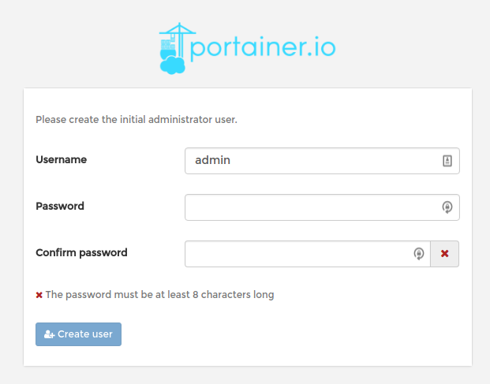

4. After registering your `admin` user you will be asked about the type of connection you are using: **Local** or **Remote**. Since you will run your containers from the same Linode choose Local:

    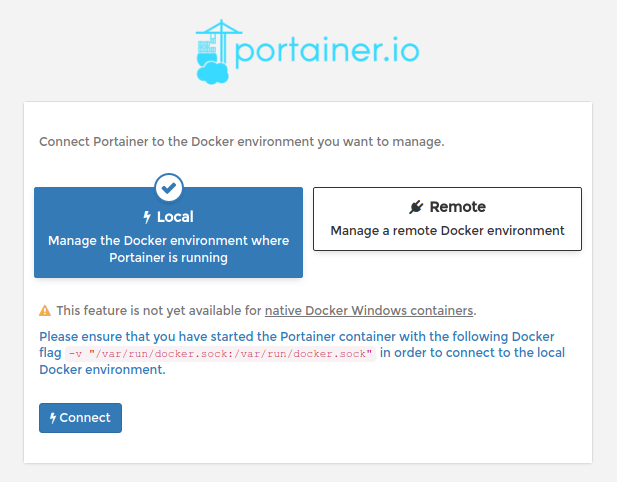

5. If everything goes as expected you will be presented with the Portainer Dashboard.

    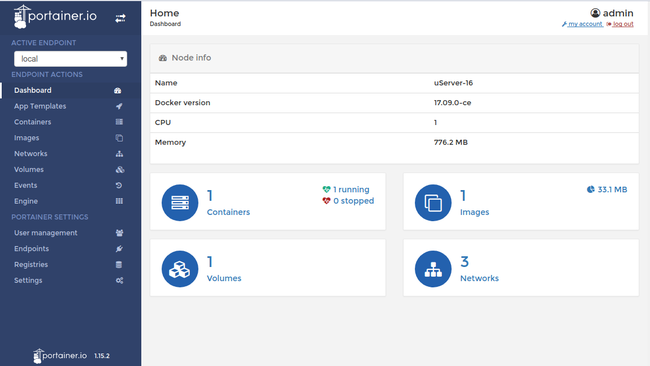


By default your connection with Portainer GUI is not encrypted. If you need to use SSL then you must install the corresponding certificates on your Linode and pass their location to the Docker container on start. For more information please read how to [Secure Portainer using SSL](https://portainer.readthedocs.io/en/stable/deployment.html#secure-portainer-using-ssl) in the Portainer official documentation.


### Set Up an Nginx Directory

In the next section you will mount a directory on your Linode to an NGINX Docker container. Create this directory now:

    mkdir -p ~/nginx/html

## Connect From a Remote Device

With everything set up it's time to work with your remote development environment. This guide will test your development environment using a simple NGINX container.

### Install a Container from a Tablet

1. Open your browser and point it to the address: http://192.0.2.0:9000 from Portainer Dashboard Sidebar navigate to **App Templates** menu.

    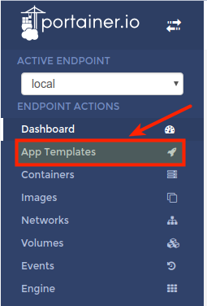

2. In the Application templates list, click on **Nginx** to install the container.

    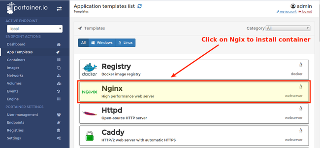

3. You will see the Configuration screen. From here you can name your container, choose a Docker network and even determine access control (useful for teams).

    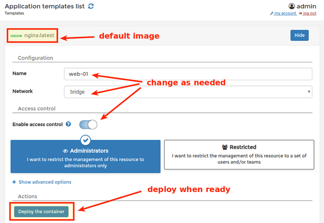

5. Deploy your container when ready by hitting the corresponding button. The NGINX image will download automatically and will be available for deployment. You will be directed to the **Containers** menu, where you can manage your containers.

    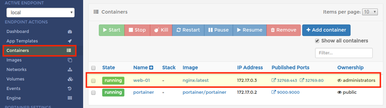

6. Check your installation by pointing your browser to the assigned port `http://<Linode IP or FQDN> :32769`.

    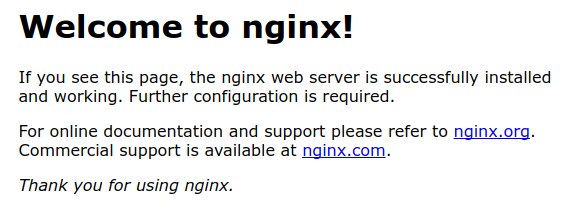

### Use Portainer to Manage your Containers

1. Navigate to the **Containers** menu on the left sidebar and click the check-box for the `web-01` container you just created. Review the available options for managing this container.

    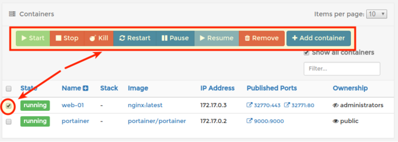

2. You can start, stop, kill, restart, pause, resume, or remove the selected container in the same manner you would use `docker` from the terminal. You can also edit `web-01` container by clicking on its name.

3. Remove the `web-01` container by touching the **Remove** button, and select to automatically remove non-persistent volumes.

    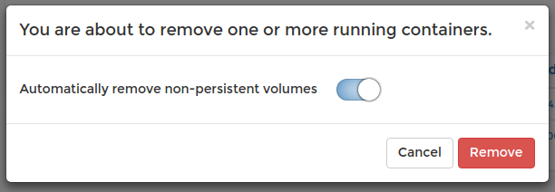

### Bind Volumes to your Container

1. From the **App Templates** menu select Nginx again.

2. Disable access control and click on **Show advanced options**. On the volume mapping section touch the **Bind** button for the container's `/usr/share/nginx/html` and set the host to `/home/username/nginx/html`.

    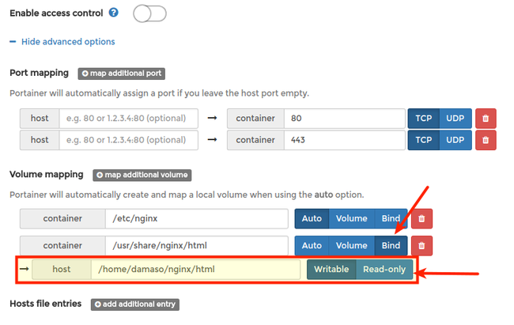

### Connect to your Linode host using JuiceSSH

1. Open JuiceSSH and then select **connections** from the main dashboard.

    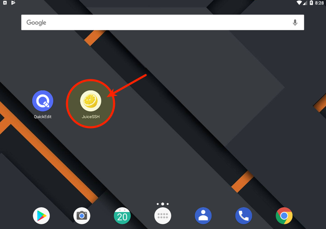

    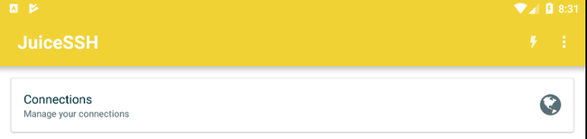

2. Add a new identity by swiping right on the **identities** menu and then clicking the **+** sign.

    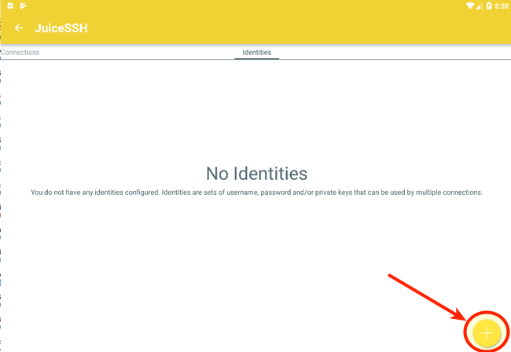

3. Enter a nickname, and then fill in the username and password for your Linode (make sure you choose an account that has sudo access).

    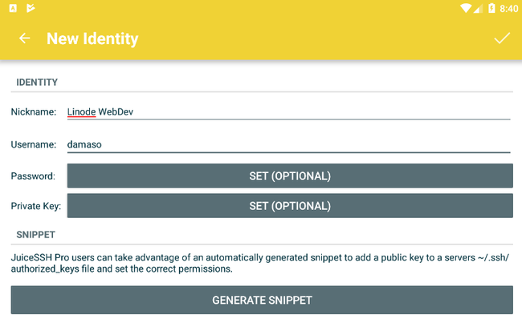

4. You can also create a private SSH key for secure access. Once you have connected to your Linode you can use `ssh-copy-id` to transfer the public key to the server.

5. Press the check button on top right to save the identity.

    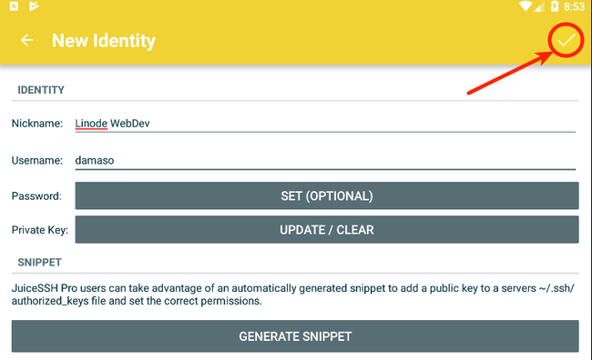

6. If you created an SSH key, you can export the public key by pressing and holding the identity name in the Identities menu. Coose **Export Public Key** from the pop-up menu.

    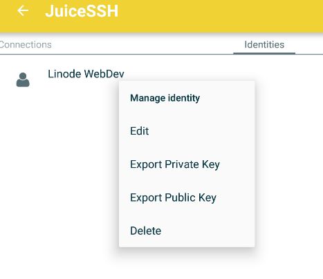

7. Swipe left on the **Connections** menu and create a new connection by press the **+** sign.

    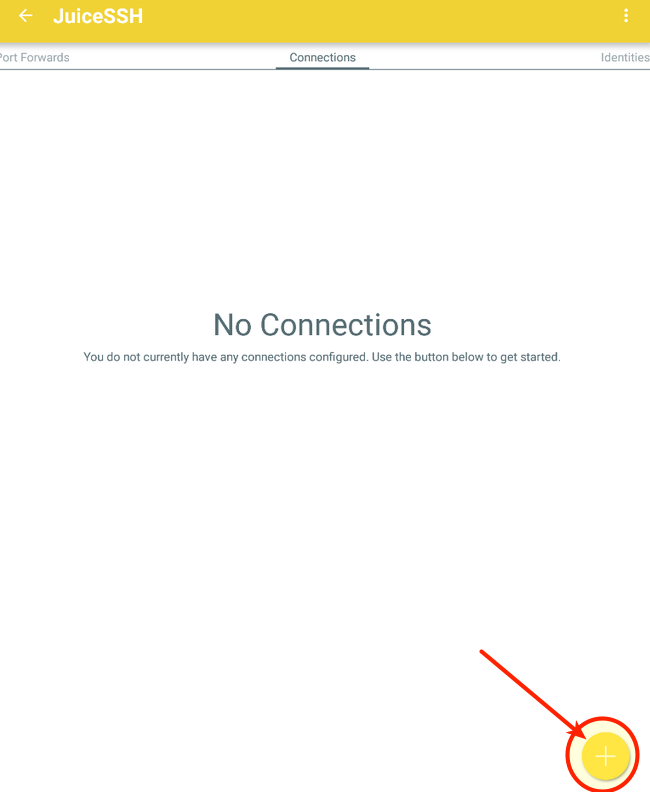

8. Assign a nickname to your connection, fill in the Linode's IP address or FQDN, and save your connection by touching the check mark on top right.

    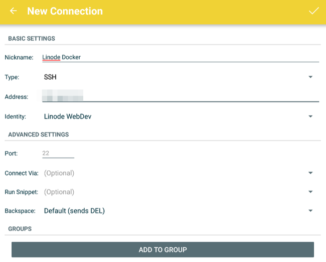

9. Tap the connection name to open an SSH connection to your Linode.

10. Check your NGINX container from JuiceSSH.

        sudo docker ps

11. You can work with your Docker containers through the command line as normal. The top of the virtual keyboard provides some shortcuts pre-defined for ease of use.

    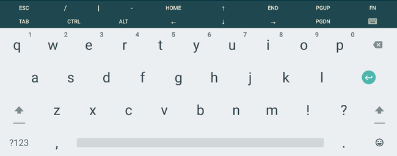

12. Navigate to the volume bound to the container:

        cd nginx/html

13. Create a test HTML file:

        echo "<html>
Hello World
</html>" >> index.html

14. Point your browser to the NGINX server (you can check the port that NGINX is listening on from the Portainer console). Any edits you make from your tablet's SSH connection will be rendered to the browser, allowing you to work on this NGINX project from your tablet.

### Edit Files Using QuickEdit

1. Editing simple configuration files is not hard. But if you need to do substantial editing from your tablet then you will need a text editor with syntax highlighting and other features. Open QuickEdit and allow access to photos, media, and files on your device.

    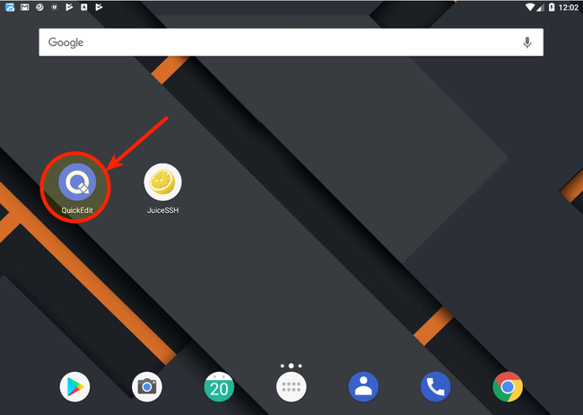

2. By default, you will see a blank file. Touch the menu icon on top left.

    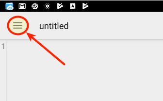

3. Select the **Storage Manager** from the menu.

4. Create a new connection by touching the **+** button on lower right. When prompted choose **FTP/FTPS/SFTP** and then **SFTP**

    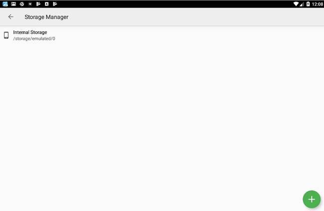

5. Enter your Linode's IP address or FQDN, desired label and username. Then select an authentication mode (you can use either a password or SSH keys).

6. Touch your Linode connection and you will be forwarded to the remote directory structure. Find your NGINX bind, then mount and open the `test.json` file.

## Next Steps

You now have a basic but powerful setup that allows you to work from any device with an internet connection.

The main limitation of a tablet is its storage capacity. An efficient way to set up a centralized storage space is by using OwnCloud on a Linode with [Block Storage](/docs/products/storage/block-storage/). This way you can host all your archives, dotfiles, scripts, images and more in a scalable Linode. An additional benefit is the possibility to connect external storage services like Dropbox, Google Drive or OneDrive. OwnCloud has native applications for Android and iOS so managing your assets won't be a problem. You can install and configure ownCloud by following our [ownCloud guide](/docs/guides/install-and-configure-owncloud-on-ubuntu-16-04/).
