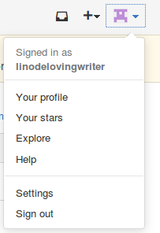
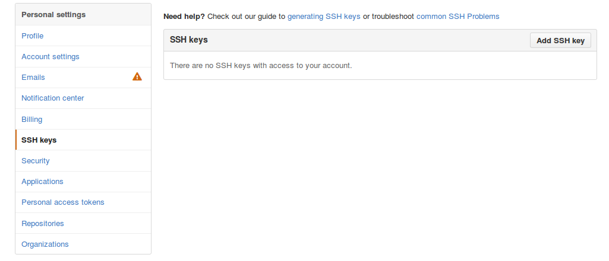
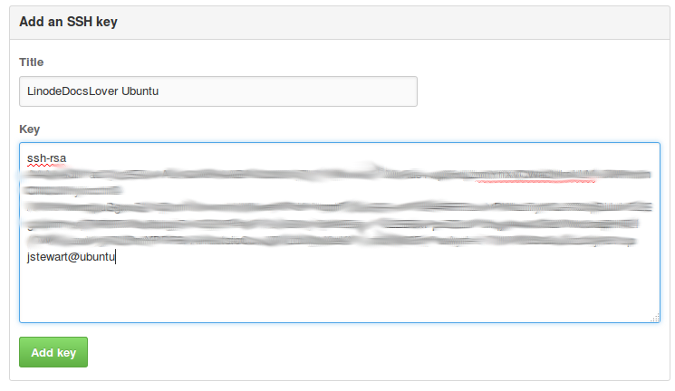
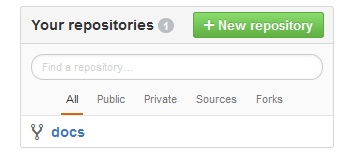
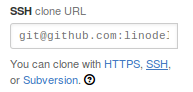
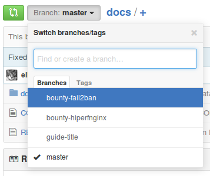
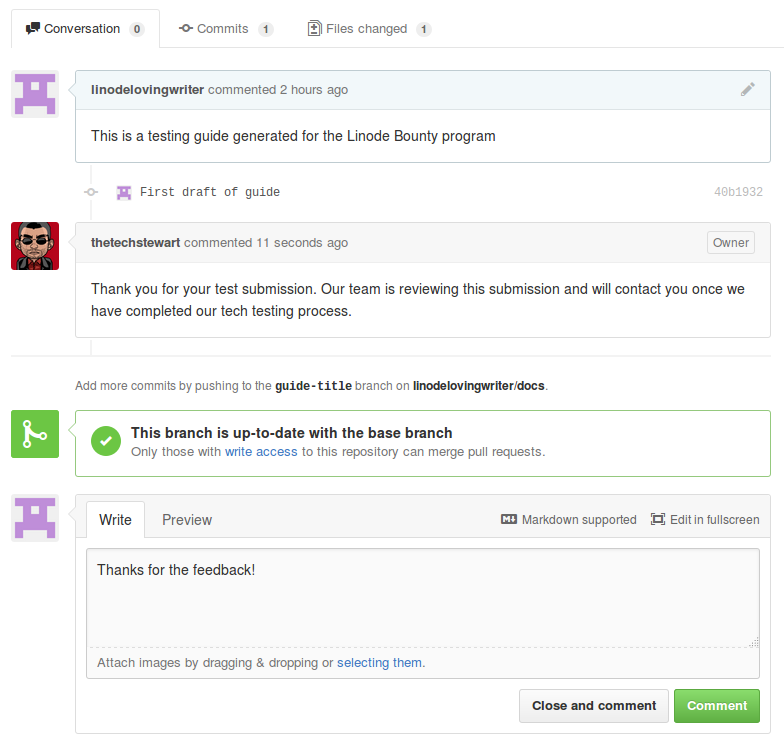

Linode's Guides and Tutorials library is managed through the use of [Markdown files](https://en.wikipedia.org/wiki/Markdown) stored in a GitHub repository. In the interest of making submissions from outside contributors as easy as possible, this tutorial will walk you through submitting a new guide on our [public GitHub](https://github.com/linode/docs).


The Write For Linode freelance contributor program offers payment for new guides to qualified authors. Visit our [Write For Linode page](https://www.linode.com/lp/write-for-linode/) for a description of the program and for application instructions.


## Before You Begin

This guide assumes that you've signed up for a [GitHub account](https://www.github.com), and that you've followed the sections for installing and configuring Git on your local machine contained within our [Git Source Control Management](/docs/guides/how-to-install-git-on-linux-mac-and-windows/) guide.

This guide will also use [Hugo](https://gohugo.io) to create a new guide within the Linode library's repository, and Node.js and NPM to build a local development version of Linode's documentation website. Please visit the [Install Hugo](https://github.com/linode/docs/blob/develop/CONTRIBUTING.md#install-hugo) and [Install Node and NPM](https://github.com/linode/docs/blob/develop/CONTRIBUTING.md#install-node-and-npm) sections of our [CONTRIBUTING.md](https://github.com/linode/docs/blob/develop/CONTRIBUTING.md) for installation instructions of those dependencies.


If you are following these instructions on a Windows system, all commands will need to be run via the [Git Bash console](http://git-scm.com/downloads).


## Submitting New Guides or Changes with Git

### Placing Your SSH Key on GitHub

1.  If you have not done so already, generate an SSH key on your local system:

        ssh-keygen

1.  View the contents of the newly-created public key file:

        cat ~/.ssh/id_rsa.pub

1.  In a browser window, select your user account icon in the upper right-hand corner of the screen, then click **Settings**. Your user account icon may look different than the one below:

    

1.  Select the **SSH keys** option from the **Personal settings** menu, then click the **Add SSH key** button:

    

1.  Copy the contents of your public key file from your terminal window, and paste them into the **Key** text box.  Add a descriptive title for your key in the **Title** text box:

    

### Setting Up Your Repository

In order to edit or create documents for our library, you will need to fork your own version of the Linode 'docs' repository on GitHub.

1.  Navigate to the [Linode Docs](http://www.github.com/linode/docs) GitHub repository.

1.  Click **Fork** in the upper right-hand corner of your screen to create your own version of the repository.

1.  Once the fork process has completed, visit the **docs** repository under your repository list on the GitHub homepage:

    

1.  Clone your forked branch to your local machine by copying the clone URL, and appending it to the following command.  We recommend cloning via SSH for this particular step.  This command will create a local copy of your cloned repository that you can work with directly in the directory where the command is run:

    

        git clone <insert clone URL>

    You will need to accept the host identification key on your first connection.

1.  Move to the cloned directory and configure the primary Linode Docs repository (not your fork of it) as your *upstream* repository:

        cd docs
        git remote add upstream https://github.com/linode/docs

1.  After you first clone the repository, you should be on the `develop` branch by default:

        git status

    
On branch develop
Your branch is up-to-date with 'origin/develop'.

nothing to commit, working directory clean


1.  The docs website has some Node dependencies. Install these with npm:

        npm install

### Creating Your Branch

Once you've cloned a local copy of your repository, you will need to make a branch to store your new guide.  Branches allow you to work on multiple guide changes without creating issues within your pull requests.

1.  First, make sure that you're starting from the `develop` branch, and that you have the latest content from this branch:

        git checkout develop
        git pull upstream develop

1.  Check out a new branch with a descriptive title matching the guide that you are editing or creating:

        git checkout -b guide-title

1.  Rerun the `git status` command to confirm that you have been moved to the new branch.  You should receive output matching the following:

    
On branch guide-title
nothing to commit, working directory clean


### Creating Your First Guide

Using your preferred text editor, you should now be able to edit and create documents within your new branch. When writing your guide, you can refer to the [Linode Writer's Formatting Guide](/docs/guides/linode-writers-formatting-guide/) for help with the format of your guide and the styling of your text. Also note that our site uses the [Hugo](https://gohugo.io/) static site generator to render the website, and Hugo offers several features to enhance your Markdown files. These features are covered in our formatting guide.

1.  When creating your guide, first determine where it should be located within the docs website's directory structure. For example, to create a new guide in the [/docs/guides/kubernetes/](/docs/guides/kubernetes/) section, you would create your guide within the `docs/guides/kubernetes/` subfolder inside your repository.

    
To reiterate, the docs repository contains a folder that is also called `docs/`, and this folder then contains all of the content in the library:

- Run `ls` while inside the root of the docs repository to see the other folders that it contains, if you'd like.

- Run `ls docs` while inside the root of the docs repository to see all of the top-level sections of the library.


1.  Next, take a moment to review the specific folder-and-file structure used for each guide, referred to by Hugo as a [*leaf bundle*](https://gohugo.io/content-management/page-bundles/#leaf-bundles):

    - When you create your guide, you will create a directory whose name corresponds to the title of your guide, but in lowercase and with hyphens substituted for each space. For example, if your guide is titled "My Kubernetes Guide", the directory you create should be `my-kubernetes-guide`. The path for your guide within the repository would be `docs/guides/kubernetes/my-kubernetes-guide/`

    - This directory should contain a Markdown text file named `index.md`. This file will contain the contents of your guide. The directory can also contain any images or other assets that you'd like to include in your guide.

    
While this example guide is located at `docs/guides/kubernetes/my-kubernetes-guide/`, the guide itself will later be published under the `docs/guides/my-kubernetes-guide/` URL path. Note that the URL for the guide will *not* include the `kubernetes/` section information. This is intentional, as our docs website is configured to publish guides under a flattened URL structure.


1.  While you can manually create your guide's directory and Markdown file, we recommend that you use Hugo's [*archetypes*](https://gohugo.io/content-management/archetypes/) feature to do so. Our repository has a [content archetype](https://github.com/linode/docs/blob/develop/archetypes/content.md) that you can use which contains some sample text. To create a new guide from this archetype, run:

        hugo new -k content guides/kubernetes/my-kubernetes-guide/index.md

    
- You should *not* include the `docs/` directory at the front of the path that you pass to the `hugo new` command. Hugo will automatically know that it should place your guide under this directory.

- You should replace `kubernetes/` with the section that your guide belongs to, and replace `my-kubernetes-guide/` with the appropriate directory name for your guide. This command will automatically create the `my-kubernetes-guide` directory if it does not already exist.


1.  The command will output the location of your new guide on your filesystem. For example:

    
/Users/your-computer-user/linode-docs/docs/guides/kubernetes/my-kubernetes-guide/index.md created


1.  At this point, you're ready to start editing this file in your favorite editor. Feel free to change or clear the content that was included by default by the `content` archetype. Also note that the top of this file is populated with the guide's [*front matter*](https://gohugo.io/content-management/front-matter/), which is Hugo's collection of metadata about your guide. You can set your guide's `title`, `description`, and `keywords` in the front matter, and you can add your name and social media link (or website link) under the `contributor` front matter keyword.

1.  To preview your guide while you're writing it, start the local Hugo web server:

        hugo server

    This starts a local server you can use to view the Linode library in your browser on `http://localhost:1313/docs/`.

1.  In a web browser, navigate to the location of your new guide. The example Kubernetes guide will be located at `http://localhost:1313/docs/guides/my-kubernetes-guide/`.

    
Note that you will not be able to navigate to the new guide within the local website's Explore Docs menu, or through the search feature. This is because these features rely on a central search index, and this index is not updated until the production docs website is published.


1.  Once you have completed composing or making edits to a guide, you can use the `git status` command to view the status of your changes.  You should receive output resembling the following:

    
Untracked files:
    (use "git add <file>..." to include in what will be committed)

        docs/guides/kubernetes/my-kubernetes-guide/

nothing added to commit but untracked files present (use "git add" to track)


1.  Add your guide to the list of files to be committed with the 'git add' command:

        git add docs/guides/kubernetes/my-kubernetes-guide/

1.  Commit your file to officially make it part of your changes.  Utilize the `-m` flag with the `git commit` command to add a commit message.  Commit messages will need to be encased in quotation marks, as shown below:

        git commit -m "First draft of guide"

    You should receive output resembling the following:

    
[guide-title 40b1932] First draft of guide
    1 file changed, 1 insertion(+)
    Create mode 100644 docs/guides/kubernetes/my-kubernetes-guide/index.md


1.  Push your guide to GitHub.  You will need to replace `guide-title` below with the name of your branch:

        git push origin guide-title

### Submitting Your First Pull Request

Now that you've completed the composition of your guide, it's time to make your first *pull request* (PR) on GitHub.

1.  Within the GitHub web interface, navigate to your fork of the **linode/docs** repository:

    

1.  Select the branch containing your changes:

    

1.  Select the **New pull request** option to generate your first PR.

1.  Ensure that your pull request is being submitted configured with the **Base repository** set to **linode/docs** and the **Base** branch set to **develop**. Enter the title of your guide, along with a brief description, and click the **Create pull request** button.

    Congratulations! Your guide has been submitted as a pull request against the Linode Docs repository!

### Commenting and Editing Your PR

Once you have submitted your first pull request, you will likely receive communication from the Linode Guides and Tutorials team as your PR is run through our tech and copy editing processes.  You can respond to this feedback directly from your PR page:

If you need to edit your PR, you can make changes to your locally saved branch, then upload the changes by following steps 4-8 of the [Creating Your First Guide](#creating-your-first-guide) section of this guide.

### Managing Multiple Branches

If you are working on multiple guide submissions or changes, you will need to utilize multiple branches to keep your changes separate from each other.

1.  Before starting on another guide draft, switch to your develop branch and pull in the latest changes from the Linode Docs upstream repository:

        git checkout develop
        git pull upstream develop

1.  Create and switch to a new branch to store your new changes:

        git checkout -b guide-title-2

    You should receive output resembling the following:

    
Switched to a new branch 'guide-title-2'


1.  To confirm what branch you are currently using, run `git status`. The output should resemble the following:

    
On branch guide-title-2
nothing to commit, working directory clean


1.  To list all of your available branches, utilize the `git branch` command.  This will list all of your branches, and highlight your active branch:

        git branch

1.  Use the `checkout` command to switch to any other branch:

        git checkout another-branch-name

## Reporting Issues with Existing Guides

If you wish to report an issue with an existing guide, you can do so from the [**Issues** tab](https://github.com/linode/docs/issues) of the Linode Docs repository.  You can then open a new issue and provide a description of the problems you've encountered. When opening a new issue, be sure to include a link to the guide where the problem is located. If you've already found a fix for the issue, we encourage you to also submit the fix as a new pull request.
