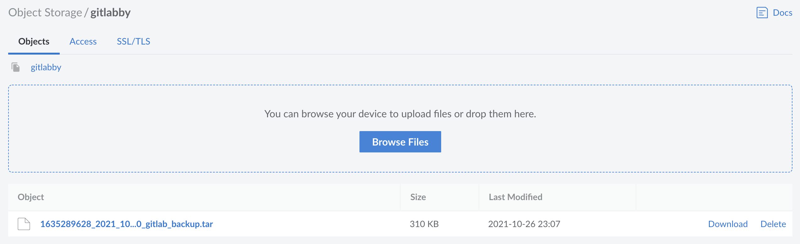

## In This Guide

GitLab is a complete solution for all aspects of your software development. At its core, GitLab serves as your centralized remote Git repository. GitLab also features built-in tools that represent every task in your development workflow, from planning to testing to releasing.

All modern GitLab installations additionally include tooling to create backups on Linode's Object Storage using a single command. This guide will describe the process for initially setting up an Object Storage Bucket which can be used to remotely store backups created directly from Gitlab.

## Before you Begin

- Follow the guide for [Deploying Gitlab Through the Linode Marketplace](/docs/products/tools/marketplace/guides/gitlab/) to completion, or otherwise ensure that a Gitlab installation is available and accessible over SSH.

- Create an Object Storage access key and a bucket. See the [Manage Access Keys](/docs/products/storage/object-storage/guides/access-keys/) and Create and Manage Buckets](/docs/products/storage/object-storage/guides/manage-buckets/) guides.

## Configuring Gitlab For Object Storage Backups

In order to configure Gitlab on Linode's Object Storage, the Gitlab instance must first be [Accessed Directly Over SSH](/docs/products/compute/compute-instances/guides/set-up-and-secure/#connect-to-the-instance). To do this, enter the following command, replacing the username and IP address with the unique username and IP address of your Linode:

    ssh username@198.51.100.4

Once access has been gained, using a text editor of your choice, edit the '/etc/gitlab/gitlab.rb' configuration file to reflect the following:

    sudo nano /etc/gitlab/gitlab.rb


gitlab_rails['backup_upload_connection'] = {
  'provider' => 'AWS',
  'region' => 'us-east-1',
  'endpoint'    => 'https://us-east-1.linodeobjects.com',
  'aws_access_key_id' =>YOUR_ACCESS_KEY,
  'aws_secret_access_key' =>YOUR_SECRET_KEY,
}
gitlab_rails['backup_upload_remote_directory'] = 'bucketname'


The following chart will explain each configuration settings in additional detail:

| Descriptor | Setting|
| ------------| --------------------- |
| provider | AWS (The provider must be set to AWS because it is dependent on [s3cmd](/docs/products/storage/object-storage/guides/s3cmd)) |
| region | The region the bucket was created in. A full list of regions can be found in the [Product Documentation](/docs/products/storage/object-storage/). |
| endpoint | The endpoint url for the datacenter. Uses the syntax of **region.linodeobjects.com** |
| aws_access_key-id | The Object Storage [Access Key](/docs/products/storage/object-storage/guides/access-keys/) created in a previous step. |
| aws_secret_access_key | The Object Storage [Secret Key](/docs/products/storage/object-storage/guides/access-keys/) created in a previous step. |
| gitlab_rails['backup_upload_remote_directory'] | The [label](/docs/products/storage/object-storage/get-started/#create-a-bucket) of the bucket created during bucket creation.

Once the configuration settings are completed, apply the configuration with the following command:

    gitlab-ctl reconfigure

## Creating a Backup

Once configured, backups can now be created for your gitlab instance at any time by using the following command:

    gitlab-backup create

Once complete, the backup will be freely available in a compressed `.tar` file within the Object Storage bucket, and can be observed directly in the Linode Cloud Manager.

