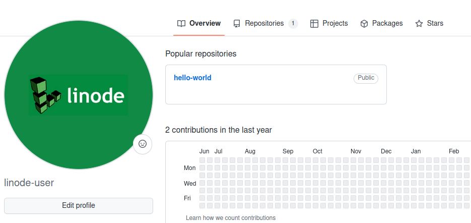
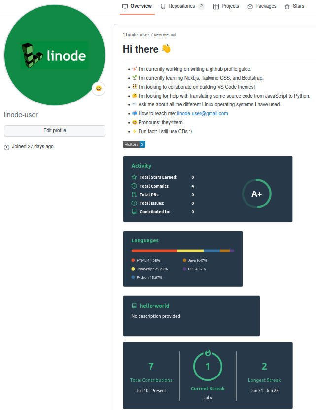
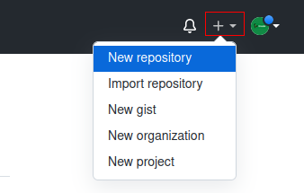
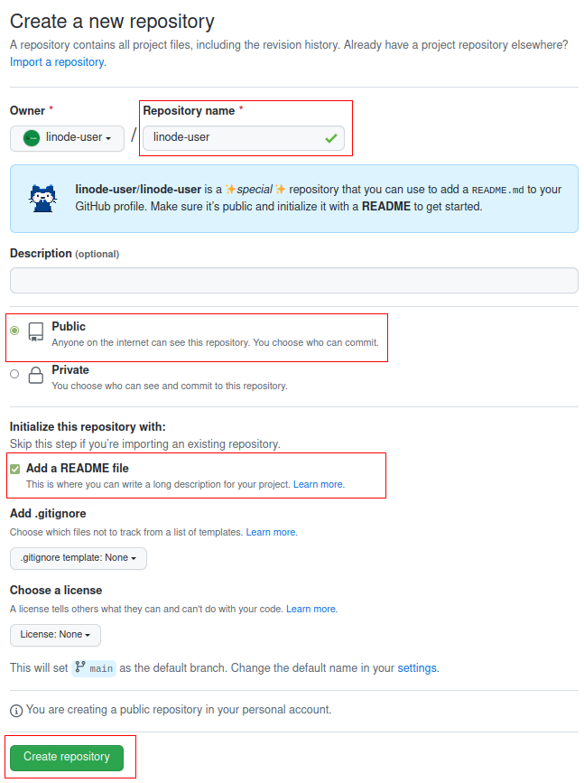
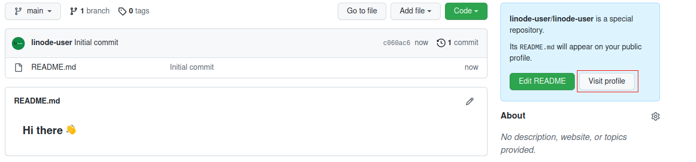
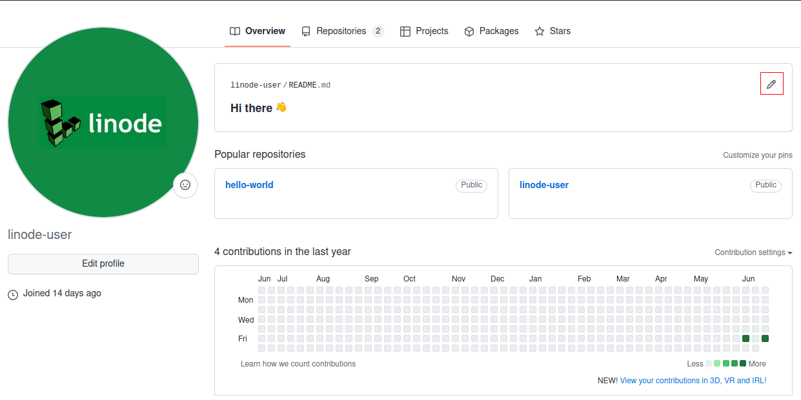
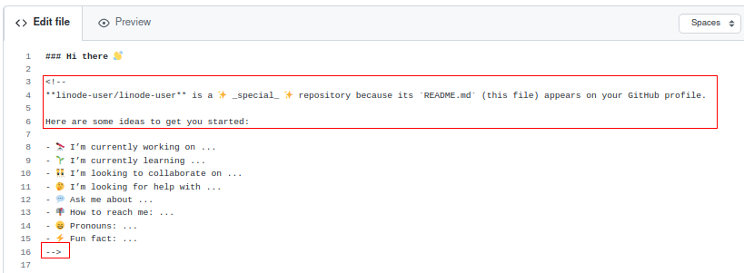
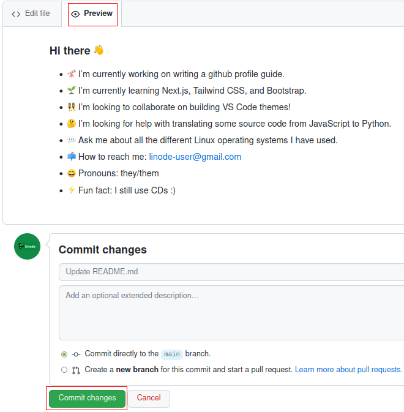

## Introduction
Creating a GitHub profile is a great way to show visitors what you are all about as a developer - what languages and frameworks you know, types of work you are interested in, and general background informaton. 
  
In this guide, we'll cover how to create a repository that doubles as a profile and how to add advanced tools that display cool statistics about your coding history and habits. 

| Before | After |
|:------:|:-----:|
| |  

## Create a Profile Repository
To make a GitHub profile, you must first create a repository with the same name as your GitHub username. 

|      Step      |      Instructions      |      Reference |
|----------------|------------------------|---------------
|1. Create a new repository | In the upper-right hand corner of the GitHub dashboard:  a. Click `+`   b. Click `New repository`            | 
|2. Add the details for the new repository | c. Under "Repository name", type in your GitHub username    **For example, if my GitHub username is linuxfan123, I would type in `linuxfan123`**    d. Click the `Public` option so all users can see your newly created profile    e. Check the `Add a README file` box    f. Click the green `Create repository` button to make the new repository with all the above settings   | 
|3. View your new default profile | g. Click the white `View Profile` button on the right side of the page     h. Take a look at your new profile - by default, some placeholder text is inputted.    i. Click the pencil icon in the top-right hand corner of our new profile to initiate editing |   
| 4. Edit your new profile | j. Delete lines 3-6 and the ending `-->`    k. Add the missing information - think about what important information visitors looking at your code should know    l. Click the `Preview` tab to see what the new edits will actually look like    m. When satisfied, click the green `Commit changes` button to finalize the changes  |  
| 5. View your new profile | In the upper-right hand corner of the GitHub dashboard:   n. Click your profile picture    o. Click `Your profile`    | 

## Advanced Coding Statistic Add-ons
We can also choose to add from a variety of add-on tools that display insightful and interesting statistics about our coding history and habits. 


Take care to replace `<your-github-username>` with your own GitHub username when using the following code snippets and then delete the angle brackets `<>`. 


 

|   Add-on   |   Description   |   Preview   |   Code to Add 
|------------|-----------------|-----------------|----------
| Activity   | Displays total stars, commits, pull requests, etc. |  | ``
| Commits Graph | A simple graph displaying your daily commits over the last 30 days |   | `&bg_color=1c1917&color=ffffff&line=0891b2&point=ffffff&area_color=1c1917&area=true&hide_border=true&custom_title=GitHub%20Commits%20Graph" alt="GitHub Commits Graph" />`
| Languages  | Lists your most frequently coded in languages by percentage |  | `` | 
| Repository Highlight | Displays a single repository (just as it would look underneath your GitHub profile) |  | `<a href="https://github.com/<your-github-username>/<repo-name>">&repo=<repo-name>&theme=vue-dark" /></a>`
| Streak Counter | Lists your current and longest streak of making at least one daily GitHub commit |  | ``
| View Counter | A running counter of how many times your GitHub profile has been visited |  | ``

## Conclusion
Today, we learned how to customize our GitHub profiles so visitors can immediately get a sense of our most useful abilities and skillsets. Next step - get creative with the theming, layout, and order to make your profile uniquely stand out. 

