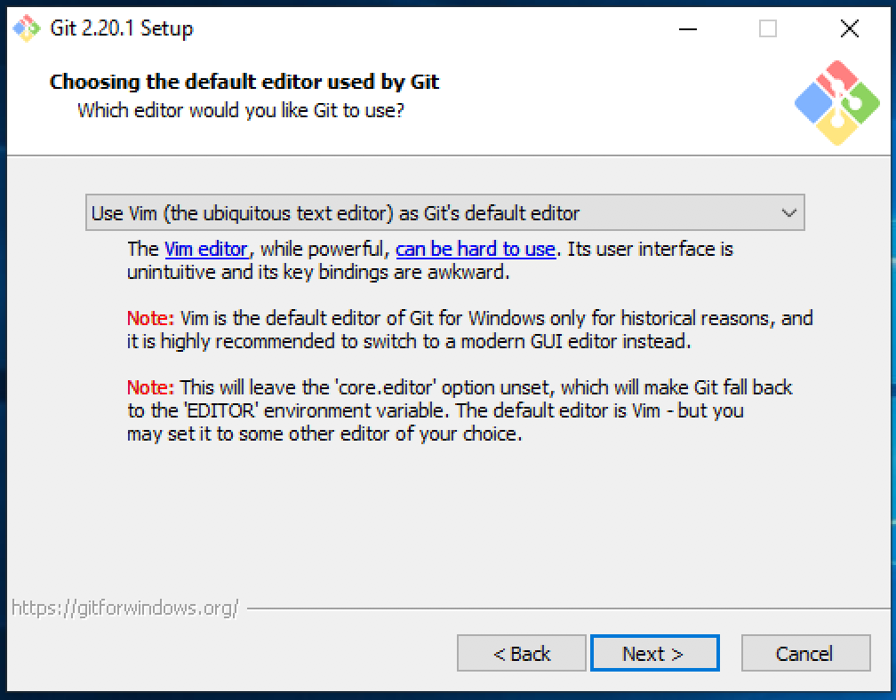
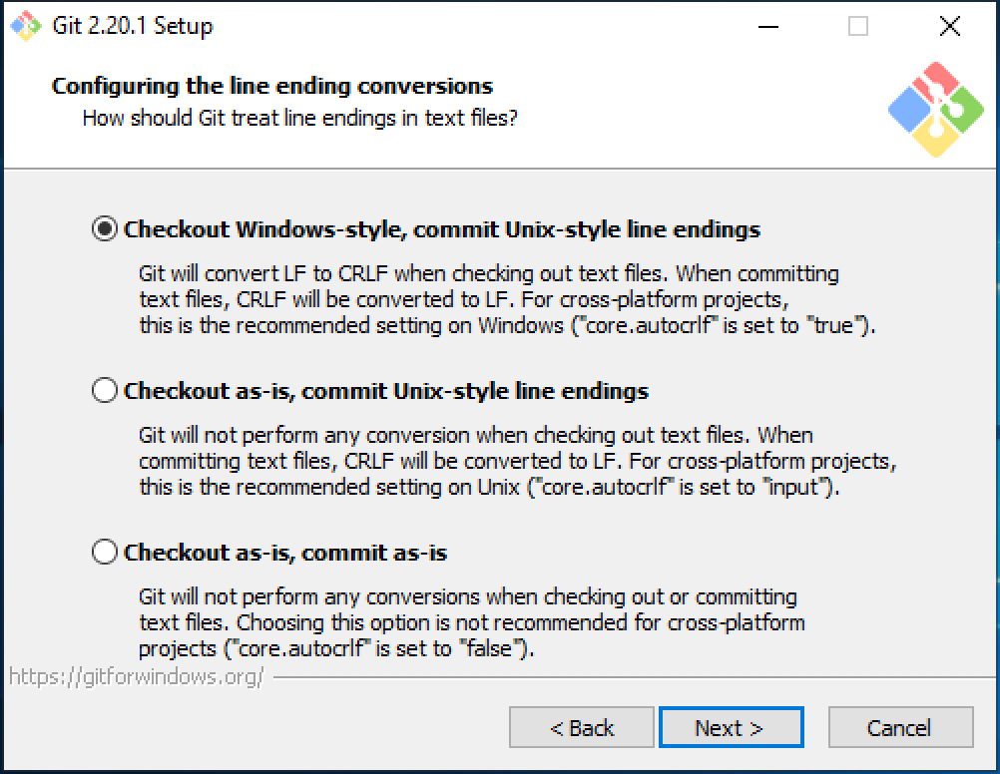

## Introduction to Installing Git

Git was designed and developed by [Linus Torvalds](https://en.wikipedia.org/wiki/Linus_Torvalds) for Linux kernel development. Git provides support for non-linear, distributed development, allowing multiple contributors to work on a project simultaneously. Git is the most popular distributed version control and source code management system.

This guide explains how to install the latest, stable, and prepackaged version of Git on GNU/Linux, Mac OSX, and Windows, using their respective package managers. Git can also be [compiled from source and installed](https://git-scm.com/book/en/v2/Getting-Started-Installing-Git#_installing_from_source) on any operating system.

For more information about using and configuring Git, see our [Getting Started with Git](/docs/guides/how-to-configure-git/) guide.


This guide uses `sudo` wherever possible. Complete the [Add a Limited User Account](/docs/products/compute/compute-instances/guides/set-up-and-secure/#add-a-limited-user-account) of our [Setting Up and Securing a Compute Instance](/docs/products/compute/compute-instances/guides/set-up-and-secure/) guide to create a standard user account.


## How to Install Git on Mac OSX

There are different ways to install Git on Mac OSX. You can install Git using Homebrew, MacPorts, or by downloading the Git installer package.

### Check if Git is already installed

1.  Check if Git is already installed on your Mac using:

        git --version

    If Git isn’t installed on your computer, the terminal prompts you with the following message:

    

2.  Click on **Install** to install the developer tools required to use Git on your Mac.

    The Mac developer tools include Xcode and the Xcode app development utilities. After you follow the prompts, agree to them, and download Git for Mac, at the end of the process you have a working version of Git.

### Install Git using Homebrew on MacOS

1.  Execute the following command on your Mac terminal:

        /bin/bash -c "$(curl -fsSL https://raw.githubusercontent.com/Homebrew/install/master/install.sh)"

    

2.  Press return once you are prompted. You should see an installation success message once the installation is complete.

    

3.  The Homebrew version you just installed may not be the most recent stable build. Therefore, it's a good practice to update it. To update Homebrew, enter the following command in your terminal:

        brew update

4.  Finally, to install Git run:

        brew install git

## How to Install Git on Windows

1.  Navigate to the Git website's [Download page](https://git-scm.com/download/win).

    

2.  Double click on a recent version of Git to download Git for Windows.

3.  When you see an install prompt, click on **Yes**:

    

4.  Agree to the GNU license terms:

    

5.  Select the directory you want Git to be installed in or use the default location:

    

6.  Select the components that you want to install. If you are unsure, go ahead with the default selection.

    

7.  Choose the default editor for Git:

    

8.  Select how you want to use Git from the command line from the options that are presented:

    

9.  Select the SSL/TLS library that you want Git to use for HTTPs connections:

    

10. Select how Git should treat the line endings in text files:

    

11. Select your terminal emulator, default behavior of `git pull`, and some extra configuring options.

    For the simplest installation, keep MinTTY for the terminal emulator, use the default behavior (fast-forward or merge), and enable file system caching in configuring extra options. When you are done selecting your configuration options, click **Install** at the end.

    

12. Click on **Finish**. You should have a working Git installation on your Windows machine.

## How to Install Git on Linux

The steps for installing Git on Linux depend on which Linux distribution you are using. This section shows you how you can install Git on Ubuntu, CentOS, Fedora, and Arch Linux.

### Check if Git is already installed on Linux

Before you begin, check whether Git is already installed on your computer by issuing the example command in your terminal. Some Linux distributions have Git preinstalled:

    git --version

If the output shows a Git version (see example below), you already have Git installed on your Linux machine.


git version 2.17.1


If you need to install Git, your terminal shows the following error:


-bash: git: command not found


If your terminal confirms that there’s no pre-installed version of Git, move on to the next section that is appropriate for your Linux system's distribution.

### Installing Git on Ubuntu or Debian

To install Git run the following command:

    sudo apt install git

If you see an error, consider running the following command before you install Git for Ubuntu:

    sudo apt update

### Installing Git on CentOS

#### Option 1: Installing Git on CentOS using Yum

To install Git on CentOS using Yum, run the following command:

    sudo yum install git

#### Option 2: Installing Git on CentOS from Source

1. 	In order to install Git from source install its dependencies first using the following commands:

        sudo yum group install “Development tools”
        sudo yum install gettext-devel openssl-devel perl-CPAN perl-devel zlib-devel

2. 	Now, go to [Git’s release page](https://github.com/git/git/releases) and select the version that you prefer to install. Find a stable Git version (select the one without an `-rc` suffix):

    

3. 	After finding the right Git version, click on it. You should see two files included in the release version you selected (with `.zip` and `tar.gz` extensions).

    

4. 	Right click and copy the link for the file with the `tar.gz` extension. For example, if you selected the version v2.29.1, your download link is `https://github.com/git/git/archive/v2.29.1.tar.gz`.

5. 	Use `wget` to download your selected Git version on CentOS. Replace the example URL with the one you copied in the previous step.

        wget https://github.com/git/git/archive/v2.29.1.tar.gz -O gitdownloadversion.tar.gz

    This command downloads `v2.29.1.tar.gz` as `gitdownloadversion.tar.gz`.

6. 	Unpack the file using `tar`. Decompress it and the extract files using the `-zxf` option. Use the following command to do it:

        tar -zxf gitdownloadversion.tar.gz

7. 	Change your directory to the unpacked folder:

        cd gitdownloadversion-*

8.	Create a Makefile in this directory to help compile the downloaded Git files:

        make configure
        ./configure --prefix=/usr/local

9.	Once your Makefile is in place, compile your Git files using:

        sudo make install

10.	When completed, check the Git version to ensure the installation was successful.

        git --version

### Installing Git on Fedora

Similar to CentOS, installing Git on Fedora can be done using two options:

- Install Git using Yum

- Install Git from source

The process to install Git from source is similar to the CentOS installation above. To install Git using Yum on Fedora, enter the following command:

    sudo yum install git-core

Once successful, view the Git version that is running to confirm the installation:

    git --version

### Installing Git on Arch Linux

To install Git on Arch Linux using pacman, run the following command:

    sudo pacman -Sy git

### Installing Git on Gentoo

You can install Git on Gentoo using emerge:

    sudo emerge --ask --verbose dev-vcs/git

## FAQs on Installing Git

### Is Git pre-installed on Mac?

No, Git for Mac does not come pre-installed. You have to install Git for Mac using the above instructions.

### How do I know if Git is installed?

To see if Git is installed on your system, open your terminal and type `git --version`. If your terminal returns a Git version as an output, that confirms you have Git installed on your system. If not, you have to download Git for Mac or Windows.

### Are Git and GitHub the same?

Git and GitHub are different. GitHub hosts Git repositories in a central location, whereas Git is a tool that manages multiple versions of source code on GitHub.

### How do I download Git for Windows?

To download Git for Windows, visit the [Downloads page](https://git-scm.com/download/win) on the Git documentation site and select the most recent version. Once you click on the version your download starts shortly and you can install Git for Windows.

### How to check the Git version?

To check your Git version type `git --version` and press enter in your terminal. This displays the Git version as an output.

### Do I need to download Git Bash?

 Git Bash is included in the Git for Windows package. It is unnecessary to install Git Bash on a Mac, as Git can be run natively on MacOS.

### How to clone a repository in Git?

Go to the repository’s page on GitHub, click on the green **Code** button, and copy the URL of the repository. To clone the repository on your system, open your Terminal and run `git clone URL`. Replace `URL` with the repository's URL.

## Get Started with Git

Visit our guide on [Git configuration](/docs/guides/how-to-configure-git/) for helpful commands to get you started with Git and GitHub repositories.
